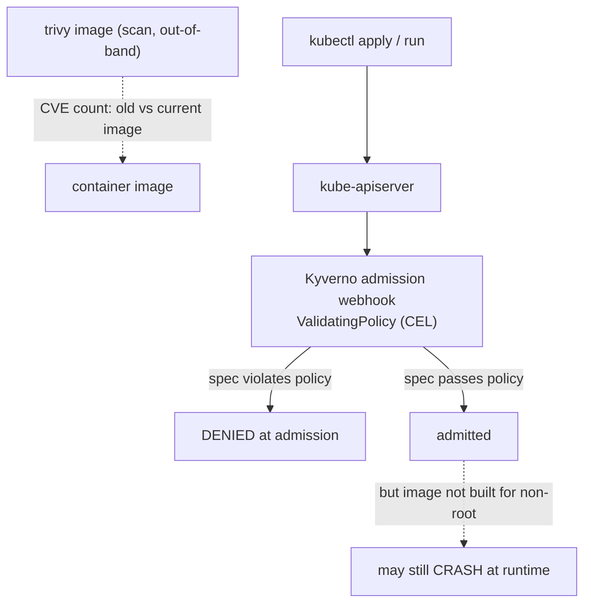
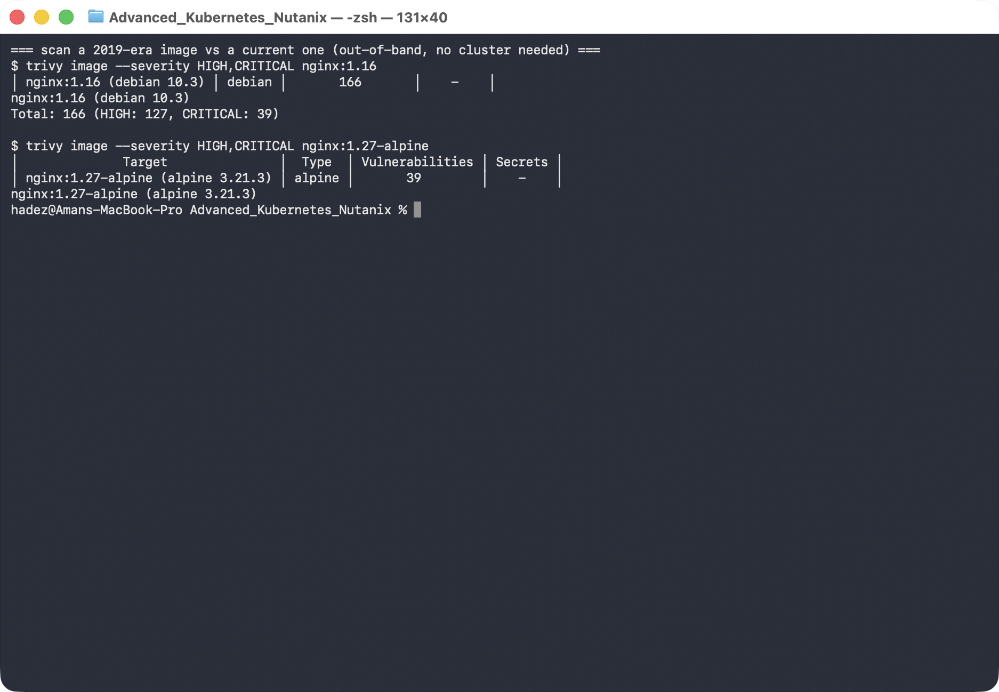
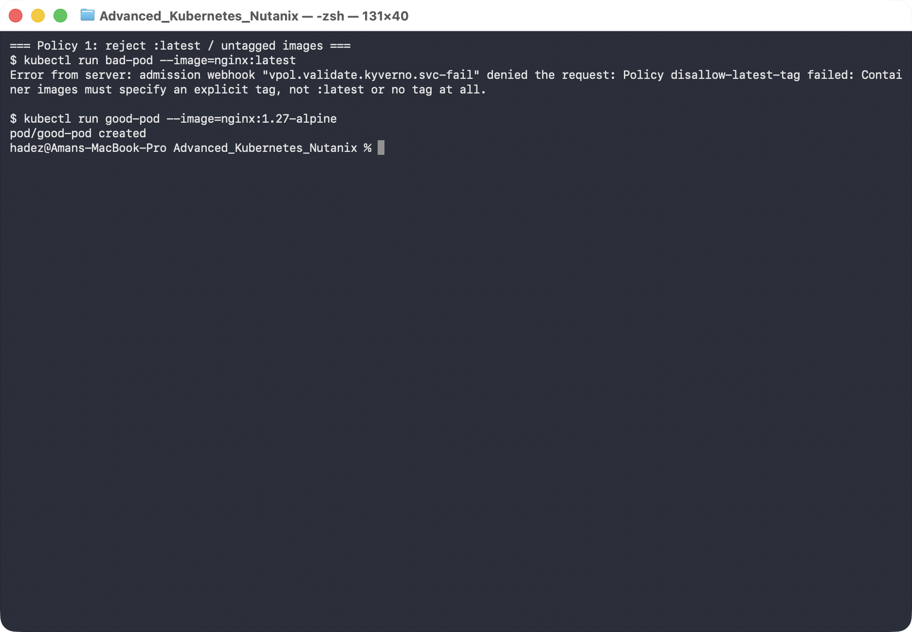
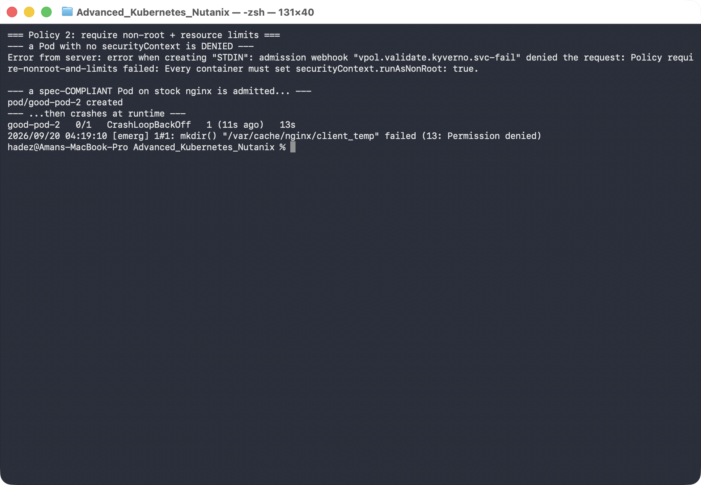
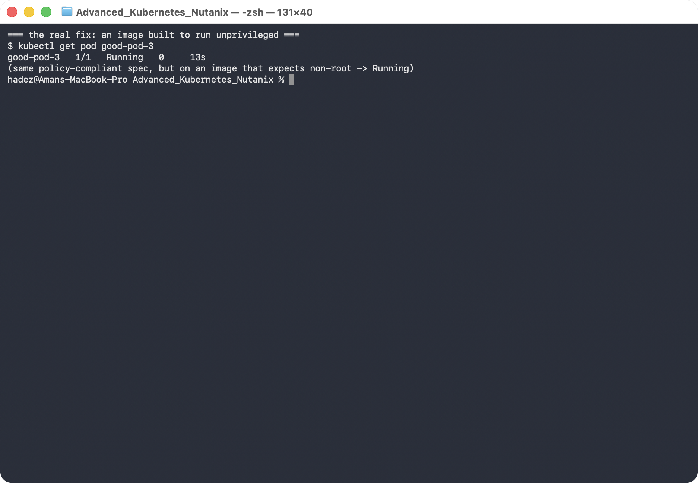

# Lab 10 — Block Bad Images Before They Run (Image Scanning & Admission Control with Kyverno)

**Day 2 · Extending and Operating the Platform Under Pressure**

> ✅ **Tested end-to-end** on a **real GKE cluster** (`advk8s-lab`, `dcproject-462806`) with **Kyverno 1.19** installed. Every screenshot is a real capture. The lesson that sticks: a Pod can pass every admission policy you write and **still crash at runtime** — because admission checks the *spec*, not whether the *image* was actually built to obey it.

## What you'll learn

- How to scan a container image for known vulnerabilities with **Trivy**, and why image choice alone changes your risk by an order of magnitude.
- How to enforce cluster-wide guardrails at admission time with **Kyverno `ValidatingPolicy`** (the current CEL-based API — not the deprecated `ClusterPolicy`).
- Two production-grade policies: reject `:latest`/untagged images, and require `runAsNonRoot` + resource limits.
- The crucial limit of admission control: it validates the *spec*, so a spec-compliant Pod on the wrong image is admitted and then **crashes** — and the fix is the image, not the policy.

## What you'll do

You'll install Kyverno, scan two images with Trivy to see the difference, then write two admission policies and test both the allowed and blocked cases. Then you'll hit the trap on purpose — a Pod that satisfies your policy but still can't run — and fix it properly.

## Time & cost

- **Time:** ~40 minutes.
- **Cost:** negligible beyond the shared workhorse GKE cluster. Everything here is control-plane and a few tiny Pods.

---

## Before you start

- **Where you'll work:** in a **terminal** on your own machine.
- **Tools you need:** `gcloud`, `kubectl`, `helm`, and **`trivy`** (`brew install trivy`). The Kyverno *CLI* is optional; the cluster component is installed via Helm below.
- **Cluster:** use a GKE cluster (this course's shared `advk8s-lab`), then install Kyverno:

```bash
helm repo add kyverno https://kyverno.github.io/kyverno/
helm repo update
helm install kyverno kyverno/kyverno -n kyverno --create-namespace
kubectl wait --for=condition=Ready pod -n kyverno --all --timeout=180s
```

> **Kyverno API note.** Kyverno is mid-migration to a new policy API. The original `kyverno.io/v1 ClusterPolicy` (in almost every older blog post) is deprecated and being removed; the replacement is `policies.kyverno.io/v1 ValidatingPolicy`, which uses **CEL** expressions. This lab uses `ValidatingPolicy` throughout, so it won't go stale — if a tutorial elsewhere opens with `kind: ClusterPolicy`, treat it as historical.

> **Nutanix note.** Trivy and Kyverno are platform-agnostic — they behave identically on NKE, GKE, and `kind`. Nothing here depends on GKE; we run it on GKE because Day 2 is cloud-first. On NKE this lab is unchanged.

---

## The idea in 60 seconds

There are two independent lines of defence, and this lab shows both — plus the gap between them:

- **Scanning (out-of-band):** `trivy image <name>` inspects an image's packages against vulnerability databases *before* you deploy. It tells you what's wrong with the image; it doesn't stop anyone deploying it.
- **Admission control (in-band):** Kyverno runs as an admission webhook — every `kubectl apply` is checked against your policies *before* the object is stored. A violating Pod is rejected outright.

The catch: admission only sees the Pod **spec**. It can require `runAsNonRoot: true`, but it can't know whether the image actually tolerates running as non-root. So a Pod can pass admission and still crash. You'll see exactly that.



---

## Step 1 — Scan two images with Trivy

**Goal:** see how much image choice alone changes your vulnerability exposure.

**1. Scan an old image and a current slim one** (this runs locally — it doesn't touch the cluster):

```bash
trivy image --severity HIGH,CRITICAL nginx:1.16
trivy image --severity HIGH,CRITICAL nginx:1.27-alpine
```

**What you should see:** the old `nginx:1.16` (Debian) reports **166** HIGH/CRITICAL (127 HIGH, 39 CRITICAL); the current `nginx:1.27-alpine` reports **39** — never zero, but ~4× fewer, and mostly lower-severity.



**What this means:** before any policy, *picking a smaller, current base image* is the single biggest lever on your CVE count. Trivy is how you see that number; the policies below are how you enforce standards on top of it.

> In production you'd usually run Trivy continuously in-cluster (the Trivy Operator generates a `VulnerabilityReport` per workload) and have admission consult those reports. That's the natural next step once you're comfortable with the two halves — scanning and enforcement — separately.

---

## Step 2 — Policy 1: reject `:latest` and untagged images

**Goal:** enforce that every Pod pins an explicit image tag.

**1. Apply the policy:**

```bash
kubectl apply -f - <<'EOF'
apiVersion: policies.kyverno.io/v1
kind: ValidatingPolicy
metadata:
  name: disallow-latest-tag
spec:
  validationActions: [Deny]
  matchConstraints:
    resourceRules:
      - apiGroups: ['']
        apiVersions: [v1]
        operations: [CREATE, UPDATE]
        resources: [pods]
  validations:
    - message: "Container images must specify an explicit tag, not :latest or no tag at all."
      expression: |
        object.spec.containers.all(c,
          c.image.contains(':') && !c.image.endsWith(':latest'))
EOF
```

**2. Test both sides:**

```bash
kubectl run bad-pod  --image=nginx:latest       --restart=Never
kubectl run good-pod --image=nginx:1.27-alpine  --restart=Never
```

**What you should see:** `bad-pod` is **denied** — `admission webhook "vpol.validate.kyverno.svc-fail" denied the request: Policy disallow-latest-tag failed: …` — while `good-pod` is **created**.



**What this means:** the policy runs *before* the Pod is stored, so an untagged image never even gets scheduled. `:latest` is a moving target that breaks reproducibility and rollbacks — this rejects it cluster-wide.

---

## Step 3 — Policy 2: require non-root + limits — and the trap on the other side

**Goal:** require every container to run as non-root with resource limits, then discover why that's necessary but *not sufficient*.

**1. Apply the policy:**

```bash
kubectl apply -f - <<'EOF'
apiVersion: policies.kyverno.io/v1
kind: ValidatingPolicy
metadata:
  name: require-nonroot-and-limits
spec:
  validationActions: [Deny]
  matchConstraints:
    resourceRules:
      - apiGroups: ['']
        apiVersions: [v1]
        operations: [CREATE, UPDATE]
        resources: [pods]
  validations:
    - message: "Every container must set securityContext.runAsNonRoot: true."
      expression: |
        object.spec.containers.all(c,
          has(c.securityContext) && has(c.securityContext.runAsNonRoot) &&
          c.securityContext.runAsNonRoot == true)
    - message: "Every container must define CPU and memory limits."
      expression: |
        object.spec.containers.all(c,
          has(c.resources) && has(c.resources.limits) &&
          has(c.resources.limits.cpu) && has(c.resources.limits.memory))
EOF
```

**2. First the obvious violation — a bare Pod (no securityContext):**

```bash
kubectl apply -f - <<'EOF'
apiVersion: v1
kind: Pod
metadata: {name: bad-pod-2}
spec:
  containers: [{name: app, image: nginx:1.27-alpine}]
EOF
```

It's **denied** — `Every container must set securityContext.runAsNonRoot: true.`

**3. Now a Pod that satisfies the policy — stock nginx, with everything asked for:**

```bash
kubectl apply -f - <<'EOF'
apiVersion: v1
kind: Pod
metadata: {name: good-pod-2}
spec:
  containers:
  - name: app
    image: nginx:1.27-alpine
    securityContext: {runAsNonRoot: true, runAsUser: 101}
    resources: {limits: {cpu: "250m", memory: "128Mi"}}
EOF

kubectl get pod good-pod-2
kubectl logs good-pod-2
```

**What you should see:** `good-pod-2` is **admitted** — then goes to `Error`/`CrashLoopBackOff`. Its logs show `nginx: [emerg] mkdir() "/var/cache/nginx/client_temp" failed (13: Permission denied)`.



**What this means — this is the point of the lab, not a mistake.** The policy only checked the *spec*. The stock `nginx` image writes to root-owned paths (`/var/cache/nginx/…`) at startup regardless of `runAsNonRoot`. Setting that flag on an image that doesn't expect it just moves the failure from **admission time** to **runtime**. Admission control is necessary, but it can't vouch for the image.

---

## Step 4 — The real fix: an image built to run unprivileged

**Goal:** keep the exact same policy-compliant spec, but use an image designed for non-root.

```bash
kubectl delete pod good-pod-2 --wait=false
kubectl apply -f - <<'EOF'
apiVersion: v1
kind: Pod
metadata: {name: good-pod-3}
spec:
  containers:
  - name: app
    image: nginxinc/nginx-unprivileged:1.27-alpine
    securityContext: {runAsNonRoot: true, runAsUser: 101}
    resources: {limits: {cpu: "250m", memory: "128Mi"}}
EOF

kubectl get pod good-pod-3
```

**What you should see:** `good-pod-3` reaches `Running` — same spec, same policy, but on `nginxinc/nginx-unprivileged`, an image that expects to run as non-root.



**What this means:** the durable fix for "runs as root" is a container image built to run unprivileged — the policy enforces the *requirement*, but only the right image *satisfies* it at runtime.

---

## Step 5 — Clean up

```bash
kubectl delete pod good-pod good-pod-3 --ignore-not-found
kubectl delete validatingpolicy disallow-latest-tag require-nonroot-and-limits
```

Leave the cluster running for the rest of the course, or uninstall Kyverno with `helm uninstall kyverno -n kyverno`.

---

## What you learned

| You saw… | in Step | proof |
|---|---|---|
| Image choice alone changes CVE count by ~10× | 1 | Trivy: old Debian nginx vs current Alpine |
| Admission runs before the object is stored | 2 | `bad-pod` denied at `kubectl run` |
| A spec-compliant Pod can still be wrong | 3 | `good-pod-2` admitted, then `mkdir … Permission denied` |
| Admission checks the spec, not the image | 3 | crash is at runtime, not admission |
| The fix for "runs as root" is the image | 4 | `good-pod-3` Running on `nginx-unprivileged` |

## Evidence

Real screenshots for this lab are in [`artifacts/lab-10/screenshots/`](../../artifacts/lab-10/screenshots/).

---

---

**Next:** [Lab 11 — Survive a Disaster with Volume Snapshots (StatefulSets, PVCs & Snapshots)](../../day-2-stateful-storage-and-exposure/lab-11-statefulsets-snapshots.md)
