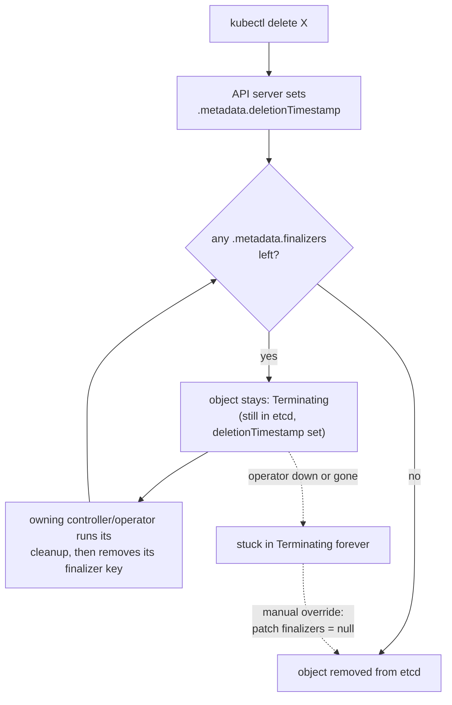
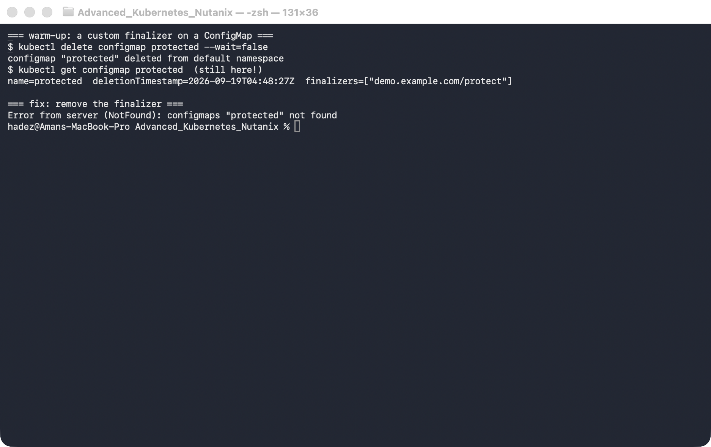
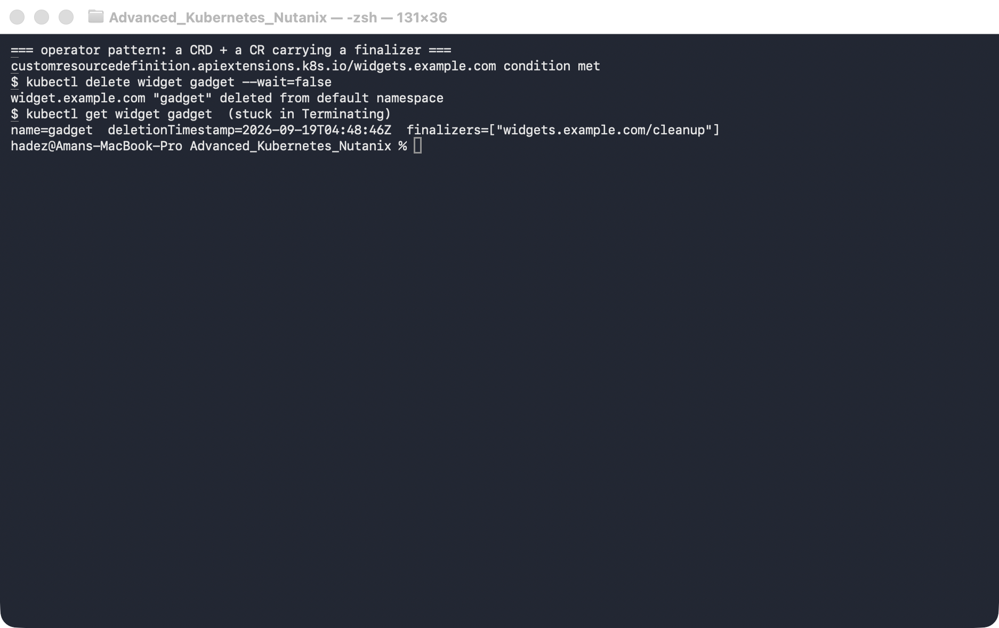
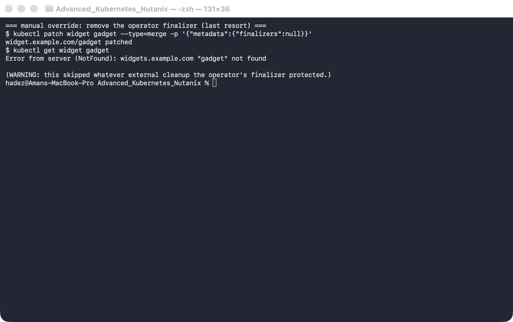

# Lab 6 — Why Won't This Delete? (Operators, Finalizers & Stuck Deletions)

**Day 2 · Extending and Operating the Platform Under Pressure**

> ✅ **Tested end-to-end** on a **real GKE cluster** (`dcproject-462806`, the shared Day-2 cluster). Every screenshot is a real capture. The eye-opener: `kubectl delete` prints `… deleted`, yet the object is **still there** with a `deletionTimestamp` set — because a finalizer is holding it open. Deletion in Kubernetes is a two-phase handshake, not an instant remove.

## What you'll learn

- What a **finalizer** is — a key in `.metadata.finalizers` that turns deletion into a two-phase operation — and why `kubectl delete` succeeding does **not** mean the object is gone.
- How the deletion lifecycle really works: `deletionTimestamp` is set, the object goes `Terminating`, and it's removed only once every finalizer is cleared.
- Why **operators** add finalizers (to guarantee cleanup runs first), and what happens when the operator is down: their resources wedge in `Terminating` forever.
- How to diagnose a stuck object *and* a stuck **namespace**, the manual override to force deletion — and why that override is dangerous.

## What you'll do

You'll wedge three different things into `Terminating` on purpose — a ConfigMap, a custom resource, and a whole namespace — diagnose each, and recover it. Along the way you'll see exactly why "it won't delete" is almost always a finalizer.

## Time & cost

- **Time:** ~35 minutes.
- **Cost:** negligible — everything here is control-plane-only (no extra nodes or storage). Reuses the Day-2 GKE cluster.

---

## Before you start

- **Where you'll work:** in a **terminal** on your own machine.
- **Tools you need:** `gcloud`, `kubectl`.
- **Cluster:** this lab creates a shared Day-2 GKE cluster (reused by Labs 6 and C):

```bash
gcloud container clusters create advk8s-day2 \
  --zone us-central1-a --num-nodes 2 --machine-type e2-medium \
  --disk-size 30 --release-channel regular
gcloud container clusters get-credentials advk8s-day2 --zone us-central1-a
```

> **Nutanix note.** Finalizers, `deletionTimestamp`, the `Terminating` state, and namespace `status.conditions` are pure Kubernetes API machinery — identical on NKE, GKE, and `kind`. Nothing here is cloud-specific; we run it on GKE only because Day 2 is cloud-first. It behaves exactly the same on a Nutanix NKE cluster.

---

## The idea in 60 seconds

Deleting a Kubernetes object is a **two-phase** operation:

1. You call delete. The API server sets `.metadata.deletionTimestamp`; the object enters `Terminating`. It is **not** removed yet.
2. Any controller that registered a **finalizer** (a string in `.metadata.finalizers`) runs its cleanup, then removes *its own* finalizer key.
3. Only when `.metadata.finalizers` is empty does the object actually get deleted.

This is how operators guarantee cleanup — an operator managing a cloud load balancer adds a finalizer so deleting its custom resource first deprovisions the real load balancer, *then* lets the resource vanish. The failure mode is the mirror image: if a finalizer is present but nothing ever removes it (the operator crashed, was uninstalled, or never existed), the object is stuck in `Terminating` forever. That's the most common "why won't this delete?" incident in Kubernetes, and you'll reproduce it three ways.



---

## Step 1 — Warm-up: watch `delete` lie to you

**Goal:** put a finalizer on a plain ConfigMap and see that "deleted" doesn't mean gone.

**1. Create a ConfigMap, add a finalizer, then delete it:**

```bash
kubectl create configmap protected --from-literal=k=v
kubectl patch configmap protected --type=merge \
  -p '{"metadata":{"finalizers":["demo.example.com/protect"]}}'

kubectl delete configmap protected --wait=false     # prints "deleted" ...
kubectl get configmap protected \
  -o jsonpath='name={.metadata.name}  deletionTimestamp={.metadata.deletionTimestamp}  finalizers={.metadata.finalizers}{"\n"}'
```

**What you should see:** `kubectl delete` prints `configmap "protected" deleted`, but the `get` still returns it — with `deletionTimestamp` set and `finalizers=["demo.example.com/protect"]`.



**What this means:** it's in `Terminating`, waiting for a finalizer that nobody will ever remove. Clear it by hand and it vanishes instantly:

```bash
kubectl patch configmap protected --type=merge -p '{"metadata":{"finalizers":null}}'
kubectl get configmap protected      # Error ... NotFound
```

---

## Step 2 — The operator pattern: a custom resource that won't delete

**Goal:** define a custom resource (as an operator would), create one *with* a finalizer, then delete it while no operator is running to process it.

**1. Create the CRD and one custom resource carrying a finalizer:**

```bash
kubectl apply -f - <<'EOF'
apiVersion: apiextensions.k8s.io/v1
kind: CustomResourceDefinition
metadata:
  name: widgets.example.com
spec:
  group: example.com
  scope: Namespaced
  names: {plural: widgets, singular: widget, kind: Widget}
  versions:
    - name: v1
      served: true
      storage: true
      schema:
        openAPIV3Schema:
          type: object
          properties:
            spec:
              type: object
              properties: {size: {type: string}}
EOF
kubectl wait --for=condition=Established crd/widgets.example.com --timeout=30s

kubectl apply -f - <<'EOF'
apiVersion: example.com/v1
kind: Widget
metadata:
  name: gadget
  finalizers: ["widgets.example.com/cleanup"]
spec: {size: large}
EOF
```

**2. Delete it and check:**

```bash
kubectl delete widget gadget --wait=false
kubectl get widget gadget \
  -o jsonpath='name={.metadata.name}  deletionTimestamp={.metadata.deletionTimestamp}  finalizers={.metadata.finalizers}{"\n"}'
```

**What you should see:** the `Widget` is stuck exactly like the ConfigMap — `deletionTimestamp` set, `finalizers=["widgets.example.com/cleanup"]`, still present.



**What this means:** in production this is a resource whose operator was going to run some external cleanup before letting it go. With the operator down, deletion can never complete.

**3. Force it out** with the same finalizer patch:

```bash
kubectl patch widget gadget --type=merge -p '{"metadata":{"finalizers":null}}'
kubectl get widget gadget      # NotFound
```



> ⚠️ **Gotcha — force-removing a finalizer skips the cleanup it was protecting.** Patching `finalizers: null` makes the object disappear, but it **bypasses whatever the operator was going to do** — deprovisioning a cloud disk, deregistering a load balancer, deleting a DNS record. You may have **orphaned the real resource** it represented, which will keep costing money and won't be tracked. The correct fix is almost always to get the operator healthy again so it removes its own finalizer *after* real cleanup; the manual patch is a last resort for when the operator is gone for good and you've verified the external cleanup by hand.

---

## Step 3 — The classic incident: a namespace stuck in `Terminating`

**Goal:** wedge a whole namespace by leaving one finalizer-blocked object inside it, then diagnose it from the namespace's own conditions.

**1. Create a namespace with a blocked ConfigMap inside, then delete the namespace:**

```bash
kubectl create namespace stuck-demo
kubectl -n stuck-demo create configmap blocker --from-literal=k=v
kubectl -n stuck-demo patch configmap blocker --type=merge \
  -p '{"metadata":{"finalizers":["demo.example.com/hold"]}}'

kubectl delete namespace stuck-demo --wait=false
kubectl get namespace stuck-demo -o jsonpath='phase={.status.phase}{"\n"}'
kubectl get namespace stuck-demo -o jsonpath='{range .status.conditions[*]}{.type}={.status} ({.reason}){"\n"}{end}'
```

*(The conditions take ~10 seconds to populate after the delete — if the second command prints nothing, wait a moment and re-run it.)*

**What you should see:** `phase=Terminating`, and the conditions name the blockage — `NamespaceContentRemaining=True (SomeResourcesRemain)` and `NamespaceFinalizersRemaining=True (SomeFinalizersRemain)`.


**What this means:** deleting a namespace deletes everything in it — so a single finalizer-blocked object wedges the whole namespace. The namespace's `status.conditions` are the right place to look first: they tell you *what* it's waiting on, so you don't have to guess.

**2. Fix the root cause** — clear the finalizer on the object *inside* the namespace:

```bash
kubectl -n stuck-demo patch configmap blocker --type=merge -p '{"metadata":{"finalizers":null}}'
kubectl get namespace stuck-demo      # after ~25s: NotFound
```


**What this means:** within about half a minute (the namespace controller re-checks on an interval) the namespace finishes and disappears. Note that you fixed the *cause* (the blocked object), not the symptom — editing the namespace's own `spec.finalizers` (the other "fix" you'll see online) is a sledgehammer that can strand the very content it was still trying to clean up.

---

## Step 4 — Clean up

```bash
kubectl delete crd widgets.example.com --ignore-not-found
```

Leave the `advk8s-day2` cluster running for Labs 6 and C.

---

## What you learned

| You saw… | in Step | proof |
|---|---|---|
| `kubectl delete` returning "deleted" ≠ object gone | 1 | ConfigMap present with `deletionTimestamp` after "deleted" |
| A finalizer holds an object in `Terminating` until removed | 1 / 2 | object persists with `finalizers` set |
| Operator resources wedge when the operator can't clear its finalizer | 2 | `Widget` stuck on `widgets.example.com/cleanup` |
| Force-removing a finalizer skips protected cleanup | 2 gotcha |
| A finalizer-blocked object wedges its whole namespace | 3 | `stuck-demo` in `Terminating` |
| Namespace `status.conditions` name the blockage | 3 | `NamespaceContentRemaining` / `NamespaceFinalizersRemaining` |

## Evidence

Real screenshots for this lab are in [`artifacts/lab-06/screenshots/`](../../artifacts/lab-06/screenshots/) (5 images), and a full command transcript is in [`artifacts/lab-06/evidence/lab-05-operators-finalizers.txt`](../../artifacts/lab-06/evidence/lab-05-operators-finalizers.txt).

---

---

**Next:** [Lab 7 — Find the Cluster's Breaking Point (Cluster Scale Knee-Point)](../further-labs/lab-07-cluster-scale-knee-point.md)
