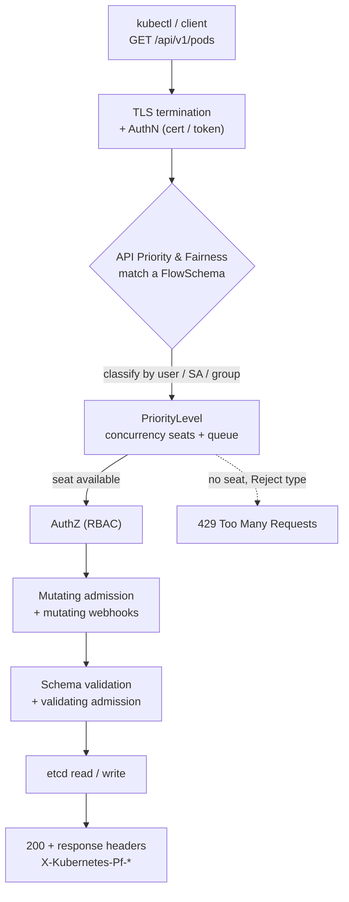
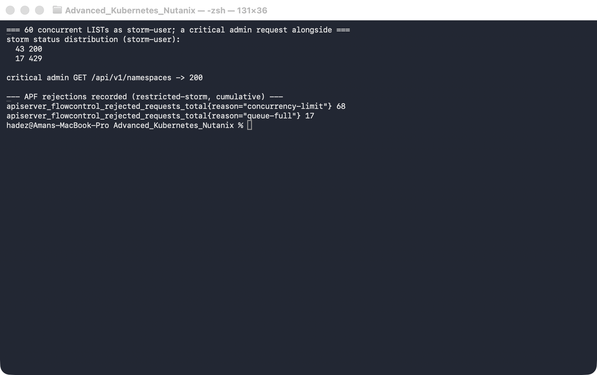

# Lab 2 — Stop One Client From Taking Down the API Server (API Priority & Fairness)

**Day 1 · How Kubernetes Really Works**

> ✅ **Tested end-to-end** on a real 4-node `kind` cluster (Kubernetes v1.37.0). Every screenshot is a real capture. The headline you'll prove yourself: a noisy client confined to a tiny lane loses **17 of 60 requests to HTTP 429**, while a critical request in another lane stays **200** the whole time.

## What you'll learn

- The full path a request takes through `kube-apiserver`: TLS + authentication → **API Priority & Fairness** → authorization (RBAC) → admission → etcd — and how to watch it live.
- How **API Priority & Fairness (APF)** sorts *every* request into a lane ("priority level") with its own concurrency budget, so one runaway client can't starve everyone else — including the control plane.
- How to read the APF headers that tell you which lane a request used.
- How to build your own lane, trap a noisy client in it, and **prove with real 429s and metrics** that critical traffic sails through untouched.

## What you'll do

You'll first watch a single request travel through the API server. Then you'll look at the lanes Kubernetes ships with, build a deliberately tiny lane, trap a "storm" client in it, and hit the API server with 60 simultaneous requests from that client — watching APF reject the overflow while an admin request stays healthy.

## Time & cost

- **Time:** ~45 minutes.
- **Cost:** **$0** — runs on the local `kind` cluster from Lab 1.

---

## Before you start

- **Where you'll work:** in a **terminal** on your own machine.
- **Cluster:** this lab **reuses the `advk8s-day1` cluster from [Lab 1](lab-01-reconciliation-tracing.md)**. If you deleted it, recreate it with the `day1-kind.yaml` from Lab 1, Step 1. APF is on by default — nothing to install.
- **Tools you need:** `kubectl` and `curl`.

> **Nutanix note.** APF is a core `kube-apiserver` feature, on by default on NKE, GKE, EKS, AKS, and `kind` alike. FlowSchemas, priority levels, the seat maths, the metrics — all identical on a real Nutanix (NKE) cluster. The only thing that differs is the *total* number of seats, which scales with the API server's size (bigger on a production control plane than on `kind`).

---

## The idea in 60 seconds

When you run `kubectl get pods`, the request doesn't go straight to storage. It runs a gauntlet inside `kube-apiserver`:

1. **TLS + authentication** — who are you?
2. **API Priority & Fairness** — which *lane* is this, and is there a free seat? *(the part most people don't know exists)*
3. **Authorization (RBAC)** — are you allowed?
4. **Admission** — defaulting, validation, webhooks.
5. **etcd** — the read/write finally happens.

Step 2 is this lab. Before APF existed, one misbehaving client — a hot LIST loop, a broken operator — could eat the API server's entire request budget and freeze the whole cluster. APF fixes that by sorting every request into a **priority level** with a bounded number of concurrency **seats**. A storm in one lane can't steal seats from another. Two objects define the lanes:

- **`FlowSchema`** — the matcher: "requests from *these* identities go to *this* lane."
- **`PriorityLevelConfiguration`** — the lane itself: how many seats (its `nominalConcurrencyShares`), and whether an overflow request waits (`Queue`) or is rejected immediately (`Reject`).



---

## Step 1 — Watch a single request's whole journey

**Goal:** see the raw HTTP request and the APF headers the API server stamps on every reply.

**1. In your terminal, run any command with `-v=8`** (verbose enough to print the HTTP exchange) and filter to the interesting lines:

```bash
kubectl get ns -v=8 2>&1 | grep -iE '"Request" verb=|"Response" status=|X-Kubernetes-Pf'
```

**What you should see:** the request line — `"Request" verb="GET" url="https://127.0.0.1.../api/v1/namespaces?limit=500"` — then `"Response" status="200 OK"`, and two headers: `X-Kubernetes-Pf-Flowschema-Uid` and `X-Kubernetes-Pf-Prioritylevel-Uid`.


**What this means:** *every* request the API server serves is classified into a lane, and those two `Pf` (Priority-and-Fairness) headers tell you exactly which FlowSchema matched and which priority level it used. (In `kubectl` v1.37 the `-v=8` output is structured — `verb="GET" url=…` — not the older `GET https://…` line you may see in blog posts.)

---

## Step 2 — Look at the lanes Kubernetes ships with

**Goal:** see the built-in FlowSchemas and priority levels, and notice how the control plane protects its own traffic.

**1. List the FlowSchemas in precedence order, then the priority levels:**

```bash
kubectl get flowschemas -o 'custom-columns=NAME:.metadata.name,PRIORITYLEVEL:.spec.priorityLevelConfiguration.name,PRECEDENCE:.spec.matchingPrecedence'
kubectl get prioritylevelconfigurations -o 'custom-columns=NAME:.metadata.name,TYPE:.spec.type,SHARES:.spec.limited.nominalConcurrencyShares'
```

**What you should see:** a precedence-ordered list — `exempt` (1) and `probes` (2) at the top, then `system-*` and `kube-controller-manager`/`kube-scheduler` schemas (100–900), and ordinary traffic falling through to `service-accounts` (9000) → `global-default` (9900) → `catch-all` (10000).


**What this means:** the design goal is visible right here. `exempt`/`probes` are never throttled (that's how health probes and leader election always get through), and control-plane traffic sits in high-priority reserved lanes. No amount of *user* traffic can starve them, because user traffic lives in the lower-priority lanes at the bottom.

---

## Step 3 — Build a tiny lane and trap a noisy client in it

**Goal:** create a lane with almost no seats, route a made-up user `storm-user` into it, and see how few seats it actually gets.

**1. Apply a small priority level (`Reject` = overflow gets an instant 429) and a FlowSchema that routes `storm-user` to it:**

```bash
kubectl apply -f - <<'EOF'
apiVersion: flowcontrol.apiserver.k8s.io/v1
kind: PriorityLevelConfiguration
metadata:
  name: restricted-storm
spec:
  type: Limited
  limited:
    nominalConcurrencyShares: 1
    limitResponse:
      type: Reject
---
apiVersion: flowcontrol.apiserver.k8s.io/v1
kind: FlowSchema
metadata:
  name: storm-user-fs
spec:
  priorityLevelConfiguration:
    name: restricted-storm
  matchingPrecedence: 200
  distinguisherMethod:
    type: ByUser
  rules:
    - subjects:
        - kind: User
          user:
            name: storm-user
      resourceRules:
        - verbs: ["*"]
          apiGroups: ["*"]
          resources: ["*"]
          clusterScope: true
          namespaces: ["*"]
EOF
```

**2. Give `storm-user` read permission** (so its requests come back `200`/`429`, not `403`):

```bash
kubectl create clusterrolebinding storm-user-view --clusterrole=view --user=storm-user
```

**3. Confirm the routing, and check how many seats each lane got:**

```bash
# impersonate storm-user and read the PriorityLevel header back:
kubectl get pods -A --as=storm-user -v=8 2>&1 | grep -i 'Prioritylevel-Uid'

# seats each lane actually received (proportional to its shares):
kubectl get --raw /metrics | grep '^apiserver_flowcontrol_nominal_limit_seats' \
  | grep -E 'restricted-storm|global-default|workload-low'
```

**What you should see:** `restricted-storm` gets **3 seats**, versus **49** for `global-default` and **244** for `workload-low`.


**What this means:** you didn't pick "3" — APF computed it by splitting the API server's total concurrency budget in proportion to each lane's shares (and `nominalConcurrencyShares: 1` is as small as it goes). Three seats is a very narrow lane, which makes the next step deterministic: hit it with more than 3 simultaneous requests and the rest *must* be rejected.

---

## Step 4 — Storm it, and watch critical traffic survive

**Goal:** fire 60 simultaneous requests as `storm-user` and one admin request alongside, and prove the storm is contained.

We'll hit the REST API through `kubectl proxy` with `curl` rather than plain `kubectl` — the gotcha below explains why.

**1. Run the whole storm as one block:**

```bash
kubectl proxy --port=18080 >/tmp/kproxy.log 2>&1 &
PROXY=$!
sleep 2

# 60 simultaneous requests as the noisy client; record each one's HTTP status:
tmp=$(mktemp -d); pids=()
for i in $(seq 1 60); do
  curl -s --max-time 20 -o /dev/null -w "%{http_code}\n" \
    -H "Impersonate-User: storm-user" \
    "http://127.0.0.1:18080/api/v1/pods?limit=1000" > "$tmp/$i" &
  pids+=($!)
done
wait "${pids[@]}"          # wait ONLY on the curls, not the proxy
echo "storm status distribution:"; cat "$tmp"/* | sort | uniq -c

# one "critical" admin request in the same window:
curl -s --max-time 20 -o /dev/null -w "admin GET /api/v1/namespaces -> %{http_code}\n" \
  "http://127.0.0.1:18080/api/v1/namespaces"

# APF's own count of what it rejected:
kubectl get --raw /metrics | grep '^apiserver_flowcontrol_rejected_requests_total' | grep 'restricted-storm'

kill $PROXY; rm -rf "$tmp"
```

**What you should see:** of the 60 storm requests, roughly **43 came back `200` and 17 came back `429`**; the **admin request returned `200`**; and the rejection counter for `restricted-storm` is non-zero.



**What this means:** APF rejected exactly the overflow that couldn't grab one of the 3 seats — and it did so *inside the storm's own lane*. The admin request, in a different lane, never noticed. That's the whole point: a client hammering the API server is boxed into its lane and cannot starve anyone else. (Your exact split will vary by a few requests run to run.)

> ⚠️ **Gotcha — `kubectl` hides the throttling from you.** If you run the storm with `kubectl get pods --as=storm-user` in a loop instead of raw `curl`, you'll barely see any 429s — the requests just get *slow*. That's because the library `kubectl` is built on **automatically retries 429s** with backoff, so a throttled request eventually succeeds. To actually observe APF you must look at the **raw HTTP status** (hence `curl`) or the **`apiserver_flowcontrol_rejected_requests_total` metric**. This fools people into thinking APF "isn't doing anything."

> ⚠️ **Gotcha — don't let `wait` hang forever.** In the script, a bare `wait` would also wait on the `kubectl proxy &` you started (which never exits), so the loop would appear to hang. That's why we capture the curl PIDs and `wait "${pids[@]}"` on just those.

---

## Step 5 — Clean up

**Goal:** remove the custom lane so the cluster is back to its default landscape. Leave the cluster running for Labs 3–4.

```bash
kubectl delete flowschema storm-user-fs
kubectl delete prioritylevelconfiguration restricted-storm
kubectl delete clusterrolebinding storm-user-view
```

**What you should see:** all three objects report `deleted`, and a `kubectl get flowschema storm-user-fs` now returns `NotFound`.


**What this means:** the built-in FlowSchemas and priority levels remain; only your custom lane is gone.

---

## What you learned

| You saw… | in Step | proof |
|---|---|---|
| Every request is classified by APF into a lane | 1 | `X-Kubernetes-Pf-*` headers on a `200` |
| The control plane has reserved lanes user traffic can't starve | 2 | `exempt`/`system-*` precedence vs `global-default`/`catch-all` |
| Seats are allocated in proportion to a lane's shares | 3 | `restricted-storm=3`, `global-default=49`, `workload-low=244` |
| A confined storm is throttled, not the whole API server | 4 | ~43×200 / 17×429 for `storm-user`, admin stays `200` |
| APF records exactly what it rejected | 4 | `apiserver_flowcontrol_rejected_requests_total{…reason="concurrency-limit"}` |
| `kubectl`'s retry masks 429s; raw HTTP / metrics reveal them | 4 gotcha |

## Evidence

Real screenshots for this lab are in [`artifacts/lab-02/screenshots/`](../artifacts/lab-02/screenshots/) (5 images), and a full command transcript is in [`artifacts/lab-02/evidence/lab-02-api-priority-fairness.txt`](../artifacts/lab-02/evidence/lab-02-api-priority-fairness.txt).

---

---

**Next:** [Lab 3 — Recover a Cluster That's Gone Read-Only (etcd Quota & Recovery)](../additional/optional-day-control-plane-and-war-room/lab-03-etcd-quota-recovery.md)
