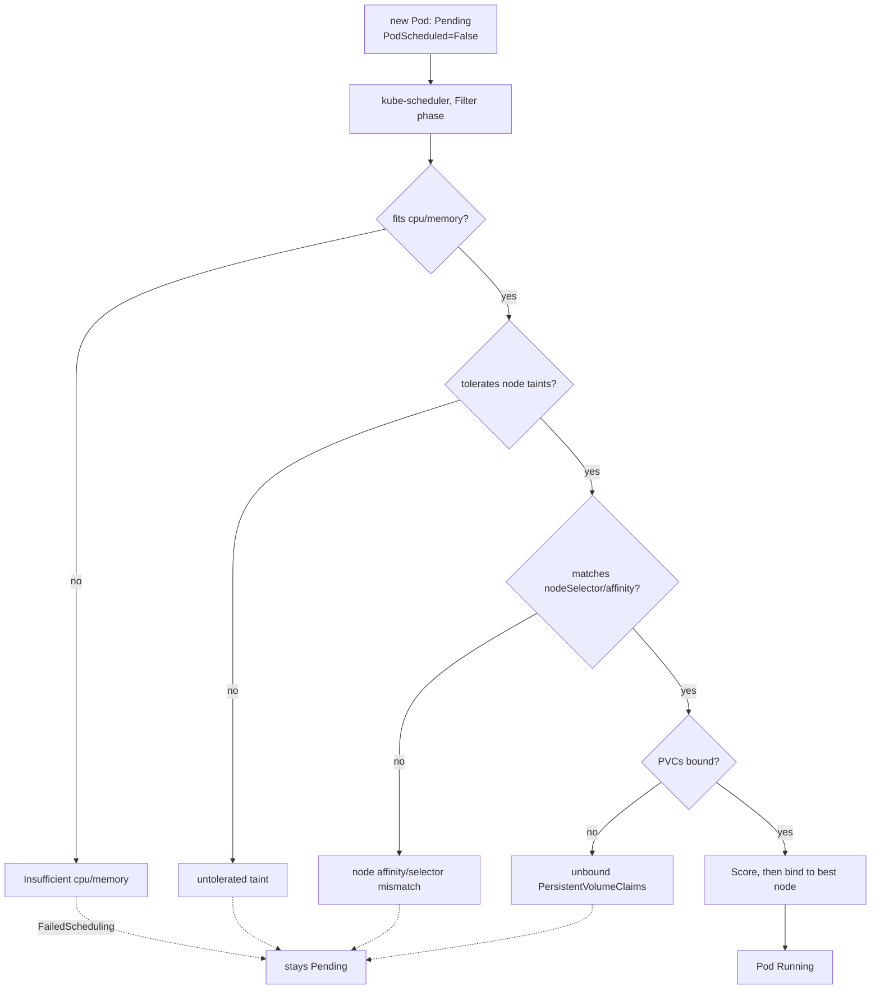
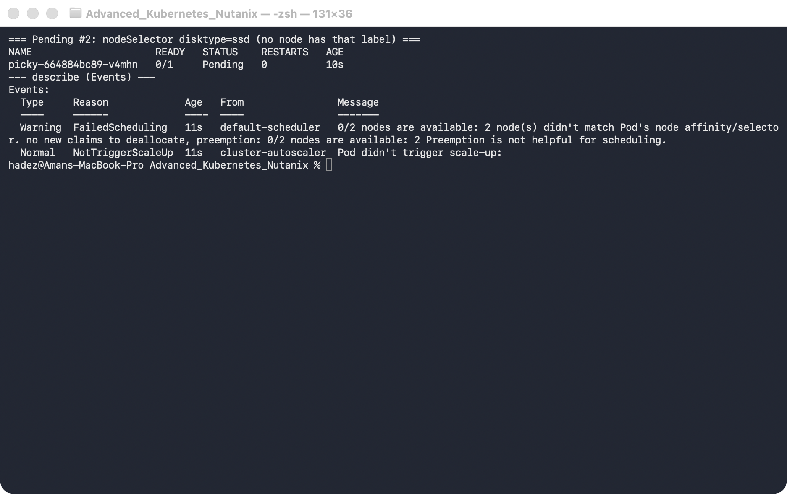
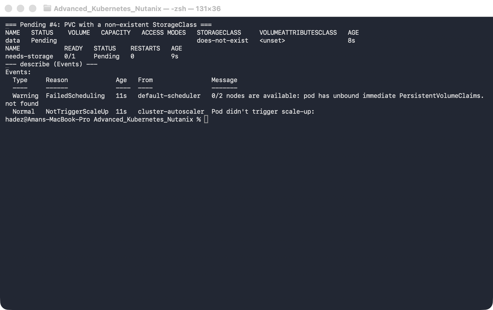
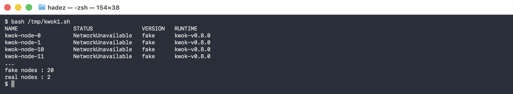
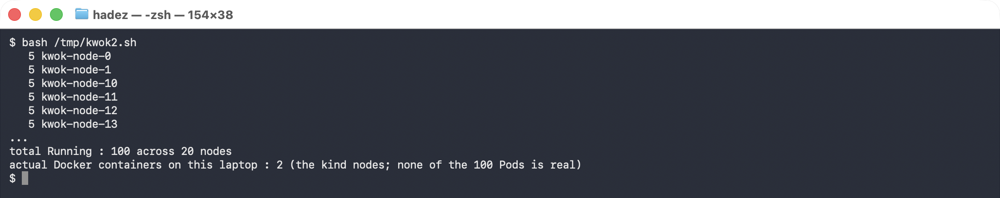

# Lab 4 — Diagnose Why a Pod Won't Schedule (Pending-Pod Diagnostics)

**Day 1 · How Kubernetes Really Works**

> ✅ **Tested end-to-end** on a **real GKE cluster** (`dcproject-462806`, `us-central1-a`, 2× `e2-medium`, Kubernetes v1.35.7-gke). Every screenshot is a real capture. You'll seed the four `Pending` reasons that cause the vast majority of real incidents, read the exact `FailedScheduling` message for each, and fix each until the Pod runs.

## What you'll learn

- The four reasons a Pod sits in `Pending` — insufficient resources, an untolerated taint, a node-affinity/selector mismatch, and an unbound PVC — and the exact scheduler message each one produces.
- How to read a scheduling failure the fast way (`kubectl describe pod` → the `FailedScheduling` event).
- Why the scheduler's message tells you *precisely* which check rejected the Pod and on how many nodes — and how to turn that into a one-line fix.
- A cloud-specific twist: on GKE, an "insufficient resources" Pod can be fixed by the **cluster autoscaler** adding a node, not just by editing the Pod.

## What you'll do

You'll create a GKE cluster, then deliberately create four Pods that each *can't* schedule for a different reason. For each, you'll read the scheduler's own explanation, apply the fix, and watch the Pod go `Running`. Finally you'll confirm all four are healthy and tear the cluster down.

## Time & cost

- **Time:** ~45 minutes.
- **Cost:** ~$0.30–0.60 of GKE if you create the cluster just for this lab and delete it at the end. A 2-node `e2-medium` zonal cluster is roughly $0.20/hr plus the GKE management fee.

---

## Before you start

- **Where you'll work:** in a **terminal** on your own machine.
- **Tools you need:** `gcloud`, `kubectl`, and the `gke-gcloud-auth-plugin`.
- **Account:** a GCP project with billing enabled and the Kubernetes Engine API turned on. (See the [Setup Environment Guide](../00-setup-environment-guide.md).)

> **Nutanix note.** Every failure here — `Insufficient cpu`, `untolerated taint`, affinity mismatch, unbound PVC — is core `kube-scheduler` behaviour, byte-for-byte identical on NKE, `kind`, and every conformant cluster; the diagnosis commands don't change at all. The only platform-specific bit is the *resolution* for the resource case: GKE's autoscaler adds a node, whereas on NKE you'd scale the node pool through Prism/NKE. We run this on GKE to show that cloud twist.

---

## The idea in 60 seconds

A `Pending` Pod is one the scheduler looked at and couldn't place. The scheduler runs two phases: **Filter** (which nodes are even feasible?) and **Score** (of those, which is best?). A Pod goes `Pending` when Filter eliminates *every* node — and, crucially, the scheduler records *why*, as a `FailedScheduling` event you can read. Four filters reject almost everything:

1. **Fit** — the Pod's CPU/memory requests must fit in a node's *allocatable* capacity (which is less than its raw size).
2. **Taints** — a node can carry a taint that repels Pods unless they tolerate it.
3. **Node affinity / `nodeSelector`** — the Pod can demand labels a node must have.
4. **Volume binding** — a Pod whose PVC can't be bound can't schedule.



---

## Step 1 — Create the cluster and see what "allocatable" really is

**Goal:** stand up a 2-node GKE cluster and notice how little CPU is actually schedulable.

**1. In your terminal, create the cluster and connect to it:**

```bash
gcloud container clusters create advk8s-gke \
  --zone us-central1-a --num-nodes 2 --machine-type e2-medium \
  --disk-size 30 --release-channel regular

gcloud container clusters get-credentials advk8s-gke --zone us-central1-a
kubectl get nodes -o custom-columns='NODE:.metadata.name,CPU_ALLOC:.status.allocatable.cpu,MEM_ALLOC:.status.allocatable.memory'
```

**What you should see:** two `Ready` nodes, each reporting **`940m` allocatable CPU** — even though an `e2-medium` nominally has **2** vCPUs.


**What this means:** GKE reserves over half of each node's CPU for the system and kubelet. The scheduler fits Pods into **allocatable**, not raw capacity — and that gap is what makes the next scenario trivial to trigger.

---

## Step 2 — Pending #1: not enough CPU

**Goal:** create a Pod that asks for more CPU than any node can offer, and read the message.

**1. Create a Deployment whose Pod requests 5 CPUs** (baked into the manifest, so there's exactly one clean `Pending` Pod — using `create` then `set resources` would leave the first, unconstrained Pod `Running` alongside the new `Pending` one):

```bash
kubectl apply -f - <<'EOF'
apiVersion: apps/v1
kind: Deployment
metadata: {name: hog, labels: {app: hog}}
spec:
  replicas: 1
  selector: {matchLabels: {app: hog}}
  template:
    metadata: {labels: {app: hog}}
    spec:
      containers:
        - name: nginx
          image: nginx:1.27
          resources: {requests: {cpu: "5"}}
EOF

kubectl get pods -l app=hog
kubectl describe pod -l app=hog | sed -n '/Events:/,$p'
```

**What you should see:** the Pod is `Pending`, and the event reads `FailedScheduling` → **`0/2 nodes are available: 2 Insufficient cpu.`** There's often a second event from `cluster-autoscaler`: `NotTriggerScaleUp`.


**What this means:** neither node has 5 cores of *allocatable* CPU free (each has only `940m`), so both are filtered out. The `NotTriggerScaleUp` line means the autoscaler looked at this Pod but this cluster has no autoscaling enabled — so it stays `Pending`.

**2. Fix it** — ask for a realistic amount:

```bash
kubectl set resources deployment hog --requests=cpu=100m
kubectl get pods -l app=hog -w      # watch it go Pending -> Running
```

> ☁️ **Cloud twist (GKE).** The *other* fix is to add capacity. Had you created the cluster with `--enable-autoscaling --min-nodes=2 --max-nodes=4`, that 5-core Pod would have triggered the **cluster autoscaler** to provision a third node, and the Pod would schedule onto it a couple of minutes later — no edit required. On NKE you'd scale the node pool for the same effect; on plain `kind` there's no autoscaler, so it would stay `Pending` forever. Same scheduler decision, three platform-specific resolutions.

---

## Step 3 — Pending #2: no node matches the selector

**Goal:** demand a node label that doesn't exist, and read the message.

**1. Create a Deployment that requires `disktype=ssd`:**

```bash
kubectl apply -f - <<'EOF'
apiVersion: apps/v1
kind: Deployment
metadata: {name: picky, labels: {app: picky}}
spec:
  replicas: 1
  selector: {matchLabels: {app: picky}}
  template:
    metadata: {labels: {app: picky}}
    spec:
      nodeSelector: {disktype: ssd}
      containers: [{name: nginx, image: nginx:1.27}]
EOF

kubectl describe pod -l app=picky | sed -n '/Events:/,$p'
```

**What you should see:** `FailedScheduling` → **`0/2 nodes are available: 2 node(s) didn't match Pod's node affinity/selector.`**



**What this means:** no node carries the `disktype=ssd` label, so both are filtered out.

**2. Fix it** — label a node so the selector matches (the existing Pending Pod then schedules onto it):

```bash
NODE=$(kubectl get nodes -o jsonpath='{.items[0].metadata.name}')
kubectl label node "$NODE" disktype=ssd
kubectl get pods -l app=picky -w
```

---

## Step 4 — Pending #3: an untolerated taint

**Goal:** taint both nodes so they repel Pods, then run one without a toleration.

**1. Taint the nodes and create a plain Deployment:**

```bash
kubectl taint nodes --all dedicated=analytics:NoSchedule
kubectl create deployment worker --image=nginx:1.27
kubectl describe pod -l app=worker | sed -n '/Events:/,$p'
```

**What you should see:** `FailedScheduling` → **`0/2 nodes are available: 2 node(s) had untolerated taint(s).`**


**What this means:** the nodes have capacity and match everything else — but the `dedicated=analytics:NoSchedule` taint actively repels any Pod that doesn't carry a matching toleration.

**2. Fix it** — give the Pod the toleration:

```bash
kubectl patch deployment worker --type=merge -p '{"spec":{"template":{"spec":{"tolerations":[{"key":"dedicated","operator":"Equal","value":"analytics","effect":"NoSchedule"}]}}}}'
kubectl get pods -l app=worker -w

# remove the taint again so it doesn't affect the other steps:
kubectl taint nodes --all dedicated=analytics:NoSchedule-
```

---

## Step 5 — Pending #4: an unbound PVC

**Goal:** point a Pod at a PVC whose StorageClass doesn't exist.

**1. Create the PVC (bad class) and a Pod that mounts it:**

```bash
kubectl apply -f - <<'EOF'
apiVersion: v1
kind: PersistentVolumeClaim
metadata: {name: data}
spec:
  accessModes: ["ReadWriteOnce"]
  storageClassName: does-not-exist
  resources: {requests: {storage: 1Gi}}
---
apiVersion: v1
kind: Pod
metadata: {name: needs-storage, labels: {app: needs-storage}}
spec:
  containers:
    - name: app
      image: nginx:1.27
      volumeMounts: [{name: d, mountPath: /data}]
  volumes:
    - name: d
      persistentVolumeClaim: {claimName: data}
EOF

kubectl get pvc data
kubectl describe pod needs-storage | sed -n '/Events:/,$p'
```

**What you should see:** the PVC stays `Pending`, and the Pod's event reads `FailedScheduling` → **`0/2 nodes are available: pod has unbound immediate PersistentVolumeClaims.`**



**What this means:** nothing can provision a volume for the `does-not-exist` class, so the PVC never binds — and the scheduler won't place a Pod whose volume can't be bound.

**2. Fix it** — recreate the PVC with a real StorageClass (GKE's default is `standard-rwo`):

```bash
kubectl get storageclass
kubectl delete pod needs-storage; kubectl delete pvc data
kubectl apply -f - <<'EOF'
apiVersion: v1
kind: PersistentVolumeClaim
metadata: {name: data}
spec:
  accessModes: ["ReadWriteOnce"]
  storageClassName: standard-rwo
  resources: {requests: {storage: 1Gi}}
---
apiVersion: v1
kind: Pod
metadata: {name: needs-storage, labels: {app: needs-storage}}
spec:
  containers:
    - name: app
      image: nginx:1.27
      volumeMounts: [{name: d, mountPath: /data}]
  volumes:
    - name: d
      persistentVolumeClaim: {claimName: data}
EOF
kubectl get pvc data -w      # Bound; the Pod schedules and runs
```

---

## Step 6 — Simulate a twenty-node fleet with KWOK

**Goal:** test scheduler and node-controller behaviour at a size you cannot build on a laptop.

The four Pending causes above each needed one real node. Some questions need twenty — *does my
topology spread actually spread? what happens to placement when I cordon a rack?* **KWOK** answers
them by creating nodes that the API server and scheduler treat as real, with no kubelet and no
containers behind them.

```bash
KWOK_VER=v0.8.0
kubectl apply -f https://github.com/kubernetes-sigs/kwok/releases/download/${KWOK_VER}/kwok.yaml
kubectl apply -f https://github.com/kubernetes-sigs/kwok/releases/download/${KWOK_VER}/stage-fast.yaml
```

Then create nodes as plain objects — annotate them `kwok.x-k8s.io/node: fake`, label `type: kwok`,
and declare whatever capacity you want to test against (8 vCPU / 16Gi each here). Create twenty.

**What you should see:**

```
NAME                     STATUS  ROLES          VERSION   CONTAINER-RUNTIME
kwok-lab-control-plane   Ready   control-plane  v1.37.0   containerd://2.3.4
kwok-node-0              Ready   agent          fake      kwok-v0.8.0
kwok-node-1              Ready   agent          fake      kwok-v0.8.0
...
fake nodes : 20
real nodes : 1
```

`kubeletVersion: fake` and `CONTAINER-RUNTIME: kwok-v0.8.0` are the tell.



Now schedule against them — Pods need a toleration for `kwok.x-k8s.io/node` and a
`nodeSelector: {type: kwok}`:

```bash
kubectl scale deploy/fleet-web --replicas=100
kubectl get pods -o wide | awk '{print $7}' | sort | uniq -c
```

```
   5 kwok-node-0
   5 kwok-node-1
   5 kwok-node-10
   ...
total Running : 100 across 20 nodes
```

**What this means.** One hundred Pods, spread evenly over twenty nodes, while the only real
containers on the laptop are the two `kind` nodes themselves. Every scheduling decision here is the
genuine scheduler making genuine choices — only the kubelet is fictional.




**Cordon one and watch the node-controller respond:**

```bash
kubectl cordon kwok-node-5
kubectl get node kwok-node-5 -o jsonpath='{.spec.unschedulable} {.spec.taints}'
```

```
unschedulable = true
taint added   = node.kubernetes.io/unschedulable:NoSchedule
pods already there, untouched = 5
```

Cordoning adds a taint and sets `unschedulable`; it stops **new** placement and evicts nothing. That
distinction is the one people get wrong under pressure.

---

### Why a failed node takes five minutes to fail over

Ask any Pod what tolerations it has — including ones you never wrote:

```bash
kubectl get pod <any-pod> -o jsonpath='{.spec.tolerations}'
```

```
node.kubernetes.io/not-ready     op=Exists effect=NoExecute tolerationSeconds=300
node.kubernetes.io/unreachable   op=Exists effect=NoExecute tolerationSeconds=300
```

**Kubernetes injects these into every Pod.** When a node goes unreachable, workloads sit there for
**300 seconds** before eviction — and that delay is neither the scheduler being slow nor a controller
backoff, which is what most people assume. It is a default toleration, and it is editable:

```yaml
tolerations:
  - { key: node.kubernetes.io/unreachable, operator: Exists, effect: NoExecute, tolerationSeconds: 10 }
```

Shorten it and failover happens in seconds. Shorten it too far and a node with a brief network blip
sheds its whole workload for nothing. That trade-off is the discussion worth having.

> ### ⚠️ Gotcha — KWOK will not let you fail a node, and this costs people an afternoon
>
> **Measured on KWOK v0.8.0:**
>
> - `kubectl patch node ... --subresource=status` to set `Ready=False` is **reverted within
>   seconds** — the node reports `Ready=True` again. Adding `kwok.x-k8s.io/status: custom` did not
>   change this, and neither did recreating the node with `Ready=False` in its manifest.
> - A `NoExecute` taint applied with `kubectl taint` is **removed by the kwok-controller**. It is
>   present at t+0 and gone shortly after. Pods never evict.
>
> The kwok-controller owns the node object and continuously reconciles it. **KWOK simulates a fleet
> of healthy nodes extremely well; it is not a node-failure injector.** To exercise eviction, drive
> it with a KWOK `Stage` resource, or take a real `kind` worker down with `docker stop`.

---

## Step 7 — Confirm all four are Running, then clean up

**Goal:** verify every seeded `Pending` Pod is now `Running`.

```bash
kubectl get pods -o wide
```

**What you should see:** `hog`, `picky`, `worker`, and `needs-storage` all `Running`, and `kubectl get pvc data` shows `Bound`.


**Delete the cluster** (this is the only real cost in the lab):

```bash
gcloud container clusters delete advk8s-gke --zone us-central1-a --quiet
gcloud container clusters list      # verify it's gone
```

---

## What you learned

| You saw… | in Step | proof |
|---|---|---|
| Allocatable is far less than raw vCPU | 1 | `940m` allocatable vs 2 capacity |
| Over-request → `Insufficient cpu` on all nodes | 2 | `0/2 nodes are available: 2 Insufficient cpu` |
| A selector with no matching node → affinity failure | 3 | `didn't match Pod's node affinity/selector` |
| An untolerated taint repels an otherwise-fine Pod | 4 | `2 node(s) had untolerated taint(s)` |
| An unbound PVC blocks scheduling | 5 | `unbound immediate PersistentVolumeClaims` |
| Each fix moves the Pod Pending → Running | 2–5 watches + 6 all Running |
| Cloud autoscaler is an alternate fix for the resource case | 2 cloud twist |
| KWOK simulates a fleet the scheduler treats as real | 6 | 20 fake nodes, 100 Pods spread, 1 real container |
| Cordon stops new placement and evicts nothing | 6 | `unschedulable=true` + NoSchedule taint, 5 Pods stayed |
| The 5-minute failover delay is an injected toleration | 6 | `not-ready`/`unreachable` `tolerationSeconds=300` on every Pod |
| KWOK owns the node object and reverts failure injection | 6 gotcha | `Ready=False` patch reverted; NoExecute taint removed |


## Evidence

The KWOK simulated-fleet run is captured in
[`artifacts/lab-04/evidence/lab-04-kwok-simulated-fleet.txt`](../artifacts/lab-04/evidence/lab-04-kwok-simulated-fleet.txt)
— 64 lines from 2026-09-25 (Kubernetes 1.37.0, KWOK v0.8.0), including the 20-node fleet, the
100-Pod spread, the cordon response, the injected 300s tolerations, and both things KWOK refused to do.

### Original evidence

Real screenshots for this lab are in [`artifacts/lab-04/screenshots/`](../artifacts/lab-04/screenshots/) (6 images), and a full command transcript is in [`artifacts/lab-04/evidence/lab-04-pending-pod-diagnostics.txt`](../artifacts/lab-04/evidence/lab-04-pending-pod-diagnostics.txt).

---

---

**Next:** [Lab 5 — Autopilot vs Standard, Private Clusters & Release Channels](../additional/further-labs/lab-05-cluster-architecture.md)
