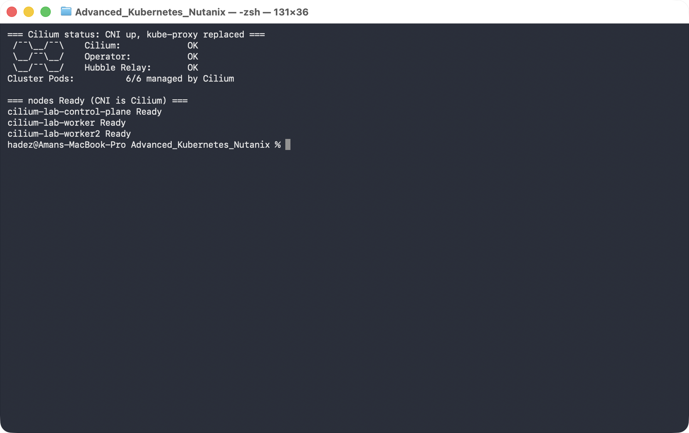
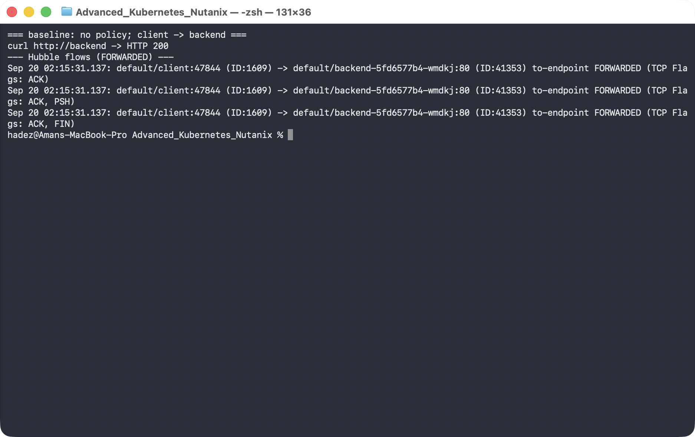
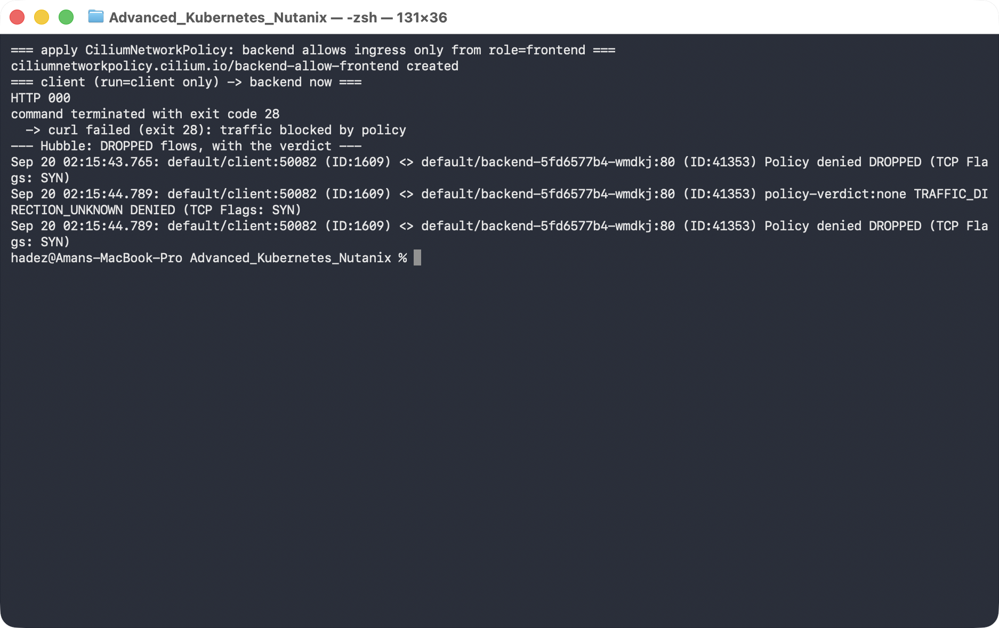
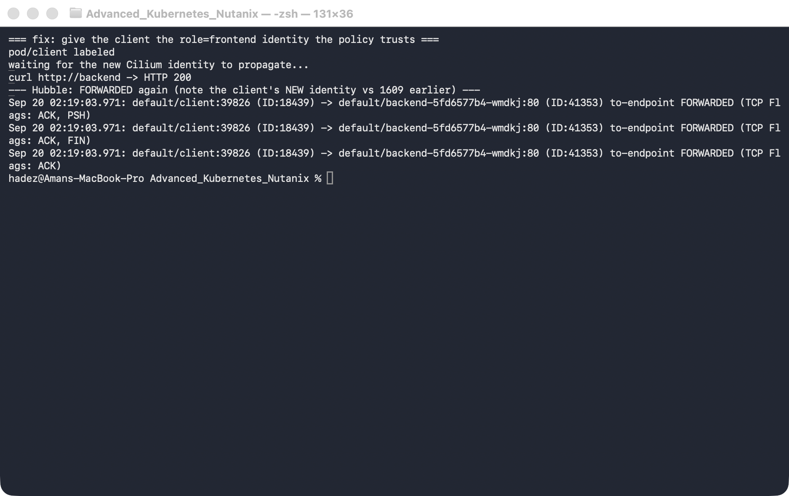
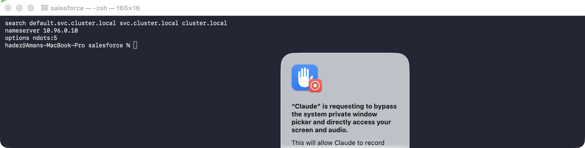
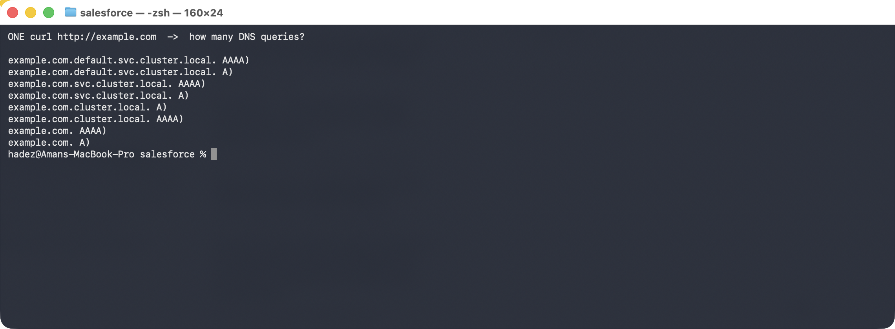
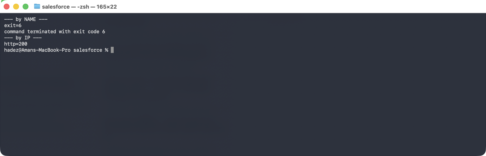
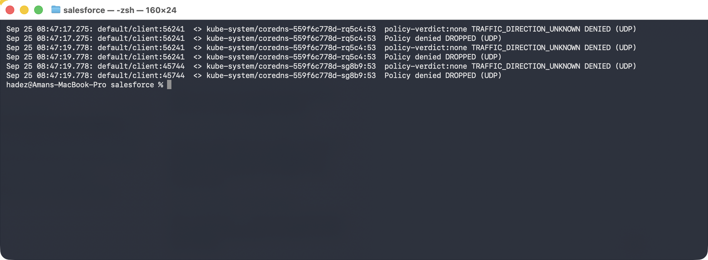
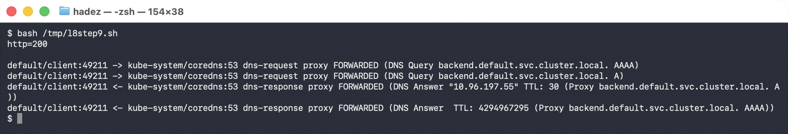

# Lab 8 — Trace a Blocked Network Flow to the Exact Policy (Cilium & Hubble)

**Day 2 · Extending and Operating the Platform Under Pressure**

> ✅ **Tested end-to-end** on a real 3-node `kind` cluster running **Cilium 1.20.1** as its CNI (kube-proxy fully replaced) with **Hubble** enabled. Every screenshot is a real capture. The insight you'll reach: the fix for a blocked flow isn't editing the policy — it's changing the client's **labels**, which gives it a new Cilium **identity** (you'll watch it flip from `ID:1609` to `ID:18439`), and the verdict changes the instant that identity propagates.

## What you'll learn

- Why Cilium's network policy is **identity-based**, not IP-based: every Pod gets a numeric security **identity** from its labels, and policy is evaluated on identities — so rules keep working as Pods churn and IPs change.
- How to install Cilium as the CNI (replacing kube-proxy) and turn on **Hubble** for flow-level observability.
- How to read a `DROPPED` flow in Hubble and trace it to the exact verdict (`Policy denied`).
- The non-obvious fix — change the client's identity (labels) to match the policy — and the propagation delay to expect.
- Why `ndots:5` and the search list turn **one hostname into eight DNS queries**, and what that costs CoreDNS.
- How to diagnose the most misread failure in Kubernetes networking: **the name fails, the IP works** — an egress policy that forgot DNS.
- Where the **five-second DNS stall** comes from, measured off the resolver's own retry timer.

## What you'll do

You'll build a Cilium cluster, deploy a client and a backend, and watch normal traffic flow in Hubble. Then you'll apply a policy that blocks the client, trace the drop in Hubble, and fix it by changing the client's identity — watching the verdict flip from `DROPPED` back to `FORWARDED`.

Then you'll turn the same lens on **DNS**: read the resolver every Pod is handed, count the eight queries one hostname really produces, break name resolution with a realistic egress policy, and diagnose it from Hubble's denied flows before fixing it.

## Time & cost

- **Time:** ~50 minutes.
- **Cost:** **$0** — runs on a local `kind` cluster.

---

## Before you start

- **Where you'll work:** in a **terminal** on your own machine. **One step needs a second terminal tab** (for Hubble's live feed).
- **Tools you need:** `docker`, `kind`, `kubectl`, the **`cilium`** CLI, and the **`hubble`** CLI — install the last two with `brew install cilium-cli hubble`.
- **⚠️ This lab uses its own dedicated `kind` cluster** (Cilium needs to *be* the CNI), separate from the Day-2 GKE cluster.

> **Nutanix note — and why this one is `kind`, not GKE.** Installing **upstream** Cilium and opening Hubble requires control of the cluster's CNI, which managed GKE doesn't give you (its CNI is fixed; GKE Dataplane V2 is Google's own locked-down Cilium with no upstream Hubble CLI/UI). So this lab runs on `kind`, where you own the datapath. On **Nutanix**, NKE lets you run Cilium as the CNI (or install it yourself), so everything here — identity-based policy, `hubble observe`, the drop/forward verdicts — transfers directly to NKE; only the cluster-creation step differs.

---

## The idea in 60 seconds

Cilium is an **eBPF-based CNI** that programs the Linux datapath directly and can fully replace kube-proxy. Its key idea for this lab is **identity**: Cilium doesn't write policy in terms of Pod IPs (which are ephemeral) — it gives every Pod a numeric **security identity** derived from its labels, and evaluates policy identity-to-identity. Change a Pod's labels and it gets a *new* identity.

**Hubble** is Cilium's observability layer: because Cilium already sees every packet, Hubble exports a live **flow log** — source identity, destination identity, port, and the **verdict** (`FORWARDED` / `DROPPED`) with a reason. That's what turns "my connection hangs" into "identity 1609 was denied by policy reaching backend:80."


---

## Step 1 — Build a Cilium cluster and enable Hubble

**Goal:** create a `kind` cluster with no CNI, install Cilium (which becomes the CNI *and* replaces kube-proxy), and turn on Hubble.

**1. Create a cluster with the default CNI and kube-proxy disabled:**

```bash
cat > cilium-kind.yaml <<'EOF'
kind: Cluster
apiVersion: kind.x-k8s.io/v1alpha4
name: cilium-lab
networking:
  disableDefaultCNI: true
  kubeProxyMode: none
nodes:
  - role: control-plane
  - role: worker
  - role: worker
EOF

kind create cluster --config cilium-kind.yaml
# the nodes will be NotReady until a CNI exists — that's expected
```

**2. Install Cilium with Hubble, and wait for it to come up:**

```bash
cilium install --set hubble.relay.enabled=true
cilium status --wait
```

**What you should see:** Cilium's image is large, so its Pods sit in `Init` for a minute or two while it downloads. Then `cilium status` reports `Cilium: OK`, `Operator: OK`, `Hubble Relay: OK`, all Pods "managed by Cilium," and the nodes flip from `NotReady` to `Ready`.



**What this means:** Cilium is now the cluster's datapath — it provides Pod networking *and* service routing (it detected kube-proxy was absent and took over). Hubble is ready to show you flows.

---

## Step 2 — See what a *healthy* request looks like

**Goal:** before blocking anything, watch normal traffic so you know what "good" looks like in Hubble.

**1. Deploy a backend and a client:**

```bash
kubectl create deployment backend --image=nginx:1.27
kubectl expose deployment backend --port=80
kubectl run client --image=curlimages/curl --restart=Never -- sleep 3600
kubectl wait --for=condition=Ready pod/client --timeout=90s
```

**2. Open Hubble's live flow feed — leave this running in a *second* terminal tab:**

```bash
cilium hubble port-forward
```

**3. Back in your first terminal, send one request and look at the flow:**

```bash
kubectl exec client -- curl -s -o /dev/null -w "HTTP %{http_code}\n" http://backend
hubble observe --pod client --to-label app=backend --last 3
```

**What you should see:** `curl` prints **`HTTP 200`**, and Hubble prints three lines ending in **`FORWARDED`**, e.g. `default/client (ID:1609) -> default/backend:80 (ID:41353)`.



**What this means:** with no policy in place, Cilium forwards the client's packets. Note the identity numbers — client `ID:1609`, backend `ID:41353`. **Remember the client's number; it's about to change.**

---

## Step 3 — Apply a policy and trace the drop

**Goal:** apply a policy that only lets `role=frontend` reach the backend, and watch Hubble name the drop.

**1. Apply the policy, then try the request again:**

```bash
kubectl apply -f - <<'EOF'
apiVersion: cilium.io/v2
kind: CiliumNetworkPolicy
metadata:
  name: backend-allow-frontend
spec:
  endpointSelector:
    matchLabels: {app: backend}
  ingress:
    - fromEndpoints:
        - matchLabels: {role: frontend}
EOF

kubectl exec client -- curl -s -o /dev/null -w "HTTP %{http_code}\n" --max-time 5 http://backend
hubble observe --pod client --verdict DROPPED --last 4
```

**What you should see:** `curl` now **times out (exit 28)** — the connection never establishes — and Hubble shows exactly why: `default/client (ID:1609) <> default/backend:80 (ID:41353)` **`Policy denied DROPPED (TCP Flags: SYN)`**.



**What this means:** the client's `SYN` packets are dropped by the datapath before they reach the backend. This is the diagnosis Hubble gives you that plain `kubectl` never will — not "it's slow," but "identity 1609 is denied by policy."

> **The key mental model:** once *any* `CiliumNetworkPolicy` selects an endpoint (here `backend`), that endpoint switches to **default-deny** for the direction the policy covers. So this one rule didn't just "allow frontend" — it simultaneously *denied everything else*, which is why the previously-working client is now dropped.

---

## Step 4 — Fix it by changing the client's identity

**Goal:** give the client the identity the policy already trusts (`role=frontend`), and watch the verdict flip.

**1. Label the client, wait for the new identity to propagate, then retry:**

```bash
kubectl label pod client role=frontend --overwrite
sleep 12                                   # let the new identity propagate
kubectl exec client -- curl -s -o /dev/null -w "HTTP %{http_code}\n" --max-time 5 http://backend
hubble observe --pod client --to-label app=backend --last 3
```

**What you should see:** `curl` returns **`HTTP 200`** again, Hubble shows **`FORWARDED`** — and the client's identity has **changed from `ID:1609` to `ID:18439`**.



**What this means:** adding the `role=frontend` label gave the client a *new Cilium identity*, and that new identity matches the policy's `fromEndpoints`. The verdict flipped because the **identity** changed, not because the policy did. That's identity-based networking in one screenshot.

> ⚠️ **Gotcha — identity propagation isn't instant.** Immediately after `kubectl label`, the very next `curl` can still be `DROPPED` for a few seconds: the Pod's new identity has to be computed and pushed to every node's datapath. In our run it took ~10 seconds. If you test too quickly you'll wrongly conclude the fix failed — wait a moment, or watch `hubble observe` until you see the identity number change.

---

## Step 5 — The resolver every Pod is handed

**Goal:** understand why one hostname becomes eight DNS queries, before anything breaks.

Cilium and Hubble are the lens; DNS is what you will spend most of your incident time looking
through it at. Start by reading the resolver config the kubelet writes into every Pod.

```bash
kubectl exec client -- cat /etc/resolv.conf
```

**What you should see:**

```
search default.svc.cluster.local svc.cluster.local cluster.local
nameserver 10.96.0.10
options ndots:5
```



**What this means.** Three things, and the third is the one that bites:

- **`nameserver 10.96.0.10`** — the `kube-dns` Service. Every lookup leaves the Pod as UDP to that ClusterIP.
- **`search …`** — three suffixes the resolver will append before giving up.
- **`options ndots:5`** — *"if the name has fewer than 5 dots, try the search list first."*

`backend` has 0 dots. `example.com` has 1. Both are below the threshold, so **both get the search
list applied before the name is tried as written**.

---

## Step 6 — Watch one hostname become eight queries

**Goal:** measure the amplification instead of taking it on trust.

By default Hubble shows DNS as opaque `UDP:53` flows — you see *that* a Pod talked to CoreDNS, not
*what it asked*. Query names are L7 data, and Cilium only parses them when a DNS-aware policy says
to. Apply one:

```bash
cat <<'EOF' | kubectl apply -f -
apiVersion: cilium.io/v2
kind: CiliumNetworkPolicy
metadata:
  name: dns-visibility
spec:
  endpointSelector:
    matchLabels:
      run: client
  egress:
    - toEndpoints:
        - matchLabels:
            io.kubernetes.pod.namespace: kube-system
            k8s-app: kube-dns
      toPorts:
        - ports:
            - port: "53"
              protocol: UDP
          rules:
            dns:
              - matchPattern: "*"
    - toEntities: [world, cluster]
EOF
```

Now make **one** request to an external name and count what CoreDNS was asked:

```bash
kubectl exec client -- curl -s -o /dev/null http://example.com
hubble observe --pod client --protocol dns --last 40 | grep 'DNS Query'
```

**What you should see — eight queries for one hostname:**

```
example.com.default.svc.cluster.local. AAAA
example.com.default.svc.cluster.local. A
example.com.svc.cluster.local. AAAA
example.com.svc.cluster.local. A
example.com.cluster.local. A
example.com.cluster.local. AAAA
example.com. AAAA
example.com. A
```



**What this means.** Four name variants (three search suffixes plus the name as written) × two
address families (A and AAAA) = **eight queries, six of which are guaranteed `NXDOMAIN`**. Multiply
by every Pod, every external call, no caching — this is why CoreDNS is so often the first thing to
fall over in a busy cluster, and why `ndots:2` in a Pod's `dnsConfig` is such a common tuning fix
for workloads that mostly call out to the internet.

> ⚠️ **Gotcha — `nslookup` will not show you this.** `nslookup example.com` sends the name
> **absolute** (with a trailing dot), skipping the search list entirely. You will see two queries
> and conclude everything is fine. Use a client that goes through the normal resolver path —
> `curl`, or the application itself.

---

## Step 7 — Break DNS the way a real policy does

**Goal:** produce the most misread symptom in Kubernetes networking.

Replace the visibility policy with the egress rule almost everyone writes first — *"the client is
allowed to reach the backend"*:

```bash
kubectl delete ciliumnetworkpolicy dns-visibility
cat <<'EOF' | kubectl apply -f -
apiVersion: cilium.io/v2
kind: CiliumNetworkPolicy
metadata:
  name: client-egress
spec:
  endpointSelector:
    matchLabels:
      run: client
  egress:
    - toEndpoints:
        - matchLabels:
            app: backend
      toPorts:
        - ports:
            - port: "80"
              protocol: TCP
EOF
```

Wait ~8 seconds, then try the Service **by name**, and the Pod **by IP**:

```bash
kubectl exec client -- curl -s --max-time 8 -o /dev/null -w "exit=%{exitcode}\n" http://backend

BIP=$(kubectl get pod -l app=backend -o jsonpath='{.items[0].status.podIP}')
kubectl exec client -- curl -s --max-time 8 -o /dev/null -w "http=%{http_code}\n" http://$BIP
```

**What you should see:**

```
--- by NAME ---
exit=6
--- by IP ---
http=200
```



**What this means.** `exit=6` is curl's *"couldn't resolve host."* The policy did exactly what it
said — the client can reach the backend — and the application still cannot, because **resolving the
name was never allowed**. The connection was never attempted; it died one layer earlier.

This is the shape of the real incident: *"I allowed the traffic and it still doesn't work."* The IP
working while the name fails is the tell.

---

## Step 8 — Let Hubble name the cause

**Goal:** go from symptom to the exact denied flow in one command.

```bash
hubble observe --pod client --verdict DROPPED --to-label k8s-app=kube-dns --last 6
```

**What you should see:**

```
default/client:56241 <> kube-system/coredns-559f6c778d-rq5c4:53 Policy denied DROPPED (UDP)
default/client:56241 <> kube-system/coredns-559f6c778d-rq5c4:53 Policy denied DROPPED (UDP)
default/client:45744 <> kube-system/coredns-559f6c778d-sg8b9:53 Policy denied DROPPED (UDP)
```



**What this means.** No guessing: the client's UDP traffic **to CoreDNS on :53** was `Policy denied`.
That points straight at the missing egress rule.

> ⚠️ **Gotcha — `--port 53` returns nothing here.** These drops are recorded with unknown traffic
> direction (`<>`), and the port filter does not match them. Filter on the destination workload
> instead: `--to-label k8s-app=kube-dns`. Learners who try the obvious flag conclude Hubble has no
> record of the drop.

**Look at the timestamps.** In the captured run the retry bursts are at `08:47:17.275` and
`08:47:19.778` — **2.503 seconds apart**. That is the resolver's retry timer, and two of those is
the notorious **five-second DNS stall**. When users report "the app hangs for about five seconds
then works," this timer is usually why: something is dropping or losing a fraction of DNS packets
and the resolver is waiting out its retry before falling through to the next search suffix.

---

## Step 9 — Add the rule everyone forgets

**Goal:** fix it, and see the query succeed.

```bash
cat <<'EOF' | kubectl apply -f -
apiVersion: cilium.io/v2
kind: CiliumNetworkPolicy
metadata:
  name: client-egress
spec:
  endpointSelector:
    matchLabels:
      run: client
  egress:
    # the rule everyone writes
    - toEndpoints:
        - matchLabels:
            app: backend
      toPorts:
        - ports: [{ port: "80", protocol: TCP }]
    # the rule everyone forgets
    - toEndpoints:
        - matchLabels:
            io.kubernetes.pod.namespace: kube-system
            k8s-app: kube-dns
      toPorts:
        - ports: [{ port: "53", protocol: UDP }]
          rules:
            dns:
              - matchPattern: "*"
EOF
```

```bash
kubectl exec client -- curl -s --max-time 8 -o /dev/null -w "http=%{http_code}\n" http://backend
hubble observe --pod client --protocol dns --last 4
```

**What you should see:** `http=200`, and the lookup now `FORWARDED`:

```
default/client -> kube-system/coredns:53 dns-request proxy FORWARDED (DNS Query backend.default.svc.cluster.local. A)
default/client <- kube-system/coredns:53 dns-response proxy FORWARDED (DNS Answer "10.96.201.151" ...)
```




**What this means.** Egress policy is **default-deny once it selects an endpoint** — the moment you
write any egress rule for a Pod, everything you did *not* list is denied, including DNS. Every
egress policy needs a DNS allowance, and adding it as an L7 `rules.dns` block buys you the query
names in Hubble at the same time.

> **Nutanix note.** The `ndots:5` amplification and the default-deny DNS trap are upstream Kubernetes
> and Cilium behaviour — neither depends on the cloud. They reproduce identically on NKE. What does
> differ on-prem is the blast radius: with no managed DNS tier absorbing the extra queries, CoreDNS
> replica count and its `cache` plugin settings become a capacity decision you own.

---

## Step 10 — Clean up

```bash
kind delete cluster --name cilium-lab
```

---

## What you learned

| You saw… | in Step | proof |
|---|---|---|
| Cilium can be the CNI *and* replace kube-proxy | 1 | `cilium status: OK`, nodes Ready, kube-proxy absent |
| Hubble shows per-flow verdicts with identities | 2 | `FORWARDED` flows, client `ID:1609` |
| One policy flips the selected endpoint to default-deny | 3 | previously-working client now `DROPPED` |
| A drop is traceable to `Policy denied` in Hubble | 3 | `Policy denied DROPPED (TCP Flags: SYN)` |
| Policy is identity-based; labels drive identity | 4 | client `ID:1609` → `ID:18439` on relabel, verdict flips |
| Identity propagation has a short delay | 4 gotcha |
| `ndots:5` + 3 search domains = 8 queries per hostname | 6 | all eight listed in `hubble observe --protocol dns` |
| Query names need an L7 DNS-aware policy to appear | 6 | opaque `UDP:53` before, named queries after |
| An egress policy is default-deny — and silently kills DNS | 7 | name `exit=6`, same backend by IP `http=200` |
| A DNS drop is traceable to `Policy denied` on :53 | 8 | `client <> coredns:53 Policy denied DROPPED (UDP)` |
| The 5-second DNS stall is two 2.5s resolver retries | 8 | retry bursts 2.503s apart in the captured flows |

## Evidence

Real screenshots for this lab are in [`artifacts/lab-08/screenshots/`](../artifacts/lab-08/screenshots/), and full command transcripts are in [`artifacts/lab-08/evidence/`](../artifacts/lab-08/evidence/):

- [`lab-07-cilium-hubble.txt`](../artifacts/lab-08/evidence/lab-07-cilium-hubble.txt) — Steps 1–4, the identity/policy arc.
- [`lab-08-dns-diagnosis.txt`](../artifacts/lab-08/evidence/lab-08-dns-diagnosis.txt) — Steps 5–9, captured 2026-09-25 on Cilium 1.20.1: the resolver config, all eight queries, the `exit=6` / `http=200` split, the denied flows with their 2.503s retry gap, and the fix.

---

---

**Next:** [Lab 9 — Make Two Clusters Behave Like One (Multi-Cluster Service Mesh with Istio)](../additional/further-labs/lab-09-multicluster-service-mesh.md)
