**Day 3 · Stateful Workloads, Persistent Storage & Service Exposure**

> YES — **Tested end-to-end** on a **real GKE cluster** (`advk8s-lab`, `dcproject-462806`) using real Persistent Disks and CSI volume snapshots, and **Steps 5–7 on a 3-node `kind` cluster** running csi-driver-host-path v1.18.0. Every screenshot is a real capture. The payoff you'll see: you write data, snapshot it, **delete the StatefulSet and its disk entirely**, then bring the data back from the snapshot onto a brand-new volume — `important-data-v1`, intact.

## What you'll learn

- How a **StatefulSet** gives each Pod its own stable **PVC** via a `volumeClaimTemplate`, backed by a real cloud disk.
- How to take a **`VolumeSnapshot`** of a live PVC through the CSI driver, and confirm it's `readyToUse`.
- How to **restore** a snapshot onto a *new* PVC using `dataSource`, and verify the data survived a full destroy/restore cycle.
- Why a snapshot in the same storage system is a fast recovery tool — and where its limits are (that's what Lab 12's Velero backup covers).
- How **volume expansion** actually lands: two CSI RPCs, why the PVC sits at `FileSystemResizePending`, and why volumes only ever grow.
- How to diagnose a **multi-attach conflict** on a `ReadWriteOnce` volume — and the **node-affinity-pinned volume** failure waiting behind it.
- Why a deleted PVC stays `Terminating`, what `kubernetes.io/pvc-protection` is protecting you from, and how `reclaimPolicy` decides whether "delete the PVC" means "delete the data".
- How **volume cloning** (`dataSource` → a PVC) differs from restoring a snapshot, and when to reach for each.

## What you'll do

You'll run a StatefulSet with a persistent volume, write a known value into it, snapshot the volume, then **delete the whole StatefulSet and its PVC** to simulate a disaster. Then you'll restore the snapshot onto a fresh PVC and prove the original data is still there. After that you'll move to a local `kind` cluster running the **CSI hostpath driver** to expand a volume in use, reproduce a **multi-attach conflict** and a **node-affinity mount failure** on purpose, watch a PVC finalizer hold a deletion, and clone a volume straight from another PVC.

## Time & cost

- **Time:** ~40 minutes for Steps 1–4 on GKE (much of it waiting for real disks to provision), plus ~45 minutes for Steps 5–7 on `kind`.
- **Cost:** a few cents of Persistent Disk on the shared GKE cluster; Steps 5–7 are **$0** on `kind`.

---

## Before you start

- **Where you'll work:** in a **terminal** on your own machine.
- **Tools you need:** `gcloud`, `kubectl` for Steps 1–4; `docker`, `kind`, `kubectl` for Steps 5–7.
- **Cluster:** a GKE cluster (this course's shared `advk8s-lab`). GKE ships the CSI snapshot CRDs but **no `VolumeSnapshotClass` by default** — you'll create one in Step 2.

> **Nutanix note.** StatefulSets, PVCs, `VolumeSnapshot`, and the `dataSource`-restore mechanism are all standard Kubernetes/CSI — identical on NKE. The only platform-specific piece is the **CSI driver** name: here it's `pd.csi.storage.gke.io` (Google Persistent Disk); on Nutanix it's the **Nutanix CSI driver** (`csi.nutanix.com`), which likewise supports `VolumeSnapshot`. Swap the driver name in the `VolumeSnapshotClass` and everything else in this lab is unchanged.

---

## The idea in 60 seconds

A **StatefulSet** is how you run stateful apps: each replica gets a stable identity (`db-0`, `db-1`, …) and its *own* PVC from a `volumeClaimTemplate`, so a Pod that restarts reattaches to the same disk. A **PVC** is bound to a real volume provisioned by a **CSI driver** (here Google Persistent Disk).

A **`VolumeSnapshot`** asks that CSI driver to take a point-in-time copy of the volume. It's fast and space-efficient, and — crucially — you can create a **new PVC from a snapshot** (`spec.dataSource`), which is how you recover. That's the cycle you'll run: snapshot → destroy → restore.

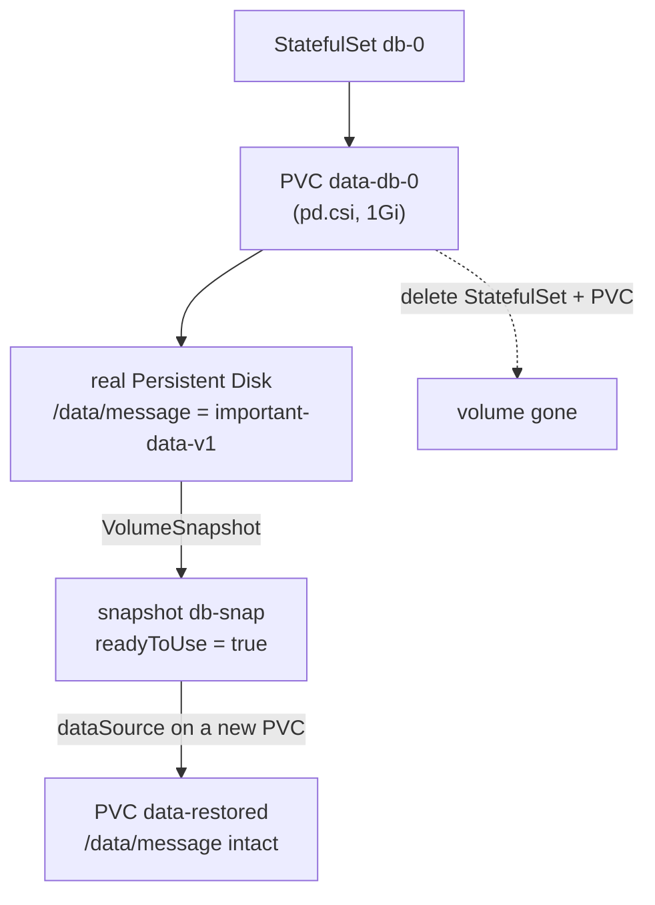

---

## Step 1 — Run a StatefulSet and write data to its volume

**Goal:** create a StatefulSet whose Pod has its own persistent disk, and put a known value on it.

**1. Create the StatefulSet (it declares a `volumeClaimTemplate`), wait for it, then write a file:**

```bash
kubectl apply -f - <<'EOF'
apiVersion: apps/v1
kind: StatefulSet
metadata: {name: db}
spec:
  serviceName: db
  replicas: 1
  selector: {matchLabels: {app: db}}
  template:
    metadata: {labels: {app: db}}
    spec:
      containers:
        - name: app
          image: busybox:1.36
          command: ["sh","-c","sleep 3600"]
          volumeMounts: [{name: data, mountPath: /data}]
  volumeClaimTemplates:
    - metadata: {name: data}
      spec:
        accessModes: ["ReadWriteOnce"]
        storageClassName: standard-rwo
        resources: {requests: {storage: 1Gi}}
EOF
kubectl rollout status statefulset/db --timeout=120s

kubectl exec db-0 -- sh -c 'echo "important-data-v1" > /data/message; cat /data/message'
kubectl get pvc data-db-0
```

**What you should see:** the rollout completes, `cat /data/message` prints `important-data-v1`, and `kubectl get pvc data-db-0` shows a `Bound` 1Gi PVC.

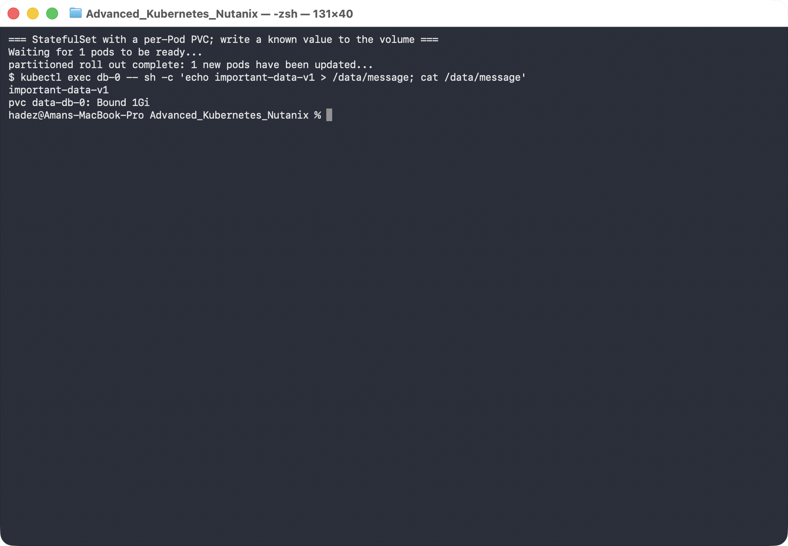

**What this means:** the StatefulSet created a PVC named `data-db-0` (template name + Pod name), CSI provisioned a real Persistent Disk for it, and your file lives on that disk — not in the Pod.

---

## Step 2 — Snapshot the volume

**Goal:** create a `VolumeSnapshot` of the PVC and confirm it's usable.

**1. Create a `VolumeSnapshotClass` (GKE doesn't ship one), then snapshot the PVC:**

```bash
kubectl apply -f - <<'EOF'
apiVersion: snapshot.storage.k8s.io/v1
kind: VolumeSnapshotClass
metadata: {name: pd-snapclass}
driver: pd.csi.storage.gke.io
deletionPolicy: Delete
EOF

kubectl apply -f - <<'EOF'
apiVersion: snapshot.storage.k8s.io/v1
kind: VolumeSnapshot
metadata: {name: db-snap}
spec:
  volumeSnapshotClassName: pd-snapclass
  source: {persistentVolumeClaimName: data-db-0}
EOF

kubectl wait --for=jsonpath='{.status.readyToUse}'=true volumesnapshot/db-snap --timeout=120s
kubectl get volumesnapshot db-snap
```

**What you should see:** `db-snap` with `READYTOUSE: true` and `RESTORESIZE: 1Gi`.

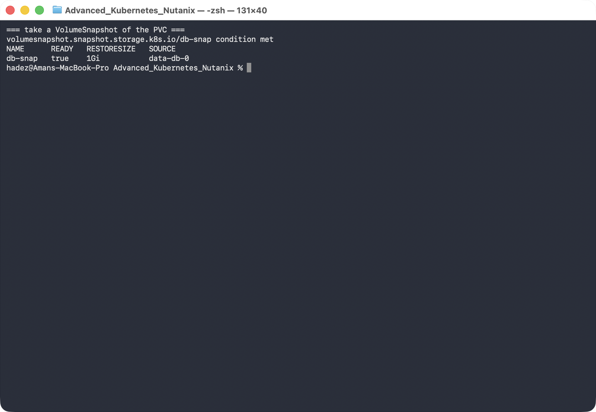

**What this means:** the CSI driver captured a point-in-time copy of the disk. It exists independently of the PVC now — you could delete the original and still restore from this.

---

## Step 3 — Simulate a disaster

**Goal:** destroy the StatefulSet *and* its volume, so recovery has to come from the snapshot.

```bash
kubectl delete statefulset db
kubectl delete pvc data-db-0
kubectl get pvc data-db-0 --ignore-not-found
kubectl get volumesnapshot db-snap
```

**What you should see:** `data-db-0` is gone (no output), but `db-snap` is still present and ready.

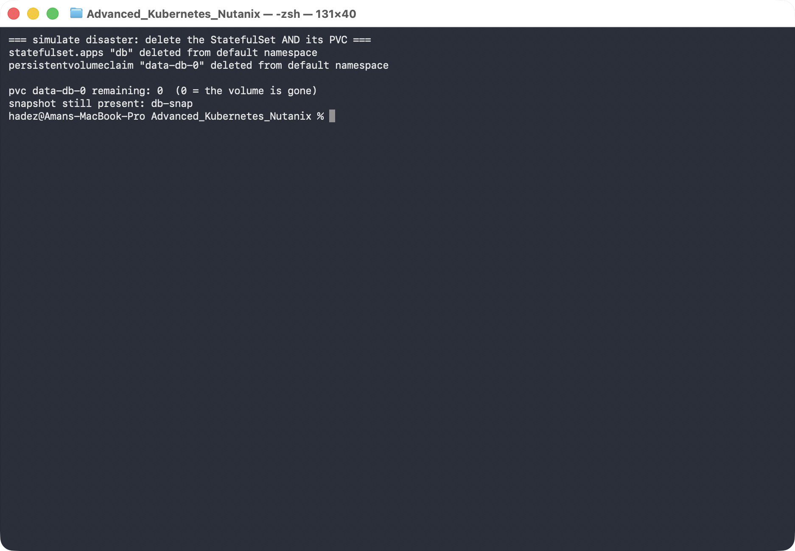

**What this means:** the live volume no longer exists — this is the "someone deleted the wrong thing" or "the disk is gone" scenario. The only copy of your data is the snapshot.

---

## Step 4 — Restore from the snapshot and verify

**Goal:** create a new PVC *from the snapshot* and prove the data survived.

```bash
kubectl apply -f - <<'EOF'
apiVersion: v1
kind: PersistentVolumeClaim
metadata: {name: data-restored}
spec:
  storageClassName: standard-rwo
  dataSource: {name: db-snap, kind: VolumeSnapshot, apiGroup: snapshot.storage.k8s.io}
  accessModes: ["ReadWriteOnce"]
  resources: {requests: {storage: 1Gi}}
---
apiVersion: v1
kind: Pod
metadata: {name: restore-check}
spec:
  containers:
    - name: app
      image: busybox:1.36
      command: ["sh","-c","sleep 3600"]
      volumeMounts: [{name: data, mountPath: /data}]
  volumes:
    - name: data
      persistentVolumeClaim: {claimName: data-restored}
EOF
kubectl wait --for=condition=Ready pod/restore-check --timeout=120s

kubectl exec restore-check -- cat /data/message
```

**What you should see:** `cat /data/message` prints **`important-data-v1`** — the exact value from before the disaster.

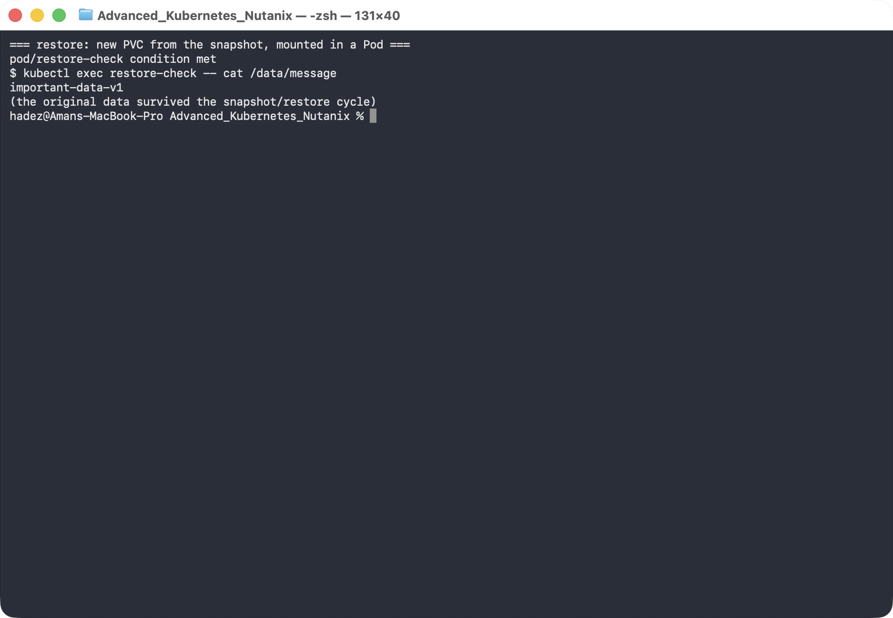

**What this means:** the snapshot's `dataSource` pre-populated a brand-new disk with the snapshot's contents, so the data survived a *complete* destroy/restore cycle. This is the fast path for recovering a single volume.

> **Where snapshots stop.** A `VolumeSnapshot` lives in the *same* storage system and doesn't capture your Kubernetes objects (the StatefulSet, Services, ConfigMaps). For "restore a whole namespace, objects and data, possibly to another cluster," you need a backup tool that captures both — that's [Lab 12 (Velero)](lab-12-velero-backup-restore.docx).

---

## Steps 5–7 — a second cluster, with a CSI driver that can resize and attach

Steps 1–4 ran on GKE because Persistent Disk snapshots are the realistic thing to demonstrate there. The remaining three outline topics — **volume expansion**, the **multi-attach conflict** and the **PVC lifecycle** — are behaviours of the *Kubernetes controllers*, not of any particular cloud, so they are done here on a local `kind` cluster at zero cost.

They need a driver that kind's built-in provisioner cannot provide:

```console
$ kubectl get sc -o custom-columns=NAME:.metadata.name,PROVISIONER:.provisioner,EXPANSION:.allowVolumeExpansion,BINDING:.volumeBindingMode,RECLAIM:.reclaimPolicy
NAME                    PROVISIONER             EXPANSION   BINDING                RECLAIM
csi-hostpath-noexpand   hostpath.csi.k8s.io     false       Immediate              Delete
csi-hostpath-sc         hostpath.csi.k8s.io     true        Immediate              Delete
standard                rancher.io/local-path   <none>      WaitForFirstConsumer   Delete
```

kind's default `standard` class has **no `allowVolumeExpansion` field at all**, so it can never resize. Set up the **CSI hostpath driver** instead:

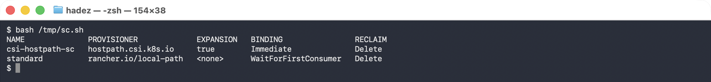


```bash
kind create cluster --name csistate --config - <<'EOF'
kind: Cluster
apiVersion: kind.x-k8s.io/v1alpha4
nodes: [{ role: control-plane }, { role: worker }, { role: worker }]
EOF

# snapshot CRDs + controller
S=https://raw.githubusercontent.com/kubernetes-csi/external-snapshotter/v8.2.0
kubectl apply -f $S/client/config/crd/snapshot.storage.k8s.io_volumesnapshotclasses.yaml
kubectl apply -f $S/client/config/crd/snapshot.storage.k8s.io_volumesnapshotcontents.yaml
kubectl apply -f $S/client/config/crd/snapshot.storage.k8s.io_volumesnapshots.yaml
kubectl apply -f $S/deploy/kubernetes/snapshot-controller/rbac-snapshot-controller.yaml
kubectl apply -f $S/deploy/kubernetes/snapshot-controller/setup-snapshot-controller.yaml

# RBAC for the CSI sidecars
kubectl apply -f https://raw.githubusercontent.com/kubernetes-csi/external-attacher/v4.12.0/deploy/kubernetes/rbac.yaml
kubectl apply -f https://raw.githubusercontent.com/kubernetes-csi/external-provisioner/v6.3.0/deploy/kubernetes/rbac.yaml
kubectl apply -f https://raw.githubusercontent.com/kubernetes-csi/external-resizer/v2.2.1/deploy/kubernetes/rbac.yaml
kubectl apply -f https://raw.githubusercontent.com/kubernetes-csi/external-snapshotter/v8.6.0/deploy/kubernetes/csi-snapshotter/rbac-csi-snapshotter.yaml
kubectl apply -f https://raw.githubusercontent.com/kubernetes-csi/external-health-monitor/v0.18.0/deploy/kubernetes/external-health-monitor-controller/rbac.yaml

# the driver itself
H=https://raw.githubusercontent.com/kubernetes-csi/csi-driver-host-path/v1.18.0/deploy/kubernetes-1.34/hostpath
kubectl apply -f $H/csi-hostpath-driverinfo.yaml
kubectl apply -f $H/csi-hostpath-plugin.yaml
kubectl apply -f $H/csi-hostpath-snapshotclass.yaml

# a StorageClass that permits expansion
kubectl apply -f - <<'EOF'
apiVersion: storage.k8s.io/v1
kind: StorageClass
metadata: { name: csi-hostpath-sc }
provisioner: hostpath.csi.k8s.io
reclaimPolicy: Delete
volumeBindingMode: Immediate
allowVolumeExpansion: true
EOF

kubectl rollout status statefulset/csi-hostpathplugin --timeout=300s
```

> YES — **Tested end-to-end** on `kind` v1.37.0 (3 nodes) with **csi-driver-host-path v1.18.0**, `external-resizer v2.2.1` and `external-attacher v4.12.0`. Full transcript: [`artifacts/lab-11/evidence/lab-11-expansion-and-multiattach.txt`](../artifacts/lab-11/evidence/lab-11-expansion-and-multiattach.txt).

Re-create the StatefulSet from Step 1, but pointed at `csi-hostpath-sc`:

```bash
kubectl apply -f - <<'EOF'
apiVersion: apps/v1
kind: StatefulSet
metadata: { name: shop-db }
spec:
  serviceName: shop-db
  replicas: 1
  selector: { matchLabels: { app: shop-db } }
  template:
    metadata: { labels: { app: shop-db } }
    spec:
      containers:
        - name: app
          image: busybox:1.36
          command: ["sh","-c","echo important-data-v1 > /data/message; sleep 100000"]
          volumeMounts: [{ name: data, mountPath: /data }]
  volumeClaimTemplates:
    - metadata: { name: data }
      spec:
        accessModes: ["ReadWriteOnce"]
        storageClassName: csi-hostpath-sc
        resources: { requests: { storage: 1Gi } }
EOF
```

Unlike the GKE Persistent Disk class, this driver requires an **attach** step, so there is a real `VolumeAttachment` object to look at — which is what makes Step 6 possible:

```console
$ kubectl get volumeattachment -o custom-columns=NAME:.metadata.name,ATTACHER:.spec.attacher,NODE:.spec.nodeName,ATTACHED:.status.attached
NAME                                        ATTACHER              NODE               ATTACHED
csi-762d7c3ab1a1e8c5f370b4742ce4f947...      hostpath.csi.k8s.io   csistate-worker   true
```

---

## Step 5 — Expand a volume while the application is running

**Goal:** grow a bound PVC and understand why the change lands in **two phases**, one in the control plane and one on the node.

**1. Ask for more space by editing the PVC — never the PV:**

```bash
kubectl patch pvc data-shop-db-0 --type merge \
  -p '{"spec":{"resources":{"requests":{"storage":"3Gi"}}}}'
```

**2. Watch `spec`, `status` and the conditions separately:**

```bash
watch -n2 'kubectl get pvc data-shop-db-0 \
  -o jsonpath="spec={.spec.resources.requests.storage} status={.status.capacity.storage} {range .status.conditions[*]}{.type}={.status} {end}"; echo'
```

**What you should see** — and it does **not** finish on its own:

```console
  spec=3Gi  status=1Gi  conditions=[Unused=False Resizing=True FileSystemResizePending=True ]
  spec=3Gi  status=1Gi  conditions=[Unused=False Resizing=True FileSystemResizePending=True ]
  spec=3Gi  status=1Gi  conditions=[Unused=False Resizing=True FileSystemResizePending=True ]
```

The **PV** is already the new size, though:

```console
$ kubectl get pv -o custom-columns=NAME:.metadata.name,CAPACITY:.spec.capacity.storage
NAME                                       CAPACITY
pvc-f833ee26-a0ef-4f3f-bea3-077146df7c56   3Gi
```

**3. Read the event trail — it names every actor in order:**

```console
$ kubectl describe pvc data-shop-db-0 | sed -n '/Events/,$p'
Normal  ExternalExpanding         18s   volume_expand                        waiting for an external controller to expand this PVC
Normal  Resizing                  18s   external-resizer hostpath.csi.k8s.io  External resizer is resizing volume pvc-f833ee26-…
Normal  FileSystemResizeRequired  18s   external-resizer hostpath.csi.k8s.io  Require file system resize of volume on node
```

The driver told the resizer it is only half done:

```console
"Method":"/csi.v1.Controller/ControllerExpandVolume",
"Response":{"capacity_bytes":3221225472,"node_expansion_required":true}
```

**What this means.** Expansion is a **two-RPC** operation. `ControllerExpandVolume` grows the backing volume — that is the `external-resizer` sidecar, and it is what updated the PV. Then `NodeExpandVolume` grows the *filesystem* on the node, and only **kubelet** can do that, only while the volume is mounted. `FileSystemResizePending` is the handoff between the two.

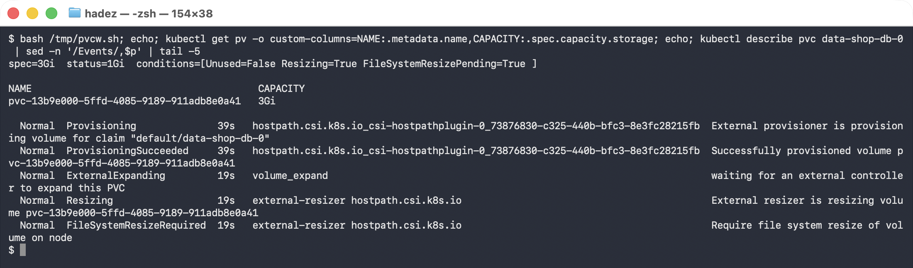


**4. Restart the consumer so kubelet performs the node-side resize:**

```bash
kubectl delete pod shop-db-0
kubectl rollout status statefulset/shop-db --timeout=240s
```

```console
  spec=3Gi  status=3Gi  conditions=[Unused=False ]

$ kubectl get pvc data-shop-db-0
data-shop-db-0   Bound   pvc-f833ee26-…   3Gi   RWO   csi-hostpath-sc   76s

$ kubectl exec shop-db-0 -- cat /data/message
important-data-v1
```

`status.capacity` now matches `spec`, the conditions are gone, and the data survived.

> ⚠️ **Gotcha — `status.capacity`, not `spec`, is the size you actually have.** `spec.resources.requests.storage` is a *request*. Monitoring or automation that reads `spec` will believe the volume grew the moment you patched it, which is wrong for as long as `FileSystemResizePending` is set — potentially indefinitely, if nothing ever restarts the Pod. Alert on the **condition**, not on the request.

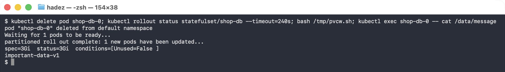


> ⚠️ **Gotcha — whether you need the restart depends on the driver.** Drivers that support *online* expansion complete `NodeExpandVolume` on the mounted volume with no restart, and you never see `FileSystemResizePending` for more than a moment. The hostpath driver here, like many block drivers, needs the remount. Check your driver's docs before promising a zero-downtime resize.

> ⚠️ **Gotcha — `df` inside the Pod will not confirm this on the hostpath driver.** Because the hostpath driver bind-mounts a directory from the node's filesystem rather than formatting a device, `df -h /data` reports the *node's* disk (here `452.1G`) both before and after. The Kubernetes-level resize is real — the PV, the PVC status and both CSI RPCs all prove it — but the filesystem is not a separate device. On GKE PD or Nutanix CSI, `df` **does** change, and that is the check to use there.

**5. Two refusals worth seeing once.** The second needs a claim on a class that forbids expansion:

```bash
kubectl apply -f - <<'EOF'
apiVersion: storage.k8s.io/v1
kind: StorageClass
metadata: { name: csi-hostpath-noexpand }
provisioner: hostpath.csi.k8s.io
allowVolumeExpansion: false
---
apiVersion: v1
kind: PersistentVolumeClaim
metadata: { name: locked-pvc }
spec:
  accessModes: ["ReadWriteOnce"]
  storageClassName: csi-hostpath-noexpand
  resources: { requests: { storage: 1Gi } }
EOF
```

```console
$ kubectl patch pvc data-shop-db-0 --type merge -p '{"spec":{"resources":{"requests":{"storage":"1Gi"}}}}'
The PersistentVolumeClaim "data-shop-db-0" is invalid: spec.resources.requests.storage:
Forbidden: field can not be less than status.capacity

$ kubectl patch pvc locked-pvc --type merge -p '{"spec":{"resources":{"requests":{"storage":"2Gi"}}}}'
Error from server (Forbidden): persistentvolumeclaims "locked-pvc" is forbidden:
only dynamically provisioned pvc can be resized and the storageclass that provisions
the pvc must support resize
```

**Volumes only grow.** There is no shrink in Kubernetes — the API server rejects it outright — and expansion is gated on `allowVolumeExpansion` in the **StorageClass**, decided at provisioning time. Pick the class correctly up front; retrofitting means migrating data.

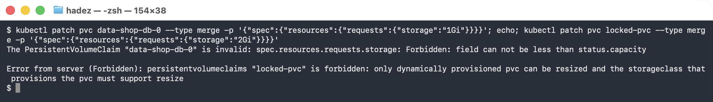


---

## Step 6 — Diagnose a multi-attach failure

**Goal:** produce the classic `ReadWriteOnce` conflict on purpose, read the message correctly, and fix it — then meet the *second* failure hiding behind it.

**1. Find where the volume is attached, then deliberately put a second Pod somewhere else:**

```bash
kubectl get pod shop-db-0 -o custom-columns=POD:.metadata.name,NODE:.spec.nodeName
```

```console
POD         NODE
shop-db-0   csistate-worker
```

```bash
kubectl apply -f - <<'EOF'
apiVersion: v1
kind: Pod
metadata: { name: report-runner }
spec:
  nodeName: csistate-worker2          # <- the OTHER worker, on purpose
  containers:
    - name: app
      image: busybox:1.36
      command: ["sh","-c","cat /data/message; sleep 100000"]
      volumeMounts: [{ name: data, mountPath: /data }]
  volumes:
    - name: data
      persistentVolumeClaim: { claimName: data-shop-db-0 }
EOF
```

**2. It hangs in `ContainerCreating`. Get the reason from the events:**

```console
$ kubectl get pod report-runner
NAME            READY   STATUS              RESTARTS   AGE
report-runner   0/1     ContainerCreating   0          45s

$ kubectl describe pod report-runner | sed -n '/Events/,$p'
Warning  FailedAttachVolume  46s  attachdetach-controller  Waiting for detach for volume
  "pvc-f833ee26-…" Volume is already used by pod(s) shop-db-0

$ kubectl get volumeattachment -o custom-columns=NODE:.spec.nodeName,ATTACHED:.status.attached
NODE               ATTACHED
csistate-worker   true
```

**What this means.** A `ReadWriteOnce` volume can be attached to **one node** at a time. The `attachdetach-controller` in `kube-controller-manager` sees an existing `VolumeAttachment` for `csistate-worker` and refuses to create a second one for `csistate-worker2`. Notice there is still exactly **one** `VolumeAttachment` — the conflict is resolved by *not acting*, which is why the Pod waits forever rather than failing.

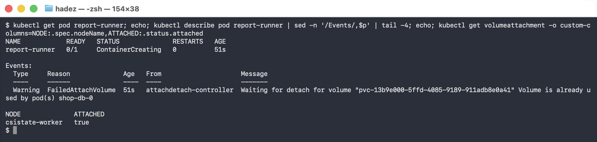


> ⚠️ **Gotcha — the wording changed, the condition did not.** On Kubernetes v1.37 the message is `Waiting for detach for volume "…" Volume is already used by pod(s) <name>`. Older clusters print `Multi-Attach error for volume "…" Volume is already exclusively attached to one node and can't be attached to another`. Search runbooks for **`FailedAttachVolume`**, which is stable, rather than for the phrase "Multi-Attach".

> ⚠️ **Gotcha — `RWO` is per *node*, not per *Pod*.** Two Pods sharing one RWO volume is fine as long as the scheduler puts them on the **same** node — which is exactly why this bug hides in development and appears in production, where replicas spread out. The real-world trigger is almost never a hand-written `nodeName`: it is a `Deployment` with an RWO PVC scaled past one replica, or a rolling update where the new Pod lands elsewhere before the old one is gone. If a workload genuinely needs shared access, it needs `ReadWriteMany` and a driver that supports it — not a retry loop.

**3. Free the volume and watch the attachment move:**

```bash
kubectl scale statefulset shop-db --replicas=0
```

```console
$ kubectl get volumeattachment -o custom-columns=NODE:.spec.nodeName,ATTACHED:.status.attached
NODE              ATTACHED
csistate-worker2   true
```

The attach succeeded on the new node — proving the earlier refusal really was only about the prior attachment. But the Pod *still* will not start, and the reason is now different:

```console
$ kubectl describe pod report-runner | sed -n '/Events/,$p'
Warning  FailedAttachVolume      106s              attachdetach-controller  Waiting for detach for volume …
Normal   SuccessfulAttachVolume  22s               attachdetach-controller  AttachVolume.Attach succeeded …
Warning  FailedMount             6s (x6 over 22s)  kubelet                  MountVolume.NodeAffinity check
  failed for volume "pvc-f833ee26-…" : no matching NodeSelectorTerms
```

**4. This is the fourth failure pattern — a node-affinity-pinned volume:**

```console
$ kubectl get pv -o jsonpath='{.items[0].spec.nodeAffinity}'
{"required":{"nodeSelectorTerms":[{"matchExpressions":[{"key":"topology.hostpath.csi/node",
 "operator":"In","values":["csistate-worker"]}]}]}}

$ kubectl get csinode -o custom-columns=NODE:.metadata.name,DRIVERS:.spec.drivers[*].name,TOPOLOGY:.spec.drivers[*].topologyKeys
NODE                     DRIVERS               TOPOLOGY
csistate-control-plane   <none>                <none>
csistate-worker2          <none>                <none>
csistate-worker         hostpath.csi.k8s.io   [topology.hostpath.csi/node]
```

The volume is **physically on `csistate-worker`**, so the provisioner wrote `nodeAffinity` into the PV. (Which worker ends up running the single driver replica is arbitrary — read it from `CSINode` rather than assuming, and swap the names below accordingly.) `kubectl` let the attach happen, then kubelet refused the mount. Fix it by scheduling the consumer where the data is:

```bash
kubectl delete pod report-runner
# re-create with nodeName: csistate-worker
kubectl exec report-runner -- cat /data/message
```

```console
important-data-v1
```

**What this means.** Two distinct controls stopped you, in order: the **attach-detach controller** (one node per RWO volume) and then **kubelet's node-affinity check** (this volume only exists on one node). Read the `From` column — `attachdetach-controller` versus `kubelet` — to know which one you are fighting. A `FailedMount` with `NodeAffinity` is never fixed by waiting; the Pod must move.

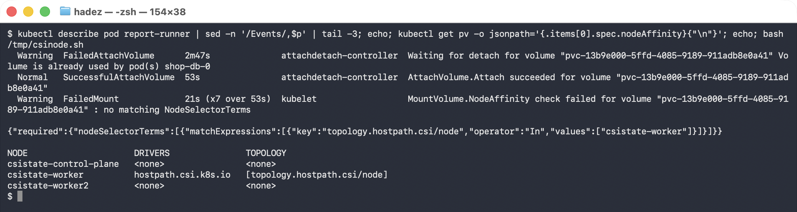


> **Nutanix note.** On a Nutanix cluster, Nutanix Volumes are reachable from any node, so a PV normally carries **no** `nodeAffinity` and this second failure does not occur — a detached RWO volume will attach and mount anywhere. The multi-attach conflict in part 2 is identical, because it is enforced by `kube-controller-manager` and not by the driver. Where topology *does* bite on Nutanix is across **availability domains or rack-aware storage containers**; the diagnostic is the same pair of commands — the PV's `nodeAffinity` and the `CSINode` topology keys.

---

## Step 7 — PVC lifecycle: a finalizer that holds a deletion, and cloning

**Goal:** see why a PVC you deleted is still there, and copy a volume without going through a snapshot.

**1. Delete a PVC that a running Pod still uses:**

```bash
kubectl delete pvc data-shop-db-0 --wait=false
kubectl get pvc data-shop-db-0
```

```console
persistentvolumeclaim "data-shop-db-0" deleted from default namespace

NAME             STATUS        VOLUME           CAPACITY   ACCESS MODES   STORAGECLASS      AGE
data-shop-db-0   Terminating   pvc-f833ee26-…   3Gi        RWO            csi-hostpath-sc   3m31s
```

**2. The object is marked for deletion but held by a finalizer:**

```console
$ kubectl get pvc data-shop-db-0 -o jsonpath='{.metadata.finalizers}'
["kubernetes.io/pvc-protection"]

$ kubectl get pvc data-shop-db-0 -o jsonpath='{.metadata.deletionTimestamp}'
2026-09-27T05:44:02Z
```

A minute later nothing has changed, and the volume is still serving reads:

```console
data-shop-db-0   Terminating   pvc-f833ee26-…   3Gi   RWO   csi-hostpath-sc   4m26s

$ kubectl exec report-runner -- cat /data/message
important-data-v1
```

**3. Remove the consumer and the deletion completes by itself:**

```bash
kubectl delete pod report-runner
kubectl get pvc data-shop-db-0
kubectl get pv
```

```console
Error from server (NotFound): persistentvolumeclaims "data-shop-db-0" not found

NAME                                       STATUS   CLAIM
pvc-f17b29aa-b1e9-471f-b9d3-079f2294f2b7   Bound    locked-pvc
```

The PVC went, and because the StorageClass used `reclaimPolicy: Delete`, **the PV and the data went with it**.

**What this means.** `kubernetes.io/pvc-protection` is deliberate protection, not a bug: it stops you destroying storage that something is still mounting. `Terminating` plus a `deletionTimestamp` plus a finalizer means *"waiting for a precondition"* — find the holder, don't force it.

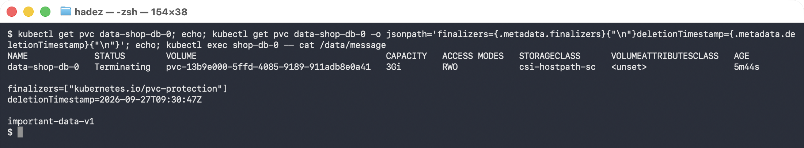


> 🚨 **Gotcha — never `kubectl patch` a `pvc-protection` finalizer away to "unstick" it.** Stripping the finalizer deletes the PVC while a Pod still has the volume mounted; with `reclaimPolicy: Delete` the PV is then removed under a running application, which is data loss, not a cleanup. The supported fix is always to remove the consumer. `kubectl describe pvc` names it, and so does:
>
> ```bash
> kubectl get pods -o json | jq -r '.items[] | select(.spec.volumes[]?.persistentVolumeClaim.claimName=="data-shop-db-0") | .metadata.name'
> ```

> ⚠️ **Gotcha — `reclaimPolicy` is what decides whether "delete the PVC" means "delete the data".** `Delete` (the default for most dynamic classes, including this one and GKE's `standard-rwo`) destroys the volume. `Retain` keeps the PV in `Released` state so you can recover it — but a `Released` PV will **not** rebind to a new PVC until you clear `spec.claimRef` by hand. Choose per class, and know which one your production class uses before you test a deletion.

**4. Clone a volume directly from another PVC — no snapshot in between.** First make a source with something in it:

```bash
kubectl apply -f - <<'EOF'
apiVersion: v1
kind: PersistentVolumeClaim
metadata: { name: src-pvc }
spec:
  accessModes: ["ReadWriteOnce"]
  storageClassName: csi-hostpath-sc
  resources: { requests: { storage: 1Gi } }
---
apiVersion: v1
kind: Pod
metadata: { name: writer }
spec:
  containers:
    - name: app
      image: busybox:1.36
      command: ["sh","-c","echo orders-2026-Q3 > /data/ledger; sleep 100000"]
      volumeMounts: [{ name: d, mountPath: /data }]
  volumes: [{ name: d, persistentVolumeClaim: { claimName: src-pvc } }]
EOF
kubectl wait --for=condition=Ready pod/writer --timeout=180s
```

Then clone it:

```bash
kubectl apply -f - <<'EOF'
apiVersion: v1
kind: PersistentVolumeClaim
metadata: { name: clone-pvc }
spec:
  accessModes: ["ReadWriteOnce"]
  storageClassName: csi-hostpath-sc
  resources: { requests: { storage: 1Gi } }
  dataSource:
    kind: PersistentVolumeClaim     # <- a PVC, not a VolumeSnapshot
    name: src-pvc
EOF
```

```console
NAME        STATUS   VOLUME           CAPACITY   ACCESS MODES   STORAGECLASS      AGE
src-pvc     Bound    pvc-10da5199-…   1Gi        RWO            csi-hostpath-sc   22s
clone-pvc   Bound    pvc-95e46fdc-…   1Gi        RWO            csi-hostpath-sc   12s
```

Mount the clone to read it:

```bash
kubectl apply -f - <<'EOF'
apiVersion: v1
kind: Pod
metadata: { name: clone-reader }
spec:
  containers:
    - name: app
      image: busybox:1.36
      command: ["sh","-c","sleep 100000"]
      volumeMounts: [{ name: d, mountPath: /data }]
  volumes: [{ name: d, persistentVolumeClaim: { claimName: clone-pvc } }]
EOF
kubectl wait --for=condition=Ready pod/clone-reader --timeout=180s
```

The clone carries the source's contents and is then **fully independent**:

```console
$ kubectl exec clone-reader -- cat /data/ledger
orders-2026-Q3

$ kubectl exec clone-reader -- sh -c 'echo clone-only-line >> /data/ledger; cat /data/ledger'
orders-2026-Q3
clone-only-line

$ kubectl exec writer -- cat /data/ledger          # source untouched
orders-2026-Q3
```

**What this means.** `dataSource` takes either a `VolumeSnapshot` (Step 4) or a **`PersistentVolumeClaim`**. Cloning is the right tool for "give me a copy of production data to test against" — it is one object and no snapshot to manage. A snapshot is the right tool for *point-in-time recovery*, because it keeps existing after the source volume is gone. Both require driver support and both are constrained to the **same StorageClass**.

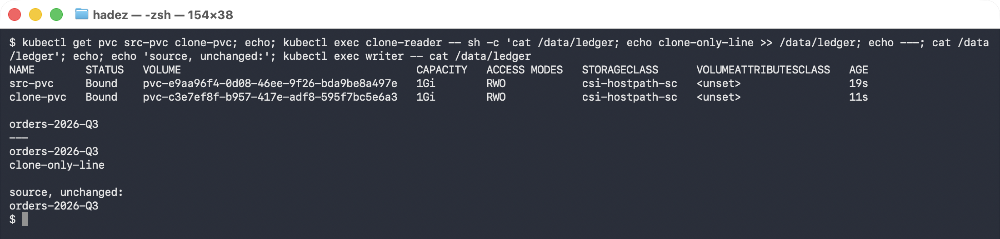


---
## Step 8 — Clean up

```bash
# GKE part (Steps 1-4)
kubectl delete pod restore-check --ignore-not-found
kubectl delete pvc data-restored --ignore-not-found
kubectl delete volumesnapshot db-snap --ignore-not-found
kubectl delete volumesnapshotclass pd-snapclass --ignore-not-found

# kind part (Steps 5-7) — one command removes everything
kind delete cluster --name csistate
```

---

## What you learned

| You saw… | in Step | proof |
|---|---|---|
| A StatefulSet gives each Pod its own PVC/disk | 1 | `data-db-0` Bound, file on the disk |
| You can snapshot a live PVC via CSI | 2 | `db-snap` `readyToUse=true`, 1Gi |
| A snapshot outlives its source volume | 3 | PVC deleted, snapshot remains |
| A snapshot restores onto a new PVC via `dataSource` | 4 | `data-restored` Bound, data intact |
| Data survives a full destroy/restore cycle | 4 | `important-data-v1` after restore |
| Expansion takes **two** CSI calls, controller then node | 5 | `node_expansion_required:true`, PV `3Gi` while PVC status `1Gi` |
| `FileSystemResizePending` does not clear on its own | 5 | unchanged over 18s; cleared only after the Pod restarted |
| Volumes only grow, and only if the class allows it | 5 | `field can not be less than status.capacity`; `…must support resize` |
| An RWO volume attaches to one **node**, not one Pod | 6 | `FailedAttachVolume … already used by pod(s) shop-db-0`, one `VolumeAttachment` |
| Freeing the volume reveals a **second** failure | 6 | `MountVolume.NodeAffinity check failed: no matching NodeSelectorTerms` |
| The PV is pinned by CSI topology | 6 | PV `nodeAffinity` on `topology.hostpath.csi/node`, `CSINode` shows one node |
| A PVC finalizer holds a deletion open indefinitely | 7 | `Terminating` + `["kubernetes.io/pvc-protection"]` for 60s+ |
| `reclaimPolicy: Delete` destroys the data with the PVC | 7 | PV gone once the consumer was removed |
| `dataSource` also clones from a PVC, independently | 7 | clone reads `orders-2026-Q3`, diverges, source unchanged |

## Evidence

Real screenshots for this lab are in [`artifacts/lab-11/screenshots/`](../artifacts/lab-11/screenshots/) (4 images), and command transcripts are in [`artifacts/lab-11/evidence/lab-08-statefulsets-snapshots.txt`](../artifacts/lab-11/evidence/lab-08-statefulsets-snapshots.txt) (Steps 1–4, GKE) and [`artifacts/lab-11/evidence/lab-11-expansion-and-multiattach.txt`](../artifacts/lab-11/evidence/lab-11-expansion-and-multiattach.txt) (Steps 5–7, kind + CSI hostpath).

---

---

**Next:** [Lab 12 — Bring a Deleted Namespace Back from Backup (Velero)](lab-12-velero-backup-restore.docx)
