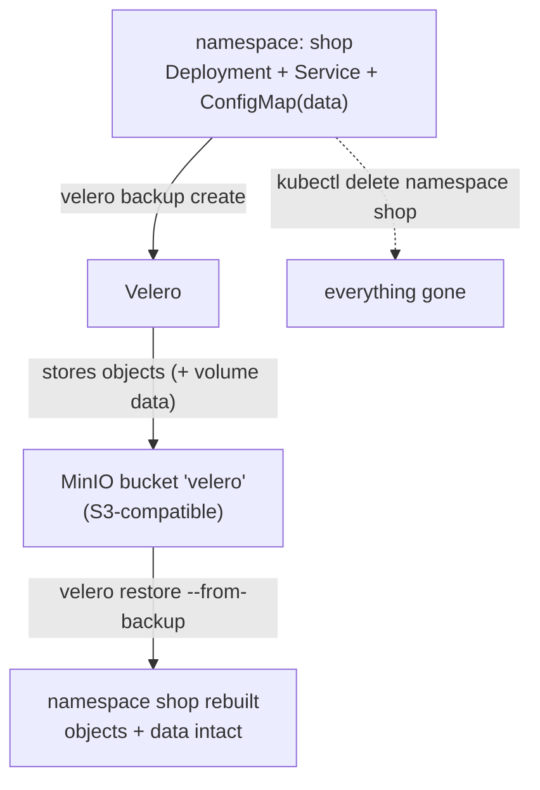

**Day 3 · Stateful Workloads, Persistent Storage & Service Exposure**

> YES — **Tested end-to-end** on a **real GKE cluster** (`advk8s-lab`, `dcproject-462806`) with **Velero** backing up to an **in-cluster MinIO** (S3-compatible) bucket. Every screenshot is a real capture. The payoff: you `kubectl delete namespace` an entire application, then bring it *all* back — Deployment, Service, and its data — from a backup, with `catalog: widget-9000=42.00` intact.

## What you'll learn

- The difference between a **volume snapshot** (Lab 11 — one disk, same storage system) and a **backup** (this lab — whole namespaces of *objects and data*, in external object storage you can restore anywhere).
- How to run **Velero** against **S3-compatible object storage** — here in-cluster MinIO, exactly the pattern you'd use with **Nutanix Objects**.
- Why a backup that reports **`Completed` with zero errors** can restore **nothing usable**, and the one test that catches it.
- How **Schedules**, **TTL** and **expiry** behave — including what expiry actually deletes.
- How to back up a namespace, prove it's stored, delete the namespace completely, and restore it.

## What you'll do

You'll stand up MinIO as an S3 target and install Velero pointing at it. Then you'll create an app with data, back up its namespace, **delete the whole namespace**, and restore it from the backup — verifying every object and its data returns.

## Time & cost

- **Time:** ~45 minutes.
- **Cost:** negligible — MinIO and Velero run as small Pods on the shared GKE cluster; no cloud object storage needed.

---

## Before you start

- **Where you'll work:** in a **terminal** on your own machine.
- **Tools you need:** `gcloud`, `kubectl`, and the **`velero`** CLI (`brew install velero`).
- **Cluster:** a GKE cluster (this course's shared `advk8s-lab`).

> **Nutanix note.** Velero is the standard Kubernetes backup tool and is platform-agnostic. We back up to in-cluster **MinIO** here so the lab is self-contained and needs no cloud credentials — but the object-store config is *identical* for **Nutanix Objects** (also S3-compatible): you'd just point `s3Url` at your Nutanix Objects endpoint and use its access keys. Everything else in this lab is unchanged on NKE.

---

## The idea in 60 seconds

A **snapshot** (Lab 11) copies one volume within the same storage system — great for fast single-disk recovery, useless if the whole cluster or namespace is gone. A **backup** captures your Kubernetes **objects** (Deployments, Services, ConfigMaps, …) *and* volume data, and writes them to **external object storage**. Because the backup lives outside the cluster, you can restore a deleted namespace — or rebuild onto a brand-new cluster entirely.

**Velero** is the tool: it watches for `Backup`/`Restore` custom resources, serialises the selected objects, and stores them in an S3 bucket. Here that bucket is MinIO running in the cluster.



---

## Step 1 — Stand up the backup target (MinIO) and install Velero

> ### ⚠️ Check the MinIO image pulls before you teach this
>
> **Verified 2026-09-25: `minio/minio` no longer pulls from Docker Hub.**
>
> ```
> Error response from daemon: pull access denied for minio/minio,
> repository does not exist or may require 'docker login'
> ```
>
> `quay.io/minio/minio` returns `401 Unauthorized` and `bitnami/minio` fails too, while Docker Hub
> itself is fine (`alpine:3.20` pulls normally). MinIO restricted their public images. If your
> learners cannot pull it, this lab stops at Step 1.
>
> **Substitutes that do pull, and work as a Velero target:** `chrislusf/seaweedfs`,
> `zenko/cloudserver`. SeaweedFS was used to verify the evidence for Steps 6–7 of this lab, with the
> Service still named `minio` so nothing else changes.
>
> ⚠️ **If you substitute, file-system backup needs real S3 auth.** SeaweedFS refuses signed requests
> unless `-s3.config` defines credentials — kopia's repository init fails with *"Signed request
> requires setting up SeaweedFS S3 authentication"* while metadata-only backups keep working. The
> symptom is a backup that reports `PartiallyFailed` with no `PodVolumeBackup` objects. Mirror the
> credentials in your Velero secret. Plain MinIO or real S3 does not have this problem.
>
> Check the pull before the session — it is a one-line test and it is the difference between the lab
> running and not.

**Goal:** deploy MinIO as an S3 target, create a bucket, and install Velero pointing at it.

**1. Deploy MinIO and a Service** (MinIO dropped its `latest` tag, so use a current `RELEASE.*` image — the quay.io mirror is reliable):

```bash
kubectl create namespace velero
kubectl apply -n velero -f - <<'EOF'
apiVersion: apps/v1
kind: Deployment
metadata: {name: minio, labels: {app: minio}}
spec:
  replicas: 1
  selector: {matchLabels: {app: minio}}
  template:
    metadata: {labels: {app: minio}}
    spec:
      containers:
        - name: minio
          image: quay.io/minio/minio:RELEASE.2025-09-07T16-13-09Z-cpuv1
          args: ["server", "/data", "--console-address", ":9001"]
          env:
            - {name: MINIO_ROOT_USER, value: minioadmin}
            - {name: MINIO_ROOT_PASSWORD, value: minioadmin}
          ports: [{containerPort: 9000}]
---
apiVersion: v1
kind: Service
metadata: {name: minio}
spec:
  selector: {app: minio}
  ports: [{port: 9000, targetPort: 9000}]
EOF
kubectl -n velero rollout status deployment/minio --timeout=150s
```

**2. Create the `velero` bucket** with a one-shot `mc` (MinIO client) Job:

```bash
kubectl -n velero apply -f - <<'EOF'
apiVersion: batch/v1
kind: Job
metadata: {name: mc-mkbucket}
spec:
  backoffLimit: 3
  template:
    spec:
      restartPolicy: OnFailure
      containers:
        - name: mc
          image: quay.io/minio/mc:RELEASE.2025-08-13T08-35-41Z-cpuv1
          command: ["sh","-c","until mc alias set local http://minio:9000 minioadmin minioadmin; do sleep 2; done; mc mb -p local/velero; mc ls local"]
EOF
kubectl -n velero wait --for=condition=complete job/mc-mkbucket --timeout=120s
```

**3. Install Velero** pointing at MinIO (these are throwaway MinIO creds, not cloud credentials):

```bash
cat > /tmp/velero-creds <<'EOF'
[default]
aws_access_key_id=minioadmin
aws_secret_access_key=minioadmin
EOF

velero install \
  --provider aws \
  --plugins velero/velero-plugin-for-aws:v1.11.1 \
  --bucket velero \
  --secret-file /tmp/velero-creds \
  --use-volume-snapshots=false \
  --use-node-agent \
  --backup-location-config region=minio,s3ForcePathStyle=true,s3Url=http://minio.velero.svc:9000 \
  --namespace velero

kubectl -n velero rollout status deployment/velero --timeout=150s
velero backup-location get
```

**What you should see:** the backup location `default` reports **`PHASE: Available`** — Velero can reach the MinIO bucket.

**What this means:** Velero is installed and its S3 target is validated. On NKE you'd point `s3Url` at Nutanix Objects instead; nothing else changes.

---

## Step 2 — Create an app with data, and back it up

**Goal:** back up a whole namespace to MinIO.

```bash
kubectl create namespace shop
kubectl -n shop create deployment web --image=nginx:1.27-alpine
kubectl -n shop create configmap catalog --from-literal=featured="widget-9000" --from-literal=price="42.00"
kubectl -n shop expose deployment web --port=80

velero backup create shop-backup --include-namespaces shop --wait
velero backup describe shop-backup
```

**What you should see:** the backup reaches **`Phase: Completed`**, with something like **16 items backed up** (the namespace and everything in it), and the `catalog` data is `widget-9000=42.00`.


**What this means:** Velero serialised every object in `shop` and wrote them to the MinIO bucket. That backup now exists *independently of the cluster*.

---

## Step 3 — Delete the entire namespace

**Goal:** simulate a real disaster — the whole namespace is gone.

```bash
kubectl delete namespace shop
kubectl get ns shop --ignore-not-found
velero backup get
```

**What you should see:** `shop` is gone (no output), but `shop-backup` is still listed as `Completed`.


**What this means:** the live application is completely gone — Deployment, Service, ConfigMap, all of it. The only copy is the backup in MinIO.

---

## Step 4 — Restore, and verify the data came back

**Goal:** restore the namespace from the backup and prove everything returned.

```bash
velero restore create shop-restore --from-backup shop-backup --wait

kubectl get ns shop
kubectl -n shop get deploy,svc,cm
kubectl -n shop get cm catalog -o jsonpath='{.data.featured}={.data.price}{"\n"}'
```

**What you should see:** the restore completes, `shop` is `Active` again, `web` (Deployment + Service) and `catalog` are back, and the ConfigMap data reads **`widget-9000=42.00`** — exactly as before.


**What this means:** a fully deleted namespace came back, objects and data intact, from external storage. Because the backup lives in object storage, the very same command could restore this app onto a *different* cluster — which is the real power of a backup over a snapshot.

---

## Step 5 — The backup that says `Completed` and restores nothing

**Goal:** meet the failure mode that makes people trust backups they should not.

Everything so far worked. Now configure Velero the way most teams first do — and watch it lie to you.

Back the same namespace up **without** file-system backup of the volume:

```bash
velero backup create orders-nightly --include-namespaces orders \
  --default-volumes-to-fs-backup=false --wait
velero backup get orders-nightly
```

**What you should see — a completely clean result:**

```
phase          = Completed
itemsBackedUp  = 19 of 19
errors         = 0
warnings       = 0
```

Destroy the namespace and restore it:

```bash
kubectl delete ns orders
velero restore create --from-backup orders-nightly --wait
```

```
Restore completed with status: Completed.
ERRORS: 0
```

**Check the cluster — everything is healthy:**

```bash
kubectl -n orders get pvc,deploy
```

```
persistentvolumeclaim/pgdata   Bound   pvc-5e49edac...   1Gi   RWO   standard
deployment.apps/orders-db      1/1     1            1
```

**Now ask the database:**

```bash
kubectl -n orders exec $POD -- psql -U postgres -c "SELECT * FROM orders;"
```

```
ERROR:  relation "orders" does not exist
```

**What this means.** Backup `Completed`. Restore `Completed`, zero errors. PVC `Bound`. Pod
`1/1 Running`. **The data is gone.**

Velero backed up the Kubernetes *objects* — the PVC, the Deployment, the Service — and never touched
the bytes inside the volume. On restore it recreated an empty PVC. Postgres found an empty data
directory, ran `initdb`, and started cleanly. **Nothing anywhere reports a problem.**

> ⚠️ **This is worse than a failed restore.** A restore that errors gets investigated. This one
> reports success, so it gets ticked off — and the gap is discovered months later by someone who
> actually needed the data. The outline calls this *"restores that report success without usable
> data"*, and it is the single most important thing in this module.

**The fix is to tell Velero to back up volume contents**, not just the objects that describe them:

```bash
velero install ... --use-node-agent --default-volumes-to-fs-backup
velero backup create orders-nightly --include-namespaces orders --default-volumes-to-fs-backup
```

Then verify by the only test that counts:

```bash
kubectl -n velero get podvolumebackups     # a row per volume, with bytesDone
```

> **The rule this lab exists to teach:** a backup is not verified by its phase. It is verified by a
> restore into a scratch namespace and a query against the restored data. Put that in the runbook.

---

## Step 6 — Schedules, TTL and what expiry actually deletes

**Goal:** make the backup recurring, and know when it disappears.

```bash
velero schedule create orders-daily \
  --schedule="0 2 * * *" \
  --include-namespaces orders \
  --ttl 72h

velero schedule get
```

```
NAME           STATUS    SCHEDULE    BACKUP TTL   LAST BACKUP   PAUSED
orders-daily   Enabled   0 2 * * *   72h0m0s      n/a           false
```

Every backup the schedule creates inherits that TTL. Look at what that becomes on the object:

```bash
kubectl -n velero get backup <name> \
  -o jsonpath='ttl={.spec.ttl}{"\n"}completed={.status.completionTimestamp}{"\n"}expiration={.status.expiration}'
```

```
ttl        = 720h0m0s
completed  = 2026-09-25T13:40:02Z
expiration = 2026-10-25T13:40:01Z
```

**What this means.** TTL is resolved to an **absolute expiration timestamp at creation**, not
evaluated later. Velero's `gc-controller` removes the Backup object *and its data in object storage*
once that moment passes.

Two consequences worth stating plainly:

- **Changing a Schedule's `--ttl` does not re-date backups already taken.** The old ones still expire
  on their original schedule. If you extend retention after an incident, the backups you care about
  may already be counting down.
- **Expiry deletes the data, not just the record.** This is not an index tidy-up. A backup that ages
  out is gone from the bucket.

> ⚠️ **Gotcha — `velero backup describe --details` fails against an in-cluster object store.** The
> CLI runs on your laptop and tries to fetch details directly from S3, so it cannot resolve
> `minio.velero.svc`. You get `dial tcp: lookup minio.velero.svc: no such host` even though the
> backup itself is fine. Read `kubectl -n velero logs deploy/velero` instead, or port-forward the
> object store.

---

## Step 7 — Clean up

```bash
kubectl delete namespace shop --ignore-not-found
velero backup delete shop-backup --confirm
# to remove Velero + MinIO entirely:
# kubectl delete namespace velero
```

---

## What you learned

| You saw… | in Step | proof |
|---|---|---|
| Velero backs up to S3-compatible storage (MinIO / Nutanix Objects) | 1 | backup location `Available` |
| A namespace backup captures all its objects | 2 | `Completed`, 16 items |
| The backup survives the cluster's objects | 3 | namespace deleted, backup remains |
| A deleted namespace restores with data intact | 4 | `shop` Active, `catalog=widget-9000=42.00` |
| Backups (unlike snapshots) can restore to another cluster | 4 |
| A backup can report `Completed` and restore nothing usable | 5 | 19/19 items, 0 errors — then `relation "orders" does not exist` |
| Velero backs up objects, not volume bytes, unless told | 5 | PVC `Bound` and empty; Postgres ran `initdb` and started clean |
| Only a restore-and-query verifies a backup | 5 | every status field was green while the data was gone |
| TTL becomes an absolute expiry stamped at creation | 6 | `ttl=720h` → `expiration=2026-10-25T13:40:01Z` |
| Expiry deletes the backup **and its data** | 6 | gc-controller removes the object and the bucket contents |


## Evidence

The "backup said Completed" scenario and the schedule/TTL behaviour are captured in
[`artifacts/lab-12/evidence/lab-12-backup-completed-no-data.txt`](../artifacts/lab-12/evidence/lab-12-backup-completed-no-data.txt)
— 78 lines from a run on 2026-09-25 (Kubernetes 1.37.0, Velero 1.18.2), including the clean
`Completed` phases, the healthy PVC and Pod, and the `relation "orders" does not exist` that follows.

### Original GKE evidence

Real screenshots for this lab are in [`artifacts/lab-12/screenshots/`](../artifacts/lab-12/screenshots/) (3 images), and a command transcript is in [`artifacts/lab-12/evidence/lab-09-velero-backup-restore.txt`](../artifacts/lab-12/evidence/lab-09-velero-backup-restore.txt).

---

---

**Next:** [Lab 13 — Give On-Prem Services a Real IP (Bare-Metal LoadBalancer with MetalLB)](lab-13-metallb.docx)
