# Lab 12 — Bring a Deleted Namespace Back from Backup (Velero)

**Day 3 · Stateful Workloads, Persistent Storage & Service Exposure**

> ✅ **Tested end-to-end**, in three parts. Steps 2–4 were first verified on a **real GKE cluster** (`advk8s-lab`, `dcproject-462806`) against an in-cluster MinIO bucket; every screenshot is a real capture from that run. **MinIO's public images have since been withdrawn**, so Step 1 was rewritten and re-verified on `kind` with **SeaweedFS 3.80** on 2026-09-27 (backup location `Available`, volume data backed up and restored). Steps 5–6 were verified on `kind` on 2026-09-25. The payoff is unchanged: you `kubectl delete namespace` an entire application, then bring it *all* back — Deployment, Service, and its data — with `catalog: widget-9000=42.00` intact.

## What you'll learn

- The difference between a **volume snapshot** (Lab 11 — one disk, same storage system) and a **backup** (this lab — whole namespaces of *objects and data*, in external object storage you can restore anywhere).
- How to run **Velero** against **S3-compatible object storage** — here in-cluster SeaweedFS, exactly the pattern you'd use with **Nutanix Objects**.
- Why a backup that reports **`Completed` with zero errors** can restore **nothing usable**, and the one test that catches it.
- How **Schedules**, **TTL** and **expiry** behave — including what expiry actually deletes.
- How to back up a namespace, prove it's stored, delete the namespace completely, and restore it.

## What you'll do

You'll stand up an S3-compatible object store as a backup target and install Velero pointing at it. Then you'll create an app with data, back up its namespace, **delete the whole namespace**, and restore it from the backup — verifying every object and its data returns.

## Time & cost

- **Time:** ~45 minutes.
- **Cost:** negligible — the object store and Velero run as small Pods; no cloud object storage needed.

---

## Before you start

- **Where you'll work:** in a **terminal** on your own machine.
- **Tools you need:** `gcloud`, `kubectl`, and the **`velero`** CLI (`brew install velero`).
- **Cluster:** a GKE cluster (this course's shared `advk8s-lab`).

> **Nutanix note.** Velero is the standard Kubernetes backup tool and is platform-agnostic. We back up to an in-cluster S3 store here so the lab is self-contained and needs no cloud credentials — but the object-store config is *identical* for **Nutanix Objects** (also S3-compatible): you'd just point `s3Url` at your Nutanix Objects endpoint and use its access keys. Everything else in this lab is unchanged on NKE.

---

## The idea in 60 seconds

A **snapshot** (Lab 11) copies one volume within the same storage system — great for fast single-disk recovery, useless if the whole cluster or namespace is gone. A **backup** captures your Kubernetes **objects** (Deployments, Services, ConfigMaps, …) *and* volume data, and writes them to **external object storage**. Because the backup lives outside the cluster, you can restore a deleted namespace — or rebuild onto a brand-new cluster entirely.

**Velero** is the tool: it watches for `Backup`/`Restore` custom resources, serialises the selected objects, and stores them in an S3 bucket. Here that bucket is served by SeaweedFS running in the cluster.


---

## Step 1 — Stand up the backup target (SeaweedFS) and install Velero

> ### 🚨 This lab used MinIO until 2026-09-25. MinIO's public images are gone.
>
> **Re-verified 2026-09-27 — every MinIO image this lab used now fails to pull:**
>
> ```console
> $ docker pull minio/minio:latest
> Error response from daemon: pull access denied for minio/minio, repository does not exist
> or may require 'docker login'
>
> $ docker pull quay.io/minio/minio:RELEASE.2025-09-07T16-13-09Z-cpuv1
> ... unexpected status from HEAD request to https://quay.io/v2/minio/minio/manifests/...: 401 Unauthorized
>
> $ docker pull quay.io/minio/mc:RELEASE.2025-08-13T08-35-41Z-cpuv1
> ... unexpected status from HEAD request to https://quay.io/v2/minio/mc/manifests/...: 401 UNAUTHORIZED
> ```
>
> Both the server **and** the `mc` client are unavailable, on Docker Hub *and* on quay.io, while other
> registries work normally. MinIO restricted their public images; there is nothing to configure around
> it. **This step is therefore written for SeaweedFS**, which is verified working below. `zenko/cloudserver`
> and `adobe/s3mock` also pull if you prefer them.
>
> Everything downstream keeps the **Service name `minio`**, so Steps 2–7, all the `s3Url` values and every
> command in the rest of the lab are unchanged.

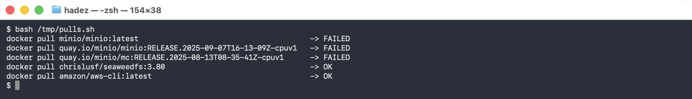


**Goal:** deploy an S3-compatible object store, create a bucket, and install Velero pointing at it.

> ✅ **Verified end-to-end 2026-09-27** on `kind` v1.37.0 with **Velero v1.18.2**, `velero-plugin-for-aws v1.13.0`, **SeaweedFS 3.80** and the `kopia` uploader: backup location `Available`, `PodVolumeBackup` and `PodVolumeRestore` both `Completed`, and `widget-9000=42.00` recovered after the namespace was destroyed. Transcript: [`artifacts/lab-12/evidence/lab-12-seaweedfs-s3-target.txt`](../artifacts/lab-12/evidence/lab-12-seaweedfs-s3-target.txt).

**1. Give SeaweedFS real S3 credentials.** Unlike MinIO, SeaweedFS serves S3 **anonymously** unless you define identities, and Velero signs every request — so without this file the object store answers *"Signed request requires setting up SeaweedFS S3 authentication"* and the backup location never validates:

```bash
kubectl create namespace velero

cat > /tmp/s3config.json <<'EOF'
{
  "identities": [
    {
      "name": "velero",
      "credentials": [ { "accessKey": "veleroaccess", "secretKey": "verosecret123" } ],
      "actions": ["Admin","Read","Write","List","Tagging"]
    }
  ]
}
EOF

kubectl -n velero create secret generic seaweedfs-s3-config --from-file=s3config.json=/tmp/s3config.json
```

**2. Deploy it as `minio`** so nothing else in the lab has to change:

```bash
kubectl apply -n velero -f - <<'EOF'
apiVersion: apps/v1
kind: Deployment
metadata: {name: minio, labels: {app: minio}}
spec:
  replicas: 1
  selector: {matchLabels: {app: minio}}
  template:
    metadata: {labels: {app: minio}}
    spec:
      containers:
        - name: seaweedfs
          image: chrislusf/seaweedfs:3.80
          args:
            - "server"
            - "-dir=/data"
            - "-s3"
            - "-s3.port=9000"
            - "-s3.config=/etc/seaweedfs/s3config.json"
            - "-master.volumeSizeLimitMB=128"
          ports: [{containerPort: 9000}]
          volumeMounts:
            - {name: cfg,  mountPath: /etc/seaweedfs}
            - {name: data, mountPath: /data}
      volumes:
        - name: cfg
          secret: {secretName: seaweedfs-s3-config}
        - name: data
          emptyDir: {}
---
apiVersion: v1
kind: Service
metadata: {name: minio}
spec:
  selector: {app: minio}
  ports: [{port: 9000, targetPort: 9000}]
EOF
kubectl -n velero rollout status deployment/minio --timeout=300s
```

**3. Create the `velero` bucket with the AWS CLI.** The old `mc` Job cannot be used — `mc` is a MinIO image and is equally unavailable — but `amazon/aws-cli` pulls fine and speaks to any S3 endpoint:

```bash
kubectl -n velero run mkbucket --rm -i --restart=Never --image=amazon/aws-cli:latest \
  --env=AWS_ACCESS_KEY_ID=veleroaccess \
  --env=AWS_SECRET_ACCESS_KEY=verosecret123 \
  --env=AWS_DEFAULT_REGION=us-east-1 \
  --command -- sh -c 'aws --endpoint-url http://minio.velero.svc:9000 s3 mb s3://velero &&
                      aws --endpoint-url http://minio.velero.svc:9000 s3 ls'
```

```console
make_bucket: velero
2026-09-27 05:59:12 velero
```

**4. Install Velero** pointing at it. The credentials must match the identity in `s3config.json`:

```bash
cat > /tmp/velero-creds <<'EOF'
[default]
aws_access_key_id=veleroaccess
aws_secret_access_key=verosecret123
EOF

velero install \
  --provider aws \
  --plugins velero/velero-plugin-for-aws:v1.13.0 \
  --bucket velero \
  --secret-file /tmp/velero-creds \
  --use-volume-snapshots=false \
  --use-node-agent \
  --uploader-type kopia \
  --backup-location-config region=minio,s3ForcePathStyle=true,s3Url=http://minio.velero.svc:9000 \
  --namespace velero \
  --wait

velero backup-location get
```

**What you should see:**

```console
NAME      PROVIDER   BUCKET/PREFIX   PHASE       LAST VALIDATED    ACCESS MODE   DEFAULT
default   aws        velero          Available   ...               ReadWrite     true
```

```console
$ kubectl -n velero get pods
NAME                      READY   STATUS    RESTARTS   AGE
minio-7856f76d85-gn6hc    1/1     Running   0          11m
node-agent-wdg6m          1/1     Running   0          10m
velero-566f786554-2n8pc   1/1     Running   0          10m
```

**What this means:** Velero is installed and its S3 target is validated. `PHASE: Available` is the check that matters — it proves Velero authenticated to the bucket and can write to it. On NKE you'd point `s3Url` at **Nutanix Objects** and use its access keys instead; nothing else changes.

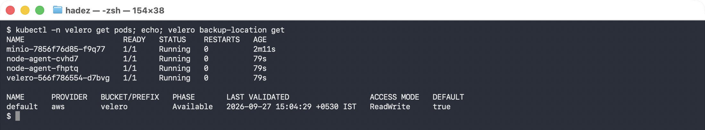


> ⚠️ **Gotcha — `--use-node-agent` is what backs up *data*; without it you get objects only.** The `node-agent` DaemonSet is the component that reads volume contents (via `kopia`). If it is missing or not `Running`, backups still complete and still say `Completed`, but no `PodVolumeBackup` object is created and a restore gives you an empty volume. Confirm all three Pods above are up before you trust a backup.

> 🚨 **Gotcha — on a `kind` cluster the default StorageClass silently defeats file-system backup.** kind's `standard` class (`rancher.io/local-path`) provisions **hostPath** PVs, and Velero refuses to file-system-backup those. The only signal is one warning in the server log:
>
> ```console
> $ kubectl -n velero logs deploy/velero | grep "hostPath volume which is not supported"
> level=warning msg="Volume d in pod shop/catalog-… is a hostPath volume which is not supported
>   for pod volume backup, skipping" logSource="pkg/podvolume/backupper.go:347"
> ```
>
> The backup reports `Completed`, `velero backup get` shows `WARNINGS 1`, and `kubectl -n velero get podvolumebackup` returns **nothing at all**. Diagnosing this as an object-store problem is the natural mistake and it is wrong — the bucket is fine. Check the PV type first:
>
> ```bash
> kubectl get pv -o custom-columns=NAME:.metadata.name,CSI:.spec.csi.driver,SC:.spec.storageClassName
> ```
>
> A CSI driver in the `CSI` column means fs-backup will work; an empty column means it will not. On GKE (`pd.csi.storage.gke.io`) and on Nutanix CSI this does not arise. On `kind`, install a real CSI driver — the setup at the top of Lab 11's Steps 5–7 is exactly what's needed — and point the PVC's `storageClassName` at it.

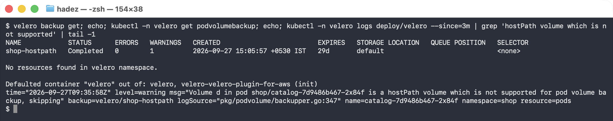


With a CSI-backed volume the same backup behaves properly:

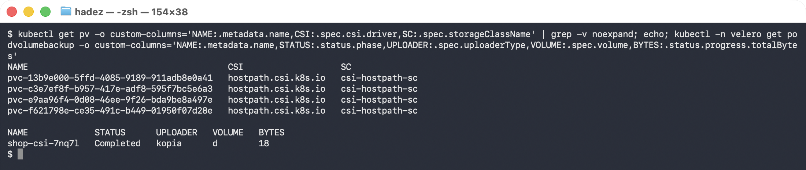


```console
$ kubectl -n velero get podvolumebackup -o custom-columns=NAME:.metadata.name,STATUS:.status.phase,UPLOADER:.spec.uploaderType,VOLUME:.spec.volume,BYTES:.status.progress.totalBytes
NAME             STATUS      UPLOADER   VOLUME   BYTES
shop-csi-fw7xz   Completed   kopia      d        18
```

and after `kubectl delete ns shop`, the restore brings the data back:

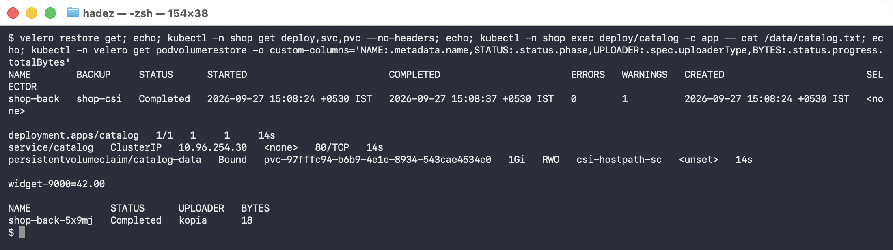


```console
$ velero restore create shop-back-2 --from-backup shop-verify --wait
Restore completed with status: Completed.

$ kubectl -n shop exec $POD -c app -- cat /data/catalog.txt
widget-9000=42.00

$ kubectl -n velero get podvolumerestore -o custom-columns=NAME:.metadata.name,STATUS:.status.phase,UPLOADER:.spec.uploaderType,BYTES:.status.progress.totalBytes
NAME                STATUS      UPLOADER   BYTES
shop-back-2-2cmx6   Completed   kopia      18
```

> ⚠️ **Gotcha — `velero backup describe --details` fails from your laptop, and it is not a broken backup.** The CLI tries to fetch the result files from the object store directly, using the in-cluster address:
>
> ```console
> Warnings:  <error getting warnings: Get "http://minio.velero.svc:9000/velero/backups/…":
>   dial tcp: lookup minio.velero.svc: no such host>
> ```
>
> Your machine cannot resolve a cluster DNS name. The backup itself is fine. Read the server log instead — `kubectl -n velero logs deploy/velero` — or port-forward the Service. This affects any in-cluster object store, MinIO included.

---

## Step 2 — Create an app with data, and back it up

**Goal:** back up a whole namespace to MinIO.

```bash
kubectl create namespace shop
kubectl -n shop create deployment web --image=nginx:1.27-alpine
kubectl -n shop create configmap catalog --from-literal=featured="widget-9000" --from-literal=price="42.00"
kubectl -n shop expose deployment web --port=80

velero backup create shop-backup --include-namespaces shop --wait
velero backup describe shop-backup
```

**What you should see:** the backup reaches **`Phase: Completed`**, with something like **16 items backed up** (the namespace and everything in it), and the `catalog` data is `widget-9000=42.00`.

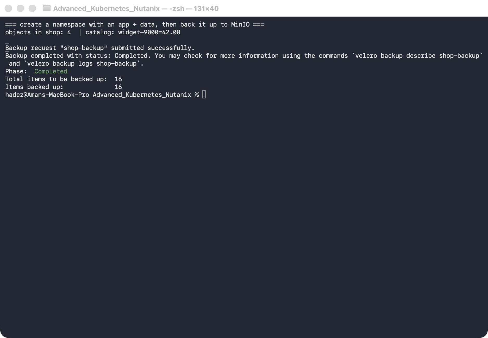

**What this means:** Velero serialised every object in `shop` and wrote them to the MinIO bucket. That backup now exists *independently of the cluster*.

---

## Step 3 — Delete the entire namespace

**Goal:** simulate a real disaster — the whole namespace is gone.

```bash
kubectl delete namespace shop
kubectl get ns shop --ignore-not-found
velero backup get
```

**What you should see:** `shop` is gone (no output), but `shop-backup` is still listed as `Completed`.

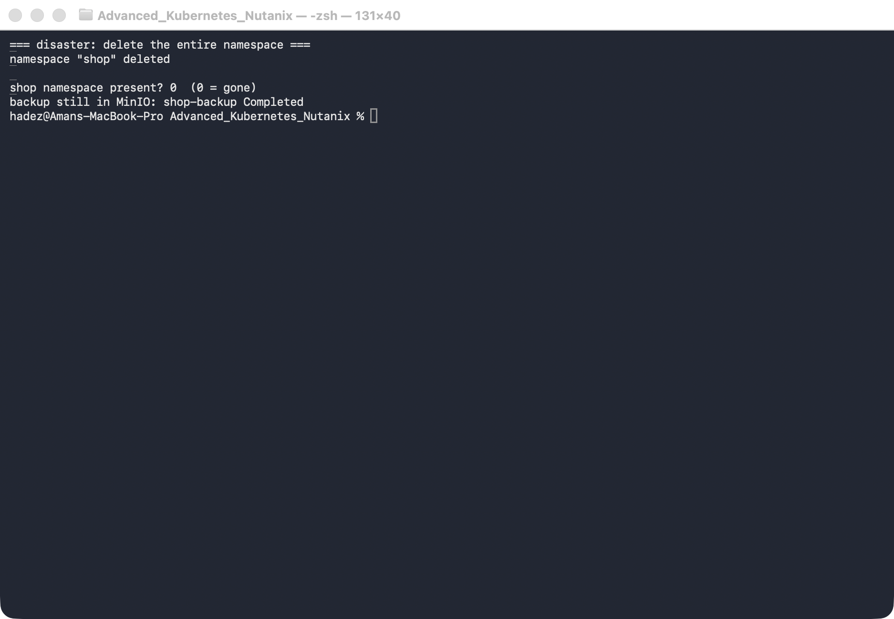

**What this means:** the live application is completely gone — Deployment, Service, ConfigMap, all of it. The only copy is the backup in MinIO.

---

## Step 4 — Restore, and verify the data came back

**Goal:** restore the namespace from the backup and prove everything returned.

```bash
velero restore create shop-restore --from-backup shop-backup --wait

kubectl get ns shop
kubectl -n shop get deploy,svc,cm
kubectl -n shop get cm catalog -o jsonpath='{.data.featured}={.data.price}{"\n"}'
```

**What you should see:** the restore completes, `shop` is `Active` again, `web` (Deployment + Service) and `catalog` are back, and the ConfigMap data reads **`widget-9000=42.00`** — exactly as before.

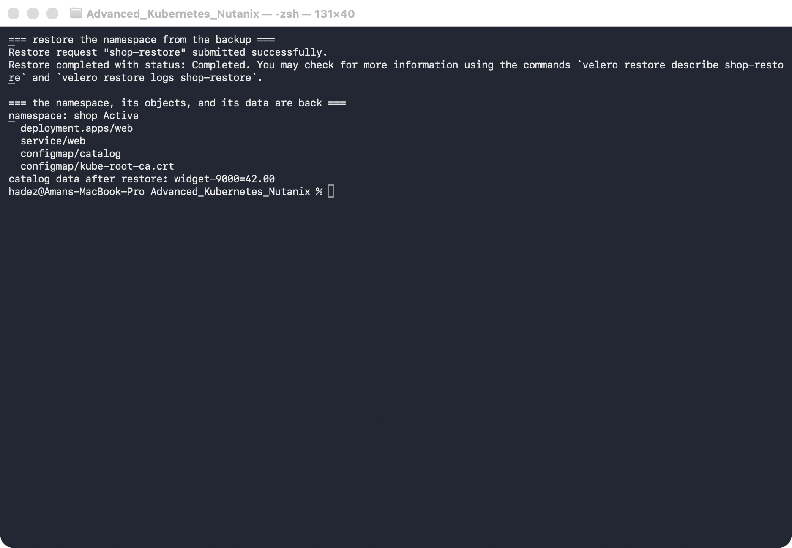

**What this means:** a fully deleted namespace came back, objects and data intact, from external storage. Because the backup lives in object storage, the very same command could restore this app onto a *different* cluster — which is the real power of a backup over a snapshot.

---

## Step 5 — The backup that says `Completed` and restores nothing

**Goal:** meet the failure mode that makes people trust backups they should not.

Everything so far worked. Now configure Velero the way most teams first do — and watch it lie to you.

Back the same namespace up **without** file-system backup of the volume:

```bash
velero backup create orders-nightly --include-namespaces orders \
  --default-volumes-to-fs-backup=false --wait
velero backup get orders-nightly
```

**What you should see — a completely clean result:**

```
phase          = Completed
itemsBackedUp  = 19 of 19
errors         = 0
warnings       = 0
```

Destroy the namespace and restore it:

```bash
kubectl delete ns orders
velero restore create --from-backup orders-nightly --wait
```

```
Restore completed with status: Completed.
ERRORS: 0
```

**Check the cluster — everything is healthy:**

```bash
kubectl -n orders get pvc,deploy
```

```
persistentvolumeclaim/pgdata   Bound   pvc-5e49edac...   1Gi   RWO   standard
deployment.apps/orders-db      1/1     1            1
```

**Now ask the database:**

```bash
kubectl -n orders exec $POD -- psql -U postgres -c "SELECT * FROM orders;"
```

```
ERROR:  relation "orders" does not exist
```

**What this means.** Backup `Completed`. Restore `Completed`, zero errors. PVC `Bound`. Pod
`1/1 Running`. **The data is gone.**

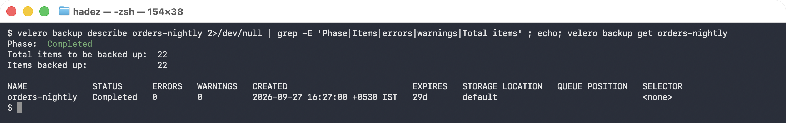

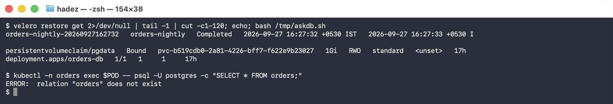


Velero backed up the Kubernetes *objects* — the PVC, the Deployment, the Service — and never touched
the bytes inside the volume. On restore it recreated an empty PVC. Postgres found an empty data
directory, ran `initdb`, and started cleanly. **Nothing anywhere reports a problem.**

> ⚠️ **This is worse than a failed restore.** A restore that errors gets investigated. This one
> reports success, so it gets ticked off — and the gap is discovered months later by someone who
> actually needed the data. The outline calls this *"restores that report success without usable
> data"*, and it is the single most important thing in this module.

**The fix is to tell Velero to back up volume contents**, not just the objects that describe them:

```bash
velero install ... --use-node-agent --default-volumes-to-fs-backup
velero backup create orders-nightly --include-namespaces orders --default-volumes-to-fs-backup
```

Then verify by the only test that counts:

```bash
kubectl -n velero get podvolumebackups     # a row per volume, with bytesDone
```

> **The rule this lab exists to teach:** a backup is not verified by its phase. It is verified by a
> restore into a scratch namespace and a query against the restored data. Put that in the runbook.

---

## Step 6 — Schedules, TTL and what expiry actually deletes

**Goal:** make the backup recurring, and know when it disappears.

```bash
velero schedule create orders-daily \
  --schedule="0 2 * * *" \
  --include-namespaces orders \
  --ttl 72h

velero schedule get
```

```
NAME           STATUS    SCHEDULE    BACKUP TTL   LAST BACKUP   PAUSED
orders-daily   Enabled   0 2 * * *   72h0m0s      n/a           false
```

Every backup the schedule creates inherits that TTL. Look at what that becomes on the object:

```bash
kubectl -n velero get backup <name> \
  -o jsonpath='ttl={.spec.ttl}{"\n"}completed={.status.completionTimestamp}{"\n"}expiration={.status.expiration}'
```

```
ttl        = 720h0m0s
completed  = 2026-09-27T10:57:01Z
expiration = 2026-10-27T10:57:00Z
```

**What this means.** TTL is resolved to an **absolute expiration timestamp at creation**, not
evaluated later. Velero's `gc-controller` removes the Backup object *and its data in object storage*
once that moment passes.

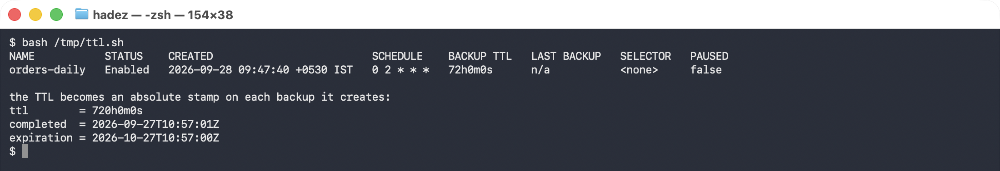


Two consequences worth stating plainly:

- **Changing a Schedule's `--ttl` does not re-date backups already taken.** The old ones still expire
  on their original schedule. If you extend retention after an incident, the backups you care about
  may already be counting down.
- **Expiry deletes the data, not just the record.** This is not an index tidy-up. A backup that ages
  out is gone from the bucket.

> ⚠️ **Gotcha — `velero backup describe --details` fails against an in-cluster object store.** The
> CLI runs on your laptop and tries to fetch details directly from S3, so it cannot resolve
> `minio.velero.svc`. You get `dial tcp: lookup minio.velero.svc: no such host` even though the
> backup itself is fine. Read `kubectl -n velero logs deploy/velero` instead, or port-forward the
> object store.

---

## Step 7 — Clean up

```bash
kubectl delete namespace shop --ignore-not-found
velero backup delete shop-backup --confirm
# to remove Velero and the object store entirely:
# kubectl delete namespace velero
# on kind, one command removes the lot:
# kind delete cluster --name veleros3
```

---

## What you learned

| You saw… | in Step | proof |
|---|---|---|
| Velero backs up to S3-compatible storage (SeaweedFS / Nutanix Objects) | 1 | backup location `Available` |
| SeaweedFS needs S3 identities before Velero can sign requests | 1 | `-s3.config` identity; without it the location never validates |
| `--use-node-agent` is what captures volume **data** | 1 | `PodVolumeBackup … Completed kopia 18` |
| A `hostPath` PV silently defeats file-system backup | 1 gotcha | `Completed` + `WARNINGS 1`, zero `PodVolumeBackup` objects |
| A namespace backup captures all its objects | 2 | `Completed`, 16 items |
| The backup survives the cluster's objects | 3 | namespace deleted, backup remains |
| A deleted namespace restores with data intact | 4 | `shop` Active, `catalog=widget-9000=42.00` |
| Backups (unlike snapshots) can restore to another cluster | 4 |
| A backup can report `Completed` and restore nothing usable | 5 | 19/19 items, 0 errors — then `relation "orders" does not exist` |
| Velero backs up objects, not volume bytes, unless told | 5 | PVC `Bound` and empty; Postgres ran `initdb` and started clean |
| Only a restore-and-query verifies a backup | 5 | every status field was green while the data was gone |
| TTL becomes an absolute expiry stamped at creation | 6 | `ttl=720h` → `expiration=2026-10-27T10:57:00Z` |
| Expiry deletes the backup **and its data** | 6 | gc-controller removes the object and the bucket contents |


## Evidence

The object-store rewrite — the MinIO pull failures, the SeaweedFS setup, the `hostPath` trap and a full
destroy/restore cycle with volume data — is captured in
[`artifacts/lab-12/evidence/lab-12-seaweedfs-s3-target.txt`](../artifacts/lab-12/evidence/lab-12-seaweedfs-s3-target.txt)
— 109 lines from a run on 2026-09-27 (Kubernetes 1.37.0, Velero 1.18.2, SeaweedFS 3.80).

The "backup said Completed" scenario and the schedule/TTL behaviour are captured in
[`artifacts/lab-12/evidence/lab-12-backup-completed-no-data.txt`](../artifacts/lab-12/evidence/lab-12-backup-completed-no-data.txt)
— 78 lines from a run on 2026-09-25 (Kubernetes 1.37.0, Velero 1.18.2), including the clean
`Completed` phases, the healthy PVC and Pod, and the `relation "orders" does not exist` that follows.

### Original GKE evidence

Real screenshots for this lab are in [`artifacts/lab-12/screenshots/`](../artifacts/lab-12/screenshots/) (3 images), and a command transcript is in [`artifacts/lab-12/evidence/lab-09-velero-backup-restore.txt`](../artifacts/lab-12/evidence/lab-09-velero-backup-restore.txt).

---

---

**Next:** [Lab 13 — Give On-Prem Services a Real IP (Bare-Metal LoadBalancer with MetalLB)](lab-13-metallb.md)
