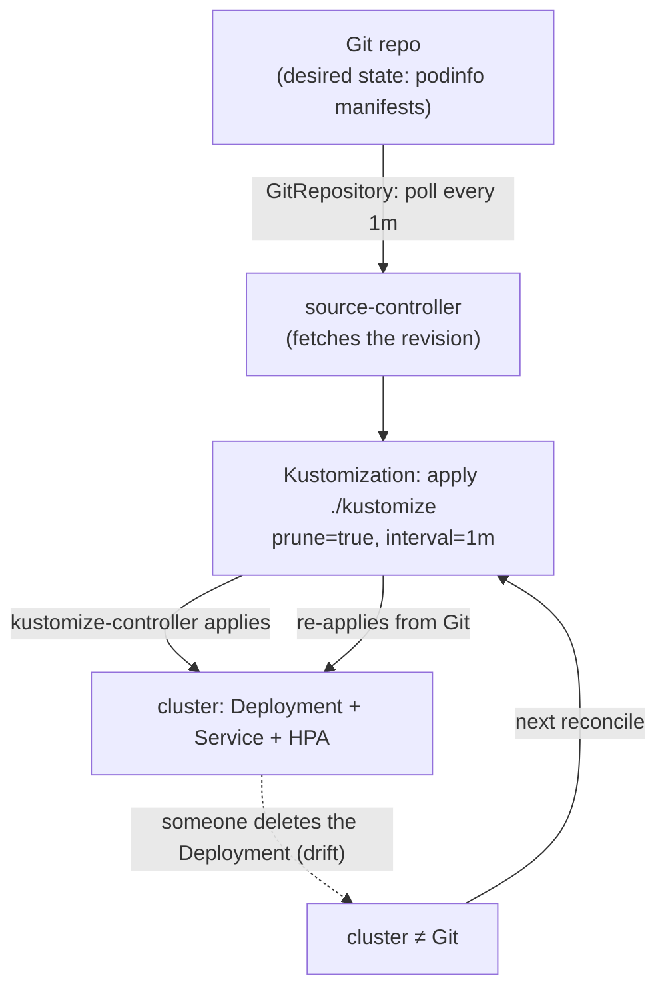
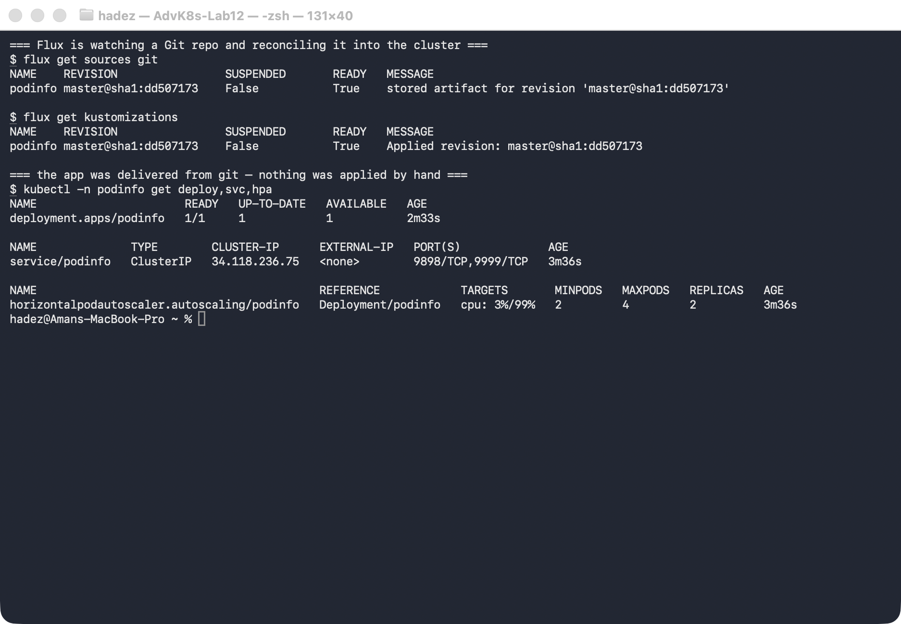
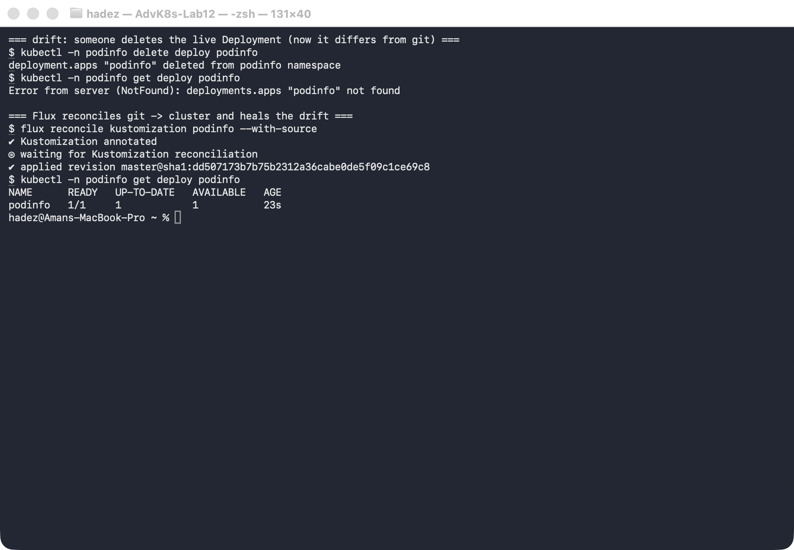
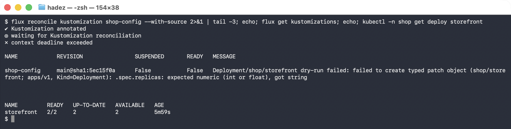

# Lab 15 — Let Git Drive the Cluster (GitOps Delivery with Flux)

**Day 4 · GitOps, Multi-Cluster & Advanced Scheduling**

> ✅ **Tested end-to-end** on a **real GKE cluster** (`advk8s-lab`, `dcproject-462806`) with **Flux v2**. Screenshots for Steps 1–3 are real captures from that GKE cluster; **Step 4's capture was taken on a local `kind` cluster on 2026-09-28**, with Gitea in-cluster instead of the GKE source. The failure and its message are identical. The payoff: you deliver an app to the cluster **without ever running `kubectl apply`** — Flux pulls it from Git — and then you *delete the live Deployment* and watch Flux **put it back**, because Git says it should exist.

## What you'll learn

- What **GitOps** actually means: Git is the single source of truth, and an in-cluster agent continuously makes the cluster match it — the same reconciliation idea from Lab 1, now applied to *your whole app*.
- How **Flux** works: a `GitRepository` source (what to watch) plus a `Kustomization` (what to apply and how often).
- How to run Flux against a **local Git server**, so the lab works with no internet access.
- What a **bad commit** does to a running cluster — and why `lastAppliedRevision` and `lastAttemptedRevision` are the two fields to read when something stops updating.
- Why GitOps gives you **drift detection and self-healing** for free: anything that diverges from Git is reverted.

## What you'll do

You'll install Flux on the cluster, point it at a Git repo — public, or a Gitea server running inside the cluster if your room has no internet — and let it deploy an app. Then you'll simulate drift by deleting the running Deployment and watch Flux put it back. Finally you'll commit a **broken** manifest and find out what that does to a running system.

## Time & cost

- **Time:** ~35 minutes.
- **Cost:** negligible — Flux controllers and `podinfo` are small Pods on the shared GKE cluster.

---

## Before you start

- **Where you'll work:** in a **terminal** on your own machine.
- **Tools you need:** `gcloud`, `kubectl`, and the **`flux`** CLI (`brew install fluxcd/tap/flux`).
- **Cluster:** a GKE cluster (this course's shared `advk8s-lab`).
- **No GitHub account needed:** we use `flux install` (controllers only) and point at a **public** repo, so you never need a Git token for this lab.

> **Nutanix note.** Flux is CNCF-graduated and completely platform-agnostic — it runs identically on **NKE**. In fact GitOps is the *recommended* operating model for on-prem fleets: instead of engineers running `kubectl` against production Nutanix clusters (untracked, un-reviewable), every change is a Git commit that Flux pulls and applies. That gives you an audit trail, code review, and instant rollback (`git revert`) on infrastructure you can't always reach interactively.

---

## The idea in 60 seconds

Normally you *push* changes to a cluster: you run `kubectl apply` from your laptop or CI. GitOps inverts this — the cluster **pulls**. An agent inside the cluster (Flux) watches a Git repo and continuously reconciles the cluster to match it. Two Flux objects do this:

- a **`GitRepository`** — *where* to look (repo URL, branch, poll interval),
- a **`Kustomization`** — *what* to apply (a path in that repo), how often, and whether to **prune** (delete things removed from Git).

Because Flux reconciles on a loop, the cluster is *always* converging on Git. Change the cluster by hand and it drifts; Flux notices and reverts it. The only durable way to change anything is to change Git.



---

## Step 1 — Install Flux on the cluster

**Goal:** get the Flux controllers running. (No Git bootstrap, no token — just the agents.)

**1. Check prerequisites, then install:**

```bash
flux check --pre
flux install
```

**2. Confirm the controllers are up:**

```bash
kubectl -n flux-system get pods
```

**What you should see:** four Deployments `Running` in `flux-system` — `source-controller` (fetches Git), `kustomize-controller` (applies manifests), plus `helm-controller` and `notification-controller`.

**What this means:** the reconciliation engine is now living in your cluster. It isn't watching anything yet — you'll tell it what to watch next.

---

## Step 2 — Point Flux at a Git repo and let it deploy the app

**Goal:** declare a Git source and a Kustomization, and watch the app appear — without ever applying it yourself.

> ### ⚠️ Use a local Git server if your room is restricted
>
> The public repo below is convenient, and it is the first thing to fail in an air-gapped client
> environment or behind a corporate proxy. **Verified 2026-09-25:** Flux drives perfectly well from a
> Gitea server running inside the cluster, with no internet involved at any point.
>
> ```bash
> kubectl create ns git-server
> kubectl -n git-server create deployment gitea --image=gitea/gitea:1.22
> kubectl -n git-server set env deploy/gitea \
>   GITEA__database__DB_TYPE=sqlite3 GITEA__security__INSTALL_LOCK=true
> kubectl -n git-server expose deploy/gitea --port=3000
>
> POD=$(kubectl -n git-server get pod -l app=gitea -o name | head -1)
> kubectl -n git-server exec $POD -- su git -c \
>   "gitea admin user create --username labadmin --password labpass123 \
>    --email lab@example.com --admin --must-change-password=false"
> ```
>
> Then point the `GitRepository` at
> `http://gitea.git-server.svc.cluster.local:3000/labadmin/<repo>.git` with a
> `secretRef` holding those credentials. The full recipe, including pushing manifests through
> Gitea's API, is Step 1 of
> [Lab 27 — Tenant Quota Governance](lab-27-tenant-quota-governance.md).
>
> ⚠️ **Gotcha:** the Gitea Pod reports `Running` well before it serves HTTP. Wait on
> `curl -sf http://localhost:3000/api/healthz` inside the Pod, not on the rollout, or the user
> creation fails with a bare exit code 1.

**1. Create the `GitRepository` source** (a public repo, polled every minute):

```bash
kubectl create namespace podinfo
flux create source git podinfo \
  --url=https://github.com/stefanprodan/podinfo \
  --branch=master \
  --interval=1m
```

**2. Create the `Kustomization`** that applies the manifests in `./kustomize` into the `podinfo` namespace, pruning anything removed from Git:

```bash
flux create kustomization podinfo \
  --source=GitRepository/podinfo \
  --path="./kustomize" \
  --prune=true \
  --interval=1m \
  --target-namespace=podinfo \
  --wait
```

**3. Confirm Flux is reconciling, and that the app is running:**

```bash
flux get sources git
flux get kustomizations
kubectl -n podinfo get deploy,svc,hpa
```

**What you should see:** both the source and the Kustomization report `READY: True` with a revision like `master@sha1:dd507173`, and `podinfo` (Deployment + Service + HPA) is running in the `podinfo` namespace — **you never ran `kubectl apply` for it.**



**What this means:** the app's desired state lives in Git, and Flux pulled it and applied it. From here on, the way to change this app is to change Git — not the cluster.

---

## Step 3 — Cause drift, and watch Flux self-heal

**Goal:** change the cluster out from under Flux and prove it reverts you.

**1. Delete the live Deployment** — the cluster now disagrees with Git:

```bash
kubectl -n podinfo delete deploy podinfo
kubectl -n podinfo get deploy podinfo
```

**2. Trigger a reconcile** (Flux would do this on its own within the 1-minute interval; we force it so you don't wait):

```bash
flux reconcile kustomization podinfo --with-source
kubectl -n podinfo get deploy podinfo
```

**What you should see:** right after the delete, `kubectl get deploy podinfo` returns **`NotFound`** — but after the reconcile, the Deployment is **back** (`podinfo 1/1`), recreated from Git.



**What this means:** this is GitOps self-healing. Flux compared the cluster to Git, saw the Deployment was missing, and re-applied it. The same thing happens to *any* manual change — an edited image tag, a scaled replica count, a deleted Service — because Git, not the cluster, is the source of truth.

> ⚠️ **Gotcha — don't fight the reconciler.** Because Flux reverts drift, a "quick manual `kubectl edit` in production" will silently disappear at the next reconcile, which is baffling if you don't know Flux is running. To make a *real* change, commit it to Git (or `flux suspend kustomization <name>` first if you genuinely need to pause reconciliation for a break-glass fix). Manual edits are for debugging only.

---

## Step 4 — Break a manifest, and read the failure

**Goal:** find out what a bad commit actually does to a running system. The answer is reassuring, and
only believable once you have watched it.

Edit the Deployment in Git so `replicas` is a word instead of a number — the kind of thing a hand-
edit produces at 17:55 on a Friday:

```yaml
spec:
  replicas: two      # was: 2
```

Commit it, then ask Flux:

```bash
flux reconcile kustomization shop-config --with-source
flux get kustomizations
```

**What you should see — `READY` flips to `False` with the exact reason:**

```
NAME         REVISION            READY   MESSAGE
shop-config  main@sha1:12cb3b31  False   Deployment/shop/storefront dry-run failed:
                                         failed to create typed patch object
                                         (shop/storefront; apps/v1, Kind=Deployment):
                                         .spec.replicas: expected numeric (int or float), got string
```

The same message is on the resource, which is where you'd read it in a pipeline:

```bash
kubectl -n flux-system get kustomization shop-config \
  -o jsonpath='{.status.conditions[?(@.type=="Ready")].message}'
```



**Now check what is actually running:**

```bash
kubectl -n shop get deploy storefront
```

```
NAME         READY   UP-TO-DATE   AVAILABLE   AGE
storefront   2/2     2            2           5m15s
```

**Untouched.** Five minutes old, still serving. The bad commit never reached the cluster.

**Why — and this is the whole point of the step:**

```bash
kubectl -n flux-system get kustomization shop-config \
  -o jsonpath='lastApplied={.status.lastAppliedRevision}{"\n"}lastAttempted={.status.lastAttemptedRevision}'
```

```
lastApplied   = main@sha1:12cb3b31...   ← the last revision that worked
lastAttempted = main@sha1:63db2b0c...   ← the one that is failing
```

**Flux dry-runs every change before applying it.** When the dry-run fails it refuses the whole
revision and keeps serving the last good one — and it records both, so "what is live?" and "what is
Git asking for?" are two separate, readable fields.

> ⚠️ **Gotcha — `flux reconcile` exits non-zero with `context deadline exceeded`.** That is the CLI
> giving up waiting for a reconciliation that will never succeed, not a timeout in the cluster. The
> real error is in the Ready condition; go there rather than re-running the command.

**Fix it and watch it recover:**

```bash
# set replicas back to a number, commit, then:
flux reconcile kustomization shop-config --with-source
flux get kustomizations
```

```
shop-config  main@sha1:3aacd02d  True   Applied revision: main@sha1:3aacd02d
storefront   4/4     4     4
lastApplied = lastAttempted = main@sha1:3aacd02d
```

The two revision fields converging is your signal that Git and the cluster agree again.

> **What this changes about rollback.** You do not roll back the cluster — you revert the commit.
> The cluster was never in the bad state to begin with, which is why a GitOps rollback is a `git
> revert` and a reconcile rather than a recovery operation.

---

## Step 5 — Clean up

```bash
kubectl delete namespace podinfo --ignore-not-found
flux delete source git podinfo --silent
flux delete kustomization podinfo --silent
# to remove Flux itself:
# flux uninstall --silent
```

---

## What you learned

| You saw… | in Step | proof |
|---|---|---|
| Flux runs the reconciliation engine inside the cluster | 1 | four controllers `Running` in `flux-system` |
| A GitRepository + Kustomization delivers an app from Git | 2 | both `READY: True`; `podinfo` running, never `kubectl apply`-ed |
| The cluster converges on the Git revision | 2 | `Applied revision: master@sha1:dd507173` |
| Manual drift is detected and reverted (self-healing) | 3 | Deployment deleted → `NotFound` → restored on reconcile |
| Flux runs from a Git server inside the cluster, with no internet | 2 | source URL is a `.svc.cluster.local` address |
| A bad commit is refused at dry-run, not applied | 4 | `READY=False`, `.spec.replicas: expected numeric … got string` |
| The running workload is untouched by a failed revision | 4 | `storefront 2/2` still serving, 5m15s old |
| `lastApplied` vs `lastAttempted` tells you live-vs-wanted | 4 | `12cb3b31` applied while `63db2b0c` kept failing |

## Evidence

A transcript of the local-Git-server path and the broken-manifest diagnosis is in
[`artifacts/lab-15/evidence/lab-15-local-git-and-broken-manifest.txt`](../artifacts/lab-15/evidence/lab-15-local-git-and-broken-manifest.txt)
— captured 2026-09-25 on Kubernetes 1.37.0 with Flux 2.9.5 and an in-cluster Gitea, covering every
output quoted in Steps 2 and 4.

### Original GKE evidence

Real screenshots for this lab are in [`artifacts/lab-15/screenshots/`](../artifacts/lab-15/screenshots/) (2 images), and a command transcript is in [`artifacts/lab-15/evidence/lab-12-flux.txt`](../artifacts/lab-15/evidence/lab-12-flux.txt).

---

---

**Next:** [Lab 16 — Drive Many Clusters from One Git Repo (Fleet Registration & Staged Rollout)](lab-16-fleet.md)
