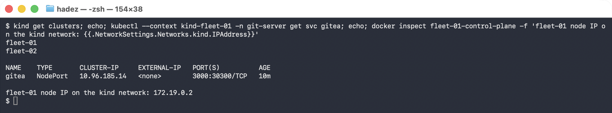
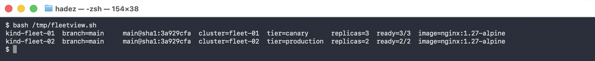
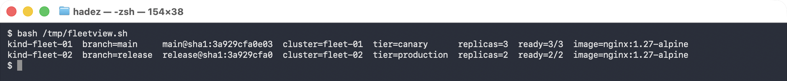
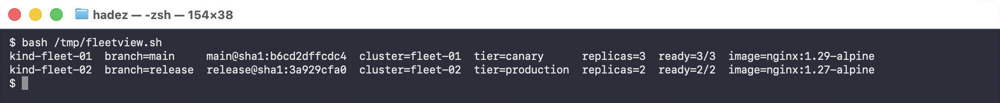
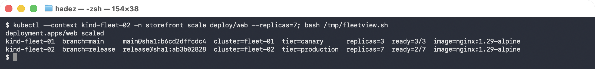

**Day 3 · GitOps, Fleet Management & Multi-Cluster Governance — Module 10**

> YES — **Built and verified end-to-end** on two `kind` clusters (Kubernetes 1.37.0) with **Flux 2.9.5** and a **Gitea 1.22** server inside the fleet — one repository, no internet. Every value below came from that run. The property worth the whole lab: **one commit, one repository, and production does not move until a human merges a pull request.**

## What you'll learn

- How **one Git repository** drives **many clusters** without a branch or a folder per cluster.
- How **per-cluster overlays** work in Flux — variable substitution from a ConfigMap each cluster carries itself.
- How to build **rollout rings**: a canary that tracks `main` and a production ring that tracks `release`, with a merge as the gate.
- What drift correction means in a fleet — each cluster returns to **its own** rendered value, not a shared constant.

## What you'll do

You'll register two clusters against a single Git repository, give each its own identity, and watch the same manifest render differently on each. Then you'll ship a version bump to the canary only, promote it to production by merging a PR, and finish by drifting one cluster and watching Flux correct it without touching the other.

## Time & cost

- **Time:** ~70 minutes.
- **Cost:** **$0** — two local `kind` clusters.

---

## Before you start

- **Tools:** `docker`, `kind`, `kubectl`, `flux`.
- **Two clusters.** `fleet-01` is the canary and also hosts the Git server; `fleet-02` is production.
- **Prior labs:** [Lab 15 — GitOps with Flux](lab-15-flux.docx) for the single-cluster basics, and [Lab 27 — Tenant Quota Governance](lab-27-tenant-quota-governance.docx) if you want the Gitea recipe in full.

> ### Why this lab uses Flux and Lab 16 uses Rancher Fleet
>
> Both are legitimate. **Lab 16** runs three clusters under **Rancher Fleet**, a purpose-built fleet
> controller with its own `GitRepo` and target-customisation model. **This lab** does the same job
> with **Flux**, which is what the course outline specifies and what most platform teams already run
> for single-cluster GitOps. Run either; run both if you want the comparison, which is a genuinely
> good design discussion.

> **Nutanix note.** Nothing here depends on a cloud. The pattern — one repository, per-cluster
> substitution, branch-gated rings — is exactly how you would drive a set of on-prem NKE clusters,
> and the Git server living inside the fleet is often a requirement rather than a convenience.

---

## The idea in 60 seconds

The naive way to run a fleet is a branch or a directory per cluster. It works until the tenth cluster, at which point a change means ten near-identical edits and the drift between them is invisible.

The alternative: **the policy lives in Git once, and each cluster supplies its own values.** Flux's `postBuild.substituteFrom` reads a ConfigMap on the cluster and substitutes it into the manifests at apply time. Same commit, different render.

Rings come from the same idea one level up: **which revision a cluster tracks is itself per-cluster config.** A canary tracking `main` and production tracking `release` turns "promote to production" into "merge a pull request" — reviewable, auditable, revertable.

---

## Step 1 — Two clusters and one Git server (15 min)

**Goal:** a repository both clusters can reach, with no internet involved.

`kind` clusters share a Docker network, so a NodePort on one is reachable from the other.

```bash
cat <<'EOF' | kind create cluster --config -
kind: Cluster
apiVersion: kind.x-k8s.io/v1alpha4
name: fleet-01
nodes:
  - role: control-plane
    extraPortMappings:
      - { containerPort: 30300, hostPort: 30300, protocol: TCP }
EOF

kind create cluster --name fleet-02
```

Put Gitea on `fleet-01` behind that NodePort:

```bash
kubectl --context kind-fleet-01 create ns git-server
kubectl --context kind-fleet-01 -n git-server create deployment gitea --image=gitea/gitea:1.22
kubectl --context kind-fleet-01 -n git-server set env deploy/gitea \
  GITEA__database__DB_TYPE=sqlite3 GITEA__security__INSTALL_LOCK=true
kubectl --context kind-fleet-01 -n git-server expose deploy/gitea \
  --port=3000 --type=NodePort \
  --overrides='{"spec":{"ports":[{"port":3000,"targetPort":3000,"nodePort":30300}]}}'
```

Find the address the *other* cluster will use:

```bash
docker inspect fleet-01-control-plane -f '{{.NetworkSettings.Networks.kind.IPAddress}}'
# 172.19.0.2  ->  http://172.19.0.2:30300/labadmin/fleet.git
```

Create the account and repository (see [Lab 27, Step 1](lab-27-tenant-quota-governance.docx) for the full commands).

> ⚠️ **Gotcha — the Gitea Pod is `Running` before it serves HTTP.** Wait on
> `curl -sf http://localhost:3000/api/healthz` inside the Pod, not on the rollout, or creating the
> admin user fails with a bare exit code 1.




---

## Step 2 — One manifest, written for many clusters (10 min)

**Goal:** put variables in Git where most people put values.

Commit `base/app.yaml`:

```yaml
apiVersion: apps/v1
kind: Deployment
metadata:
  name: web
  namespace: storefront
  labels:
    cluster: "${CLUSTER_NAME}"
    tier: "${CLUSTER_TIER}"
spec:
  replicas: ${WEB_REPLICAS}
  template:
    spec:
      containers:
        - name: web
          image: nginx:${WEB_VERSION}
```

**Nothing in this file names a cluster.** It is the shared contract; the values arrive from wherever it is applied.

---

## Step 3 — Give each cluster its identity (10 min)

**Goal:** the same Kustomization, two different renders.

Install Flux on both, point both at the same URL, then give each its own ConfigMap:

```bash
# canary
kubectl --context kind-fleet-01 -n flux-system create configmap cluster-vars \
  --from-literal=CLUSTER_NAME=fleet-01 --from-literal=CLUSTER_TIER=canary \
  --from-literal=WEB_REPLICAS=3 --from-literal=WEB_VERSION=1.27-alpine

# production
kubectl --context kind-fleet-02 -n flux-system create configmap cluster-vars \
  --from-literal=CLUSTER_NAME=fleet-02 --from-literal=CLUSTER_TIER=production \
  --from-literal=WEB_REPLICAS=2 --from-literal=WEB_VERSION=1.27-alpine
```

The Kustomization is **byte-identical on both clusters**:

```yaml
spec:
  path: ./base
  prune: true
  sourceRef: { kind: GitRepository, name: fleet }
  postBuild:
    substituteFrom:
      - { kind: ConfigMap, name: cluster-vars }
```

**What you should see:**

```
kind-fleet-01    revision=main@sha1:3a929cfa...
kind-fleet-02    revision=main@sha1:3a929cfa...

kind-fleet-01    replicas=3  tier=canary      cluster=fleet-01
kind-fleet-02    replicas=2  tier=production  cluster=fleet-02
```

**What this means.** Identical revision `3a929cfa` on both. Different replica counts, different labels. Adding a tenth cluster is one ConfigMap — not a tenth copy of the manifests.




> ⚠️ **Gotcha — an unset variable does not fail loudly.** If a cluster's ConfigMap is missing a key,
> substitution leaves the literal `${WEB_REPLICAS}` in place and the apply fails with a type error
> that does not mention the variable. Check the Kustomization's Ready condition, and consider
> `postBuild.substitute` defaults for anything optional.

---

## Step 4 — Build the rollout rings (10 min)

**Goal:** make "which version is this cluster on" a per-cluster decision with a human gate.

Create a `release` branch, and point production at it:

```bash
# via the Gitea API, branch 'release' from 'main'
kubectl --context kind-fleet-02 patch gitrepository fleet -n flux-system --type merge \
  -p '{"spec":{"ref":{"branch":"release"}}}'
```

```
kind-fleet-01    branch=main     image=nginx:1.27-alpine
kind-fleet-02    branch=release  image=nginx:1.27-alpine
```

**What this means.** The canary follows the tip of development. Production follows a branch that only moves when someone moves it. Both still read the *same* repository and the *same* path.




---

## Step 5 — Ship it to the canary only (10 min)

Commit a version bump to `main`:

```yaml
-         image: nginx:${WEB_VERSION}
+         image: nginx:1.29-alpine
```

Wait one reconcile interval, then look at both:

```
kind-fleet-01    branch=main     image=nginx:1.29-alpine   ready=3/3
kind-fleet-02    branch=release  image=nginx:1.27-alpine   ready=2/2
```

**Production did not move.** One commit, one repository, and the blast radius was exactly one ring — enforced by the branch each cluster tracks rather than by anyone remembering to be careful.




**This is the step to sit on.** Ask the room what would have happened with a single shared branch: the answer is that the same commit reaches every cluster within a reconcile interval, which is the failure mode the outline names as *"a change reaching every cluster simultaneously."*

---

## Step 6 — Promote (5 min)

Promotion is a pull request from `main` into `release`:

```bash
# open and merge via the Gitea API (or the web UI)
POST /api/v1/repos/labadmin/fleet/pulls   {"head":"main","base":"release", ...}
POST /api/v1/repos/labadmin/fleet/pulls/1/merge   {"Do":"merge"}
```

```
kind-fleet-01    branch=main     image=nginx:1.29-alpine   ready=3/3
kind-fleet-02    branch=release  image=nginx:1.29-alpine   ready=2/2
```

**What this means.** The gate was a merge — reviewable, attributable and revertable. And note production kept **its own replica count of 2** throughout: promoting a version did not overwrite the cluster's identity, because version and identity come from different places.


---

## Step 7 — Drift, on one cluster only (10 min)

```bash
kubectl --context kind-fleet-02 -n storefront scale deploy/web --replicas=7
```

```
immediately  : replicas=7
after Flux   : replicas=2      (back to what Git renders for THIS cluster)
fleet-01     : replicas=3      (never touched)
```

**What this means.** Drift correction is **per cluster, to that cluster's rendered value** — not to a fleet-wide constant. fleet-02 returns to 2 while fleet-01 stays on 3, because each is being reconciled against its own render of the same commit.




That distinction is what makes per-cluster overlays safe. Without it, a fleet-wide "correct the drift" would flatten every cluster to the same shape.

---

## Step 8 — Do it again yourself, unassisted

**Why:** two clusters and two rings is the smallest fleet that is still a fleet. The judgement starts at three.

**Your task.** Add a third cluster, `fleet-03`, as a second production ring in a different region — and give it a configuration that genuinely differs, not just a different replica count.

**You get the acceptance criteria and nothing else:**

- Three clusters, **one repository**, no new branches beyond `main` and `release`
- `fleet-03` differs from `fleet-02` in at least one way that is **not** expressible by changing a number — an extra resource, or one omitted
- A release reaches canary, then both production clusters, **in that order**, with one merge
- Drift on `fleet-03` corrects to `fleet-03`'s values
- One sentence on what you would do if `fleet-03` needed to stay a version behind indefinitely

**Done when** you can answer: *"a security patch must reach all three clusters in the next hour. What do you do, and what do you lose by doing it?"*

No commands here. Steps 1–7 have the pattern.

---

## Step 9 — Clean up

```bash
kind delete cluster --name fleet-01
kind delete cluster --name fleet-02
```

---

## What you learned

| You saw… | in Step | proof |
|---|---|---|
| One repository can drive many clusters | 3 | both on revision `main@sha1:3a929cfa` |
| Per-cluster overlays come from the cluster, not the repo | 3 | `replicas=3 tier=canary` vs `replicas=2 tier=production` |
| Rollout rings are just per-cluster refs | 4 | canary `branch=main`, production `branch=release` |
| A commit reaches only the ring that tracks it | 5 | canary `1.29`, production still `1.27` |
| Promotion is a reviewable merge | 6 | PR `main → release`, production moves to `1.29` |
| Promoting a version preserves cluster identity | 6 | production stayed at 2 replicas across the upgrade |
| Drift corrects to **that cluster's** value | 7 | fleet-02 `7 → 2` while fleet-01 stayed at `3` |

## Evidence

A full transcript is in [`artifacts/lab-29/evidence/lab-29-flux-fleet-two-clusters.txt`](../artifacts/lab-29/evidence/lab-29-flux-fleet-two-clusters.txt) — captured 2026-09-25 across both clusters, covering the shared revision, both renders, the staged upgrade timeline and the drift correction.

Real terminal captures are in [`artifacts/lab-29/screenshots/`](../artifacts/lab-29/screenshots/)
(7 images) from a live two-cluster run on 2026-09-27 — Kubernetes 1.37.0, Flux 2.9.5, Gitea 1.22.
The helper used for the side-by-side view is
[`artifacts/lab-29/fleetview.sh`](../artifacts/lab-29/fleetview.sh).

> **Note.** The screenshots come from a later run than the transcript, so the revisions differ —
> the images show `3a929cfa` / `b6cd2dff` / `ab3b0282`, the transcript shows `f56fb79e`. Every
> behaviour is identical.


---

**Related:** [Lab 16 — Fleet Registration & Staged Rollout](lab-16-fleet.docx) does the same job with **Rancher Fleet** across three clusters. Comparing the two is the Module 10 design discussion.
