# Lab 13 — Give On-Prem Services a Real IP (Bare-Metal LoadBalancer with MetalLB)

**Day 3 · Stateful Workloads, Persistent Storage & Service Exposure**

> ✅ **Tested end-to-end** on a real 4-node `kind` cluster with **MetalLB v0.14.9**, and the Step 4 comparison on a second, 2-node `kind` cluster with **Cilium 1.20.1**. Every screenshot is a real capture. You'll watch a `Service type=LoadBalancer` sit at `<pending>` forever, then get a **real, reachable IP** from MetalLB — and keep that IP working after you kill the node that was announcing it.

## What you'll learn

- Why `Service type=LoadBalancer` gives an `EXTERNAL-IP` on a cloud (GKE) but stays `<pending>` on bare metal / on-prem — there's no cloud load-balancer controller.
- How **MetalLB** fills that gap: an `IPAddressPool` plus **Layer-2 advertisement** that assigns an address and announces it from a node.
- How MetalLB **survives a node failure** — the address is re-announced from another node.
- Why this is one of the most **Nutanix-relevant** labs: on-prem NKE clusters need exactly this.
- How the same job looks with **Cilium LB-IPAM** instead of MetalLB — what it removes from your stack, what it doesn't change, and the two ways it can bite you.
- **When to prefer the Cilium BGP control plane over MetalLB BGP mode**, and why the answer is usually about ownership rather than features.

## What you'll do

You'll expose a Deployment as a LoadBalancer and see it stuck `<pending>`. Then you'll install MetalLB, give it an address pool, and watch the Service get a reachable IP. Then you'll `docker stop` the node announcing that IP and prove the Service stays up. Finally you'll build a second cluster running **Cilium** and do the same job with **LB-IPAM**, so you can compare the two approaches side by side on evidence rather than on marketing.

## Time & cost

- **Time:** ~40 minutes for Steps 1–3, plus ~30 minutes for the Cilium comparison in Step 4.
- **Cost:** **$0** — runs on a local `kind` cluster.

---

## Before you start

- **Where you'll work:** in a **terminal** on your own machine.
- **Tools you need:** `docker`, `kind`, `kubectl`.
- **Cluster:** a multi-node `kind` cluster (this course's `advk8s-day1`, 1 control-plane + 3 workers — you need multiple nodes for the failover step).

> **Nutanix note — and why this one is `kind`, not GKE.** On GKE a `LoadBalancer` Service is handled for you by a Google Cloud load balancer, so MetalLB would be redundant. MetalLB is for **bare-metal and on-prem** clusters that have no cloud LB — which is exactly the situation on a **Nutanix** on-prem cluster. So this lab runs on `kind` to *simulate* bare metal. On real NKE you'd install MetalLB the same way (or use Nutanix's own load-balancing), point the `IPAddressPool` at a range on your Nutanix network, and everything else here is identical.

---

## The idea in 60 seconds

`Service type=LoadBalancer` asks the cluster for an external IP. On a cloud, a controller calls the cloud API and provisions a real load balancer, filling in `EXTERNAL-IP`. On bare metal there's no such controller, so the field stays `<pending>` — the Service works *inside* the cluster but has no external address.

**MetalLB** is that missing controller for bare metal. You give it a pool of IPs (`IPAddressPool`) from your network, and in **Layer-2 mode** one node answers ARP for each assigned IP and forwards traffic to the Service. If that node dies, MetalLB re-elects another node to announce the IP — so the address survives node failure.

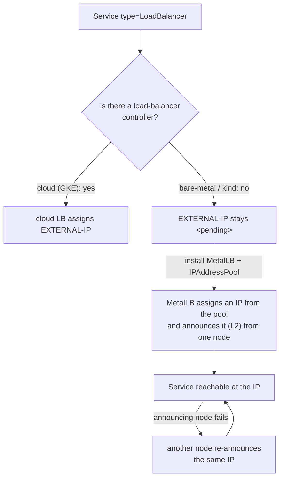

---

## Step 1 — Watch a LoadBalancer Service hang at `<pending>`

**Goal:** see that, without a cloud LB, an external IP never appears.

**1. Expose a Deployment as a LoadBalancer:**

```bash
kubectl create deployment web --image=nginx:1.27-alpine
kubectl expose deployment web --port=80 --type=LoadBalancer --name=web-lb
kubectl get svc web-lb
```

**What you should see:** `web-lb` of type `LoadBalancer` with `EXTERNAL-IP: <pending>` — and it will stay that way indefinitely.

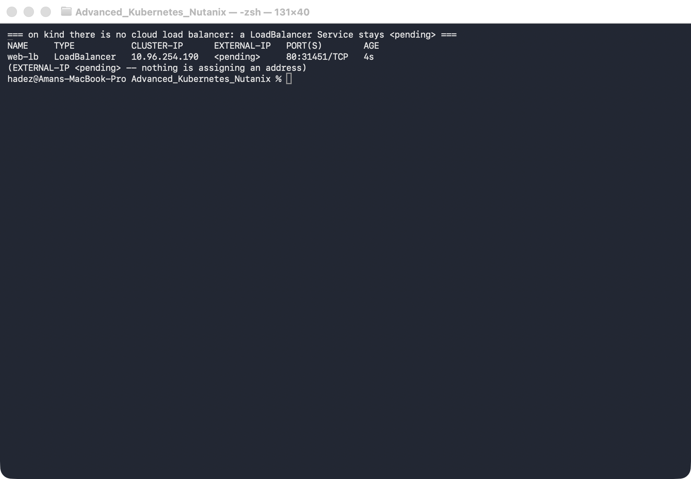

**What this means:** nothing in a bare-metal cluster is watching for `LoadBalancer` Services to assign them an address. The Service has a `ClusterIP` and works inside the cluster, but there's no external IP. On Nutanix on-prem you'd hit exactly this.

---

## Step 2 — Install MetalLB and give it an address pool

**Goal:** install MetalLB, hand it a range of IPs from the cluster's network, and watch the Service get a reachable address.

**1. Install MetalLB and wait for it:**

```bash
kubectl apply -f https://raw.githubusercontent.com/metallb/metallb/v0.14.9/config/manifests/metallb-native.yaml
kubectl -n metallb-system rollout status deployment/controller --timeout=150s
kubectl -n metallb-system rollout status daemonset/speaker --timeout=120s
```

**2. Give it an `IPAddressPool` from the kind docker subnet** (find yours with `docker network inspect kind`; here it's `172.19.0.0/16`, so we use a high, unused range):

```bash
kubectl apply -f - <<'EOF'
apiVersion: metallb.io/v1beta1
kind: IPAddressPool
metadata: {name: kind-pool, namespace: metallb-system}
spec:
  addresses: ["172.19.255.200-172.19.255.250"]
---
apiVersion: metallb.io/v1beta1
kind: L2Advertisement
metadata: {name: l2, namespace: metallb-system}
spec:
  ipAddressPools: [kind-pool]
EOF

kubectl get svc web-lb
```

**3. Reach the IP from inside the cluster network** (on Docker-Desktop-for-Mac the docker subnet isn't routable from your Mac, so curl from a node):

```bash
IP=$(kubectl get svc web-lb -o jsonpath='{.status.loadBalancer.ingress[0].ip}')
docker exec advk8s-day1-worker3 curl -s -o /dev/null -w "HTTP %{http_code}\n" http://$IP
```

**What you should see:** `web-lb` now has a real `EXTERNAL-IP` (e.g. `172.19.255.200`), and the curl returns **`HTTP 200`**.

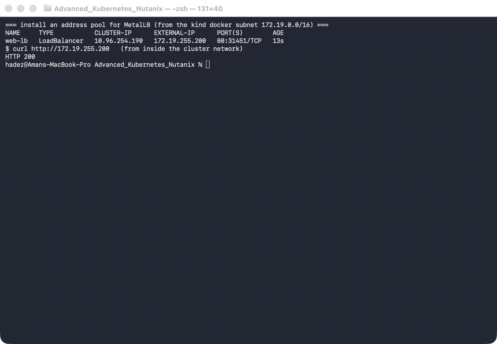

**What this means:** MetalLB is the load-balancer controller the cluster was missing. It picked an address from your pool and is announcing it (Layer-2) from one node, so the Service is now reachable at a stable IP.

---

## Step 3 — Survive a node failure

**Goal:** kill the node that's announcing the IP and prove the Service stays reachable.

**1. Find the announcing node, then stop it:**

```bash
IP=$(kubectl get svc web-lb -o jsonpath='{.status.loadBalancer.ingress[0].ip}')
kubectl describe svc web-lb | grep 'announcing from node'   # e.g. advk8s-day1-worker

# simulate a node failure:
docker stop advk8s-day1-worker
```

**2. Wait for Kubernetes to mark the node `NotReady`, then curl the same IP from a surviving node:**

```bash
kubectl get node advk8s-day1-worker            # NotReady after a few seconds
kubectl describe svc web-lb | grep 'announcing from node'   # now a DIFFERENT node
docker exec advk8s-day1-worker3 curl -s -o /dev/null -w "HTTP %{http_code}\n" http://$IP
```

**What you should see:** after the node goes `NotReady`, MetalLB shows the IP `announcing from node "advk8s-day1-worker2"` (a different node), and curling the **same IP** returns **`HTTP 200`**.

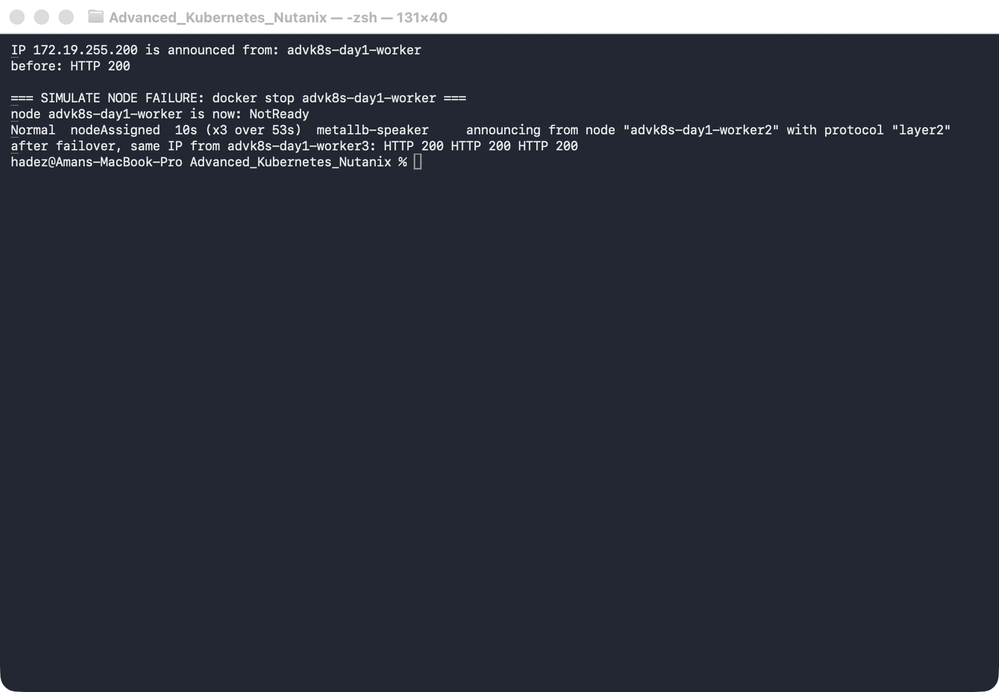

> ⚠️ **Gotcha — there's a brief failover window.** For the first few seconds after the node stops, curl may fail (`HTTP 000`): Kubernetes hasn't yet marked the node `NotReady`, so it still routes some traffic to the dead Pod, and the L2 announcement hasn't moved. Once the node is `NotReady` (endpoints pruned) and MetalLB re-announces from a healthy node, it recovers. This is normal L2 failover behaviour — L2 mode fails *over*, it doesn't load-balance across nodes.

**3. Restore the node:**

```bash
docker start advk8s-day1-worker
```

---

## Step 4 — Compare the result against Cilium LB-IPAM

MetalLB is not the only way to answer this question. If you already run **Cilium** as your CNI — common on NKE — Cilium can allocate and announce LoadBalancer addresses itself, with **no extra components at all**. This step builds a second cluster and does the same job with Cilium, so you can see exactly what differs.

> ✅ **Tested end-to-end** on a 2-node `kind` cluster named `lbipam` with **Cilium 1.20.1** (kube-proxy replacement, `disableDefaultCNI: true`) and **MetalLB not installed**. Every command output quoted below is from [`artifacts/lab-13/evidence/lab-13-cilium-lb-ipam.txt`](../artifacts/lab-13/evidence/lab-13-cilium-lb-ipam.txt).

### 4.1 — Build the Cilium cluster

```bash
cat > /tmp/lbipam-kind.yaml <<'EOF'
kind: Cluster
apiVersion: kind.x-k8s.io/v1alpha4
networking:
  disableDefaultCNI: true
  kubeProxyMode: none
nodes:
  - role: control-plane
  - role: worker
EOF
kind create cluster --name lbipam --config /tmp/lbipam-kind.yaml
```

Install Cilium **with L2 announcements switched on from the start**. Read the gotcha below before you skip that flag.

```bash
helm repo add cilium https://helm.cilium.io/ && helm repo update cilium
helm install cilium cilium/cilium --version 1.20.1 -n kube-system \
  --set kubeProxyReplacement=true \
  --set k8sServiceHost=lbipam-control-plane --set k8sServicePort=6443 \
  --set l2announcements.enabled=true \
  --set k8sClientRateLimit.qps=50 --set k8sClientRateLimit.burst=200
cilium status --wait
```

`cilium status` should show `Cilium: OK` and `Operator: OK`. Now note what is **not** there:

```console
$ kubectl -n kube-system get ds,deploy -o name | grep -iE "metallb|speaker"
(no output — allocation is done by the cilium-operator, announcement by the cilium agents)
```

MetalLB needed a `controller` Deployment plus a `speaker` DaemonSet on every node. Cilium needs neither — the operator you already run does the allocation, and the agent you already run does the announcing. **That is the single biggest practical difference.**

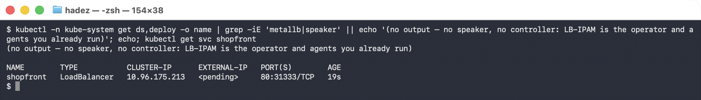


> ⚠️ **Gotcha — `l2announcements.enabled=true` must be set through Helm, not by patching the ConfigMap.** Setting `enable-l2-announcements: "true"` in `cilium-config` and restarting the DaemonSet *does* turn the feature on — the agent logs `--enable-l2-announcements='true'` — but the Helm chart is also what renders the RBAC rule for leases. Without it every announcement attempt fails in a tight loop:
>
> ```console
> level=error msg="Error retrieving lease lock" error="leases.coordination.k8s.io
>   \"cilium-l2announce-default-shopfront\" is forbidden: User
>   \"system:serviceaccount:kube-system:cilium\" cannot get resource \"leases\"
>   in API group \"coordination.k8s.io\" in the namespace \"kube-system\""
> ```
>
> The address stays allocated, nothing answers ARP, and `kubectl get svc` looks completely healthy. Running `helm upgrade --reuse-values --set l2announcements.enabled=true` fixes it by adding the rule — verify with:
>
> ```bash
> kubectl get clusterrole cilium -o yaml | grep -A4 coordination.k8s.io
> # apiGroups: ['coordination.k8s.io'] resources: ['leases'] verbs: ['create','get','update','list','delete']
> ```

### 4.2 — Allocation: `CiliumLoadBalancerIPPool`

Create a Service and watch it hang exactly as it did in Step 1:

```bash
kubectl create deployment shopfront --image=nginx:1.27-alpine
kubectl expose deployment shopfront --type=LoadBalancer --port=80
kubectl get svc shopfront
```

```console
shopfront   LoadBalancer   10.96.59.24   <pending>   80:31166/TCP   12s
```

Now give Cilium a pool. Use the **`cilium.io/v2`** API — `v2alpha1` still works but warns:

```console
Warning: cilium.io/v2alpha1 CiliumLoadBalancerIPPool is deprecated; use cilium.io/v2 CiliumLoadBalancerIPPool
```

```bash
kubectl apply -f - <<'EOF'
apiVersion: cilium.io/v2
kind: CiliumLoadBalancerIPPool
metadata:
  name: shop-pool
spec:
  blocks:
    - { start: "172.19.255.200", stop: "172.19.255.250" }
EOF
kubectl get svc shopfront
kubectl get ciliumloadbalancerippool
```

```console
shopfront   LoadBalancer   10.96.59.24   172.19.255.200   80:31166/TCP   27s

NAME        DISABLED   CONFLICTING   IPS AVAILABLE   AGE
shop-pool   false      False         50              15s
```

The pool reports its own remaining capacity — `IPS AVAILABLE` — which MetalLB's `IPAddressPool` does not. To pin a specific address, annotate the Service (the equivalent of MetalLB's `metallb.universe.tf/loadBalancerIPs`):

```bash
kubectl apply -f - <<'EOF'
apiVersion: v1
kind: Service
metadata:
  name: shopfront-fixed
  annotations:
    lbipam.cilium.io/ips: "172.19.255.240"
spec:
  type: LoadBalancer
  selector: { app: shopfront }
  ports: [{ port: 80, targetPort: 80 }]
EOF
```

```console
$ kubectl get svc shopfront-fixed
shopfront-fixed   LoadBalancer   10.96.172.101   172.19.255.240   80:32296/TCP   8s
```

```console
$ kubectl get svc shopfront -o jsonpath="{.status.loadBalancer.ingress[0]}"
{"ip":"172.19.255.200","ipMode":"VIP"}
```

> ⚠️ **Gotcha — a CIDR block hands out the network address too.** A pool written as `blocks: [{ cidr: "172.19.254.0/29" }]` allocated **`172.19.254.0`** — the network address itself — and it served traffic normally (`http_code=200`). Cilium treats the block as a flat range, not as a subnet with reserved first and last addresses. If anything upstream of your cluster dislikes `.0` or the broadcast address, use explicit `start`/`stop` bounds instead of `cidr`.

### 4.3 — Announcement is a *separate* feature

This is the part that surprises people. Allocation and announcement are two different things in Cilium, and LB-IPAM only does the first:

```console
$ kubectl get svc shopfront
shopfront   LoadBalancer   10.96.59.24   172.19.255.200   80:31166/TCP   27s

$ curl -o /dev/null -w '%{http_code}' http://172.19.255.200
000
```

The Service looks perfect and the address is dead. `LoadBalancer IPs` must be claimed by a `CiliumL2AnnouncementPolicy` before any node answers ARP for them:

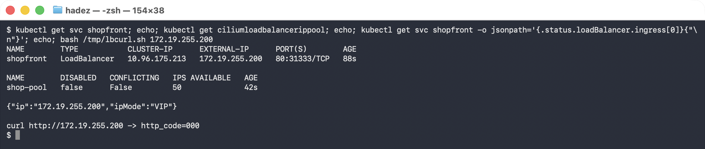


```bash
kubectl apply -f - <<'EOF'
apiVersion: cilium.io/v2alpha1
kind: CiliumL2AnnouncementPolicy
metadata:
  name: announce-lb
spec:
  loadBalancerIPs: true
  interfaces:
    - eth0
EOF
```

Within a few seconds the addresses start working, and you can prove *which* node is answering:

```console
$ curl -o /dev/null -w '%{http_code}' http://172.19.255.200   ->   200
$ curl -o /dev/null -w '%{http_code}' http://172.19.255.240   ->   200

$ kubectl -n kube-system get lease -o custom-columns=LEASE:.metadata.name,HOLDER:.spec.holderIdentity | grep l2announce
cilium-l2announce-default-shopfront    lbipam-control-plane

$ docker exec lbipam-control-plane cat /sys/class/net/eth0/address
0e:fb:91:c9:54:e6
$ docker exec lbipam-worker cat /sys/class/net/eth0/address
b6:bb:b3:f9:fe:eb

$ arping -c2 172.19.255.200
Unicast reply from 172.19.255.200 [0E:FB:91:C9:54:E6]  0.533ms
Unicast reply from 172.19.255.200 [0E:FB:91:C9:54:E6]  0.569ms
```

The replying MAC is the **lease holder's** `eth0`. Cilium keeps one Kubernetes `Lease` per Service and the holder is the only node that answers — **architecturally identical to MetalLB L2 mode**, including the same single-node failure domain and the same failover window you measured in Step 3. Switching from MetalLB to LB-IPAM does *not* buy you multi-node ingress.

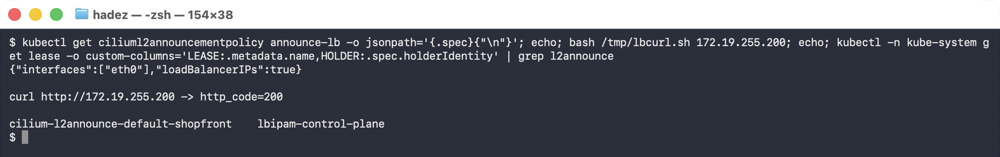

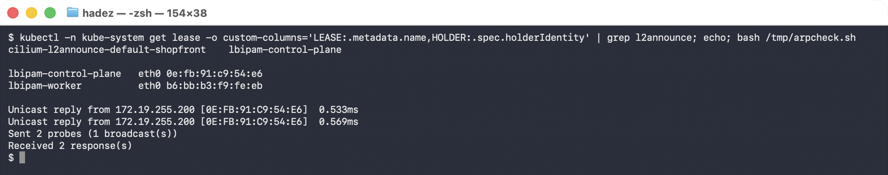


The agent exposes what it is announcing:

```console
$ kubectl -n kube-system exec $CILIUM_POD -c cilium-agent -- cilium-dbg shell -- db/show l2-announce
IP               NetworkInterface
172.19.254.0     eth0
172.19.255.200   eth0
172.19.255.240   eth0
```

### 4.4 — Per-tenant pools, and the two traps in them

Cilium scopes a pool to Services by **label selector**, which is more expressive than MetalLB's namespace/annotation-based `IPAddressPool` sharing:

```bash
kubectl apply -f - <<'EOF'
apiVersion: cilium.io/v2
kind: CiliumLoadBalancerIPPool
metadata:
  name: tenant-b-pool
spec:
  blocks:
    - { cidr: "172.19.254.0/29" }
  serviceSelector:
    matchLabels:
      tenant: b
EOF
kubectl expose deploy tenant-b --type=LoadBalancer --port=80 --labels=tenant=b
```

Expect `tenant-b` to land in `172.19.254.x`. **It did not.** It got `172.19.255.241` — out of `shop-pool`:

```console
NAME       LABELS   EXTERNAL-IP
tenant-b   b        172.19.255.241
```

> ⚠️ **Gotcha 1 — a pool with no `serviceSelector` is a catch-all and will win.** `shop-pool` had no selector, so it matched *every* Service, including the correctly-labelled `tenant=b` one. Having the right label on the Service is not enough; a more specific pool does not take priority. The fix is to give **every** pool a `serviceSelector` — once `shop-pool` was scoped to `tenant: a`, the same Service was re-created and landed on `172.19.254.0` as intended. In a multi-tenant cluster, treat an unscoped pool as a misconfiguration.

Scoping `shop-pool` after the fact revealed the second, more dangerous behaviour:

```console
$ kubectl get svc shopfront shopfront-fixed   # before
shopfront         LoadBalancer   10.96.59.24     172.19.255.200   80:31166/TCP   12m
shopfront-fixed   LoadBalancer   10.96.172.101   172.19.255.240   80:32296/TCP   9m11s

$ kubectl patch ciliumloadbalancerippool shop-pool --type merge \
    -p '{"spec":{"serviceSelector":{"matchLabels":{"tenant":"qa"}}}}'
ciliumloadbalancerippool.cilium.io/shop-pool patched

$ kubectl get svc shopfront shopfront-fixed   # 12s later
shopfront         LoadBalancer   10.96.59.24     <pending>     80:31166/TCP   12m
shopfront-fixed   LoadBalancer   10.96.172.101   <pending>     80:32296/TCP   9m23s
```

> 🚨 **Gotcha 2 — narrowing a pool's `serviceSelector` revokes addresses from live Services.** A working, traffic-serving Service lost its external IP **fourteen seconds** after an edit to a pool, with no warning and no admission rejection — the capture below shows the address present, the patch, and `<pending>` with `reason: no_pool` immediately after. Restoring the selector brings the *same* address back and traffic resumes, but during the gap it is unreachable from outside the cluster. Editing a `CiliumLoadBalancerIPPool` selector in production is an outage-class change — treat it like editing a firewall rule, not like adding a label.

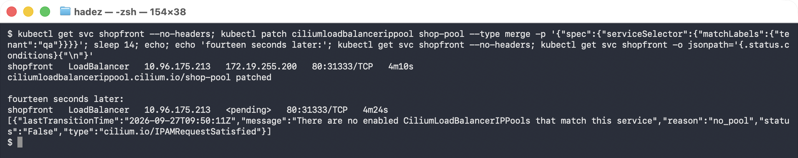


### 4.5 — Overlapping pools are refused, not silently merged

```console
$ kubectl get ciliumloadbalancerippool
NAME            DISABLED   CONFLICTING   IPS AVAILABLE   AGE
overlap-pool    false      True          11              8s
shop-pool       false      False         49              11m

$ kubectl get ciliumloadbalancerippool overlap-pool \
    -o jsonpath='{.status.conditions[?(@.type=="cilium.io/PoolConflict")].message}'
Pool conflicts since range '172.19.255.240 - 172.19.255.250' overlaps range
'172.19.255.200 - 172.19.255.250' from IP Pool 'shop-pool'
```

The conflicting pool is marked `CONFLICTING=True` and stops allocating; the existing pool keeps working. This is genuinely better than MetalLB, where overlapping `IPAddressPool` ranges are not flagged for you.

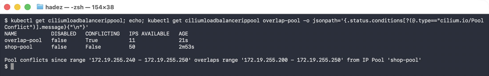


> ⚠️ **Gotcha — when a Service matches no pool, `kubectl describe` tells you nothing.** There is no Event at all:
>
> ```console
> $ kubectl describe svc orphan | sed -n '/Events/,$p'
> Events:                   <none>
> ```
>
> The explanation is on the Service's **conditions**, which `describe` does not print:
>
> ```console
> $ kubectl get svc orphan -o jsonpath='{.status.conditions}'
> [{"type":"cilium.io/IPAMRequestSatisfied","status":"False","reason":"no_pool",
>   "message":"There are no enabled CiliumLoadBalancerIPPools that match this service"}]
> ```
>
> Make `kubectl get svc <name> -o jsonpath='{.status.conditions}'` the first thing you run when an LB-IPAM address does not appear.

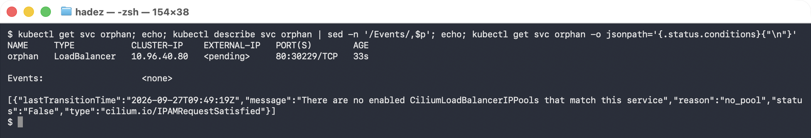


### 4.6 — When to prefer the Cilium BGP control plane over MetalLB BGP mode

Everything above was L2. Both projects also speak BGP, and in Cilium that is a **third** feature, off by default — the CRDs are not even registered until you enable it:

```console
$ kubectl -n kube-system get cm cilium-config -o jsonpath="{.data.enable-bgp-control-plane}"
(empty — disabled)
$ kubectl api-resources --api-group=cilium.io | grep -i bgp
(no output — the BGP CRDs are not even registered until bgpControlPlane.enabled=true)
```

Enable it with `--set bgpControlPlane.enabled=true`, then configure `CiliumBGPClusterConfig` / `CiliumBGPPeerConfig`.

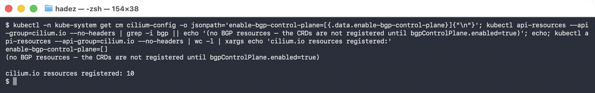


Guidance for choosing — **architectural judgement, not something this lab measured**:

| Prefer **Cilium BGP** when… | Prefer **MetalLB BGP** when… |
|---|---|
| Cilium is already your CNI — no new DaemonSet, no second thing to patch, upgrade, or get paged about | Your CNI is not Cilium (Calico, Flannel, an NKE default you don't control) |
| You want to advertise **PodCIDRs and Service ranges** from one peering session — MetalLB only advertises Service addresses | You only need Service addresses and want the smaller blast radius of a separate component |
| You need per-node or per-peer policy tied to Cilium identities, or BGP alongside egress gateway / ClusterMesh | Your network team already has a reviewed MetalLB BGP configuration and peering template |
| You want announcement state observable through `cilium-dbg` and Hubble alongside everything else | You want load-balancing to be upgradeable independently of the CNI |

The decisive question is usually ownership, not features: if the platform team owns Cilium, one control plane is less to operate; if the network team owns peering and the CNI is chosen elsewhere, MetalLB keeps the boundary clean.

### 4.7 — Side-by-side summary

| | **MetalLB** (Steps 1–3) | **Cilium LB-IPAM** (Step 5) |
|---|---|---|
| Extra components | `controller` Deployment + `speaker` DaemonSet | **none** — reuses cilium-operator + agents |
| Works with any CNI | yes | **no** — requires Cilium |
| Allocation object | `IPAddressPool` | `CiliumLoadBalancerIPPool` |
| Remaining capacity visible | no | yes — `IPS AVAILABLE` |
| Request a specific IP | `metallb.universe.tf/loadBalancerIPs` annotation | `lbipam.cilium.io/ips` annotation |
| Scope a pool to workloads | namespace / pool-sharing annotations | `serviceSelector` label selector |
| Overlapping ranges | not flagged | `CONFLICTING=True` + explicit message |
| Announcement | built into the `speaker` | **separate** — `CiliumL2AnnouncementPolicy` or BGP |
| L2 failure domain | one node per address | one node per address (identical) |
| Failover mechanism | leader election, re-announce | Kubernetes `Lease` per Service, re-announce |
| BGP | L2 or BGP mode in the same component | separate `bgpControlPlane`, off by default |
| Can advertise PodCIDRs | no | yes |

**The practical read:** if you already run Cilium, LB-IPAM removes a component from your stack for free and gives you better pool diagnostics — but it is *not* a networking upgrade. You get the same single-node L2 announcement and the same failover behaviour, plus two new sharp edges (announcement must be enabled separately; pool selectors can revoke live addresses).

### 4.8 — Tear down the comparison cluster

```bash
kind delete cluster --name lbipam
```

---
## Step 5 — Clean up

```bash
kubectl delete svc web-lb --ignore-not-found
kubectl delete deployment web --ignore-not-found
# to remove MetalLB: kubectl delete -f https://raw.githubusercontent.com/metallb/metallb/v0.14.9/config/manifests/metallb-native.yaml
```

---

## What you learned

| You saw… | in Step | proof |
|---|---|---|
| A LoadBalancer Service stays `<pending>` on bare metal | 1 | `EXTERNAL-IP <pending>` on kind |
| MetalLB assigns a real IP from a pool | 2 | `web-lb` gets `172.19.255.200`, curl `200` |
| The IP is reachable via L2 announcement from a node | 2 | curl `200` from another node |
| The IP survives the announcing node failing | 3 | re-announced from a different node, curl `200` |
| L2 mode fails over (brief window), it doesn't balance | 3 gotcha | curl `000` during the window |
| Cilium LB-IPAM does the same job with **no extra components** | 4.1 | no `speaker`/`controller`; operator + agent only |
| LB-IPAM **allocates but does not announce** | 4.3 | `EXTERNAL-IP` set, `curl` → `000` until `CiliumL2AnnouncementPolicy` exists |
| Cilium L2 has the **same single-node failure domain** as MetalLB | 4.3 | `arping` MAC `0E:FB:91:C9:54:E6` == the `Lease` holder's `eth0` |
| An unscoped pool is a catch-all that overrides per-tenant pools | 4.4 | labelled `tenant=b` Service still got `172.19.255.241` from `shop-pool` |
| **Narrowing a pool selector revokes live addresses** | 4.4 | a serving Service → `<pending>` in 14s, `reason: no_pool` |
| Overlapping pools are flagged, not merged | 4.5 | `CONFLICTING=True` + explicit overlap message |
| An unmatched Service explains itself only in `.status.conditions` | 4.5 gotcha | `Events: <none>`, condition `cilium.io/IPAMRequestSatisfied=False` |
| Cilium BGP is a third, separate feature | 4.6 | `enable-bgp-control-plane` empty, no BGP CRDs registered |

## Evidence

Real screenshots for this lab are in [`artifacts/lab-13/screenshots/`](../artifacts/lab-13/screenshots/) (3 images), and command transcripts are in [`artifacts/lab-13/evidence/lab-10-metallb.txt`](../artifacts/lab-13/evidence/lab-10-metallb.txt) (Steps 1–3) and [`artifacts/lab-13/evidence/lab-13-cilium-lb-ipam.txt`](../artifacts/lab-13/evidence/lab-13-cilium-lb-ipam.txt) (Step 5, the Cilium comparison).

---

---

**Next:** [Lab 14 — Find the Failing Pod from Its Logs (Log-Based Diagnosis with Loki)](lab-14-loki.md)
