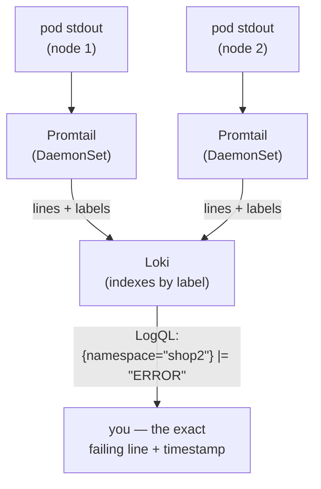
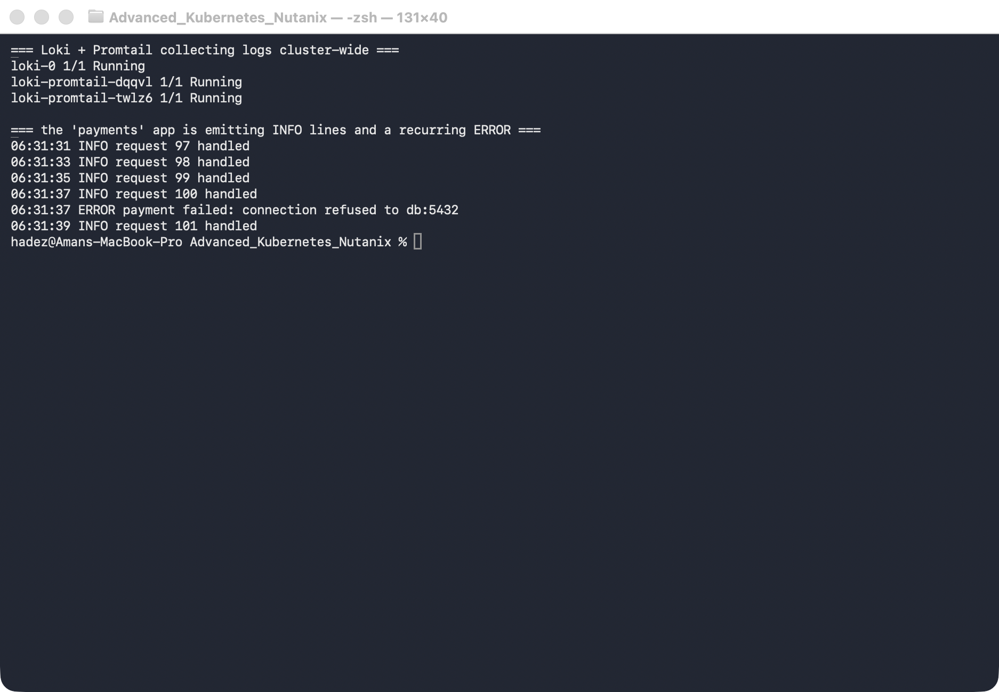
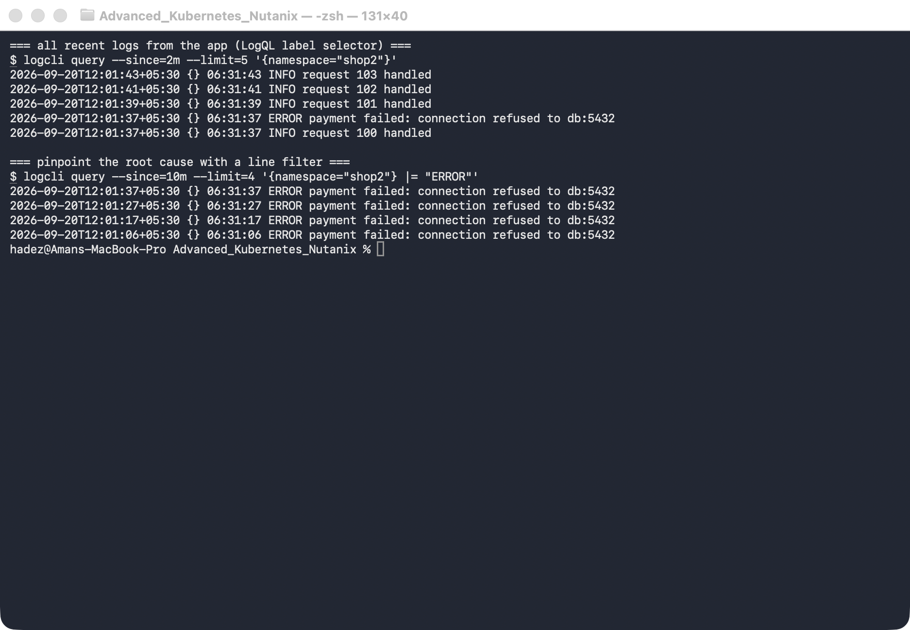

# Lab 14 — Find the Failing Pod from Its Logs (Log-Based Diagnosis with Loki)

**Day 3 · Stateful Workloads, Persistent Storage & Service Exposure**

> ✅ **Tested end-to-end** on a **real GKE cluster** (`advk8s-lab`, `dcproject-462806`) with **Loki + Promtail** collecting logs cluster-wide. Every screenshot is a real capture. The payoff: an app is quietly failing every few seconds, and instead of `kubectl logs`-ing pod after pod, you'll ask Loki **one query** and get the exact error line — `ERROR payment failed: connection refused to db:5432` — with a timestamp.

## What you'll learn

- Why `kubectl logs` doesn't scale: it's one pod at a time, and the logs vanish when the pod restarts or is rescheduled.
- How **Loki + Promtail** turn every pod's stdout into a searchable, labelled store — the logging half of observability (metrics is the other half).
- How to write **LogQL**: a **label selector** to pick a stream, a **line filter** (`|=`) to find the smoking gun, and `count_over_time` to measure *how often* it's happening.

## What you'll do

You'll install Loki and Promtail, deploy a `payments` app that logs a recurring error, then use LogQL from the `logcli` CLI to (1) see everything the app is logging, (2) filter straight to the error, and (3) count how often it fires.

## Time & cost

- **Time:** ~35 minutes.
- **Cost:** negligible — Loki, Promtail, and the app are small Pods on the shared GKE cluster.

---

## Before you start

- **Where you'll work:** in a **terminal** on your own machine.
- **Tools you need:** `gcloud`, `kubectl`, `helm`, and the **`logcli`** CLI (`brew install logcli`).
- **Cluster:** a GKE cluster (this course's shared `advk8s-lab`).

> **Nutanix note.** Loki is platform-agnostic — it runs identically on **NKE**. Promtail is a DaemonSet, so it lands one Pod on every node and tails all container logs there; on an on-prem Nutanix cluster that's exactly how you'd get whole-cluster log search without shipping logs off-site. For long-term retention you'd point Loki's storage at **Nutanix Objects** (S3-compatible) — the same object-store pattern you used for Velero in Lab 12.

---

## The idea in 60 seconds

`kubectl logs <pod>` shows one container's output, right now. That's fine for a single pod you already suspect — but useless when you have dozens of pods across namespaces and you don't yet *know* which one is broken. And once a pod restarts, its old logs are gone.

**Promtail** runs on every node, tails every container's stdout, attaches **labels** (`namespace`, `pod`, `app`, `container`, …), and ships the lines to **Loki**, which indexes them by those labels. You then query with **LogQL**:

- a **label selector** — `{namespace="shop2"}` — picks the stream(s),
- a **line filter** — `|= "ERROR"` — keeps only matching lines,
- an aggregation — `count_over_time(... [5m])` — measures the rate.



---

## Step 1 — Install Loki + Promtail, and deploy the app with the bug

**Goal:** get log aggregation running cluster-wide, then start an app that logs a recurring failure.

**1. Install Loki and Promtail with Helm:**

```bash
helm repo add grafana https://grafana.github.io/helm-charts
helm repo update
helm install loki grafana/loki-stack \
  --namespace loki --create-namespace \
  --set promtail.enabled=true --set grafana.enabled=false
kubectl -n loki rollout status statefulset/loki --timeout=180s
```

**2. Deploy the `payments` app** — it prints an `INFO` line every 2 seconds and, on every 5th request, an `ERROR`:

```bash
kubectl create namespace shop2
kubectl -n shop2 apply -f - <<'EOF'
apiVersion: apps/v1
kind: Deployment
metadata: {name: payments, labels: {app: payments}}
spec:
  replicas: 1
  selector: {matchLabels: {app: payments}}
  template:
    metadata: {labels: {app: payments}}
    spec:
      containers:
        - name: payments
          image: busybox:1.36
          command: ["sh","-c","i=0; while true; do i=$((i+1)); echo \"$(date -u +%H:%M:%S) INFO request $i handled\"; if [ $((i % 5)) -eq 0 ]; then echo \"$(date -u +%H:%M:%S) ERROR payment failed: connection refused to db:5432\"; fi; sleep 2; done"]
EOF
kubectl -n shop2 rollout status deployment/payments --timeout=90s
```

**3. Confirm everything is up and the app is logging** (`kubectl logs` here is just to show the raw stream — the whole point of the lab is to *stop* doing this):

```bash
kubectl -n loki get pods
kubectl -n shop2 logs deploy/payments --tail=6
```

**What you should see:** `loki-0` and one `loki-promtail-*` Pod **per node** all `Running`, and the app's log stream showing `INFO request N handled` lines with a recurring `ERROR payment failed: connection refused to db:5432`.



**What this means:** Promtail is already tailing this app's stdout on whatever node it landed on and shipping it to Loki — you didn't configure anything per-app. Now you can query it centrally.

---

## Step 2 — Ask Loki what the app is logging (LogQL label selector)

**Goal:** pull the app's recent logs *without* knowing or naming the pod — just the namespace.

First, point `logcli` at Loki. In one terminal, open a port-forward and leave it running:

```bash
kubectl -n loki port-forward svc/loki 3100:3100
```

In a **second** terminal, tell `logcli` where Loki is, then query by label:

```bash
export LOKI_ADDR=http://localhost:3100
logcli query --since=2m --limit=5 '{namespace="shop2"}'
```

**What you should see:** the five most recent lines from **every** pod in `shop2` — a mix of `INFO request N handled` and the `ERROR payment failed: ...` line, newest first, each tagged with its timestamp.

**What this means:** `{namespace="shop2"}` is a **label selector** — it matched the stream by label, not by pod name. You never had to know which pod, node, or container it was. That's the difference from `kubectl logs`.

---

## Step 3 — Pinpoint the root cause with a line filter

**Goal:** cut through the noise and see only the failures.

```bash
logcli query --since=10m --limit=4 '{namespace="shop2"} |= "ERROR"'
```

**What you should see:** only the `ERROR payment failed: connection refused to db:5432` lines — the `|= "ERROR"` line filter dropped every `INFO` line. The message tells you the root cause directly: the app can't reach its database at `db:5432`.



**What this means:** `|=` keeps only lines containing the substring. In one query, across the whole namespace, you went from "something's wrong" to the exact error and its timestamp — no pod-by-pod hunting. (Loki also has `|~` for regex, `!=` to exclude, and `| json` to parse structured logs into fields.)

---

## Step 4 — Measure how often it's failing (count_over_time)

**Goal:** turn logs into a number — is this a one-off or a storm?

```bash
logcli query 'sum(count_over_time({namespace="shop2"} |= "ERROR" [5m]))'
```

**What you should see:** a single value — the number of `ERROR` lines in the last 5 minutes. With this app firing an error on every 5th 2-second request (one every ~10 seconds), a full 5-minute window reads **about 30**.

**What this means:** `count_over_time(...[5m])` counts matching lines per stream over a rolling window, and `sum(...)` collapses them to one number. This is a **metric derived from logs** — the exact thing you'd graph in Grafana or alert on ("page me if payment errors exceed 20 in 5 minutes").

---

## Step 5 — Turn the query into an alert

**Goal:** stop watching the dashboard. A LogQL query you have to run yourself is a diagnosis; a rule
that evaluates it for you is monitoring.

Step 4 produced a number — errors per five minutes. Loki's **ruler** evaluates exactly that kind of
query on a schedule and raises an alert when it crosses a threshold.

**1. Enable the ruler** in Loki's config — it is off by default:

```yaml
ruler:
  storage:
    type: local
    local: { directory: /etc/loki/rules }
  rule_path: /loki/rules-tmp
  ring: { kvstore: { store: inmemory } }
  enable_api: true
  evaluation_interval: 15s
```

> ⚠️ **Gotcha — the rules directory needs a tenant subdirectory.** With `auth_enabled: false` the
> tenant is literally `fake`, so rules must live in `/etc/loki/rules/fake/`. Mount them anywhere else
> and the ruler starts cleanly, reports no errors, and loads nothing.

**2. Write the rule** — the expression is the LogQL you already wrote:

```yaml
groups:
  - name: checkout-errors
    interval: 15s
    rules:
      - alert: CheckoutErrorBurst
        expr: |
          sum(count_over_time({namespace="shop"} |= "PAYMENT_DECLINED" [1m])) > 5
        for: 30s
        labels: { severity: page, team: payments }
        annotations:
          summary: "Checkout is declining payments at an abnormal rate"
          description: "More than 5 PAYMENT_DECLINED lines in the last minute."
```

**3. Ask the ruler what it knows:**

```bash
kubectl -n logging exec deploy/loki -- \
  wget -qO- http://localhost:3100/prometheus/api/v1/rules
```

**What you should see once the errors are flowing:**

```
group    : checkout-errors
alert    : CheckoutErrorBurst
query    : (sum(count_over_time({namespace="shop"} |= "PAYMENT_DECLINED"[1m])) > 5)
for      : 30s
labels   : {'severity': 'page', 'team': 'payments'}
STATE    : FIRING
instance : state=firing activeAt=2026-09-26T07:26:40Z value=4.8e+01
```

**What this means.** The rule went through three states, and the middle one is the point:

```
INACTIVE  ->  PENDING  ->  FIRING
             threshold      held for
             crossed        the 'for' window
```

`for: 30s` is what separates a real incident from a blip. Without it, one noisy minute pages someone
at 03:00. With it, the condition has to persist before anyone is woken. **That field, not the
threshold, is usually what needs tuning after a false page.**

> **Note the endpoint path.** It is `/prometheus/api/v1/rules`, not a Loki-specific one. Loki's ruler
> deliberately speaks the Prometheus rules API, so Alertmanager and anything else that already
> understands Prometheus alerts works unchanged.

---

## Step 6 — Query the control plane, not just the app

**Goal:** use the same tooling on the components that were failing in Sessions 1 and 2.

On a self-managed cluster the control plane runs as **static Pods**, so its logs are ordinary pod logs:

```bash
docker exec <control-plane-node> ls /var/log/pods | grep -E "apiserver|etcd|scheduler"
```

```
kube-system_etcd-loki-lab-control-plane_1392c4d2...
kube-system_kube-apiserver-loki-lab-control-plane_...
kube-system_kube-scheduler-loki-lab-control-plane_...
```

The same Promtail scrape already collects them. The selector is just a different namespace:

```logql
{namespace="kube-system", container="kube-apiserver"} |= "Timeout"
{namespace="kube-system", container="etcd"} |= "alarm"
```

**This is what makes Loki worth the trouble.** The failures from earlier in the course —
API Priority and Fairness rejections, etcd quota alarms, PVC binding failures, Velero backup errors —
are all *log* evidence. A query you can run across every cluster beats SSH-ing to a node.

> ⚠️ **On a managed control plane this does not work.** GKE, and NKE's managed option, do not put
> `kube-apiserver` logs on a node you can reach — there is no `/var/log/pods` entry to scrape. Those
> logs come from the provider's own logging stack instead. Know which kind of cluster you are on
> before promising a client control-plane log search.

---

## Step 7 — Clean up

Stop the port-forward (`Ctrl-C` in its terminal), then:

```bash
kubectl delete namespace shop2 --ignore-not-found
# to remove Loki + Promtail entirely:
# helm uninstall loki -n loki && kubectl delete namespace loki
```

---

## What you learned

| You saw… | in Step | proof |
|---|---|---|
| Promtail collects every pod's logs with no per-app config | 1 | `loki-promtail` on each node; app logs searchable |
| A LogQL label selector queries by label, not pod name | 2 | `{namespace="shop2"}` returns the app's lines |
| A line filter pinpoints the root cause | 3 | `\|= "ERROR"` → `connection refused to db:5432` |
| Logs become metrics you can alert on | 4 | `count_over_time` → ~30 errors / 5m |
| A LogQL query becomes an alert via Loki's ruler | 5 | `CheckoutErrorBurst` reached `STATE: FIRING`, `value=4.8e+01` |
| `for:` is what stops a blip paging someone | 5 | `INACTIVE → PENDING → FIRING` after holding 30s |
| Loki speaks the Prometheus rules API | 5 | `/prometheus/api/v1/rules`, so Alertmanager works unchanged |
| Control-plane logs are ordinary pod logs — when self-managed | 6 | `kube-system_kube-apiserver-…` under `/var/log/pods` |
| Rules must sit in the tenant subdirectory | 5 gotcha | `auth_enabled: false` ⇒ `/etc/loki/rules/fake/`, else silently empty |


## Evidence

The ruler run is captured in
[`artifacts/lab-14/evidence/lab-14-logql-alerting-rule.txt`](../artifacts/lab-14/evidence/lab-14-logql-alerting-rule.txt)
— 59 lines from 2026-09-26 (Kubernetes 1.37.0, Loki 3.3.2), including the rule file, the ruler
config, the alert reaching `FIRING` with `value=4.8e+01`, and the control-plane pod-log paths.

### Original evidence

Real screenshots for this lab are in [`artifacts/lab-14/screenshots/`](../artifacts/lab-14/screenshots/) (2 images), and a command transcript is in [`artifacts/lab-14/evidence/lab-11-loki.txt`](../artifacts/lab-14/evidence/lab-11-loki.txt).

---

---

**Next:** [Lab 15 — Let Git Drive the Cluster (GitOps Delivery with Flux)](../day-3-gitops-fleet-and-governance/lab-15-flux.md)
