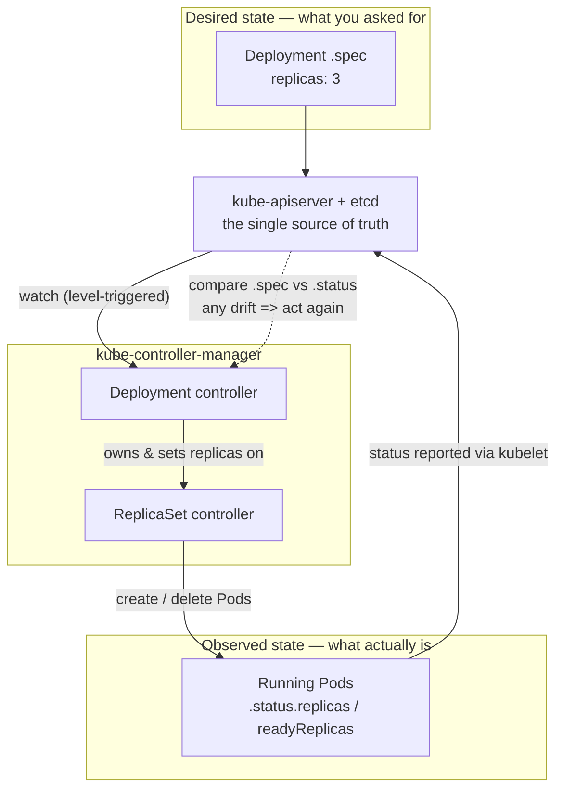
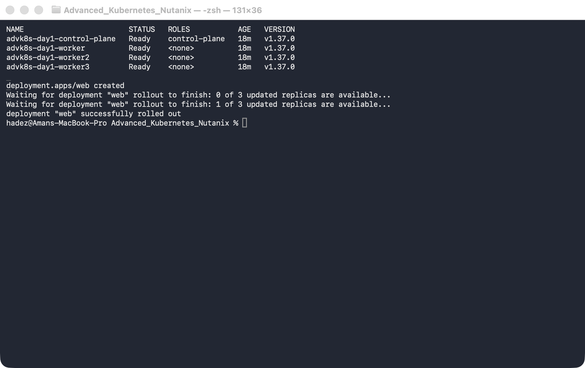
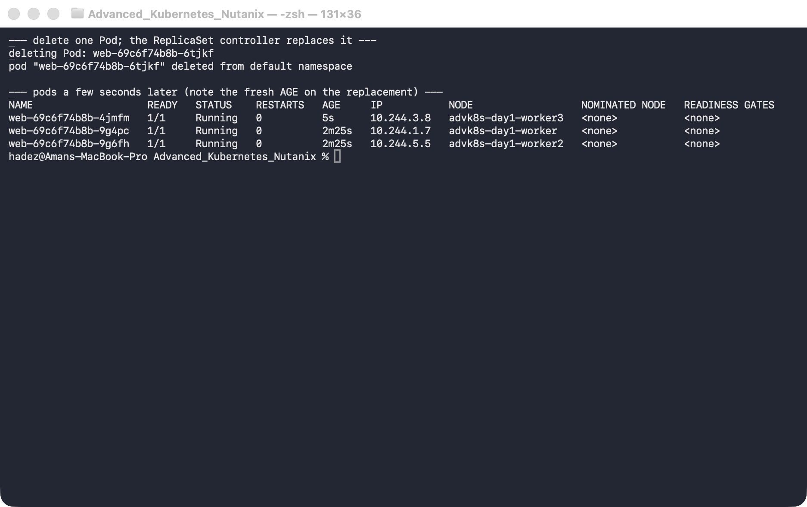
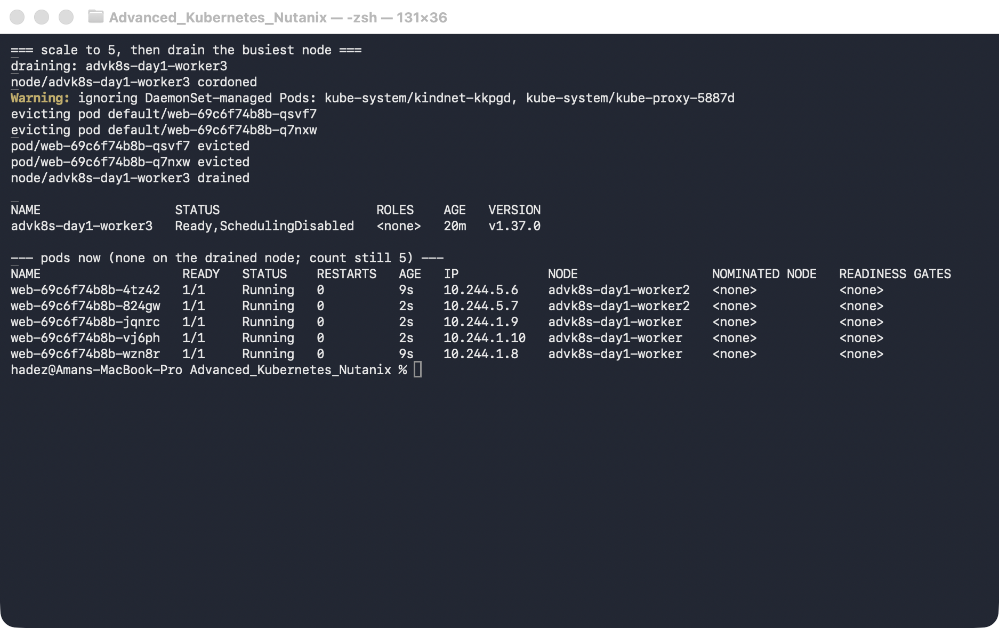

# Lab 1 — Reconciliation Tracing

**Day 1 · How Kubernetes Really Works**

> Every command below was actually run end to end on a real 4-node `kind` cluster (Kubernetes **v1.37.0**), and every screenshot is a real `screencapture` of that run. The single most striking finding: when you scale a Deployment-owned ReplicaSet by hand, the Deployment controller reverts it **faster than the very next `kubectl get` can read the change back** — the reconcile loop really is that tight.

## What you'll learn

- The reconcile loop as the *one* mechanism behind every Kubernetes controller: desired state (`.spec`) versus observed state (`.status`), driven to convergence continuously — not once, at apply time.
- How to watch reconciliation happen live — `kubectl get ... -w`, the controller event stream, and the `.metadata.generation` vs `.status.observedGeneration` pair.
- Why Kubernetes is *level-triggered*, not edge-triggered — and why that one design choice means a deleted Pod, a hand-edited ReplicaSet, and a lost node all heal by the exact same code path.
- Reading the ownership chain Deployment → ReplicaSet → Pod, and watching each controller defend the children it owns.
- Tracing a reconcile back to its actor in the `kube-controller-manager` and the API server's event log.



## Time & cost

- **Time:** ~40 minutes.
- **Cost:** $0. Runs entirely on a local `kind` cluster.

## Prerequisites

Complete the [Setup Environment Guide](00-setup-environment-guide.md). This lab needs `docker`, `kind`, and `kubectl` verified working. It creates a **multi-node** cluster (1 control-plane + 3 workers) because one of the disruptions is losing a whole node — you can't demonstrate that on a single-node cluster.

> **Nutanix note.** This lab is deliberately platform-agnostic: the reconcile loop is core Kubernetes and behaves identically on a Nutanix Kubernetes (NKE) cluster, GKE, or local `kind`. We use `kind` here so every learner can run it for free. On a real NKE cluster the only change is how you get the cluster (Prism Central / NKE console) and the node names in the output — the mechanics, commands, and results are the same.

---

## 1.1 The reconcile loop, briefly

Almost everything in Kubernetes is a **controller** running the same infinite loop:

1. Read the **desired state** — the object's `.spec`, stored in etcd behind the API server.
2. Read the **observed state** — what actually exists in the cluster right now (`.status`, plus the real Pods/objects).
3. If they differ, take an action to close the gap (create a Pod, delete a Pod, update a field).
4. Go to 1. Forever.

Two properties make this robust, and this lab is built to *show* both rather than assert them:

- **Level-triggered, not edge-triggered.** The controller doesn't react to *events* ("a pod was deleted"); it reacts to the *current level* ("I want 3, I see 2"). So it doesn't matter *how* reality drifted — a crash, a manual `kubectl delete`, a whole node vanishing — the correction is identical. Edge-triggered systems miss the event and stay broken; level-triggered systems just re-measure and fix it.
- **Ownership.** Higher-level controllers own lower-level objects (Deployment owns ReplicaSet owns Pod) via `ownerReferences`, and each controller continuously reconciles the children it owns. Hand-edit a child and its owner overwrites you.

The diagram above is the loop you'll trace for the rest of this lab.

---

## 1.2 Stand up the Day-1 cluster and declare a desired state

Create a four-node cluster. Write this config to `day1-kind.yaml`:

```bash
cat > day1-kind.yaml <<'EOF'
kind: Cluster
apiVersion: kind.x-k8s.io/v1alpha4
name: advk8s-day1
nodes:
  - role: control-plane
  - role: worker
  - role: worker
  - role: worker
EOF

kind create cluster --config day1-kind.yaml --wait 180s
kubectl get nodes -o wide
```

We keep this cluster for the rest of Day 1 (Labs 2–4 reuse it), so don't tear it down at the end of this lab.

Now declare a desired state — a Deployment that wants **3** replicas:

```bash
kubectl create deployment web --image=nginx:1.27 --replicas=3
kubectl rollout status deployment/web --timeout=90s
```



**Verified result:** four nodes `Ready` (one control-plane, `worker`, `worker2`, `worker3`), all on `v1.37.0`, and the Deployment rolls out to `3 of 3` available.

---

## 1.3 Read desired vs observed in one line

The whole loop is visible in a single object. Ask for both halves at once:

```bash
kubectl get deploy web -o jsonpath='spec.replicas={.spec.replicas}  status.replicas={.status.replicas}  ready={.status.readyReplicas}  generation={.metadata.generation}  observedGeneration={.status.observedGeneration}{"\n"}'
```

Then look at the ownership chain — Deployment → ReplicaSet → Pod (quote the column spec so your shell doesn't glob the `[0]`):

```bash
kubectl get rs -l app=web -o 'custom-columns=RS:.metadata.name,DESIRED:.spec.replicas,OWNER:.metadata.ownerReferences[0].kind'
kubectl get pods -l app=web -o wide
```


**Verified result:** `spec.replicas=3 status.replicas=3 ready=3 generation=1 observedGeneration=1` — desired and observed agree, and the controller has acknowledged spec generation 1. The ReplicaSet's `OWNER` is `Deployment`, and the three Pods are spread across all three worker nodes. Nobody scheduled them there by hand; the scheduler placed them and the ReplicaSet controller keeps the count.

---

## 1.4 Disruption #1 — delete a Pod, watch the ReplicaSet reconcile

Open a live watch in one pane:

```bash
kubectl get pods -l app=web -w
```

In another, delete a Pod:

```bash
kubectl delete pod "$(kubectl get pods -l app=web -o jsonpath='{.items[0].metadata.name}')"
```



**Verified result:** the watch shows the deleted Pod go `Terminating`, and a **brand-new Pod** appears almost immediately — in our run the replacement showed `AGE 5s` while its siblings were at `2m25s`. You never dropped below the desired count for more than a moment. The ReplicaSet controller didn't need to be *told* the Pod was gone; on its next sync it simply saw "2 running, I want 3" and created one.

---

## 1.5 Disruption #2 — edit the child directly (the level-triggered proof)

This is the money shot. Scale the **ReplicaSet** by hand — bypass the Deployment entirely — and try to force it down to 1:

```bash
RS=$(kubectl get rs -l app=web -o jsonpath='{.items[0].metadata.name}')
kubectl scale rs "$RS" --replicas=1
kubectl get rs "$RS" -o jsonpath='rs.spec.replicas={.spec.replicas}{"\n"}'
```


> **Tested gotcha — the reconcile loop is faster than you are.** The `kubectl scale rs ... --replicas=1` command *succeeds* (`replicaset.apps/web-... scaled`). But the very next line — a `kubectl get` issued milliseconds later — already reports `rs.spec.replicas=3`. The Deployment controller owns that ReplicaSet, watched the change land, and reverted it to the desired count before we could read the intermediate `1` back. This is level-triggering in the small: the controller doesn't care that a human made the edit, it just re-measures against desired and corrects. If you want to *see* the flip, run `kubectl get rs "$RS" -w` in another pane while you scale — you'll catch the `1 → 3` bounce in the watch stream.

Now do the more dramatic version — delete the entire ReplicaSet:

```bash
kubectl delete rs "$RS"
sleep 4
kubectl get rs -l app=web
kubectl get pods -l app=web
```

**Verified result:** the Deployment controller rebuilds an **identically-named** ReplicaSet (`web-69c6f74b8b` — same name because the name is a hash of the unchanged Pod template) and three fresh Pods appear with `AGE 4s`. You deleted the child; the owner rebuilt it from the desired spec.

---

## 1.6 Disruption #3 — lose a whole node, watch Pods reschedule

Scale up so there's something to move, then take out the busiest node with a drain (cordon + evict):

```bash
kubectl scale deployment web --replicas=5
kubectl get pods -l app=web -o wide   # note which node holds the most Pods

VICTIM=$(kubectl get pods -l app=web -o wide --no-headers | awk '{print $7}' | sort | uniq -c | sort -rn | head -1 | awk '{print $2}')
kubectl drain "$VICTIM" --ignore-daemonsets --delete-emptydir-data --timeout=60s
kubectl get node "$VICTIM"
kubectl get pods -l app=web -o wide
```



**Verified result:** the drain cordons the node (`Ready,SchedulingDisabled`) and evicts its two `web` Pods (the DaemonSet Pods `kindnet` / `kube-proxy` are correctly ignored). Within seconds the count is back to **5 running**, now spread only across the two remaining schedulable workers — zero on the drained node. Same loop, bigger disruption: "I want 5, I can see 3, and this node is off-limits" → reschedule elsewhere.

Restore the node when you're done:

```bash
kubectl uncordon "$VICTIM"
```

> A **drain** is the *graceful* version of node loss. The *ungraceful* version — a node that simply dies — takes the same path, just slower: the node goes `NotReady`, and after the `node.kubernetes.io/unreachable` toleration's default 300s the Pods are evicted and rescheduled. Drain lets you demonstrate the reconciliation in a lab without waiting five minutes.

---

## 1.7 Trace the reconcile to its actor

Everything above was driven by named controllers. The event log names them:

```bash
kubectl get events --sort-by=.lastTimestamp | tail -20
```

**Verified result:** you see the whole division of labour in one stream. In our run: `deployment/web  ScalingReplicaSet  Scaled up replica set web-69c6f74b8b from 5 to 6` (the Deployment controller), `replicaset/web-69c6f74b8b  SuccessfulCreate  Created pod: ...` (the ReplicaSet controller — with `SuccessfulDelete` during the earlier disruptions), `pod/...  Scheduled  Successfully assigned ... to advk8s-day1-worker` (the scheduler), and `pod/...  Pulled` / `Created` / `Started` (the kubelet). Each reconcile has a named owner.

You can also read a controller directly. In `kind`, `kube-controller-manager` is a static Pod in `kube-system`:

```bash
kubectl -n kube-system logs kube-controller-manager-advk8s-day1-control-plane | grep -i replicaset | tail -10
```

> **Tested gotcha — the loop *expects* to lose races.** The interesting lines here aren't tidy "reconciled OK" messages; they're conflicts:
> ```
> replica_set.go:640] "Unhandled Error" err="sync \"default/web-69c6f74b8b\" failed with
>   read version: 3258 is not as new as written version: 3266 for group resource replicasets.apps"
> ```
> That is optimistic concurrency in action: the ReplicaSet controller tried to write based on a slightly stale cached read, the API server rejected the write because someone (another sync of the same controller, in this rapid-fire lab) had already advanced the object, and the controller simply re-reads and retries on its next sync. Nothing is broken — this is *exactly* how a level-triggered controller is supposed to behave under churn. It never assumes its view is current; it re-measures. Seeing these under a burst of edits is normal and healthy, which is why the event stream above (not the raw controller log) is the reliable trace of what actually happened.

---

## 1.8 Watch a spec change converge

Change desired state and watch the two convergence signals behave *differently*:

```bash
kubectl scale deployment web --replicas=6
kubectl get deploy web -o jsonpath='gen={.metadata.generation}  observedGen={.status.observedGeneration}  status.replicas={.status.replicas}  ready={.status.readyReplicas}{"\n"}'
kubectl rollout status deployment/web --timeout=60s
kubectl get deploy web -o jsonpath='gen={.metadata.generation}  observedGen={.status.observedGeneration}  status.replicas={.status.replicas}  ready={.status.readyReplicas}{"\n"}'
```


**Verified result:** the instant you change the spec, `generation` bumps (to `3` in our run — this is the third spec change, after the create and the scale-to-5) **and `observedGeneration` bumps with it** — the controller *saw* the new spec almost immediately. But `readyReplicas` lags by exactly the one new Pod (`status.replicas=6 ready=5` right after the change), then reaches `6`. That's the important distinction most people miss:

- `generation` vs `observedGeneration` answers *"has the controller acknowledged my latest spec?"* — fast.
- `status.replicas` / `readyReplicas` vs `spec.replicas` answers *"has the controller actually achieved my spec?"* — that's the real convergence, and it takes as long as the work takes.

---

## 1.9 Clean up

Leave the cluster running for Labs 2–4. Just remove this lab's Deployment:

```bash
kubectl delete deployment web
```

If you're stopping here and want to reclaim the resources entirely:

```bash
kind delete cluster --name advk8s-day1
```

---

## Lab summary

| Claim | Where it's proven |
|---|---|
| Desired vs observed state live in one object (`.spec` vs `.status`) | 1.3 — `spec.replicas=3 status.replicas=3 ready=3` |
| A deleted Pod is reconciled back within seconds | 1.4 — replacement Pod at `AGE 4s` |
| Controllers own and defend their children (level-triggered) | 1.5 — hand-scaled RS reverted faster than a follow-up read; deleted RS rebuilt |
| Node loss reschedules Pods, count preserved | 1.6 — drained node → 5/5 running on remaining workers |
| Every reconcile has a named actor | 1.7 — `replicaset-controller`, `default-scheduler`, `kubelet` in the event stream |
| `observedGeneration` (acknowledged) ≠ `readyReplicas` (achieved) | 1.8 — gen/observedGen bump instantly, readyReplicas lags then converges |

## Evidence

Real screenshots for this lab live in [`screenshots/lab-01/`](screenshots/lab-01/) (6 images). Captured terminal output is in [`evidence/lab-01-reconciliation.txt`](evidence/lab-01-reconciliation.txt).

---

**Next:** [Lab 2 — API Request Lifecycle & Priority and Fairness](lab-02-api-priority-fairness.md)
