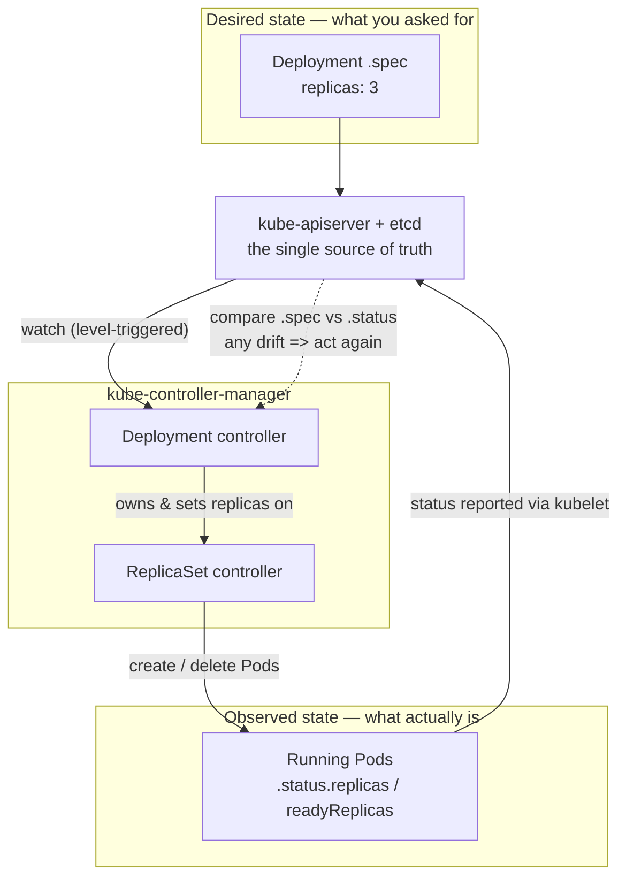
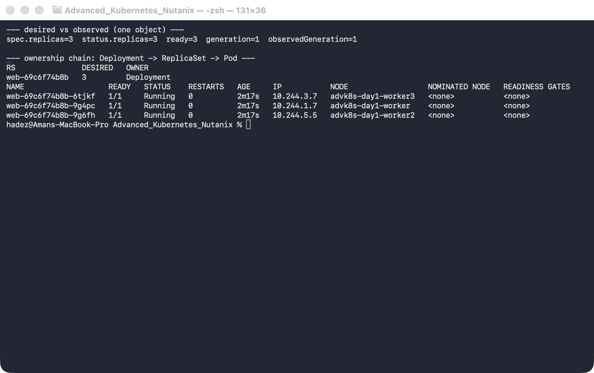
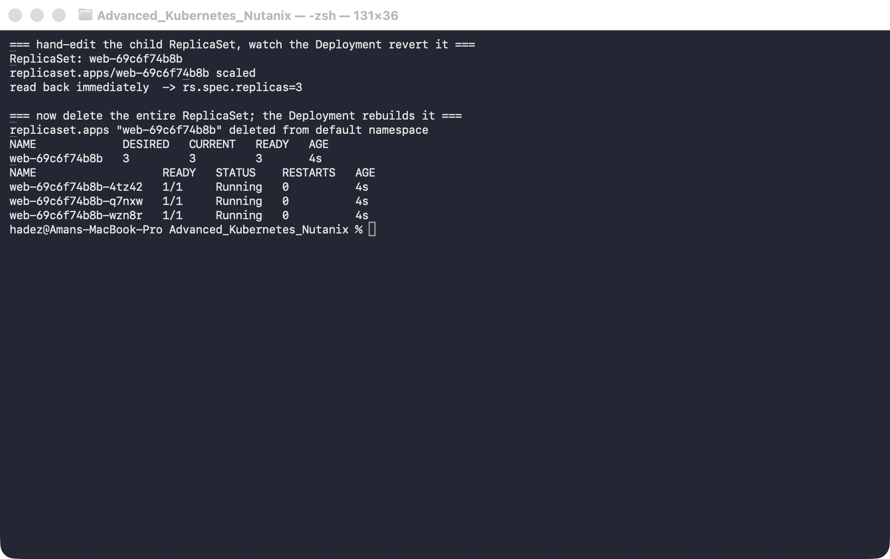
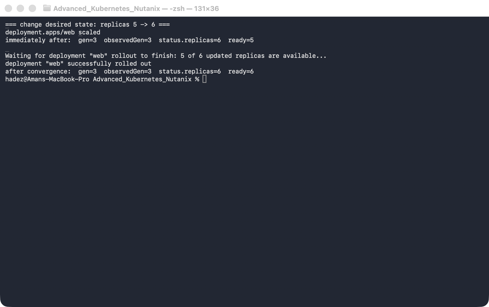

# Lab 1 — Watch Kubernetes Heal Itself (Reconciliation Tracing)

**Day 1 · How Kubernetes Really Works**

> ✅ **Tested end-to-end** on a real 4-node `kind` cluster (Kubernetes v1.37.0). Every command here was actually run and every screenshot is a real capture of that run.

## What you'll learn

- The **reconcile loop** — the single idea behind every Kubernetes controller: compare *desired state* (`.spec`) with *observed state* (`.status`) and keep closing the gap, forever.
- How to *watch* that loop work live, and how to read the two numbers that tell you whether a controller has caught up: `generation` vs `observedGeneration`.
- Why Kubernetes is **level-triggered** — so a deleted Pod, a hand-edited ReplicaSet, and a dead node all get fixed by the exact same mechanism.
- How to trace a self-healing action back to the controller that performed it.

## What you'll do

You'll create a Deployment that asks for 3 Pods, then **break it four different ways** — delete a Pod, hand-edit its ReplicaSet, take a whole node offline, and change the spec — and each time you'll watch Kubernetes quietly put it back to what you asked for. By the end you'll have *seen* the reconcile loop, not just read about it.

## Time & cost

- **Time:** ~40 minutes.
- **Cost:** **$0** — everything runs on a free local `kind` cluster.

---

## Before you start

- **Where you'll work:** on your own computer, in a **terminal**. This lab uses a local `kind` cluster (Kubernetes in Docker) — no cloud account, nothing to pay for.
- **Tools you need** (see the [Setup Environment Guide](00-setup-environment-guide.md) if any are missing):
  - `docker` — installed and **running**
  - `kind` — to create the cluster
  - `kubectl` — to talk to it
- **Heads-up:** **Step 3 needs two terminal windows open side by side.** Everything else uses one.

> **Nutanix note.** The reconcile loop is core Kubernetes — it behaves *identically* on a Nutanix (NKE) cluster, on GKE, or on local `kind`. We use `kind` here so it's free and instant. On a real NKE cluster the only differences are how you create the cluster (through Prism Central / the NKE console) and the node names you'll see — every command and result below is the same.

---

## The idea in 60 seconds

Almost everything in Kubernetes is a **controller** running the same never-ending loop:

1. Read the **desired state** — what you asked for (the object's `.spec`).
2. Read the **observed state** — what actually exists right now (`.status`, plus the real Pods).
3. If they differ, take one action to close the gap. Then start over.

Two properties make this powerful, and you'll watch both in this lab:

- **Level-triggered, not edge-triggered.** A controller doesn't react to an *event* ("a Pod was deleted") — it reacts to the *current situation* ("I want 3, I count 2"). So it doesn't matter *how* things drifted; the fix is always the same.
- **Ownership.** Higher-level objects own lower-level ones — a Deployment owns a ReplicaSet, which owns Pods — and each owner constantly repairs its children.



That loop is what you'll trace for the rest of the lab.

---

## Step 1 — Create your cluster and declare what you want

**Goal:** stand up a 4-node cluster and create a Deployment that asks for 3 Pods — your "desired state."

**1. Open a terminal.** Create the cluster config file by pasting this in:

```bash
cat > day1-kind.yaml <<'EOF'
kind: Cluster
apiVersion: kind.x-k8s.io/v1alpha4
name: advk8s-day1
nodes:
  - role: control-plane
  - role: worker
  - role: worker
  - role: worker
EOF
```

*(We want 4 nodes because in Step 5 you'll take one offline and watch its Pods move — you can't show that on a single-node cluster.)*

**2. Create the cluster** (this takes a minute or two the first time while it downloads the node image):

```bash
kind create cluster --config day1-kind.yaml --wait 180s
kubectl get nodes -o wide
```

**3. Tell Kubernetes you want 3 copies of a web server:**

```bash
kubectl create deployment web --image=nginx:1.27 --replicas=3
kubectl rollout status deployment/web --timeout=90s
```

**What you should see:** four nodes listed as `Ready` (one `control-plane` and three `worker`s), all on `v1.37.0`, then the Deployment finishing with `deployment "web" successfully rolled out`.


**What this means:** you've declared a desired state — "I want 3 `web` Pods." You didn't say *where* to put them or *how* to keep them alive; from here on, a controller does that for you. Keep this cluster running — Labs 2–4 reuse it.

---

## Step 2 — See "desired vs observed" in one place

**Goal:** look at the two halves of the loop — what you asked for, and what actually exists — on a single object.

**1. Ask for both halves at once:**

```bash
kubectl get deploy web -o jsonpath='spec.replicas={.spec.replicas}  status.replicas={.status.replicas}  ready={.status.readyReplicas}  generation={.metadata.generation}  observedGeneration={.status.observedGeneration}{"\n"}'
```

**2. Look at the ownership chain — Deployment → ReplicaSet → Pod** (quote the column spec so your shell doesn't treat the `[0]` as a filename pattern):

```bash
kubectl get rs -l app=web -o 'custom-columns=RS:.metadata.name,DESIRED:.spec.replicas,OWNER:.metadata.ownerReferences[0].kind'
kubectl get pods -l app=web -o wide
```

**What you should see:** the first command prints
```
spec.replicas=3  status.replicas=3  ready=3  generation=1  observedGeneration=1
```
and the Pods are spread across all three worker nodes.



**What this means:** desired (`spec.replicas=3`) and observed (`status.replicas=3 ready=3`) agree — the loop is at rest. The `OWNER` of the ReplicaSet is `Deployment`, and you never chose which node each Pod lands on; the scheduler placed them and the ReplicaSet controller keeps the count. Remember `generation` and `observedGeneration` — you'll use them in Step 6.

---

## Step 3 — Break it #1: delete a Pod (you'll need two terminals)

**Goal:** delete a running Pod and watch the ReplicaSet controller notice and replace it.

**1. In your *first* terminal, start a live watch** and leave it running:

```bash
kubectl get pods -l app=web -w
```

**2. In a *second* terminal window, delete one of the Pods:**

```bash
kubectl delete pod "$(kubectl get pods -l app=web -o jsonpath='{.items[0].metadata.name}')"
```

Now look back at the first terminal.

**What you should see:** the deleted Pod goes to `Terminating`, and a **brand-new Pod appears within seconds**. In our run the replacement showed `AGE 5s` while its two siblings were at `2m25s`.


**What this means:** nobody *told* the controller "a Pod was deleted." On its next pass it simply counted "2 running, I want 3" and created one. You briefly had 2 Pods; the loop brought you back to 3. That's level-triggering.

---

## Step 4 — Break it #2: hand-edit the ReplicaSet

**Goal:** bypass the Deployment and edit its child directly, and watch the Deployment overwrite you — proof that owners defend their children.

**1. Try to force the ReplicaSet down to 1 replica:**

```bash
RS=$(kubectl get rs -l app=web -o jsonpath='{.items[0].metadata.name}')
kubectl scale rs "$RS" --replicas=1
kubectl get rs "$RS" -o jsonpath='rs.spec.replicas={.spec.replicas}{"\n"}'
```

**2. Now delete the whole ReplicaSet and watch the Deployment rebuild it:**

```bash
kubectl delete rs "$RS"
sleep 4
kubectl get rs -l app=web
kubectl get pods -l app=web
```

**What you should see:** the `scale` command *succeeds* — but the very next line already reads `rs.spec.replicas=3`, not `1`. And after you delete the ReplicaSet, an **identically-named** one reappears with 3 fresh Pods (`AGE 4s`).



> ⚠️ **Gotcha — the loop is faster than you are.** Your `kubectl scale rs … --replicas=1` really did set it to 1. But the Deployment controller owns that ReplicaSet, saw the change, and reverted it to 3 *before your next command could read it back*. If you want to actually *see* the flip, run `kubectl get rs "$RS" -w` in a second terminal while you scale — you'll catch the `1 → 3` bounce.

**What this means:** you can't manage a Deployment's ReplicaSet by hand — the owner continuously reconciles it back to what the Deployment says. Same with deleting it: the Deployment just rebuilds it from the desired spec (same name, because the name is a hash of the unchanged Pod template).

---

## Step 5 — Break it #3: take a whole node offline

**Goal:** remove an entire node from service and watch its Pods reschedule onto the survivors, with the count preserved.

**1. Scale up a little so there's something to move, then drain the busiest node** (`drain` = cordon it off and evict its Pods):

```bash
kubectl scale deployment web --replicas=5
kubectl get pods -l app=web -o wide     # note which node has the most Pods

VICTIM=$(kubectl get pods -l app=web -o wide --no-headers | awk '{print $7}' | sort | uniq -c | sort -rn | head -1 | awk '{print $2}')
kubectl drain "$VICTIM" --ignore-daemonsets --delete-emptydir-data --timeout=60s
kubectl get node "$VICTIM"
kubectl get pods -l app=web -o wide
```

**What you should see:** the node becomes `Ready,SchedulingDisabled`, its `web` Pods are evicted, and within seconds you're back to **5 running Pods** — now spread only across the two remaining workers, **none on the drained node**. (The `kindnet` / `kube-proxy` system Pods are correctly left alone.)


**2. Put the node back when you're done:**

```bash
kubectl uncordon "$VICTIM"
```

**What this means:** losing a node is just another kind of drift. The loop saw "I want 5, I can reach 3, and this node is off-limits" and rescheduled onto the healthy nodes. A `drain` is the *graceful* version; a node that simply dies takes the same path, just slower (Kubernetes waits ~5 minutes before evicting Pods from an unreachable node).

---

## Step 6 — Watch a spec change converge

**Goal:** change the desired state and watch the two "have we caught up?" signals behave differently.

**1. Ask for 6 Pods, then immediately check the status:**

```bash
kubectl scale deployment web --replicas=6
kubectl get deploy web -o jsonpath='gen={.metadata.generation}  observedGen={.status.observedGeneration}  status.replicas={.status.replicas}  ready={.status.readyReplicas}{"\n"}'
kubectl rollout status deployment/web --timeout=60s
kubectl get deploy web -o jsonpath='gen={.metadata.generation}  observedGen={.status.observedGeneration}  status.replicas={.status.replicas}  ready={.status.readyReplicas}{"\n"}'
```

**What you should see:** the moment you scale, `gen` and `observedGen` both jump together (to `3` in our run), but `ready` lags — right after the change it read `status.replicas=6 ready=5`, then climbed to `ready=6`.



**What this means** — this is the distinction most people miss:
- **`generation` vs `observedGeneration`** answers *"has the controller noticed my latest change?"* — that's near-instant.
- **`ready` / `status.replicas` vs `spec.replicas`** answers *"has the controller actually finished the work?"* — that takes as long as the work takes.

So `observedGeneration` catching up does **not** mean your rollout is done; watch `readyReplicas` for that.

---

## Step 7 — (Optional) Trace who did the work

**Goal:** see that every self-healing action above had a named actor.

```bash
kubectl get events --sort-by=.lastTimestamp | tail -20
```

**What you should see:** a stream naming the controllers — `deployment/web ScalingReplicaSet …`, `replicaset/web-… SuccessfulCreate Created pod …`, `pod/… Scheduled …` (the scheduler), and `pod/… Pulled / Started` (the kubelet). Each part of the loop has an owner.

> ⚠️ **Gotcha — the controller log is *full of conflicts*, and that's healthy.** If you read the controller directly with `kubectl -n kube-system logs kube-controller-manager-advk8s-day1-control-plane | grep -i replicaset`, you'll see lines like `"Unhandled Error" … "read version: 3258 is not as new as written version: 3266"`. That's **optimistic concurrency**: the controller tried to write from a slightly stale view, the API server rejected it, and it simply re-reads and retries. Nothing is broken — a level-triggered controller *expects* to lose races and just re-measures. The **events** above are the reliable trace; the raw log is noisy by design.

---

## Clean up

Leave the cluster running for Labs 2–4 — just remove this lab's Deployment:

```bash
kubectl delete deployment web
```

If you're stopping entirely and want the resources back:

```bash
kind delete cluster --name advk8s-day1
```

---

## What you learned

| You saw… | in Step | proof |
|---|---|---|
| Desired vs observed state on one object | 2 | `spec.replicas=3 … ready=3` |
| A deleted Pod healed within seconds | 3 | replacement Pod at `AGE 5s` |
| Owners defend their children (level-triggered) | 4 | hand-scaled ReplicaSet reverted faster than you could read it |
| A lost node reschedules Pods, count preserved | 5 | drained node → 5/5 running on the survivors |
| "Noticed" (`observedGeneration`) ≠ "finished" (`readyReplicas`) | 6 | both jump, then `ready` catches up |
| Every fix has a named controller | 7 | `replicaset-controller`, `default-scheduler`, `kubelet` in the events |

## Evidence

The real screenshots for this lab are in [`artifacts/lab-01/screenshots/`](artifacts/lab-01/screenshots/) (6 images), and a full transcript of the commands and output is in [`artifacts/lab-01/evidence/lab-01-reconciliation.txt`](artifacts/lab-01/evidence/lab-01-reconciliation.txt).

---

---

**Next:** [Lab 2 — Stop One Client From Taking Down the API Server (API Priority & Fairness)](lab-02-api-priority-fairness.md)
