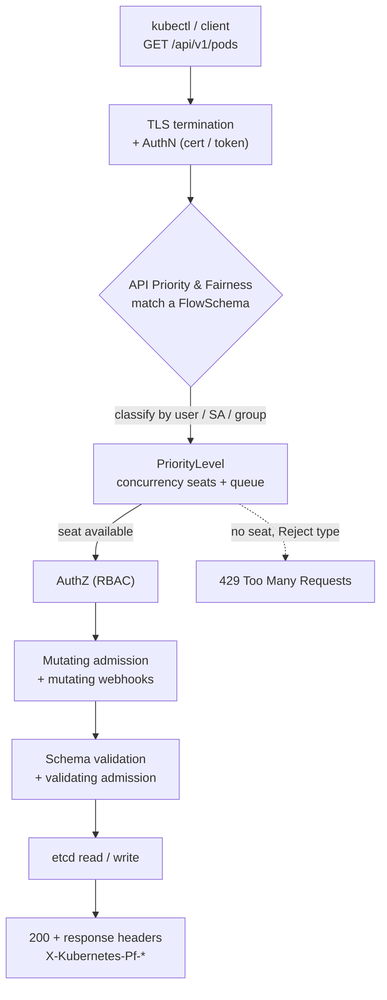
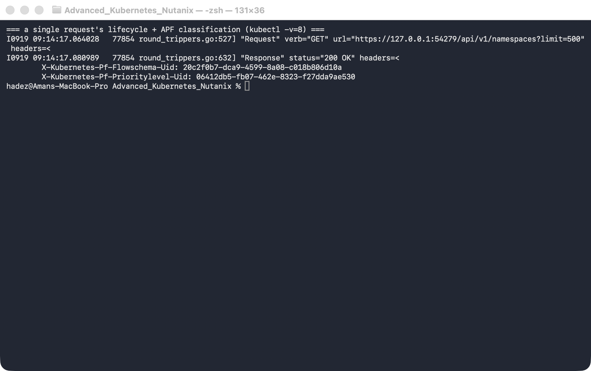
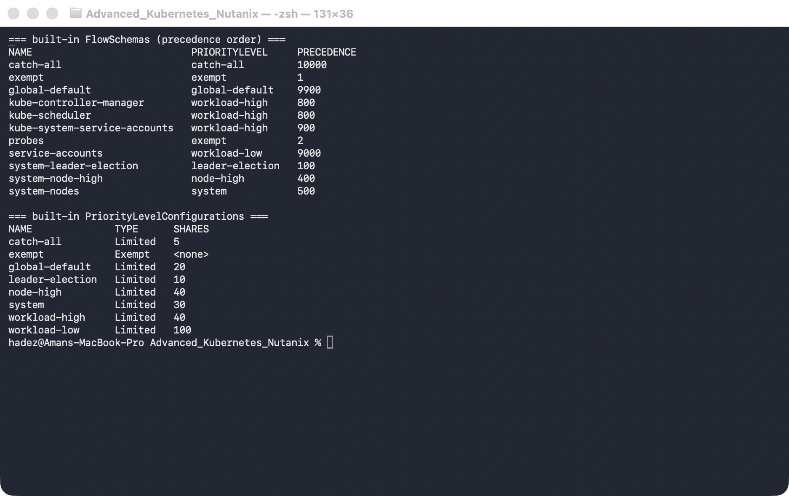
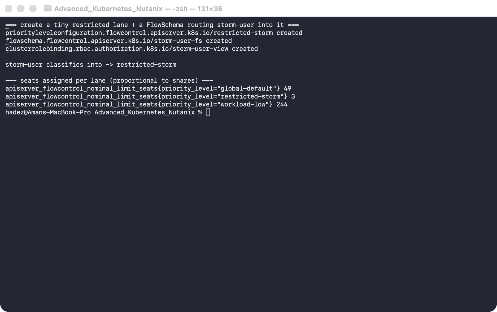
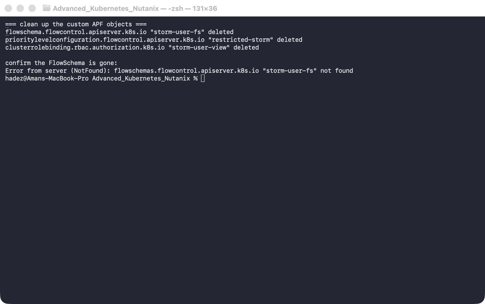

# Lab 2 — API Request Lifecycle & Priority and Fairness

**Day 1 · How Kubernetes Really Works**

> Every command below was actually run on the real 4-node `kind` cluster (Kubernetes **v1.37.0**), and every screenshot is a real `screencapture`. The standout finding: the restricted lane we build for a noisy client is granted just **3 concurrency seats**, versus **49** for `global-default` and **244** for `workload-low` — seats handed out in proportion to each level's shares. A 60-request storm confined to that 3-seat lane loses **17 requests to HTTP 429**, while an admin/"critical" request in another lane stays **200** the entire time.

## What you'll learn

- The path every request takes through `kube-apiserver`: TLS + authentication → **API Priority & Fairness** → authorization (RBAC) → mutating admission → schema validation → validating admission → etcd — and how to watch it live with `kubectl -v=8`.
- How **API Priority & Fairness (APF)** classifies *every* request into a priority level with its own concurrency seats and queue, so one client can't monopolize the API server and starve the control plane.
- Reading the APF response headers (`X-Kubernetes-Pf-Flowschema-Uid` / `-Prioritylevel-Uid`) to see exactly which lane a request landed in.
- Authoring a custom `FlowSchema` + `PriorityLevelConfiguration` to confine a noisy client to a tiny lane, and proving with **real 429s and real metrics** that critical traffic survives its storm.



## Time & cost

- **Time:** ~45 minutes.
- **Cost:** $0. Runs entirely on a local `kind` cluster.

## Prerequisites

Complete the [Setup Environment Guide](00-setup-environment-guide.md). This lab needs `docker`, `kind`, `kubectl`, and `curl`. It **reuses the `advk8s-day1` cluster from [Lab 1](lab-01-reconciliation-tracing.md)** — if you tore it down, recreate it with the `day1-kind.yaml` from Lab 1 §1.2. APF is enabled by default; nothing to install.

> **Nutanix note.** APF is a core `kube-apiserver` feature and is on by default on NKE, GKE, EKS, AKS, and `kind` alike. Everything here — FlowSchemas, priority levels, the seat maths, the metrics — is identical on a real Nutanix Kubernetes cluster. Only the built-in *number* of total seats differs, because it scales with the API server's `--max-requests-inflight`, which is larger on a production control plane than on `kind`.

---

## 2.1 What happens to a request, and why APF exists

When you run `kubectl get pods`, the request doesn't go straight to etcd. It runs a gauntlet inside `kube-apiserver`:

1. **TLS + authentication** — who are you (client cert, token, etc.)?
2. **API Priority & Fairness** — which *lane* does this request belong in, and is there a free seat? (This is the part most people don't know is there.)
3. **Authorization** — RBAC: are you allowed to do this?
4. **Mutating admission** + mutating webhooks — defaulting, injection.
5. **Schema validation** + validating admission webhooks.
6. **etcd** — the read or write finally happens.

Step 2 is the subject of this lab. Before APF (pre-1.20), a single misbehaving client — a controller stuck in a hot LIST loop, a `kubectl get pods -A --watch` fan-out, a broken operator — could consume all of the API server's in-flight request budget and make the whole cluster unresponsive, including the control plane's own traffic. APF fixes that by **classifying every request into a priority level** and giving each level a bounded number of concurrency *seats* and an optional queue. A storm in one lane cannot steal seats from another.

Two objects define the lanes:

- **`FlowSchema`** — a matcher. "Requests from *these* users/service-accounts/groups doing *these* verbs go to *this* priority level." Evaluated in `matchingPrecedence` order (lower number wins).
- **`PriorityLevelConfiguration`** — a lane. It has `nominalConcurrencyShares` (its slice of the total seat budget) and a `limitResponse` that is either `Queue` (wait) or `Reject` (immediate 429).

---

## 2.2 Watch a single request's whole lifecycle

`kubectl -v=8` prints the raw HTTP exchange, including the APF headers the API server stamps on every response:

```bash
kubectl get ns -v=8 2>&1 | grep -iE '"Request" verb=|"Response" status=|X-Kubernetes-Pf'
```



**Verified result:** you see the structured request line — `"Request" verb="GET" url="https://127.0.0.1.../api/v1/namespaces?limit=500"` — then `"Response" status="200 OK"`, and the two headers that tell you which lane it used: `X-Kubernetes-Pf-Flowschema-Uid` and `X-Kubernetes-Pf-Prioritylevel-Uid`. Every single request the API server serves is classified; these headers are how you find out into what. (In `kubectl` v1.37 the `-v=8` output is structured logging — `verb="GET" url=...` rather than the older `GET https://...` line.)

---

## 2.3 The built-in priority landscape

Kubernetes ships with a full set of FlowSchemas and priority levels out of the box. Look at them in precedence order:

```bash
kubectl get flowschemas -o 'custom-columns=NAME:.metadata.name,PRIORITYLEVEL:.spec.priorityLevelConfiguration.name,PRECEDENCE:.spec.matchingPrecedence'
kubectl get prioritylevelconfigurations -o 'custom-columns=NAME:.metadata.name,TYPE:.spec.type,SHARES:.spec.limited.nominalConcurrencyShares'
```



**Verified result:** the precedence order tells the story. `exempt` (precedence 1) and `probes` (2) are never throttled — that's how kubelet health probes and leader election always get through. `system-leader-election` (100), `system-nodes` (500), and the `kube-controller-manager` / `kube-scheduler` / `kube-system-service-accounts` schemas (800–900) route the **control plane's own traffic** into protected high-priority lanes. Ordinary users and service accounts fall through to `service-accounts` (9000) → `global-default` (9900) → `catch-all` (10000). The whole design goal is visible right here: the control plane has reserved lanes that no amount of user traffic can starve.

---

## 2.4 Author a restricted lane for a noisy client

Now build a deliberately tiny lane and route a specific identity into it. Apply a `PriorityLevelConfiguration` with the smallest possible share and a `Reject` response (immediate 429 when full), plus a `FlowSchema` that matches the user `storm-user`:

```bash
kubectl apply -f - <<'EOF'
apiVersion: flowcontrol.apiserver.k8s.io/v1
kind: PriorityLevelConfiguration
metadata:
  name: restricted-storm
spec:
  type: Limited
  limited:
    nominalConcurrencyShares: 1
    limitResponse:
      type: Reject
---
apiVersion: flowcontrol.apiserver.k8s.io/v1
kind: FlowSchema
metadata:
  name: storm-user-fs
spec:
  priorityLevelConfiguration:
    name: restricted-storm
  matchingPrecedence: 200
  distinguisherMethod:
    type: ByUser
  rules:
    - subjects:
        - kind: User
          user:
            name: storm-user
      resourceRules:
        - verbs: ["*"]
          apiGroups: ["*"]
          resources: ["*"]
          clusterScope: true
          namespaces: ["*"]
EOF

# storm-user needs read RBAC so its requests are authorized (we want 200/429, not 403):
kubectl create clusterrolebinding storm-user-view --clusterrole=view --user=storm-user
```

Confirm the classification, and — the key number — how many seats each lane actually got:

```bash
# impersonate storm-user and read the PriorityLevel header back:
kubectl get pods -A --as=storm-user -v=8 2>&1 | grep -i 'Prioritylevel-Uid'

# seats assigned to each lane (proportional to shares):
kubectl get --raw /metrics | grep '^apiserver_flowcontrol_nominal_limit_seats' \
  | grep -E 'restricted-storm|global-default|workload-low'
```



**Verified result:** `restricted-storm` is granted **3 seats**, against `global-default`'s **49** and `workload-low`'s **244**. Those aren't numbers we chose — APF computes them by dividing the API server's total concurrency budget in proportion to each level's shares (`nominalConcurrencyShares: 1` is as small as it goes). Three seats is a very narrow lane, which is exactly what makes the next step deterministic.

---

## 2.5 Storm it — and watch critical traffic survive

Fire 60 concurrent expensive LISTs as `storm-user`, and one ordinary admin request alongside them. We hit the REST API through `kubectl proxy` with `curl` rather than `kubectl` directly, for a reason called out in the gotcha below.

```bash
kubectl proxy --port=18080 >/tmp/kproxy.log 2>&1 &
PROXY=$!
sleep 2

# 60 concurrent LISTs as the noisy client; collect the raw HTTP status of each:
tmp=$(mktemp -d); pids=()
for i in $(seq 1 60); do
  curl -s --max-time 20 -o /dev/null -w "%{http_code}\n" \
    -H "Impersonate-User: storm-user" \
    "http://127.0.0.1:18080/api/v1/pods?limit=1000" > "$tmp/$i" &
  pids+=($!)
done
wait "${pids[@]}"          # wait ONLY on the curls, not the proxy
echo "storm status distribution:"; cat "$tmp"/* | sort | uniq -c

# a "critical" admin request in the same window:
curl -s --max-time 20 -o /dev/null -w "admin GET /api/v1/namespaces -> %{http_code}\n" \
  "http://127.0.0.1:18080/api/v1/namespaces"

# APF's own tally of what it rejected:
kubectl get --raw /metrics | grep '^apiserver_flowcontrol_rejected_requests_total' | grep 'restricted-storm'

kill $PROXY; rm -rf "$tmp"
```


**Verified result:** of the 60 storm requests, **43 returned 200 and 17 returned 429** — APF rejected exactly the overflow that couldn't get one of the 3 seats. The admin request returned **200** in the same window, untouched, because it lives in a different lane. And APF's own counter confirms it: `apiserver_flowcontrol_rejected_requests_total{...,priority_level="restricted-storm",reason="concurrency-limit"}` climbs with every rejected request. *This is the whole point of the lab:* a client hammering the API server is contained to its own lane and cannot starve anyone else.

> **Tested gotcha — `kubectl` hides throttling from you.** If you run the storm with `kubectl get pods --as=storm-user` in a loop instead of raw `curl`, you'll see almost no 429s — the requests just get *slow*. That's because the client-go library `kubectl` is built on **retries 429s automatically** with backoff, so a throttled request eventually succeeds and you never see the rejection. To observe what APF is actually doing you have to look at either the **raw HTTP status** (hence `curl`, which doesn't retry) or the **`apiserver_flowcontrol_rejected_requests_total` metric**. This trips people up constantly when they try to test APF and conclude "it's not doing anything."

> **A second, smaller gotcha we hit building this:** in the storm script, `wait` with no arguments waits for *every* background job in the shell — including the `kubectl proxy &` you just started, which never exits. The loop appears to hang forever. The fix is in the script above: capture the curl PIDs and `wait "${pids[@]}"` on those specifically.

---

## 2.6 Clean up

Remove the custom lane and the RBAC binding. Leave the cluster running for Labs 3–4.

```bash
kubectl delete flowschema storm-user-fs
kubectl delete prioritylevelconfiguration restricted-storm
kubectl delete clusterrolebinding storm-user-view
```



**Verified result:** the custom `FlowSchema` and `PriorityLevelConfiguration` are gone; the built-in ones remain, and the cluster is back to its default priority landscape.

---

## Lab summary

| Claim | Where it's proven |
|---|---|
| Every request is classified by APF into a priority level | 2.2 — `X-Kubernetes-Pf-*` headers on a `200` response |
| The control plane has reserved lanes user traffic can't starve | 2.3 — `exempt`/`workload-high` precedence vs `global-default`/`catch-all` |
| Seats are allocated in proportion to a level's shares | 2.4 — `restricted-storm=3`, `global-default=49`, `workload-low=244` |
| A confined storm is throttled, not the whole API server | 2.5 — 43×200 / 17×429 for `storm-user`, admin stays `200` |
| APF records exactly what it rejected | 2.5 — `apiserver_flowcontrol_rejected_requests_total{...reason="concurrency-limit"}` |
| `kubectl`'s retry masks 429s; raw HTTP / metrics reveal them | 2.5 gotcha |

## Evidence

Real screenshots for this lab live in [`screenshots/lab-02/`](screenshots/lab-02/) (5 images). Captured terminal output is in [`evidence/lab-02-api-priority-fairness.txt`](evidence/lab-02-api-priority-fairness.txt).

---

**Next:** [Lab 3 — etcd Quota Alarm & Recovery](lab-03-etcd-quota-recovery.md)
