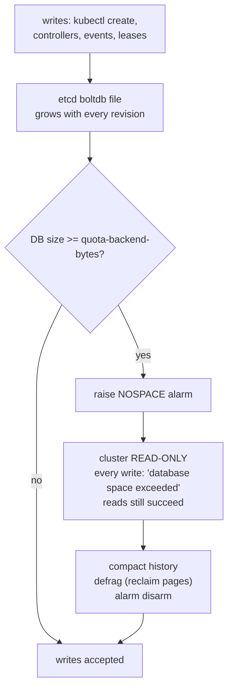
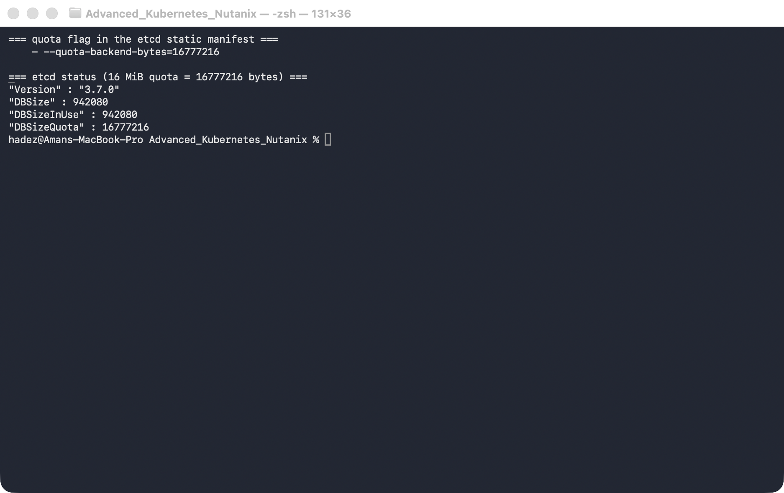

# Lab 3 — etcd Quota Alarm & Recovery

**Day 1 · How Kubernetes Really Works**

> Every command below was actually run on a real, dedicated `kind` cluster (Kubernetes **v1.37.0**, etcd **v3.7.0**) that we deliberately drove into a read-only state and then recovered. The standout moment: after filling etcd past its quota, `kubectl create configmap` fails cluster-wide with `etcdserver: mvcc: database space exceeded` — the whole cluster is read-only — and a three-command sequence (`compact` → `defrag` → `alarm disarm`) brings it back to accepting writes.

## What you'll learn

- What etcd's `--quota-backend-bytes` actually does, and what happens the instant the backend database crosses it: a **NOSPACE alarm** and a **cluster-wide read-only** state.
- How to see the failure from both sides — the etcd alarm (`etcdctl alarm list`) and the symptom every user hits (`database space exceeded` on any write).
- Why *reads keep working* while *all writes fail*, and why that's the single most confusing production incident etcd throws at you.
- The real recovery runbook: **compact** history, **defragment** to reclaim physical space, then **disarm** the alarm — and why you need all three, in that order.
- Why deleting the offending data alone doesn't help until you compact and defrag.



## Time & cost

- **Time:** ~40 minutes.
- **Cost:** $0. Runs on a local `kind` cluster.

## Prerequisites

Complete the [Setup Environment Guide](00-setup-environment-guide.md). This lab needs `docker`, `kind`, and `kubectl`.

> **This lab uses its own dedicated cluster, not the Day-1 shared one.** We are intentionally corrupting etcd into a read-only state. You never practice etcd quota recovery on a cluster you care about — so we build a throwaway `etcd-lab` cluster and delete it at the end.

> **Nutanix note.** etcd, its quota, the NOSPACE alarm, and the compact/defrag/disarm runbook are identical on NKE, GKE, EKS, AKS, and `kind` — etcd is etcd. The one thing that differs on a managed platform is *access*: on NKE (and other managed control planes) you typically don't edit the etcd static-pod manifest yourself — the platform sets `--quota-backend-bytes` and you'd raise a support case or use the platform's etcd-maintenance tooling to compact/defrag. Here on `kind` we have full control-plane access, which is exactly why `kind` is the right place to *practise* the recovery so you recognise it in production.

---

## 3.1 What the quota does, and what "read-only" means

etcd stores every Kubernetes object, and it keeps a **history of revisions**, not just the current value. That history grows continuously — every write, every controller update, every Event and Lease renewal adds a revision. To stop a runaway from filling the disk, etcd enforces `--quota-backend-bytes`. When the backend database file crosses that size, etcd does something drastic and deliberate: it raises a **NOSPACE alarm** and **refuses all writes** across the entire cluster. Reads still work. This is a safety valve — etcd would rather go read-only than corrupt itself by running out of disk.

The default quota is ~2 GiB, which is far too large to fill in a lab, so the first thing we do is lower it to 16 MiB. Then we fill it, watch the cluster go read-only, and recover it.

Recovery is always the same three steps, and you need all three:

1. **`compact`** — discard old revisions from the history. This makes space *logically* free inside the DB file…
2. **`defrag`** — …but the file doesn't shrink until you defragment it, which rewrites the boltdb file and returns the freed pages.
3. **`alarm disarm`** — the NOSPACE alarm does **not** clear itself even after the DB shrinks; you must explicitly disarm it before writes are allowed again.

---

## 3.2 Create a dedicated cluster and lower the quota

```bash
kind create cluster --name etcd-lab --wait 120s
```

etcd runs as a static Pod on the control-plane node. Lower its quota by adding a flag to the static-pod manifest on that node — the kubelet will restart etcd automatically:

```bash
docker exec etcd-lab-control-plane \
  sed -i '/^    - etcd$/a\    - --quota-backend-bytes=16777216' \
  /etc/kubernetes/manifests/etcd.yaml
```

Set up a small helper so the long `etcdctl` invocation (with all its TLS flags) is one word, then confirm the new quota took effect:

```bash
e() {
  kubectl -n kube-system exec etcd-etcd-lab-control-plane -- etcdctl \
    --endpoints=https://127.0.0.1:2379 \
    --cacert=/etc/kubernetes/pki/etcd/ca.crt \
    --cert=/etc/kubernetes/pki/etcd/server.crt \
    --key=/etc/kubernetes/pki/etcd/server.key "$@"
}

e endpoint status -w fields | grep -E '"DBSize"|"DBSizeInUse"|"DBSizeQuota"'
```

(The full `-w table` output is 17 columns wide; we grep the `-w fields` form for just the sizes so it's readable.)



**Verified result:** `DBSizeQuota` now reads **16777216** (16 MiB), against a `DBSize` of ~0.5–2 MB. There's ~15 MB of headroom to fill. Confirm the flag is present in the manifest too — `--quota-backend-bytes=16777216` — which is what the kubelet restarted etcd with.

---

## 3.3 Fill etcd until it goes read-only

Create ~1 MB ConfigMaps in a loop until a write is refused:

```bash
head -c 900000 /dev/zero | tr '\0' 'a' > /tmp/blob.txt
kubectl create namespace fill

for i in $(seq 1 40); do
  out=$(kubectl -n fill create configmap fill-$i --from-file=blob=/tmp/blob.txt 2>&1)
  echo "$out" | grep -qi 'space exceeded' && { echo "FAILED at #$i: $out"; break; }
done
```


**Verified result:** the loop creates a dozen ConfigMaps successfully and then, in our run at **#14**, the write is rejected:

```
error: failed to create configmap: etcdserver: mvcc: database space exceeded
```

(The exact number varies by a ConfigMap or two run to run, depending on how much other churn etcd absorbed in the meantime.) etcd has crossed the 16 MiB quota and raised its alarm.

---

## 3.4 Confirm the cluster is read-only

This is the part that makes the incident so disorienting in production: it's not just *your* namespace, and reads look completely healthy.

```bash
e alarm list                                          # the etcd side
kubectl create configmap canary --from-literal=a=b    # any write, anywhere
kubectl get ns                                        # reads still work
e endpoint status -w fields | grep -E 'DBSize|Quota'
```


**Verified result:**

- `e alarm list` → `memberID:... alarm:NOSPACE`.
- The `canary` write — in a totally unrelated namespace — fails with the same `etcdserver: mvcc: database space exceeded`. The **whole cluster** is read-only.
- `kubectl get ns` still returns instantly. Reads are unaffected.
- `DBSize` ≈ 17.3 MB, which has met `DBSizeQuota` = 16.8 MB (16 MiB).

> **Tested gotcha — this looks like an outage, not a disk problem.** Because reads work and only writes fail, the first symptoms people report are "I can't create pods," "my Deployment won't scale," "kubectl apply hangs" — with no obvious disk-full error at the node level. The tell is *any* write returning `database space exceeded` and `etcdctl alarm list` showing `NOSPACE`. Check the alarm first; it points straight at the cause.

---

## 3.5 Recover: compact → defrag → disarm

Get the current revision, then run the three-step runbook:

```bash
REV=$(e endpoint status -w fields | grep '"Revision"' | head -1 | grep -oE '[0-9]+')
e compact "$REV"
e defrag --command-timeout=30s
e alarm disarm
e alarm list                                          # should now be empty
kubectl create configmap canary --from-literal=a=b    # writes work again
```


**Verified result:**

- `e compact 1998` → `compacted revision 1998`.
- `e defrag` → `Finished defragmenting etcd member[https://127.0.0.1:2379]. took 211ms` — `DBSize` drops from ~17 MB to ~14 MB.
- `e alarm disarm` → prints the alarm it cleared (`alarm:NOSPACE`); `e alarm list` is now empty.
- `kubectl create configmap canary` → **`configmap/canary created`**. The cluster accepts writes again.

> **Tested gotcha — disarm is not optional, and order matters.** If you `defrag` but forget `alarm disarm`, the DB is small again but writes *still* fail — the alarm latches until you clear it explicitly. And if you `disarm` before you've made real space (compact + defrag), the very next write pushes you back over quota and re-arms the alarm within seconds. Compact, then defrag, then disarm — every time.

---

## 3.6 Reclaim the space the junk is holding

The alarm is clear, but those 12 fill ConfigMaps are still *live* keys occupying ~11 MB. Compaction only removes superseded revisions, not current objects — so you have to delete the data, then compact and defrag again to actually return the space:

```bash
kubectl delete namespace fill
kubectl delete configmap canary
REV=$(e endpoint status -w fields | grep '"Revision"' | head -1 | grep -oE '[0-9]+')
e compact "$REV"
e defrag --command-timeout=30s
e endpoint status -w fields | grep -E '"DBSize"|DBSizeInUse'
```


**Verified result:** after deleting the fill namespace and running compact + defrag again, `DBSize` falls to **~0.5 MB** — back below the original baseline. This is the crucial follow-up most runbooks skip: *disarming gets you writing again; deleting + compacting + defragging is what actually gives the space back.*

---

## 3.7 Clean up

This was a throwaway cluster; delete it:

```bash
kind delete cluster --name etcd-lab
```

(If you wanted to keep the cluster instead, you'd remove the `--quota-backend-bytes` line from `/etc/kubernetes/manifests/etcd.yaml` to restore the default 2 GiB quota, and the kubelet would restart etcd.)

---

## Lab summary

| Claim | Where it's proven |
|---|---|
| `--quota-backend-bytes` caps the etcd DB size | 3.2 — quota shown as 17 MB (16 MiB) after the manifest edit |
| Crossing the quota raises NOSPACE and blocks writes | 3.3 — fill loop fails with `database space exceeded` |
| The read-only state is cluster-wide; reads still work | 3.4 — `canary` write fails, `alarm:NOSPACE`, `get ns` succeeds |
| compact → defrag → disarm restores writes | 3.5 — `configmap/canary created` after the runbook |
| Disarm latches; order matters | 3.5 gotcha |
| Reclaiming space needs delete + compact + defrag | 3.6 — DBSize back to ~0.5 MB |

## Evidence

Real screenshots for this lab live in [`screenshots/lab-03/`](screenshots/lab-03/) (5 images). Captured terminal output is in [`evidence/lab-03-etcd-quota-recovery.txt`](evidence/lab-03-etcd-quota-recovery.txt).

---

**Next:** [Lab 4 — Pending-Pod Diagnostics](lab-04-pending-pod-diagnostics.md)
