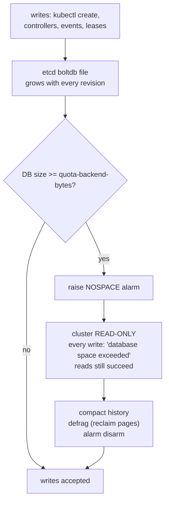
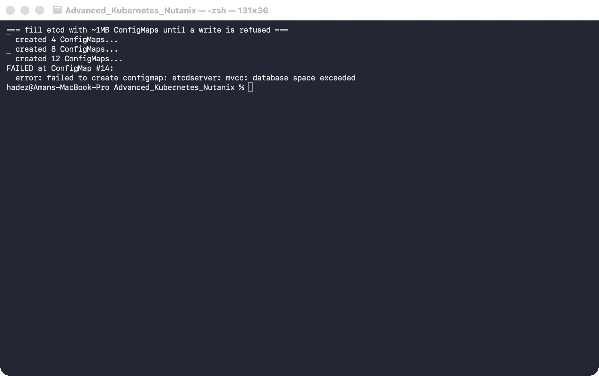
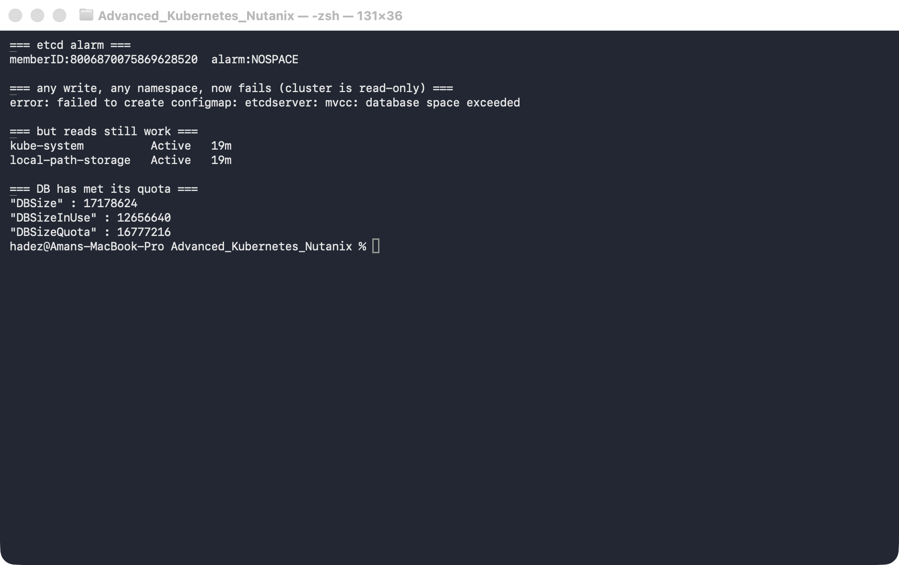
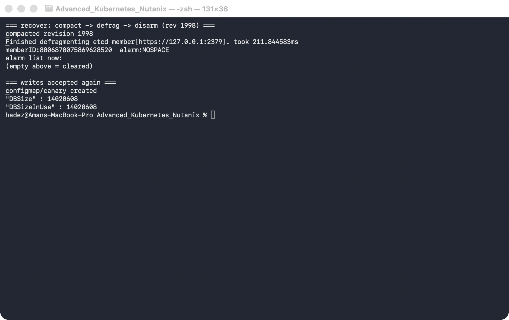
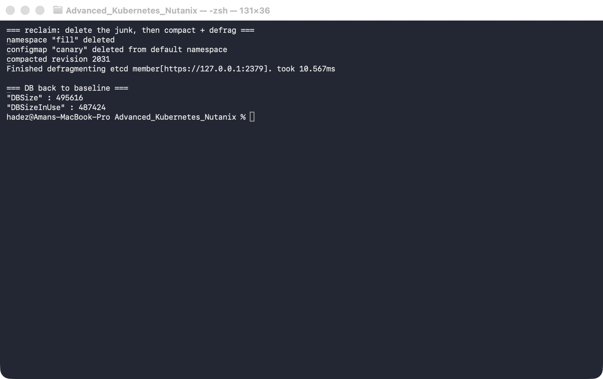

# Lab 3 — Recover a Cluster That's Gone Read-Only (etcd Quota & Recovery)

**Day 1 · How Kubernetes Really Works**

> ✅ **Tested end-to-end** on a real, dedicated `kind` cluster (Kubernetes v1.37.0, etcd v3.7.0) that we deliberately drove into a read-only state and then recovered. Every screenshot is a real capture. The moment you'll reproduce: after filling etcd past its quota, `kubectl create` fails **cluster-wide** with `database space exceeded` — and a three-command runbook brings it back.

## What you'll learn

- What etcd's `--quota-backend-bytes` does, and what happens the instant the database crosses it: a **NOSPACE alarm** and a **cluster-wide read-only** state.
- How to see the failure from both sides — the etcd alarm *and* the `database space exceeded` error every user hits.
- Why **reads keep working while all writes fail** — the single most confusing etcd incident in production.
- The real recovery runbook — **compact → defrag → disarm** — and why you need all three, in that order.
- Why deleting the offending data alone doesn't give the space back until you compact and defrag.

## What you'll do

You'll build a throwaway cluster, shrink etcd's quota so you can fill it quickly, then create ConfigMaps until etcd goes read-only. You'll confirm the whole cluster is stuck (writes fail, reads work), then run the recovery runbook to bring it back and reclaim the space.

## Time & cost

- **Time:** ~40 minutes.
- **Cost:** **$0** — runs on a local `kind` cluster.

---

## Before you start

- **Where you'll work:** in a **terminal** on your own machine.
- **Tools you need:** `docker`, `kind`, `kubectl`.
- **⚠️ This lab uses its own dedicated, throwaway cluster** — *not* the Day-1 shared one. You're going to deliberately corrupt etcd into a read-only state, and you never practise that on a cluster you care about. You'll create an `etcd-lab` cluster and delete it at the end.

> **Nutanix note — and why this one is `kind`.** etcd, its quota, the NOSPACE alarm, and the compact/defrag/disarm runbook are identical everywhere — etcd is etcd. What differs is *access*: on a managed platform (NKE, GKE, EKS, AKS) you **don't** edit etcd's static-pod manifest yourself — the platform sets the quota, and you'd use its etcd-maintenance tooling or a support case to compact/defrag. We use `kind` precisely because it gives you full control-plane access, so you can *practise* the recovery and recognise it instantly when it happens on NKE.

---

## The idea in 60 seconds

etcd stores every Kubernetes object, and it keeps a **history of revisions**, not just the latest value — so it grows with every write, every controller update, every Event and Lease renewal. To stop a runaway from filling the disk, etcd enforces `--quota-backend-bytes`. When the database file crosses that size, etcd does something drastic on purpose: it raises a **NOSPACE alarm** and **refuses all writes**, cluster-wide. Reads still work. It would rather go read-only than corrupt itself by running out of disk.

Recovery is always the same three steps, and you need all three:

1. **`compact`** — discard old revisions from the history (frees space *logically* inside the file).
2. **`defrag`** — actually shrink the file to return the freed pages (compaction alone doesn't shrink it).
3. **`alarm disarm`** — the alarm does **not** clear itself; you must explicitly disarm it before writes resume.



---

## Step 1 — Build a throwaway cluster and shrink etcd's quota

**Goal:** stand up a dedicated cluster and lower etcd's quota to 16 MiB so you can fill it in minutes instead of hours.

**1. Create the cluster:**

```bash
kind create cluster --name etcd-lab --wait 120s
```

**2. Lower the quota.** etcd runs as a static Pod on the control-plane node; add a flag to its manifest and the kubelet restarts etcd automatically:

```bash
docker exec etcd-lab-control-plane \
  sed -i '/^    - etcd$/a\    - --quota-backend-bytes=16777216' \
  /etc/kubernetes/manifests/etcd.yaml
```

**3. Set up a one-word helper** for the long `etcdctl` command (with all its TLS flags), then check the new quota took effect:

```bash
e() {
  kubectl -n kube-system exec etcd-etcd-lab-control-plane -- etcdctl \
    --endpoints=https://127.0.0.1:2379 \
    --cacert=/etc/kubernetes/pki/etcd/ca.crt \
    --cert=/etc/kubernetes/pki/etcd/server.crt \
    --key=/etc/kubernetes/pki/etcd/server.key "$@"
}

e endpoint status -w fields | grep -E '"DBSize"|"DBSizeInUse"|"DBSizeQuota"'
```

*(We grep the `-w fields` output because the full `-w table` is 17 columns wide and unreadable.)*

**What you should see:** `DBSizeQuota` now reads **16777216** (16 MiB), with `DBSize` only ~0.5–2 MB — so there's ~15 MB of headroom to fill.


**What this means:** you've turned a 2 GiB safety valve into a 16 MiB one, so the rest of the lab runs in minutes. Everything else about etcd's behaviour is unchanged.

---

## Step 2 — Fill etcd until it goes read-only

**Goal:** create ~1 MB ConfigMaps in a loop until etcd refuses a write.

**1. Make a 1 MB blob and create ConfigMaps until one fails:**

```bash
head -c 900000 /dev/zero | tr '\0' 'a' > /tmp/blob.txt
kubectl create namespace fill

for i in $(seq 1 40); do
  out=$(kubectl -n fill create configmap fill-$i --from-file=blob=/tmp/blob.txt 2>&1)
  echo "$out" | grep -qi 'space exceeded' && { echo "FAILED at #$i: $out"; break; }
done
```

**What you should see:** a dozen ConfigMaps get created, then one fails — in our run at **#14**:
```
error: failed to create configmap: etcdserver: mvcc: database space exceeded
```



**What this means:** the database crossed 16 MiB and etcd raised its NOSPACE alarm. (The exact number where it fails varies by a ConfigMap or two, depending on other cluster churn.) From this instant, etcd is read-only.

---

## Step 3 — Confirm the *whole cluster* is read-only

**Goal:** see the failure from both sides — the etcd alarm, and the error any user gets — and confirm reads still work.

**1. Check the alarm, try a write in an unrelated namespace, try a read, and look at the sizes:**

```bash
e alarm list                                          # the etcd side
kubectl create configmap canary --from-literal=a=b    # any write, anywhere
kubectl get ns                                        # reads still work
e endpoint status -w fields | grep -E 'DBSize|Quota'
```

**What you should see:**
- `e alarm list` → `memberID:… alarm:NOSPACE`
- the `canary` write (a different namespace!) fails with the same `database space exceeded`
- `kubectl get ns` returns instantly — reads are fine
- `DBSize` ≈ 17 MB, having met `DBSizeQuota` = 16.8 MB



**What this means:** it's not just your namespace — the entire cluster can't accept writes. New Pods won't create, Deployments won't scale, `kubectl apply` hangs.

> ⚠️ **Gotcha — this looks like an outage, not a disk problem.** Because reads work and only writes fail, people report "I can't create pods" or "apply hangs" with no obvious disk error at the node level. The tell is *any* write returning `database space exceeded` **plus** `etcdctl alarm list` showing `NOSPACE`. Check the alarm first — it points straight at the cause.

---

## Step 4 — Recover: compact → defrag → disarm

**Goal:** run the three-step runbook and watch writes come back.

**1. Get the current revision, then run the runbook:**

```bash
REV=$(e endpoint status -w fields | grep '"Revision"' | head -1 | grep -oE '[0-9]+')
e compact "$REV"
e defrag --command-timeout=30s
e alarm disarm
e alarm list                                          # should now be empty
kubectl create configmap canary --from-literal=a=b    # writes work again
```

**What you should see:**
- `compacted revision <N>` (e.g. `1998`)
- `Finished defragmenting etcd member[…]. took ~211ms` — and `DBSize` drops from ~17 MB toward ~14 MB
- `alarm disarm` prints the alarm it cleared; `alarm list` is now empty
- `kubectl create configmap canary` → **`configmap/canary created`**



**What this means:** the cluster is writable again. Compaction dropped the old revision history, defrag returned the freed pages to the filesystem (shrinking the file below the quota), and disarm cleared the latch.

> ⚠️ **Gotcha — disarm is not optional, and order matters.** If you `defrag` but forget `alarm disarm`, the DB is small again yet writes *still* fail — the alarm latches until you clear it. And if you `disarm` before you've actually freed space (compact + defrag), the very next write pushes you back over quota and re-arms it within seconds. **Compact, then defrag, then disarm** — every time.

---

## Step 5 — Reclaim the space the junk is still holding

**Goal:** the alarm is clear, but your 12+ fill ConfigMaps are still live keys eating ~11 MB. Delete them, then compact + defrag again to actually return the space.

**1. Delete the junk and reclaim:**

```bash
kubectl delete namespace fill
kubectl delete configmap canary
REV=$(e endpoint status -w fields | grep '"Revision"' | head -1 | grep -oE '[0-9]+')
e compact "$REV"
e defrag --command-timeout=30s
e endpoint status -w fields | grep -E '"DBSize"|DBSizeInUse'
```

**What you should see:** `DBSize` falls to **~0.5 MB** — back below where you started.



**What this means:** this is the follow-up most runbooks skip — *disarming gets you writing again, but deleting + compacting + defragging is what actually gives the disk space back.* Compaction only drops superseded revisions; a live ConfigMap keeps its space until you delete it and defrag.

---

## Step 6 — Clean up

This was a throwaway cluster — delete it:

```bash
kind delete cluster --name etcd-lab
```

*(If you wanted to keep it instead, you'd remove the `--quota-backend-bytes` line from the manifest to restore the default 2 GiB quota, and the kubelet would restart etcd.)*

---

## What you learned

| You saw… | in Step | proof |
|---|---|---|
| `--quota-backend-bytes` caps the etcd DB size | 1 | `DBSizeQuota=16777216` after the manifest edit |
| Crossing the quota raises NOSPACE and blocks writes | 2 | fill loop fails with `database space exceeded` |
| The read-only state is cluster-wide; reads still work | 3 | `canary` write fails, `alarm:NOSPACE`, `get ns` succeeds |
| compact → defrag → disarm restores writes | 4 | `configmap/canary created` after the runbook |
| Disarm latches; order matters | 4 gotcha |
| Reclaiming space needs delete + compact + defrag | 5 | `DBSize` back to ~0.5 MB |

## Evidence

Real screenshots for this lab are in [`artifacts/lab-03/screenshots/`](artifacts/lab-03/screenshots/) (5 images), and a full command transcript is in [`artifacts/lab-03/evidence/lab-03-etcd-quota-recovery.txt`](artifacts/lab-03/evidence/lab-03-etcd-quota-recovery.txt).

---

**Next:** [Lab 4 — Pending-Pod Diagnostics](lab-04-pending-pod-diagnostics.md)
