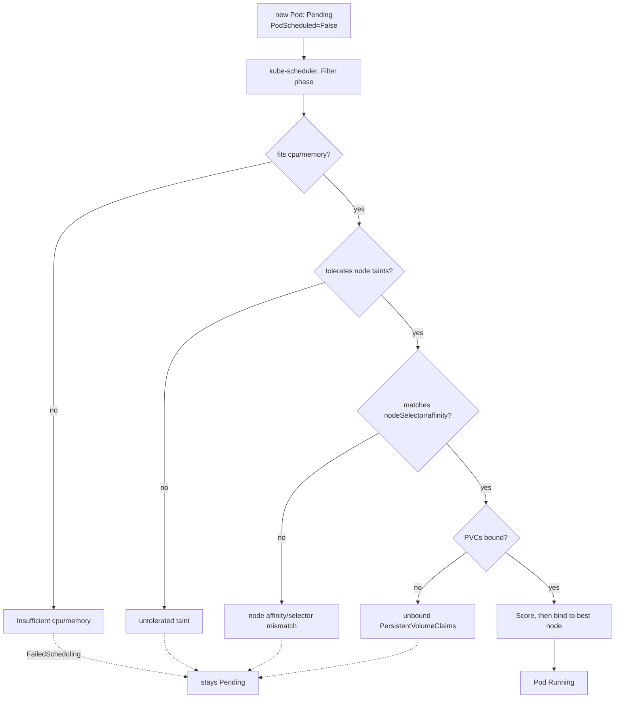
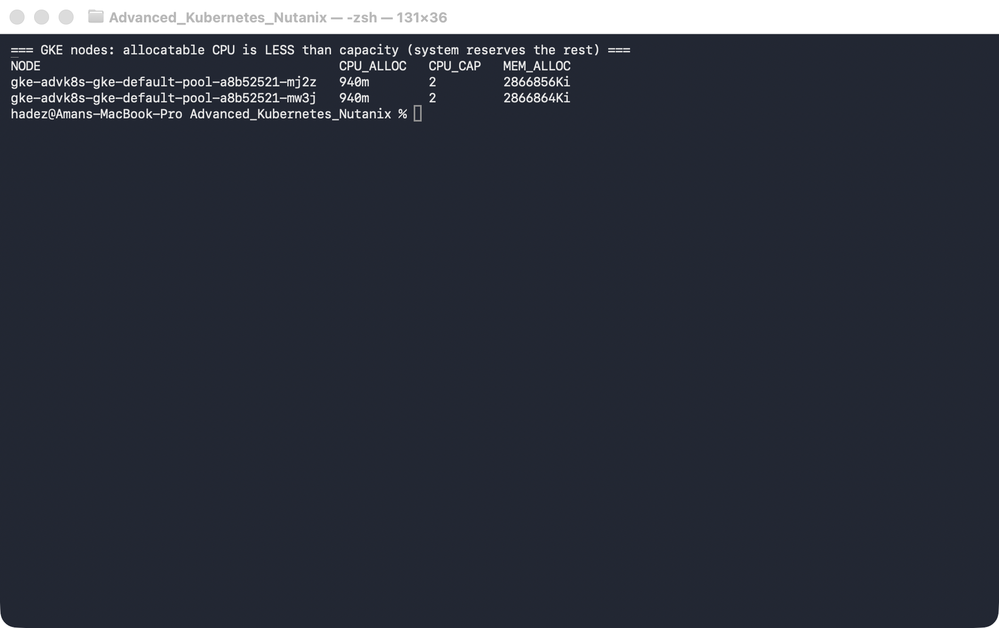
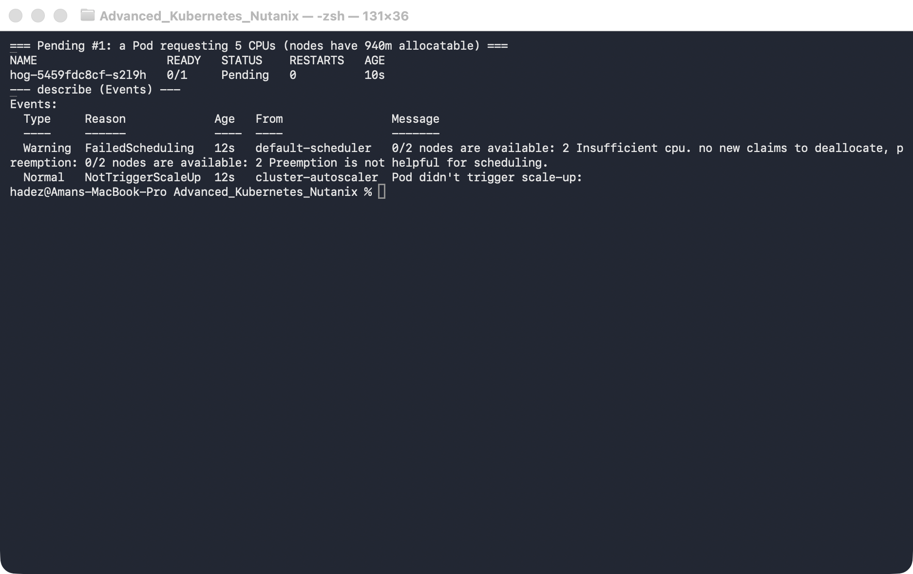
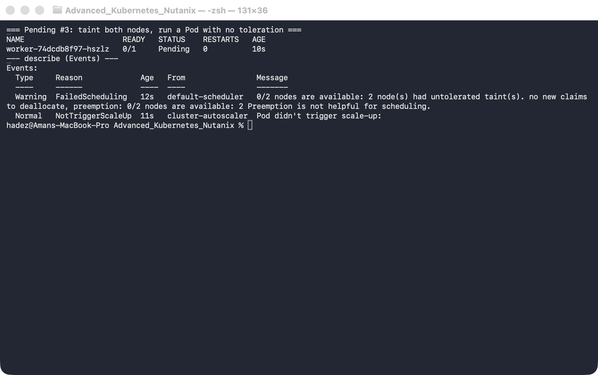
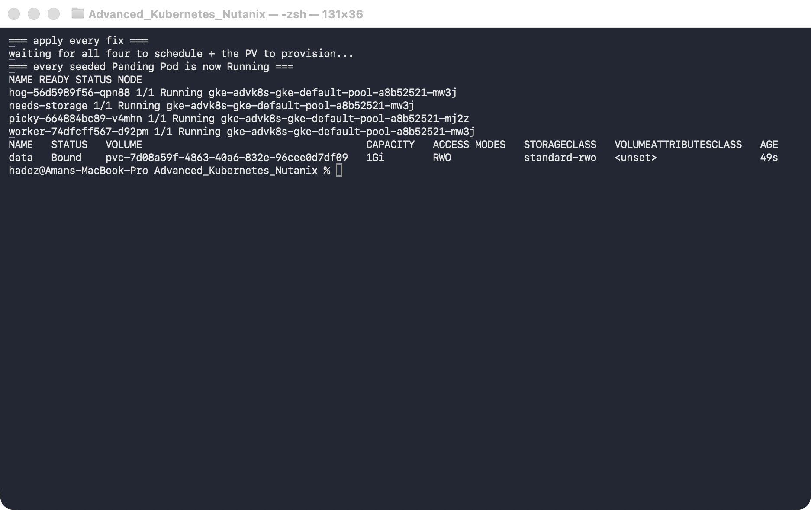

# Lab 4 — Pending-Pod Diagnostics

**Day 1 · How Kubernetes Really Works**

> Every command below was actually run on a **real GKE cluster** (`dcproject-462806`, zone `us-central1-a`, 2× `e2-medium`, Kubernetes v1.35.7-gke). Each of the four "why won't my Pod schedule?" scenarios was seeded for real, diagnosed from the actual `FailedScheduling` events, and then fixed until the Pod reached `Running`.

## What you'll learn

- The four reasons a Pod sits in `Pending` that account for the vast majority of real incidents — insufficient resources, untolerated taints, node-affinity/selector mismatches, and unbound PVCs — and the exact `FailedScheduling` message each one produces.
- How to read a scheduling failure the fast way: `kubectl describe pod`, the `PodScheduled=False` condition, and `kubectl get events --field-selector reason=FailedScheduling`.
- Why the scheduler's message tells you *precisely* which filter rejected the Pod and on how many nodes — and how to turn that into a one-line fix.
- The cloud-specific twist: on GKE an "insufficient resources" Pod can be resolved by the **cluster autoscaler** adding a node, not just by editing the Pod.



## Time & cost

- **Time:** ~45 minutes.
- **Cost:** ~$0.30–0.60 of GKE if you create the cluster just for this lab and delete it after. A 2-node `e2-medium` zonal cluster is roughly $0.20/hr of compute plus the GKE management fee.

## Prerequisites

Complete the [Setup Environment Guide](00-setup-environment-guide.md). This lab needs `gcloud`, `kubectl`, and the `gke-gcloud-auth-plugin`. You need a GCP project with billing enabled and the Kubernetes Engine API on.

> **Nutanix note.** Every failure mode here — `Insufficient cpu`, `untolerated taint`, node-affinity mismatch, unbound PVC — is core `kube-scheduler` behaviour and is byte-for-byte identical on NKE, `kind`, and every other conformant cluster; the diagnosis commands don't change at all. The only platform-specific part is the *resolution* for the resource case: GKE's cluster autoscaler adds a node, whereas on NKE you'd scale the node pool through Prism/NKE (or its autoscaler). We run this on GKE specifically to show that cloud twist; the scheduler mechanics transfer directly to Nutanix.

---

## 4.1 Why Pods go Pending

A `Pending` Pod is one the scheduler has looked at and could not place. The scheduler runs two phases: **Filter** (which nodes are even feasible?) and **Score** (of the feasible nodes, which is best?). A Pod goes `Pending` when the Filter phase eliminates *every* node — and crucially, the scheduler records *why* each node was filtered out, as a `FailedScheduling` event and the `PodScheduled: False` status condition.

The four filters that reject the overwhelming majority of real Pods:

1. **Fit** — the Pod's `resources.requests` (cpu/memory) must fit in a node's *allocatable* capacity (which is less than its total capacity — the kubelet and system reserve a slice).
2. **Taints** — a node can carry a taint that repels Pods unless they carry a matching toleration.
3. **Node affinity / `nodeSelector`** — the Pod can demand labels a node must have.
4. **Volume binding** — if the Pod mounts a PVC that can't be bound (no matching PV / bad StorageClass), it can't schedule.

The rest of this lab seeds one of each, reads the real message, and fixes it.

---

## 4.2 Create the cluster and see what "allocatable" really is

```bash
gcloud container clusters create advk8s-gke \
  --zone us-central1-a --num-nodes 2 --machine-type e2-medium \
  --disk-size 30 --release-channel regular

gcloud container clusters get-credentials advk8s-gke --zone us-central1-a
kubectl get nodes -o custom-columns='NODE:.metadata.name,CPU_ALLOC:.status.allocatable.cpu,MEM_ALLOC:.status.allocatable.memory'
```



**Verified result:** two `Ready` nodes, each reporting **`940m` allocatable CPU** against a **capacity of `2`** — GKE reserves over half the vCPU for the system and kubelet. Allocatable, not capacity, is what the scheduler fits Pods into, and that gap is exactly what makes the next scenario easy to trigger.

---

## 4.3 Pending #1 — insufficient resources

Create a Deployment whose Pod requests more CPU than any node can offer. Bake the request into the manifest so there's exactly one clean `Pending` Pod (using `create` then `set resources` would leave the first, un-constrained Pod `Running` alongside the new `Pending` one):

```bash
kubectl apply -f - <<'EOF'
apiVersion: apps/v1
kind: Deployment
metadata: {name: hog, labels: {app: hog}}
spec:
  replicas: 1
  selector: {matchLabels: {app: hog}}
  template:
    metadata: {labels: {app: hog}}
    spec:
      containers:
        - name: nginx
          image: nginx:1.27
          resources: {requests: {cpu: "5"}}
EOF

kubectl get pods -l app=hog
kubectl describe pod -l app=hog | sed -n '/Events:/,$p'
```



**Verified result:** the Pod is `Pending`, and `describe` shows `FailedScheduling` → `0/2 nodes are available: 2 Insufficient cpu.` The scheduler checked both nodes, and neither had 5 cores of *allocatable* CPU free (each has only `940m`). Note the second event, from `cluster-autoscaler`: `NotTriggerScaleUp — Pod didn't trigger scale-up`. The autoscaler *saw* this Pod but this cluster has no autoscaling enabled, so it stays Pending — that event is the hook for the cloud twist below.

**Fix it two ways.** The portable fix is to ask for a realistic amount:

```bash
kubectl set resources deployment hog --requests=cpu=100m
kubectl get pods -l app=hog -w   # transitions Pending -> Running
```

> **Cloud twist (GKE):** the *other* fix is to add capacity. Had we created the cluster with `--enable-autoscaling --min-nodes=2 --max-nodes=4`, that 5-core Pod would have triggered the **cluster autoscaler** to provision a third node and the Pod would schedule onto it a couple of minutes later — no Pod edit required. On NKE you'd get the same outcome by scaling the node pool. On plain `kind` there's no autoscaler, so the Pod would stay Pending forever. Same scheduler decision, three different resolutions depending on platform.

---

## 4.4 Pending #2 — node-affinity / selector mismatch

Demand a node label that doesn't exist (again baked into the manifest):

```bash
kubectl apply -f - <<'EOF'
apiVersion: apps/v1
kind: Deployment
metadata: {name: picky, labels: {app: picky}}
spec:
  replicas: 1
  selector: {matchLabels: {app: picky}}
  template:
    metadata: {labels: {app: picky}}
    spec:
      nodeSelector: {disktype: ssd}
      containers: [{name: nginx, image: nginx:1.27}]
EOF

kubectl describe pod -l app=picky | sed -n '/Events:/,$p'
```


**Verified result:** `FailedScheduling` → `0/2 nodes are available: 2 node(s) didn't match Pod's node affinity/selector.` No node carries `disktype=ssd`, so both are filtered out.

**Fix it** by labelling a node so the selector matches:

```bash
NODE=$(kubectl get nodes -o jsonpath='{.items[0].metadata.name}')
kubectl label node "$NODE" disktype=ssd
kubectl get pods -l app=picky -w   # schedules onto the labelled node
```

---

## 4.5 Pending #3 — an untolerated taint

Taint both nodes, then run a Pod with no matching toleration:

```bash
kubectl taint nodes --all dedicated=analytics:NoSchedule
kubectl create deployment worker --image=nginx:1.27
kubectl describe pod -l app=worker | sed -n '/Events:/,$p'
```



**Verified result:** `FailedScheduling` → `0/2 nodes are available: 2 node(s) had untolerated taint(s).` The nodes exist and have capacity; the `dedicated=analytics:NoSchedule` taint is actively repelling the Pod.

**Fix it** by giving the Pod the matching toleration:

```bash
kubectl patch deployment worker --type=merge -p '{"spec":{"template":{"spec":{"tolerations":[{"key":"dedicated","operator":"Equal","value":"analytics","effect":"NoSchedule"}]}}}}'
kubectl get pods -l app=worker -w   # now tolerates the taint and schedules

# remove the taint again so it doesn't affect later steps:
kubectl taint nodes --all dedicated=analytics:NoSchedule-
```

---

## 4.6 Pending #4 — an unbound PVC

Point a Pod at a PVC whose StorageClass doesn't exist:

```bash
kubectl apply -f - <<'EOF'
apiVersion: v1
kind: PersistentVolumeClaim
metadata:
  name: data
spec:
  accessModes: ["ReadWriteOnce"]
  storageClassName: does-not-exist
  resources:
    requests:
      storage: 1Gi
---
apiVersion: v1
kind: Pod
metadata:
  name: needs-storage
spec:
  containers:
    - name: app
      image: nginx:1.27
      volumeMounts:
        - name: d
          mountPath: /data
  volumes:
    - name: d
      persistentVolumeClaim:
        claimName: data
EOF

kubectl get pvc data
kubectl describe pod needs-storage | sed -n '/Events:/,$p'
```


**Verified result:** the PVC `data` stays `Pending` (nothing provisions the `does-not-exist` class), and the Pod reports `FailedScheduling` → `0/2 nodes are available: pod has unbound immediate PersistentVolumeClaims.` The scheduler won't place a Pod whose volume can't be bound.

**Fix it** by pointing the PVC at a real StorageClass. GKE ships `standard-rwo`:

```bash
kubectl get storageclass
kubectl delete pod needs-storage; kubectl delete pvc data
kubectl apply -f - <<'EOF'
apiVersion: v1
kind: PersistentVolumeClaim
metadata:
  name: data
spec:
  accessModes: ["ReadWriteOnce"]
  storageClassName: standard-rwo
  resources:
    requests:
      storage: 1Gi
---
apiVersion: v1
kind: Pod
metadata:
  name: needs-storage
spec:
  containers:
    - name: app
      image: nginx:1.27
      volumeMounts:
        - name: d
          mountPath: /data
  volumes:
    - name: d
      persistentVolumeClaim:
        claimName: data
EOF
kubectl get pvc data -w    # Bound; Pod schedules and runs
```

---

## 4.7 Everything Running, then clean up

```bash
kubectl get pods -o wide
```



**Verified result:** `hog`, `picky`, `worker`, and `needs-storage` are all `Running` — every seeded `Pending` diagnosed and fixed.

Delete the cluster (this is the only real-cost item in the lab):

```bash
gcloud container clusters delete advk8s-gke --zone us-central1-a --quiet
gcloud container clusters list   # verify it's gone
```

---

## Lab summary

| Claim | Where it's proven |
|---|---|
| Allocatable is less than machine capacity | 4.2 — node allocatable vs 2 vCPU |
| Over-request → `Insufficient cpu` on all nodes | 4.3 — `0/2 nodes are available: 2 Insufficient cpu` |
| Selector with no matching node → affinity failure | 4.4 — `didn't match Pod's node affinity/selector` |
| Untolerated taint repels an otherwise-fine Pod | 4.5 — `2 node(s) had untolerated taint(s)` |
| Unbound PVC blocks scheduling | 4.6 — `unbound immediate PersistentVolumeClaims` |
| Each fix moves the Pod Pending → Running | 4.3–4.6 watches + 4.7 all Running |
| Cloud autoscaler is an alternate fix for the resource case | 4.3 cloud twist |

## Evidence

Real screenshots for this lab live in [`screenshots/lab-04/`](screenshots/lab-04/) (6 images). Captured terminal output is in [`evidence/lab-04-pending-pod-diagnostics.txt`](evidence/lab-04-pending-pod-diagnostics.txt).

---

**Next:** [Lab A — Cluster Architecture Choices: Autopilot vs. Standard](lab-A-cluster-architecture.md)
