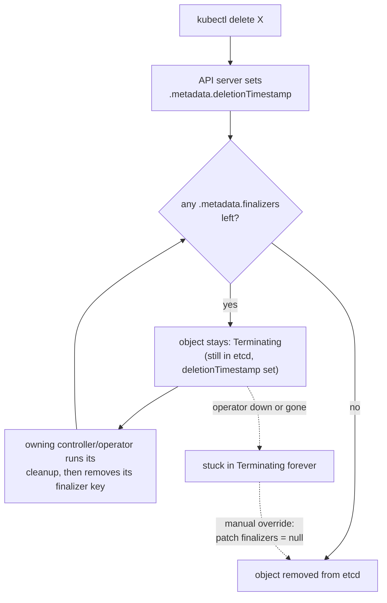
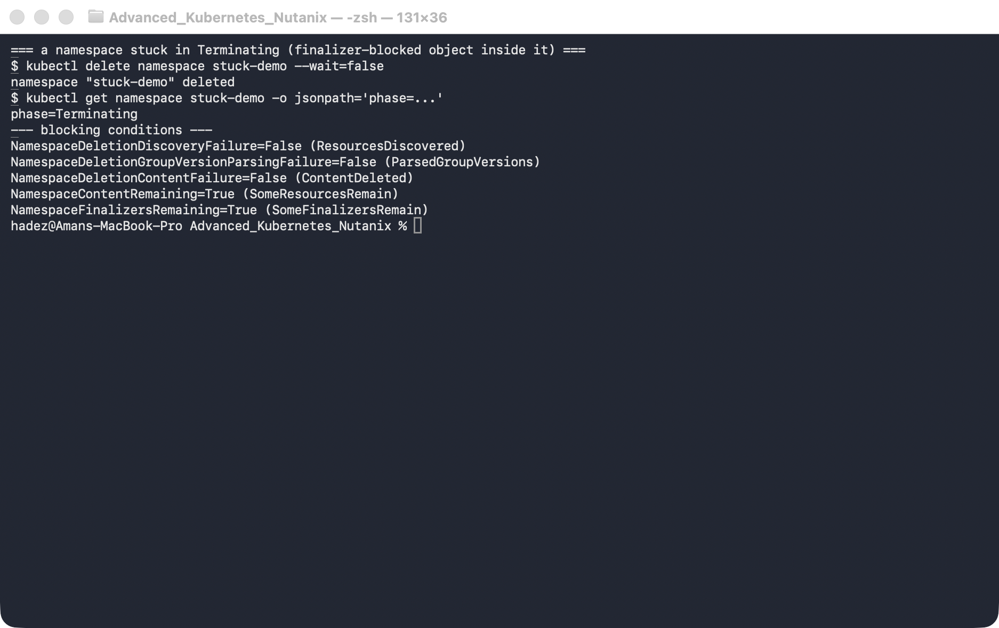
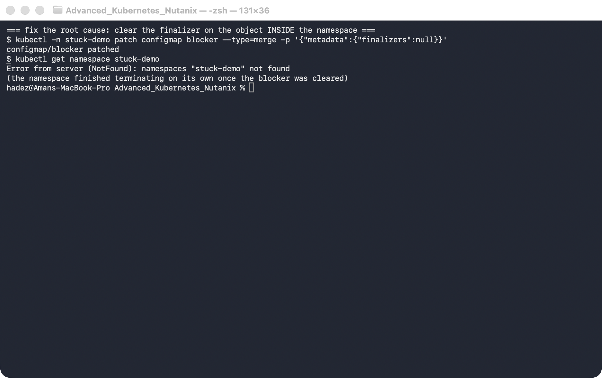

# Lab 5 — Operators, Finalizers & Stuck Deletions

**Day 2 · Extending and Operating the Platform Under Pressure**

> Every command below was actually run on a **real GKE cluster** (`dcproject-462806`, the shared Day-2 cluster). Each scenario — a ConfigMap, a custom resource, and a whole namespace — was deliberately wedged into `Terminating` and then recovered. The standout: `kubectl delete` cheerfully prints `… deleted`, yet the object is *still there* with a `deletionTimestamp` set, because a finalizer is holding it open. Deletion in Kubernetes is a two-phase handshake, not an instant remove.

## What you'll learn

- What a **finalizer** actually is — a key in `.metadata.finalizers` that turns deletion into a two-phase operation — and why `kubectl delete` returning successfully does **not** mean the object is gone.
- How the deletion lifecycle really works: `deletionTimestamp` is set, the object goes `Terminating`, and it is only removed from etcd once *every* finalizer key has been cleared.
- Why **operators** add finalizers (to guarantee external cleanup runs before the resource vanishes), and what happens to their resources when the operator is down: they wedge in `Terminating` forever.
- How to diagnose a stuck object (`deletionTimestamp` + remaining `finalizers`) and a stuck **namespace** (its `status.conditions`), and the manual override to force deletion — plus why that override is dangerous.



## Time & cost

- **Time:** ~35 minutes.
- **Cost:** shares the Day-2 GKE cluster; negligible marginal cost. Everything here is control-plane-only (no extra nodes or storage).

## Prerequisites

Complete the [Setup Environment Guide](00-setup-environment-guide.md). You need `gcloud` and `kubectl`, and a running cluster context. This lab creates a shared Day-2 GKE cluster (reused by Labs 6 and C):

```bash
gcloud container clusters create advk8s-day2 \
  --zone us-central1-a --num-nodes 2 --machine-type e2-medium \
  --disk-size 30 --release-channel regular
gcloud container clusters get-credentials advk8s-day2 --zone us-central1-a
```

> **Nutanix note.** Finalizers, `deletionTimestamp`, the `Terminating` state, and the namespace `status.conditions` are pure Kubernetes API-machinery — identical on NKE, GKE, and `kind`. Nothing in this lab is cloud-specific; we run it on GKE only because Day 2 is cloud-first. It behaves exactly the same on a Nutanix NKE cluster.

---

## 5.1 What a finalizer does

Deleting a Kubernetes object is not "remove the row from etcd." It's a **two-phase** operation:

1. You call delete. The API server sets `.metadata.deletionTimestamp` and the object enters `Terminating`. It is **not** removed yet.
2. Controllers that registered a **finalizer** (a string in `.metadata.finalizers`) get to run their cleanup. When each is done, it removes *its own* finalizer key.
3. Only when `.metadata.finalizers` is empty does the API server actually delete the object.

This is how operators guarantee cleanup: an operator managing, say, a cloud load balancer adds a finalizer to its custom resource so that deleting the CR first deprovisions the real load balancer, *then* lets the CR disappear. The failure mode is the mirror image: if the finalizer is there but nothing ever removes it — the operator crashed, was uninstalled, or never existed — the object is stuck in `Terminating` indefinitely. That is the single most common "why won't this delete?" incident in Kubernetes, and this lab reproduces it three ways.

---

## 5.2 Warm-up — a custom finalizer on a ConfigMap

Any object can carry a finalizer. Put one on a ConfigMap and watch delete lie to you:

```bash
kubectl create configmap protected --from-literal=k=v
kubectl patch configmap protected --type=merge \
  -p '{"metadata":{"finalizers":["demo.example.com/protect"]}}'

kubectl delete configmap protected --wait=false     # returns "deleted" ...
kubectl get configmap protected \
  -o jsonpath='name={.metadata.name}  deletionTimestamp={.metadata.deletionTimestamp}  finalizers={.metadata.finalizers}{"\n"}'
```


**Verified result:** `kubectl delete` prints `configmap "protected" deleted`, but the follow-up `get` still returns it — with `deletionTimestamp` set and `finalizers=["demo.example.com/protect"]`. It's in `Terminating`, waiting for a finalizer nobody will ever remove. Clear it by hand and it vanishes immediately:

```bash
kubectl patch configmap protected --type=merge -p '{"metadata":{"finalizers":null}}'
kubectl get configmap protected      # Error ... NotFound
```

---

## 5.3 The operator pattern — a CRD with a finalizer

This is the real shape of the problem. Define a custom resource (as an operator would), create one *with* a finalizer, then delete it while no operator is running to process that finalizer.

```bash
kubectl apply -f - <<'EOF'
apiVersion: apiextensions.k8s.io/v1
kind: CustomResourceDefinition
metadata:
  name: widgets.example.com
spec:
  group: example.com
  scope: Namespaced
  names: {plural: widgets, singular: widget, kind: Widget}
  versions:
    - name: v1
      served: true
      storage: true
      schema:
        openAPIV3Schema:
          type: object
          properties:
            spec:
              type: object
              properties: {size: {type: string}}
EOF
kubectl wait --for=condition=Established crd/widgets.example.com --timeout=30s

kubectl apply -f - <<'EOF'
apiVersion: example.com/v1
kind: Widget
metadata:
  name: gadget
  finalizers: ["widgets.example.com/cleanup"]
spec: {size: large}
EOF

kubectl delete widget gadget --wait=false
kubectl get widget gadget \
  -o jsonpath='name={.metadata.name}  deletionTimestamp={.metadata.deletionTimestamp}  finalizers={.metadata.finalizers}{"\n"}'
```


**Verified result:** the `Widget` is stuck exactly like the ConfigMap — `deletionTimestamp` set, `finalizers=["widgets.example.com/cleanup"]`, still in etcd. In production this is a resource whose operator is guaranteeing some external cleanup; with the operator down, deletion can never complete.

The manual override — the same finalizer patch — forces it out:

```bash
kubectl patch widget gadget --type=merge -p '{"metadata":{"finalizers":null}}'
kubectl get widget gadget      # NotFound
```


> **Tested gotcha — force-removing a finalizer skips the cleanup it was protecting.** Patching `finalizers: null` makes the object disappear, but it *bypasses whatever the operator was going to do* — deprovisioning a cloud disk, deregistering a load balancer, deleting an external DNS record. You've removed the Kubernetes object and potentially **orphaned the real resource it represented**, which will keep costing money and won't be tracked by anything. The correct fix is almost always to get the operator healthy again so it removes its own finalizer after real cleanup; the manual patch is a last resort for when the operator is gone for good and you've confirmed the external cleanup by hand.

---

## 5.4 The classic incident — a namespace stuck in `Terminating`

Deleting a namespace deletes everything in it — so a single finalizer-blocked object inside a namespace wedges the *whole namespace* in `Terminating`. This is the infamous one.

```bash
kubectl create namespace stuck-demo
kubectl -n stuck-demo create configmap blocker --from-literal=k=v
kubectl -n stuck-demo patch configmap blocker --type=merge \
  -p '{"metadata":{"finalizers":["demo.example.com/hold"]}}'

kubectl delete namespace stuck-demo --wait=false
kubectl get namespace stuck-demo -o jsonpath='phase={.status.phase}{"\n"}'
kubectl get namespace stuck-demo -o jsonpath='{range .status.conditions[*]}{.type}={.status} ({.reason}){"\n"}{end}'
```



**Verified result:** the namespace reports `phase=Terminating` and its `status.conditions` name the blockage — `NamespaceContentRemaining` and `NamespaceFinalizersRemaining` — pointing straight at the object still holding a finalizer. This is the right place to look first: the namespace conditions tell you *what* it's waiting on, so you don't have to guess.

**Fix the root cause** — clear the finalizer on the object *inside* the namespace, and the namespace finishes deleting itself:

```bash
kubectl -n stuck-demo patch configmap blocker --type=merge -p '{"metadata":{"finalizers":null}}'
kubectl get namespace stuck-demo      # NotFound — terminated cleanly
```



**Verified result:** within about half a minute (the namespace controller re-checks its cleanup on an interval) the namespace is gone — `NotFound`. Note we fixed the *cause* (the blocked object), not the symptom — editing the namespace's own `spec.finalizers` (the other common "fix" you'll see online) is the sledgehammer that can strand the very content the namespace was still trying to clean up.

---

## 5.5 Clean up

```bash
kubectl delete crd widgets.example.com --ignore-not-found
```

Leave the `advk8s-day2` cluster running for Labs 6 and C.

---

## Lab summary

| Claim | Where it's proven |
|---|---|
| `kubectl delete` returning "deleted" ≠ object gone | 5.2 — ConfigMap present with `deletionTimestamp` after "deleted" |
| A finalizer holds an object in `Terminating` until removed | 5.2 / 5.3 — object persists with `finalizers` set |
| Operator resources wedge when the operator can't clear its finalizer | 5.3 — `Widget` stuck on `widgets.example.com/cleanup` |
| Force-removing a finalizer skips protected cleanup | 5.3 gotcha |
| A finalizer-blocked object wedges its whole namespace | 5.4 — `stuck-demo` in `Terminating` |
| Namespace `status.conditions` name the blockage | 5.4 — `NamespaceContentRemaining` / `NamespaceFinalizersRemaining` |

## Evidence

Real screenshots for this lab live in [`screenshots/lab-05/`](screenshots/lab-05/) (5 images). Captured terminal output is in [`evidence/lab-05-operators-finalizers.txt`](evidence/lab-05-operators-finalizers.txt).

---

**Next:** [Lab 6 — Cluster Scale Knee-Point](lab-06-cluster-scale-knee-point.md)
