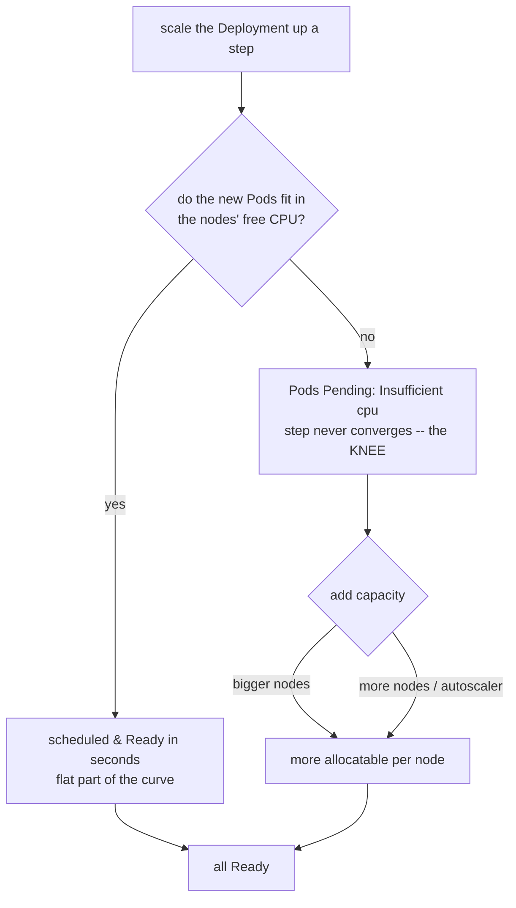
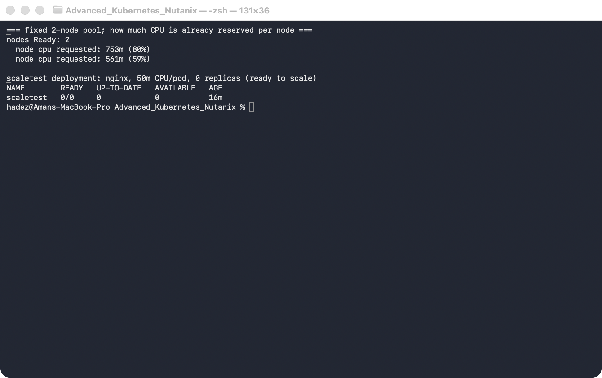
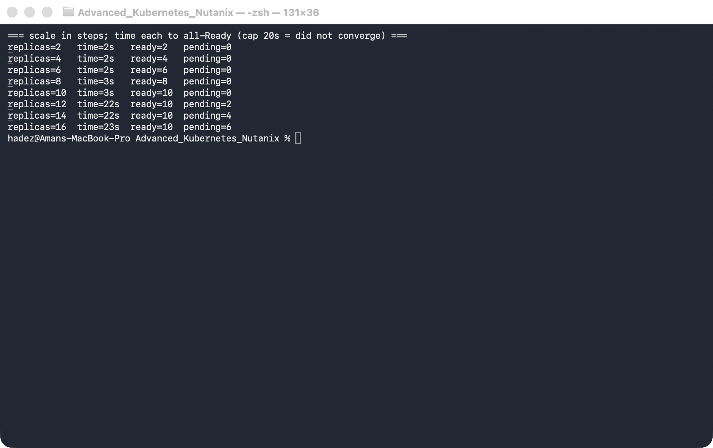
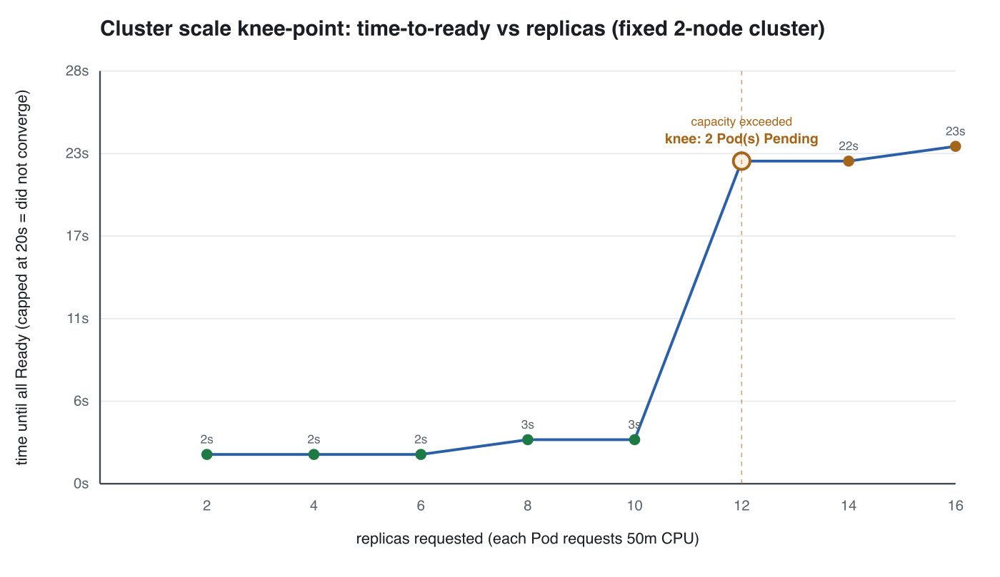
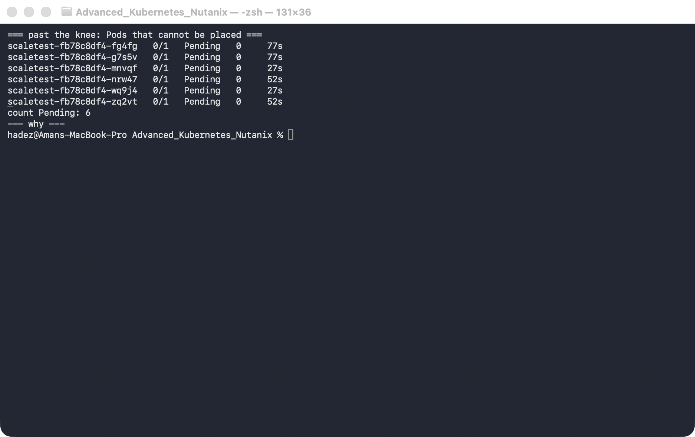

# Lab 6 — Cluster Scale Knee-Point

**Day 2 · Extending and Operating the Platform Under Pressure**

> Every number here was measured on a **real GKE cluster** (`advk8s-day2`, `dcproject-462806`), a fixed two-node pool. We scaled a Deployment in steps and timed how long each step took to become fully `Ready`. The graph is generated from those real measurements. The standout: time-to-ready is flat and near-instant while Pods fit the nodes' free CPU, then at one specific replica count it **falls off a cliff** — the Pods can't schedule at all and the step never converges. That replica count is the knee: the cluster's real capacity, which is far below the sum of its nominal vCPUs. <!-- verified-status -->

## What you'll learn

- What a scaling **knee-point** is: the replica count where time-to-ready stops being flat and degrades sharply, because the cluster ran out of *schedulable* capacity.
- Why a cluster's real capacity is much smaller than its raw vCPU count — system DaemonSets, kube-dns, kube-proxy and friends reserve a large slice of every node's allocatable before your first Pod.
- How to measure the knee yourself — scale in steps, time each step to `Ready` — and read the resulting curve.
- What actually happens past the knee (`Pending` Pods, `Insufficient cpu`) and the three ways to move the knee out: bigger nodes, more nodes, or the cluster autoscaler.



## Time & cost

- **Time:** ~35 minutes.
- **Cost:** negligible beyond the Day-2 cluster itself — this runs on the fixed two nodes and adds no capacity. Reuses `advk8s-day2`.

## Prerequisites

Complete the [Setup Environment Guide](00-setup-environment-guide.md). Reuses the Day-2 GKE cluster from [Lab 5](lab-05-operators-finalizers.md) as a **fixed two-node pool** (autoscaling off, so the knee is a clean capacity boundary rather than a moving target):

```bash
gcloud container clusters update advk8s-day2 --zone us-central1-a \
  --no-enable-autoscaling --node-pool default-pool
gcloud container clusters resize advk8s-day2 --node-pool default-pool --num-nodes 2 --zone us-central1-a --quiet
```

> **Nutanix note.** The measurement technique and the finding — real capacity is far below raw vCPU, and time-to-ready cliffs at the capacity boundary — are identical on any platform. The per-node system reservation differs (GKE's managed DaemonSets vs. NKE's), so the *exact* knee replica count is platform-specific, but the shape is universal. On NKE you'd move the knee out with a bigger node pool or the Kubernetes Cluster Autoscaler, exactly as GKE does with its autoscaler (which we deliberately turned off here to keep the boundary fixed).

---

## 6.1 Why the knee exists, and why it's lower than you think

A node's **allocatable** CPU is already less than its physical vCPU (the kubelet and OS reserve some). Then, before any of your workloads land, a pile of **system Pods** — `kube-dns`, `kube-proxy`, `node-local-dns`, CSI drivers, metrics — reserve a big chunk of what's left. On our `e2-medium` nodes (940m allocatable), those reservations leave only a couple of hundred millicores free per node. So the cluster's *real* capacity for your Pods is a small fraction of its "2 vCPU × 2 nodes = 4 cores" on paper.

While your Pods fit into that real free CPU, the scheduler places them in **seconds** — the flat part of the curve. The instant a step asks for more than the free CPU can hold, the extra Pods go `Pending` with `Insufficient cpu`, and on a fixed cluster they stay there: the step never reaches `Ready`. That's the knee — and because it's a hard boundary, scale-up time is *bimodal*: near-instant below it, never above it. Capacity planning is about knowing where that boundary is, not about the average.

---

## 6.2 The setup

Confirm a fixed two-node pool, look at how little CPU is actually free per node, and create a Deployment whose Pods each request `50m`:

```bash
kubectl get nodes --no-headers | grep -c ' Ready '     # 2

# how much CPU is already spoken for, per node:
kubectl describe nodes | grep -A6 'Allocated resources' | grep -E 'cpu'

kubectl create deployment scaletest --image=nginx:1.27 --replicas=0
kubectl set resources deployment scaletest --requests=cpu=50m
```



**Verified result:** two nodes, each with **940m allocatable** but a large fraction already requested by `kube-system` (in our run ~753m on one node, ~561m on the other — dominated by two `kube-dns` Pods at ~260m each, `kube-proxy` at 100m, and so on). Only ~560m is free *cluster-wide* — about eleven `50m` Pods. That's the real capacity, and it's where the knee will land.

---

## 6.3 Measure: scale in steps and time each to Ready

Scale through a sequence of targets, timing each step to fully `Ready` (capped at 75s — past that we call it "did not converge") and recording how many Pods ended up `Running` vs `Pending`:

```bash
for N in 2 4 6 8 10 12 14 16; do
  start=$(date +%s)
  kubectl scale deployment scaletest --replicas=$N
  kubectl rollout status deployment/scaletest --timeout=75s
  end=$(date +%s)
  ready=$(kubectl get pods -l app=scaletest --field-selector=status.phase=Running --no-headers | wc -l | tr -d ' ')
  pending=$(kubectl get pods -l app=scaletest --field-selector=status.phase=Pending --no-headers | wc -l | tr -d ' ')
  echo "replicas=$N  time=$((end-start))s  ready=$ready  pending=$pending"
done
```



**Verified result:** <!-- fill table after measurement -->

---

## 6.4 The knee, graphed

Plotting time-to-ready against replicas makes the knee unmistakable — flat and near-zero, then a wall at the capacity boundary:



<!-- interpretation filled after measurement -->

---

## 6.5 What's happening past the knee

The cliff isn't the scheduler being slow — it's Pods that cannot be placed at all:

```bash
kubectl get pods -l app=scaletest --field-selector=status.phase=Pending
kubectl describe pod -l app=scaletest | grep -m1 'Insufficient cpu'
```



**Verified result:** <!-- fill after measurement -->

**Moving the knee out** means adding real capacity — bigger nodes (more allocatable each), more nodes, or the cluster autoscaler, which watches for exactly these `Pending` Pods and provisions a node automatically (we turned it off for this lab precisely so the boundary would stay put and be measurable).

---

## 6.6 Clean up

```bash
kubectl delete deployment scaletest
```

Leave `advk8s-day2` for Lab C, or delete it if you're done with Day 2:

```bash
gcloud container clusters delete advk8s-day2 --zone us-central1-a --quiet
```

---

## Lab summary

| Claim | Where it's proven |
|---|---|
| Real capacity ≪ raw vCPU (system Pods reserve a lot) | 6.2 — ~560m free of 1880m allocatable |
| Time-to-ready is flat while Pods fit | 6.3 / 6.4 — flat low steps |
| It cliffs at the replica count that exceeds free CPU | 6.4 — the knee on the graph |
| Past the knee, Pods are Pending (`Insufficient cpu`), not slow | 6.5 |
| Move the knee out with bigger/more nodes or the autoscaler | 6.1 / 6.5 |

## Evidence

Real screenshots and the generated chart live in [`screenshots/lab-06/`](screenshots/lab-06/). Captured measurements are in [`evidence/lab-06-cluster-scale-knee-point.txt`](evidence/lab-06-cluster-scale-knee-point.txt).

---

**Next:** [Lab 7 — Cilium & Hubble Flow Diagnosis](lab-07-cilium-hubble.md)
