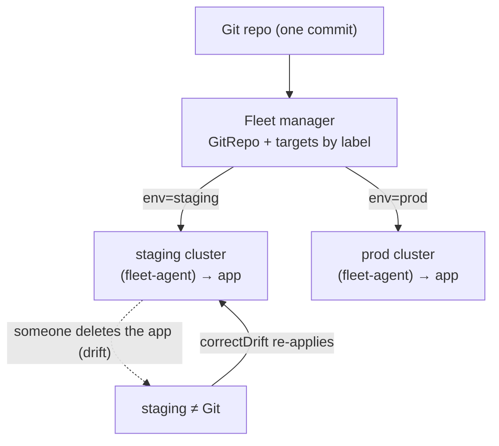
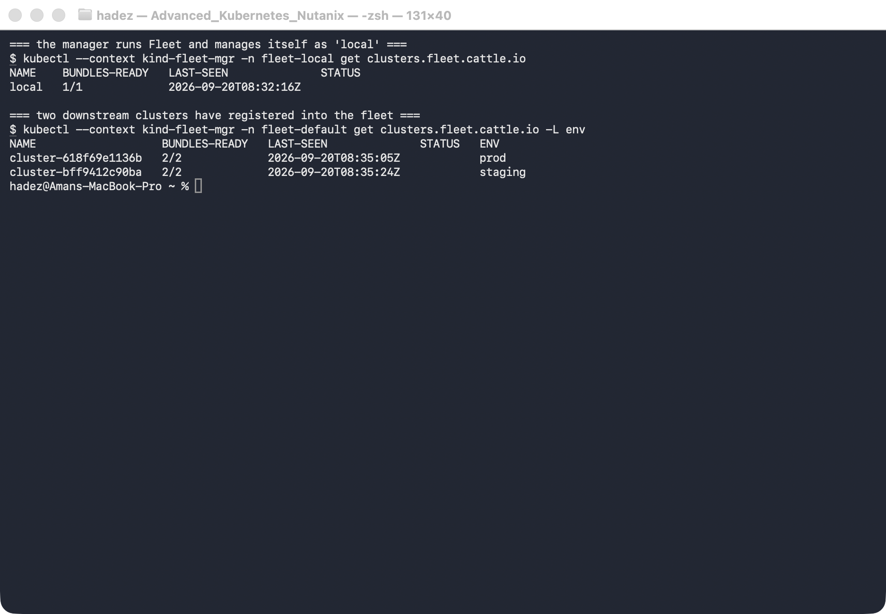
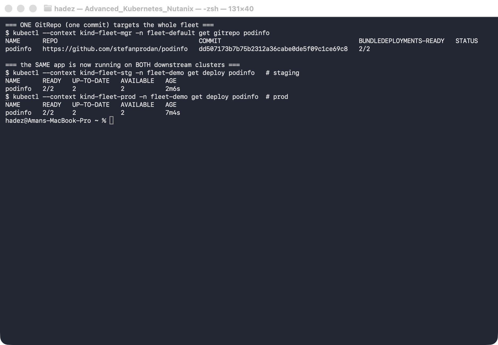
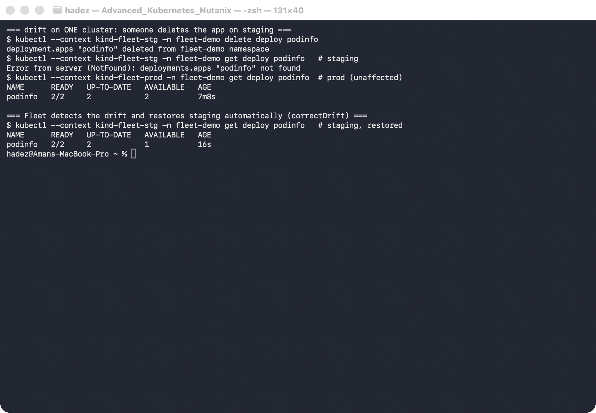

# Lab 13 — Drive Many Clusters from One Git Repo (Fleet Registration & Staged Rollout)

**Day 4 · GitOps, Multi-Cluster & Advanced Scheduling**

> ✅ **Tested end-to-end** on **three real clusters** — a Fleet **manager** plus two **downstream** clusters (`staging`, `prod`) — with **Rancher Fleet v0.16**. Every screenshot is a real capture. The payoff: you register two clusters into a fleet, deliver an app to **both of them from a single Git repo**, then delete the app on *one* cluster and watch Fleet put it back — a fleet-wide rollout and self-healing you drive from one place.

## What you'll learn

- What changes when you go from **one cluster** (Lab 12, Flux) to **many**: you need a way to *register* clusters and *target* rollouts to groups of them.
- How **Rancher Fleet** registers downstream clusters to a manager and represents each one as a `Cluster` object you can label and select.
- How a single `GitRepo` **fans out** to every matching cluster, and how **drift correction** heals a cluster that's been changed out-of-band.

## What you'll do

You'll create three clusters, install Fleet on the manager, register the other two as `staging` and `prod`, then deploy an app to both via one `GitRepo`. Finally you'll cause drift on one cluster and watch Fleet correct it.

## Time & cost

- **Time:** ~60 minutes.
- **Cost:** **$0** — all three clusters are local `kind` clusters.

---

## Before you start

- **Where you'll work:** in a **terminal** on your own machine.
- **Tools you need:** `docker`, `kind`, `kubectl`, `helm`.
- **Cluster:** you'll create three fresh `kind` clusters in Step 1. (This is deliberately `kind`: a "fleet" needs *several* clusters, and spinning up three managed cloud clusters just to demonstrate registration would be slow and costly.)

> **Nutanix note.** Managing a *fleet* of clusters is the on-prem reality: an enterprise runs many **NKE** clusters (per site, per environment, per tenant) and can't hand-run `kubectl` against each. Fleet is exactly this control plane — and it's the engine inside **Rancher**, which is a common management layer for Nutanix Kubernetes estates. On real infrastructure the three clusters here would be NKE clusters; the registration, targeting, and drift-correction steps are identical. We use `kind` only so you can stand up a whole fleet on one laptop for free.

---

## The idea in 60 seconds

Flux (Lab 12) reconciled **one** cluster from Git. A fleet needs two more things: a way to **enroll** clusters, and a way to **target** a rollout at some of them (e.g. staging first, then prod).

Fleet has a **manager** cluster running the Fleet controller. Downstream clusters run a small **agent** that registers back to the manager using a token; each registered cluster becomes a `Cluster` object you can label (`env=staging`, `env=prod`). You then create a **`GitRepo`** with `targets` that select clusters by label — one Git commit rolls out to every matching cluster. Turn on **`correctDrift`** and Fleet will re-apply anything that's changed on a downstream cluster out-of-band.



---

## Step 1 — Stand up the fleet: three clusters

**Goal:** create a manager and two downstream clusters, all reachable from each other.

```bash
for c in fleet-mgr fleet-stg fleet-prod; do kind create cluster --name "$c"; done
kind get clusters
```

Because all `kind` clusters share the `kind` Docker network, the downstream agents can reach the manager's API by its container IP. Find that IP now — you'll need it in Step 2:

```bash
docker network inspect kind -f '{{range .Containers}}{{.Name}} {{.IPv4Address}}{{"\n"}}{{end}}'
```

**What you should see:** three clusters, and the `fleet-mgr-control-plane` container with an IP like `172.19.0.2`. Note the manager's IP.

**What this means:** you now have a mini multi-cluster estate. The manager will run Fleet; the other two will be managed.

---

## Step 2 — Install Fleet on the manager

**Goal:** run the Fleet controller on `fleet-mgr`, told how downstream agents should reach it.

```bash
helm repo add fleet https://rancher.github.io/fleet-helm-charts/
helm repo update fleet

MGR_IP=172.19.0.2                     # from Step 1
API_URL="https://${MGR_IP}:6443"
CA=$(kubectl --context kind-fleet-mgr config view --raw --minify \
       -o jsonpath='{.clusters[0].cluster.certificate-authority-data}')

helm --kube-context kind-fleet-mgr -n cattle-fleet-system install --create-namespace \
  fleet-crd fleet/fleet-crd

helm --kube-context kind-fleet-mgr -n cattle-fleet-system install fleet fleet/fleet \
  --set apiServerURL="$API_URL" \
  --set apiServerCA="$CA"

kubectl --context kind-fleet-mgr -n cattle-fleet-system rollout status deploy/fleet-controller --timeout=180s
```

**What you should see:** `fleet-controller`, `gitjob`, and `helmops` Pods `Running` in `cattle-fleet-system`. The manager also registers *itself* as a cluster named `local`.

**What this means:** the fleet's control plane is live. `apiServerURL`/`apiServerCA` are baked into the registration tokens so agents know where — and how securely — to call home.

---

## Step 3 — Register the two downstream clusters

**Goal:** enrol `fleet-stg` and `fleet-prod` into the fleet, labelled by environment.

**1. Create a registration token on the manager:**

```bash
kubectl --context kind-fleet-mgr create namespace fleet-default
kubectl --context kind-fleet-mgr apply -f - <<'EOF'
apiVersion: fleet.cattle.io/v1alpha1
kind: ClusterRegistrationToken
metadata: {name: downstream-token, namespace: fleet-default}
spec: {ttl: 24h}
EOF
```

**2. Extract the agent values and the CA as raw PEM:**

```bash
kubectl --context kind-fleet-mgr -n fleet-default get secret downstream-token \
  -o jsonpath='{.data.values}' | base64 -d > /tmp/token-values.yaml

# pull apiServerCA out as a real PEM file, and strip it from the values file:
python3 - <<'PY'
import base64, yaml
v = yaml.safe_load(open('/tmp/token-values.yaml'))
open('/tmp/ca.pem','w').write(base64.b64decode(v['apiServerCA']).decode())
del v['apiServerCA']
yaml.safe_dump(v, open('/tmp/agent-values.yaml','w'))
PY
```

**3. Install the agent on each downstream, labelling it:**

```bash
for pair in "kind-fleet-stg:staging" "kind-fleet-prod:prod"; do
  CTX="${pair%%:*}"; ENV="${pair##*:}"
  helm --kube-context "$CTX" -n cattle-fleet-system install --create-namespace \
    fleet-agent fleet/fleet-agent \
    -f /tmp/agent-values.yaml \
    --set-file apiServerCA=/tmp/ca.pem \
    --set-string labels.env="$ENV"
done
```

**4. Confirm both clusters registered:**

```bash
kubectl --context kind-fleet-mgr -n fleet-local   get clusters.fleet.cattle.io
kubectl --context kind-fleet-mgr -n fleet-default get clusters.fleet.cattle.io -L env
```

**What you should see:** the manager's own `local` cluster, plus two downstream `Cluster` objects (auto-named `cluster-…`) with `ENV` showing `staging` and `prod`, each `BUNDLES-READY 2/2`.



**What this means:** three clusters are now under one control plane, and the `env` labels give you a way to *target* rollouts at groups of them.

> ⚠️ **Gotcha — the CA must be raw PEM, not base64.** The token secret stores `apiServerCA` **base64-encoded**. If you feed that base64 string straight to the agent chart, Helm base64-encodes it *again* into the agent's secret, and the agent fails with `unable to parse bytes as PEM block`. That's why Step 3.2 decodes it to a real PEM file and Step 3.3 passes it with `--set-file` (which supplies the file's raw contents). Symptom to recognise: the agent logs `Cannot find fleet-agent secret, running registration` in a loop and no `Cluster` ever appears.

---

## Step 4 — Deliver one app to the whole fleet from one Git repo

**Goal:** deploy the same app to both downstream clusters from a single `GitRepo`.

**1. Give the downstream clusters a metrics-server** — the app we'll deploy (`podinfo`) ships an HPA, and Fleet won't mark the rollout *Ready* until the HPA can compute (which needs metrics):

```bash
for CTX in kind-fleet-stg kind-fleet-prod; do
  kubectl --context "$CTX" apply -f https://github.com/kubernetes-sigs/metrics-server/releases/latest/download/components.yaml
  kubectl --context "$CTX" -n kube-system patch deployment metrics-server --type=json \
    -p='[{"op":"add","path":"/spec/template/spec/containers/0/args/-","value":"--kubelet-insecure-tls"}]'
done
```

**2. Create the `GitRepo`, targeting both environments:**

```bash
kubectl --context kind-fleet-mgr apply -f - <<'EOF'
apiVersion: fleet.cattle.io/v1alpha1
kind: GitRepo
metadata: {name: podinfo, namespace: fleet-default}
spec:
  repo: https://github.com/stefanprodan/podinfo
  branch: master
  paths: ["kustomize"]
  targetNamespace: fleet-demo
  correctDrift: {enabled: true}
  targets:
    - name: staging
      clusterSelector: {matchLabels: {env: staging}}
    - name: prod
      clusterSelector: {matchLabels: {env: prod}}
EOF
```

**3. Watch it roll out, then confirm the app is on both clusters:**

```bash
kubectl --context kind-fleet-mgr -n fleet-default get gitrepo podinfo
kubectl --context kind-fleet-stg  -n fleet-demo get deploy podinfo
kubectl --context kind-fleet-prod -n fleet-demo get deploy podinfo
```

**What you should see:** the `GitRepo` reports `BUNDLEDEPLOYMENTS-READY 2/2` at commit `dd507173…`, and `podinfo` is running `2/2` in the `fleet-demo` namespace on **both** clusters — from one repo, one commit.



**What this means:** you delivered to the whole fleet from a single source of truth. To do a **staged rollout** (roll to `staging`, verify, then `prod`), you'd add a `rolloutStrategy` or split the targets — the targeting mechanism is the same, just sequenced.

---

## Step 5 — Catch and correct drift on one cluster

**Goal:** change one cluster out-of-band and prove Fleet heals only that cluster.

```bash
kubectl --context kind-fleet-stg -n fleet-demo delete deploy podinfo   # drift on staging
kubectl --context kind-fleet-stg -n fleet-demo get deploy podinfo      # -> NotFound
kubectl --context kind-fleet-prod -n fleet-demo get deploy podinfo     # prod: unaffected
# ...wait a few seconds...
kubectl --context kind-fleet-stg -n fleet-demo get deploy podinfo      # -> back, 2/2
```

**What you should see:** right after the delete, `staging` reports `NotFound` while `prod` is untouched at `2/2`. Within seconds, `correctDrift` re-applies the Deployment and `staging` is back to `2/2`.



**What this means:** Fleet continuously reconciles *each* cluster against Git. Drift on one cluster is detected and corrected there, without touching the rest of the fleet — self-healing at fleet scale.

---

## Step 6 — Clean up

```bash
for c in fleet-mgr fleet-stg fleet-prod; do kind delete cluster --name "$c"; done
```

---

## What you learned

| You saw… | in Step | proof |
|---|---|---|
| Downstream clusters register into a manager and become labelled `Cluster` objects | 3 | `local` + `staging` + `prod`, `BUNDLES-READY 2/2` |
| One GitRepo fans out to every matching cluster | 4 | one repo/commit → `podinfo 2/2` on both clusters |
| Targeting is by cluster label | 4 | `targets` select `env: staging` and `env: prod` |
| Drift on one cluster is caught and corrected there only | 5 | staging deleted → restored; prod untouched |

## Evidence

Real screenshots for this lab are in [`artifacts/lab-13/screenshots/`](artifacts/lab-13/screenshots/) (3 images), and a command transcript is in [`artifacts/lab-13/evidence/lab-13-fleet.txt`](artifacts/lab-13/evidence/lab-13-fleet.txt).

---

**Next:** [Lab 14 — Multi-Tenant Quota Governance with Kueue](lab-14-kueue.md)
