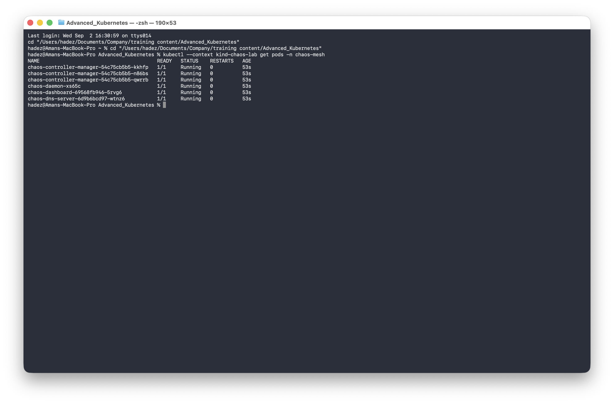
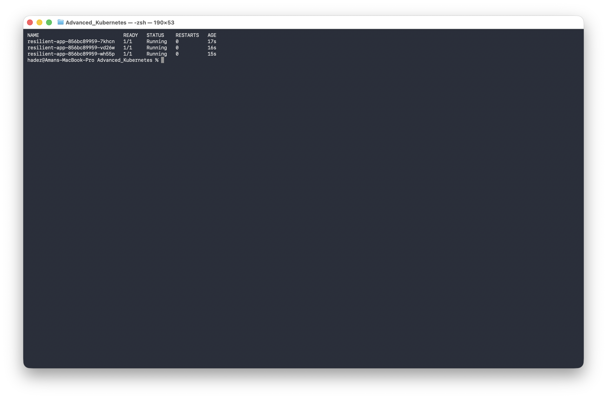
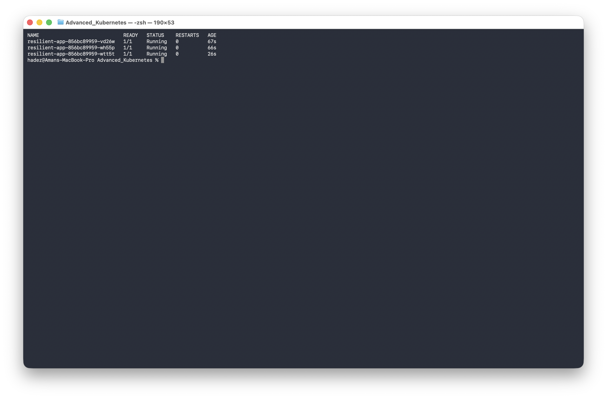
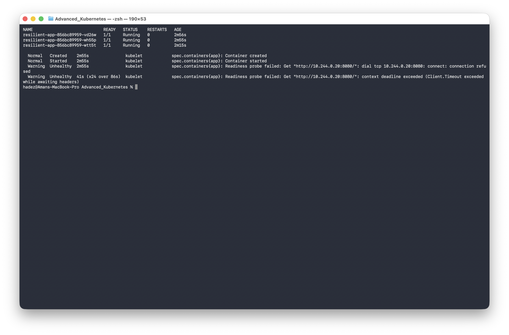
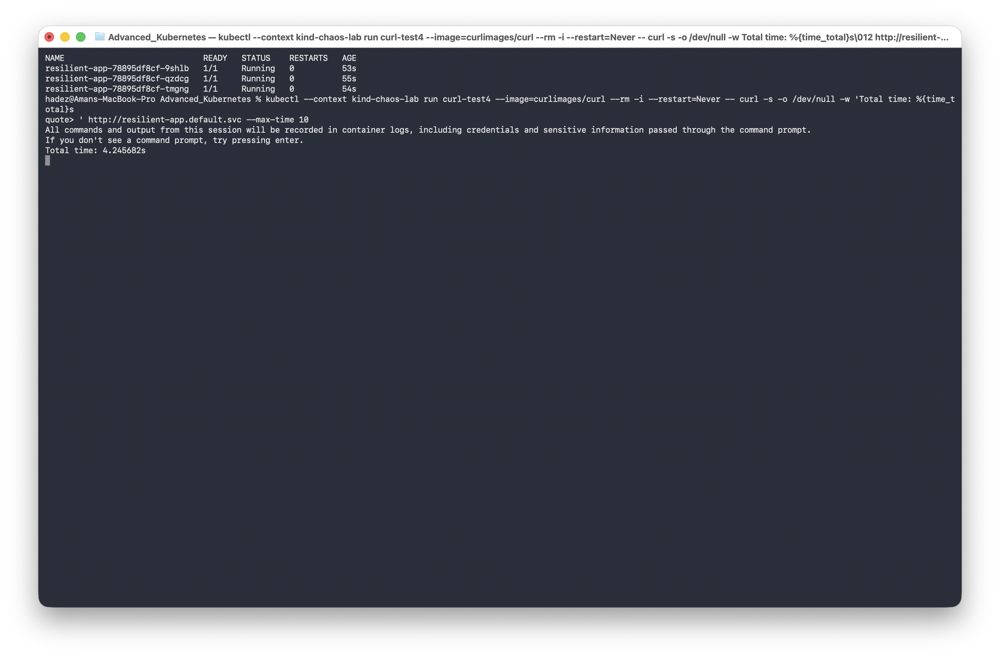

# Lab G — Break It on Purpose to Prove It's Resilient (Chaos Engineering with Chaos Mesh)

**Day 5 · Kubernetes as the AI-Native Platform**

> ✅ **Tested end-to-end** on a real `kind` cluster. Every screenshot is a real capture — including a **real, unplanned outage this experiment triggered** that the original design didn't anticipate (Step 4). The payoff: you'll kill a Pod and watch Kubernetes heal it, then inject network latency and discover it can take a Service to **zero healthy endpoints** — a failure mode you'd never find by reading YAML.

## What you'll learn

- How **Chaos Mesh** injects real faults (kill a Pod, add network latency) via CRDs and a per-node daemon — and auto-reverts them after a `duration`.
- How a **PodChaos** kill triggers Kubernetes' own self-healing.
- How a **NetworkChaos** delay, run for real, surfaces a hidden interaction: a `readinessProbe` timeout shorter than the injected delay knocks *every* replica out of readiness at once — and how the real client latency is roughly **double** the configured delay.

## What you'll do

You'll deploy a 3-replica app, install Chaos Mesh, kill one Pod (and watch it return), then inject 2s of latency on all replicas — watch it cause an outage, diagnose it, fix the probe, and re-measure.

## Time & cost

- **Time:** ~50 minutes.
- **Cost:** **$0** — runs entirely on a local `kind` cluster.

---

## Before you start

- **Where you'll work:** in a **terminal** on your own machine.
- **Tools you need:** `docker`, `kind`, `kubectl`, `helm`.
- **Cluster:** you'll create a fresh `kind` cluster in Step 1.

> **Nutanix note.** Chaos Mesh is a CNCF project and platform-agnostic — identical on **NKE**. Chaos engineering matters most where you own the failure domains: on a Nutanix cluster you'd use exactly these experiments to validate that your on-prem apps survive node loss, network partitions, and slow dependencies *before* a real incident proves they don't. This lab is `kind` only because it needs no cloud features.

---

## The idea in 60 seconds

Chaos Mesh installs CRDs (`PodChaos`, `NetworkChaos`, `IOChaos`, `StressChaos`…), a controller that watches them, and a per-node `chaos-daemon` that carries out the disruption at the container/kernel level (kill a process, inject `tc netem` latency rules, mount a faulty FS layer). You declare *what* to break and *which Pods* via a selector; Chaos Mesh does the mechanics. Every experiment has a **duration** and auto-reverts when it expires — so it's safe to run against something you care about.

The point isn't breaking things for fun: it's turning "we *assume* our timeout/retry config handles failure" into "we *watched* it handle a real, injected failure" — and sometimes finding the assumption was wrong in a way you never thought to check.

```mermaid
flowchart TB
    subgraph CTRL["Chaos Mesh control plane"]
        MGR["chaos-controller-manager"]
    end
    subgraph NODE["kind node"]
        DAEMON["chaos-daemon<br/>(DaemonSet)"]
        POD1["resilient-app Pod 1"]
        POD2["resilient-app Pod 2"]
        DAEMON -.->|"kill -9 (PodChaos)"| POD1
        DAEMON -.->|"tc netem delay (NetworkChaos)"| POD2
    end
    PODCHAOS["PodChaos CR<br/>pod-kill, mode: one"] --> MGR
    NETCHAOS["NetworkChaos CR<br/>delay 2s, mode: all, 60s"] --> MGR
    MGR --> DAEMON
    POD1 -.->|"Deployment controller recreates"| POD1B["resilient-app Pod 1' (new)"]
```



---

## Step 1 — Create the cluster and a resilient target app

**Goal:** deploy a 3-replica app that *has redundancy to lose*.

```bash
kind create cluster --name chaos-lab

kubectl apply -f - <<'EOF'
apiVersion: apps/v1
kind: Deployment
metadata: {name: resilient-app}
spec:
  replicas: 3
  selector: {matchLabels: {app: resilient-app}}
  template:
    metadata: {labels: {app: resilient-app}}
    spec:
      containers:
      - name: app
        image: nginxinc/nginx-unprivileged:1.27-alpine
        ports: [{containerPort: 8080}]
        readinessProbe:
          httpGet: {path: /, port: 8080}
          periodSeconds: 2
EOF
kubectl expose deployment resilient-app --port=80 --target-port=8080
kubectl wait --for=condition=Available --timeout=120s deployment/resilient-app
```

**What you should see:** 3 `resilient-app` Pods, all ready.

**What this means:** 3 replicas (not 1) so self-healing has something to operate on. Note the `readinessProbe` uses Kubernetes' **default `timeoutSeconds: 1`** (not set explicitly) — that default becomes the whole story in Step 4.

---

## Step 2 — Install Chaos Mesh

**Goal:** get the controller and node daemon running.

```bash
helm repo add chaos-mesh https://charts.chaos-mesh.org
helm repo update
helm install chaos-mesh chaos-mesh/chaos-mesh -n chaos-mesh --create-namespace \
  --set chaosDaemon.runtime=containerd \
  --set chaosDaemon.socketPath=/run/containerd/containerd.sock
kubectl wait --for=condition=Available --timeout=120s -n chaos-mesh deployment/chaos-controller-manager
kubectl get pods -n chaos-mesh
```

**What you should see:** every Chaos Mesh component `Running` — `chaos-controller-manager` (3 replicas), a `chaos-daemon` (one per node), `chaos-dashboard`, and `chaos-dns-server`.



**What this means:** `chaosDaemon.runtime=containerd` matters for `kind` specifically — its nodes run containerd, and the daemon must talk to the right socket to control the correct processes.

---

## Step 3 — PodChaos: kill a Pod, watch it come back

**Goal:** inject a real Pod kill and watch Kubernetes reconcile.

```bash
kubectl get pods -l app=resilient-app
```



```bash
kubectl apply -f - <<'EOF'
apiVersion: chaos-mesh.org/v1alpha1
kind: PodChaos
metadata: {name: kill-one-pod}
spec:
  action: pod-kill
  mode: one
  selector:
    labelSelectors: {app: resilient-app}
EOF
kubectl get pods -l app=resilient-app
```

**What you should see:** one Pod (e.g. `-7khcn`) is gone; the other two are the same Pods, just older; and a **brand-new Pod** (e.g. `-wtt5t`) has appeared in its place.



**What this means:** `mode: one` kills exactly one matching Pod (a realistic single-instance failure). The recovery is plain Kubernetes reconciliation — the Deployment controller replaces the killed Pod with **zero help from Chaos Mesh** past the initial kill. `action: pod-kill` is one-shot, so no `duration` is needed.

---

## Step 4 — NetworkChaos: inject latency, and find a real outage

**Goal:** inject 2s of latency on *every* replica and observe the client's experience — which turns out to be worse than "slow."

```bash
kubectl apply -f - <<'EOF'
apiVersion: chaos-mesh.org/v1alpha1
kind: NetworkChaos
metadata: {name: add-latency}
spec:
  action: delay
  mode: all
  selector:
    labelSelectors: {app: resilient-app}
  delay: {latency: "2s", jitter: "200ms"}
  duration: "60s"
EOF
kubectl describe pod -l app=resilient-app | grep -A2 Unhealthy
```

**What you should see:** instead of "slow but working," the `readinessProbe` starts **failing on all three Pods at once** — `context deadline exceeded` — because a 2-second-delayed probe response can't land inside the default 1-second timeout. The Service's endpoints drop to **zero ready backends** for stretches of the window; a client gets `connection refused`.



> ⚠️ **Gotcha — NetworkChaos didn't slow the app down, it took it *offline*.** With `mode: all` delaying every replica and the probe on the default `timeoutSeconds: 1`, all three Pods failed readiness simultaneously — no healthy replica to fall back on. This is materially worse than "added latency," and it's exactly what chaos engineering exists to surface: nobody sets `timeoutSeconds: 1` *thinking* about network chaos, until something like this makes them.

**The fix — raise the probe timeout above the injected delay, live:**

```bash
kubectl patch deployment resilient-app --type=json -p='[
  {"op":"add","path":"/spec/template/spec/containers/0/readinessProbe/timeoutSeconds","value":5}
]'
kubectl rollout status deployment/resilient-app
```

Re-run the same experiment and measure real client latency:

```bash
kubectl apply -f - <<'EOF'
apiVersion: chaos-mesh.org/v1alpha1
kind: NetworkChaos
metadata: {name: add-latency}
spec:
  action: delay
  mode: all
  selector: {labelSelectors: {app: resilient-app}}
  delay: {latency: "2s", jitter: "200ms"}
  duration: "60s"
EOF
kubectl run curl-test --image=curlimages/curl --rm -i --restart=Never -- \
  curl -s -o /dev/null -w "Total time: %{time_total}s\n" http://resilient-app.default.svc --max-time 10
```

**What you should see:** all three Pods stay `1/1 Running` under the same chaos (the probe fix worked), and the measured latency is **~4.2s** — nearly double the configured 2s.



> ⚠️ **Gotcha — the real latency was ~4s, not ~2s.** `tc netem delay` applies **per packet**, not per request. One HTTP request over a fresh connection eats the delay on the TCP handshake *and again* on the request/response — two delayed round trips, so ~2s configured shows as ~4s observed. Size any `perTryTimeout` or SLO budget against the *measured* ~4s, not the YAML's 2s.

**What this means:** chaos engineering turned two theoretical assumptions ("our probe is fine", "2s delay = 2s latency") into two proven, surprising facts. That's the entire value: making resilience config *provable* instead of assumed.

---

## Step 5 — Clean up

```bash
kubectl delete podchaos kill-one-pod --ignore-not-found
kubectl delete networkchaos add-latency --ignore-not-found
kind delete cluster --name chaos-lab
```

(Experiments also auto-revert at the end of their `duration` — no manual cleanup needed mid-experiment.)

---

## What you learned

| You saw… | in Step | proof |
|---|---|---|
| PodChaos kills a real Pod; the Deployment controller replaces it | 3 | `-7khcn` gone, `-wtt5t` new; other two untouched |
| NetworkChaos + a too-short probe timeout took the Service to zero endpoints | 4 | all pods `Unhealthy`, `context deadline exceeded` |
| Raising `readinessProbe.timeoutSeconds` restores service under the same chaos | 4 | all 3 Pods stay `1/1 Running` |
| `tc netem` latency is per-packet: ~2s configured → ~4s observed | 4 | `Total time: 4.245682s` |

## Evidence

Real screenshots for this lab are in [`artifacts/lab-G/screenshots/`](artifacts/lab-G/screenshots/) (5 images).

---

**Next:** [Lab 17 — Guardrailed Agentic Kubernetes](lab-17-agentic-guardrails.md)
